# 1	Introduction
This document describes the various processes and things one need know who wants to implement Red Hat Platform 10 Director or TripleO ("OpenStack-On-OpenStack") together with Juniper Contrail Networking plugin for Neutron to archieve a scalable network for your OpenStack installation. With Juniper Contrail Networking, you can boost your OpenStack installation to easily grow beyond the 4K limitation of traditional VLANs and enable OpenStack to learn new networking options like service chaining, which are not included into the original OpenStack VIM design but are demanded by Telcos who follow the ETSI NFV specifications.

This document is intended to be used as a blueprint to help those who:

- Have an OpenStack background but are not that familiar with Contrail and the changes it causes in a combined installation.

- Have a moderate Contrail Networking background and need to understand the process for integrating it into a Red Hat Platform 10 Director environment to have a combined solution.

The examples in this document are intended to enable you to create a full production grade environment.

Much effort has been put into providing practical advice to obtain the highest performance and resiliency from the suggested designs. These designs are all validated. We have also included the steps taken, and outputs of the various commands, to enable you to verify your own results.

Good luck with your installation.

# 2 Planning the Setup
Before you install anything: <span style="color:red">**Make a Plan!**</span>

Please review the information below for a successful installation of your OpenStack Fabric with Contrail Networking enabled.

## 2.1	Sizing the Controller Nodes and VMs
The Contrail Networking functions are usually split to three different entities that together build the Contrail Neutron plugin function to be used by OpenStack:

* Controller (in TripleO installation, called contrail-controller)
* Analytics Node (in TripleO installation, called contrail-analytics)
* Analytics DB Node (in TripleO installation, called contrail-analytics-database)

Note: In the TripleO documentation, a “Controller” refers to a fourth instance which contains the OpenStack functions to utilize the three plugin entities. <span style="color:red">Don’t get confused by the overlapping mentioning of OpenStack as a Controller for the entire VIM and Contrail Controller as SDNcontroller for the Neutron Networking plugin to OpenStack.</span>

Consule the following table when you setup the fabric to size the Contrail entities according to the number of compute nodes they need to manage:

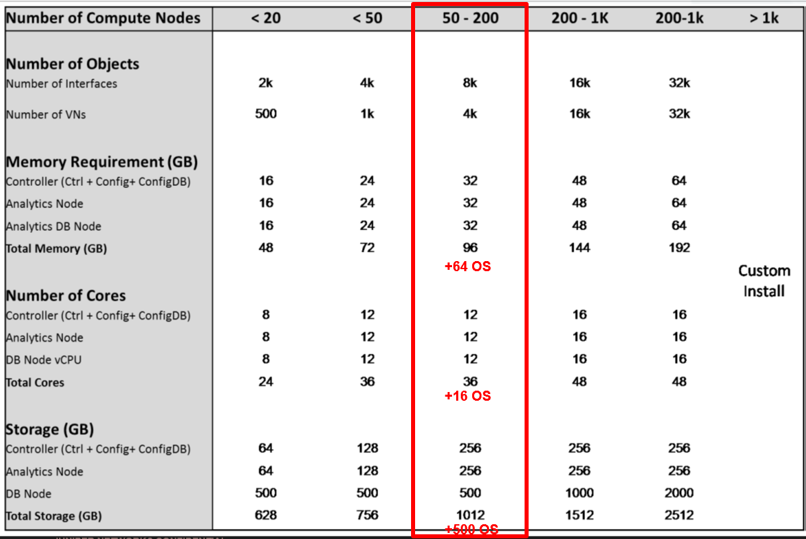

The redundancy schema of Contrail is similar to the behaviour of OpenStack itself, which is 2*N + 1. For real high availability (HA) systems you must have a minimum of three copies of every entity deployed (to have a quorum as the three nodes elect a master) to allow the loss of a node without any impact.

Depending on the hardware capacity of your servers, you may group these functions together (in form of VMs) so you can install:

* Contrail Controller
* Contrail Analytics
* Contrail Analytics Database

all together on a single physical node. However, for HA you must have three of those physical nodes with the same functions installed.

<span style="color:red">**Note: Installing and operating any of the three entities/functions more than once on the SAME PHYSICAL server will result in a non-resilient installation and will not provide the planed HA.**</span>

## 2.2	Virtual Machine vs. Bare-Metal Hosts Installation
The following rules apply to the installation of the four needed Control instances and the various compute node flavours:


| Function  | Supported as VM | Supported as Bare-Metal |
|---|---|---|
| OpenStack Controller | No | Yes |
| Contrail Controller | Yes | Yes |
| Contrail Analytics | Yes | Yes |
| Contrail Analytics DB | Yes | Yes |
| Compute Node | <span style="color:red">**No**</span> | Yes |
| Compute Node w. DPDK | <span style="color:red">**No**</span> | Yes |
| Contrail TSN Node | Yes | Yes |
| CEPH Storage Nodes | No | Yes |
| RH Director (undercloud) | Yes| Yes |


The “not supported” statement on compute nodes as VMs in the table above should be respected - Juniper does not support this option! The reason is that this setup requires nested hypervisor support, which generally resuls in unpredictable performance.

TripleO has the ability to automatically install all functions on bare-metal hosts. Keep in mind that only one function per bare-metal host will be installed and supported.

Note that if you intend to use VMs then TripleO (in typical cases) does not help you to install the host OS onto the server, setup the KVM hypervisor, install the networking interfaces and bridges to the VMs, or create and connect the VMs. You must perform these steps manually (for now) but you only need to setup blank VMs on those hosts. TripleO will then be able to treat the prepared blank VMs same way as a bare-metal host and automatically perform the guest OS installation together with the function of the VM it implements. Since you will typically do this for three to four hosts with Control functions this should not be a big deal, however you need to include this in your planning.

Note: The term “<span style="color:red">bare-metal</span>” is used in different contexts to mean different things:
* In the OpenStack community, it typically is connected to a host that is installed and maintained through OpenStack Ironic.
* In the Contrail community, it refers to one of the three ways to connect servers without a Contrail vRouter on them via a top-of-rack switch with VXLAN GWsupport to the overlay network. This is described in [Using Contrail with OVSDB in Top-of-Rack Switches](https://www.juniper.net/us/en/local/pdf/whitepapers/2000623-en.pdf), which also explains the function of a Contrail TSN node.

This document, uses “bare-metal” to refer to the first option above, and “Contrail bare-metal” to refer to the second option.

Note: The TripleO undercloud VM should be on a separate node for production environments as it also serves as an independent entity to perform upgrades.

Contrail uses inside the Data Center fabric an overlay technology to abstract the network traffic of the VMs from the physical network. Traditionally, one uses VLANs to segment traffic into virtual networks inside a single OpenStack Project/Tenant, and then again to shield the Project/Tenants from each other. This obviously presents scale issues, and also requires OpenStack to integrate (via a plugin) with the physical switches in the Data Center fabric to program the VLAN setup.
In short, Contrail erases the need for VLANs to shield the traffic of VMs.
For further implementation details, see [Contrail Architecture](https://www.juniper.net/us/en/local/pdf/whitepapers/2000535-en.pdf).

Please note that Director-10 has a limitation wherein all the overcloud networks must be stretched at Layer 2 to all the overcloud nodes. If the overcloud nodes are physical servers that are present in different racks/subnets of an IP fabric, then you’ll have to first stretch all the overcloud networks to the physical servers. One way of doing this is using EVPN.  If you have a traditional data center topology (non IP fabric), then you can extend VLANs across the physical compute nodes to extend all the overcloud networks.

Deploying an overcloud using TripleO/Director across multiple subnets is an upstream feature and a work-in-progress at the time of writing this document. Upstream developers (mostly from Red Hat) are driving this effort. You can check the status of this feature on its [blueprint](https://blueprints.launchpad.net/tripleo/+spec/tripleo-routed-networks-deployment) page.

The diagram below illustrates a data center network design where the fabric is Layer 3, from the Compute nodes (which are attached to the leaf switches) to the spine layer (between the leaf layer and DC router), and finally to the DC router that connects the fabric to the WAN.
As mentioned above it would require Layer 2 among the leaf devices to stretch the OpenStack Internal API network among them. If the fabric network is made of leaf and spine switches from Juniper, you might also consider options like Juniper Virtual Chassis Fabric, Juniper Fusion DC or Juniper IP fabric. Please contact Juniper if you are unsure which option would be the best design for you.

You can remove and redesign the DC fabric later to a full Layer 3 fabric when appropriate.
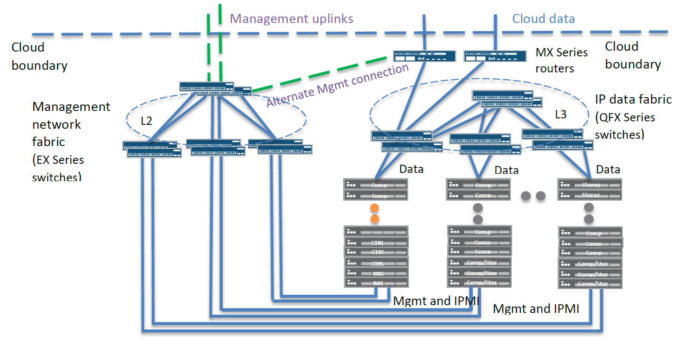
As part of the network planning and topology design process, consider the following guidelines:

* <span style="color:red">Do NOT change the IP address range of the provisioning network 192.0.2.0/24.</span> It’s not only the undercloud.conf file that will need to be changed; you also need to adapt various Heat templates later, which increases the risk of error.
* All Controller nodes and entities must be in the same Layer 2 network. This is not supposed to change even in future designs when TripleO intends to support multiple subnets between racks towards the upstream network. The reason is that for redundancy of the API IP addresses VRRP is used to share a single virtual IP address to the outside/inside. This is automatically installed during the installation. If those entities were to be segmented through different subnets, it would be necessary to have the physical underlay network monitor the health status of those entities and change the routing dynamically in case of failure.
* Carefully choose the overlay tunnel transport protocol from the data center router towards the Compute nodes:
 * Between Compute nodes (for east-west traffic), MPLSoGRE, MPLSoUDP, or VXLAN are supported and can be changed on the fly at any time.
 * For north-south traffic between the DC router and Compute nodes, in the typical case (excluding Contrail bare-metal support for the moment) you must choose between MPLSoGRE or MPLSoUDP (you can change later but not on the fly).
 * If the DC router is not a Juniper device, then it likely does not support MPLSoUDP, and you will need to use MPLSoGRE instead.
 * If the DC router is a Juniper MX Series device, then it’s recommended to have at least Junos OS Release 17.2R1 installed and select MPLSoUDP as transport. This has the additional advantage that you are able to use multipath inside your data center fabric and utilize 802.3ad link bundles to distribute traffic among bundled links. MPLSoGRE doesn’t contain enough (no Layer 4) entropy information to fully utilize the links.
 Note that regardless of which transport protocol you choose on a Juniper MX Series device, you must have a Trio-based PFE (and enable tunneling on the FPC/PIC).

Below is a generic example of the resulting networking design.
First, the Controller entities:
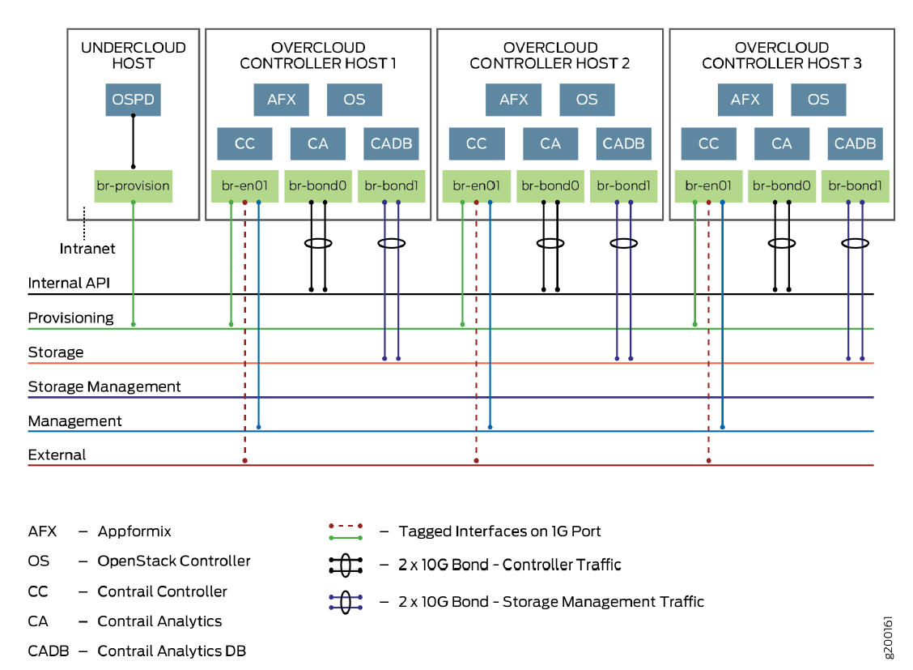
Note: Appformix is an optionally integrated Juniper product for telemetry and cloud performance, monitoring/optimization. You can find more information [here](https://www.juniper.net/uk/en/products-services/application-management-orchestration/appformix/).

Next, the Compute and Storage nodes:
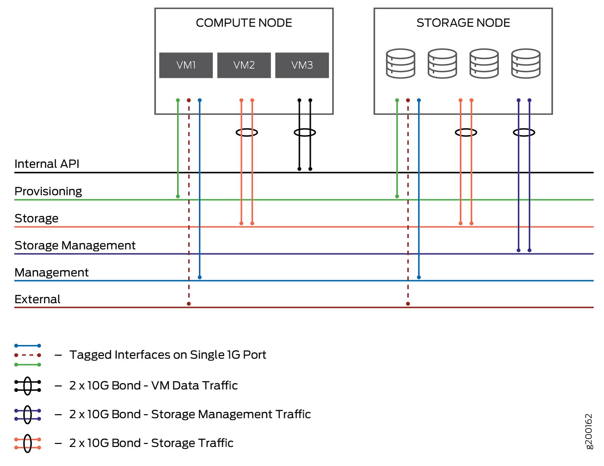
<span style="color:red">**Note: Your networking setup must be complete before you can install the Overcloud. During the rollout, the system will send pings to the various nodes on the particular VLANs to test the environment.
Only the DC router can be configured at a later time.**</span>

## 2.4	Which Networks are Needed and When?
The following article from Red Hat should be reviewed as part of planning your network design. [Isolating_networks]( https://access.redhat.com/documentation/en-us/red_hat_openstack_platform/10/html/advanced_overcloud_customization/sect-isolating_networks)

However, it must be said that due to the nature of the Contrail overlay design things become much easier in the design and fewer networks and functions need to be considered using Contrail.

As an example, the Contrail design completely <span style="color:red">eliminates the need for Neutron gateway nodes</span>, as the vRouter is highly distributed and implemented on every Compute node performing this function now.

The following Table represents the usually used Networks for an OpenStack installation and how they are utilized with Contrail Networking.

| Network Name | Purpose | Needed when |
|---|---|---|
| Provisioning | OpenStack Ironic to allow undercloud to setup and control the overcloud VM and bare-metal hosts	 | Always (for installation) |
| Internal API | OpenStack API network, Contrail API network and Contrail data network | Always |
| Tenant Networks	| Tenant traffic separation	| <span style="color:red">No longer needed. Contrail replaces this in the Contrail data network</span> |
| Storage |	Storage data network | Optional external storage |
| Storage Management | Storage API network | Optional external storage |
| Management | Node management | Not really needed but can be used for IPMI to the bare-metal hosts |
| External & Floating IP | Exposes OpenStack and Contrail REST API and GUIs towards WAN. | Recommended for production designs but no longer need for floating IP as this is now part of the Contrail data network Note: You need to plan for enough <span style="color:red">public IP</span> addresses or have to NAT somewhere. |

<span style="color:red">Note: The provisioning network must ALWAYS be of native/untagged VLANs when it reaches the VMs and bare-metal hosts on their respective virtual and physical interfaces. This is because OpenStack Ironic uses PXE boot to install the host OS on them and PXE boot doesn’t know about any VLAN tags upfront.</span>

Also keep in mind that all your bare-metal servers must support [IPMI](https://en.wikipedia.org/wiki/Intelligent_Platform_Management_Interface) (or a similar supported function like iDRAC) to allow the undercloud OpenStack Ironic to power on and off the nodes and make them boot (from PXE or HD) during the installation. Today, this should not be a big concern anymore.

It may sound a bit odd that, in the current state, Contrail multiplexes the API and the data transport into the same network, but the reason for this is to easily (without demanding any additional features from the network) detect a complete loss of ALL interfaces on a Compute node that are responsible to transport the networking data in the fabric. As the heartbeats of the XMPP control protocol travel on the same interfaces, the SDN controller will be able to detect this outage and signal this information towards OpenStack, where the admin then can take the appropriate action, such as VM evacuation.
Should you not want this practice, you can configure the Contrail data network traffic to utilize a separate network, such as the tenant network (in that case only use a single network for all tenants please), and then enable your own methods to monitor the link status of your network.

## 2.5	NIC and Bridge Options
In the previous section, the [Red Hat article](https://access.redhat.com/documentation/en-us/red_hat_openstack_platform/10/html/advanced_overcloud_customization/sect-isolating_networks) identified various options for NIC configuration and explained how bridging options inside the host are used.
Choosing from all these options can be rather confusing, so here are some easy guidelines. Keep in mind that the Red Hat article doesn’t cover any Contrail options, so some of the recommendations here may contradict the article using newer information.

* Do NOT use/setup Linux bridges and/or OVS support on any vRouter-enabled Compute node! The Contrail vRouter kernel module acts as a complete replacement, and if you configure both methods they will interfere with each other. Unfortunately, OVS will still be installed on the system by TripleO, but it should never receive any traffic.
* If you use VLANs on any vRouter-enabled Compute node, add them either to the physical NIC interface or, if using interface bonding, to the bond* interface.
* If you create VMs to host your various Controller entities on a KVM host, use either standard Linux bridges or OVS to create the internal bridges where the VMs are being attached towards the NICs. It doesn’t really matter which option you pick as this is control traffic; choose whichever option you are most familiar with.
* If you use NICbundling, do NOT use the OVS direct bundle support. OVS is fine for managing VLANs and internal bridges (on non-Compute nodes as stated above), but it is not a good option on handling interface bundles as its current implementation misses needed features like Layer 3+4 policy support. Also, review the Red Hat statement [here](https://access.redhat.com/documentation/en-us/red_hat_openstack_platform/10/html/advanced_overcloud_customization/appe-bonding_options#choosing-bond-mode). Instead, always use the native bonding support of the Linux host operating system and then you might put OVS on top of it (or use Linux bridges).
* If you utilize link bundling, enable IEEE 802.3ad and LACP on the leaf switches (every vendor should support this now). Use bond mode 4 (802.3ad support on Linux) and bond policy 1 (Layer 3+4 ECMP-based distribution of traffic on the links) on the linux host side. This will provide true active/active interface support, higher throughput, and distribute the flows over the links by looking at the tunnel overlay protocol (if it’s MPLSoGRE or VXLAN).
* Link bundles should always be created and handled by the native Linux OS and then the vRouter; Linuxbridges or OVS may be created on top if needed.
* If using link bundles, to achieve leaf layer redundancy, you can either use MC-LAG or, if using  two Juniper switches you can pool them together to form a Virtual Chassis, which makes them behave like a single switch. The Virtual Chassis option is required if you intend to use these Juniper switches for Contrail bare-metal support and require HA. MC-LAG is NOT supported for Contrail bare-metal setups.

Note: If you have Compute nodes in which you want to run the <span style="color:red">DPDK-based vRouter</span> instead of the standard vRouter in kernel mode, be sure to check the Juniper release notes for qualified NICs and host operating systems.

## 2.6	Using NIC Templates with Red Hat Director/TripleO
This section describes how to configure all these options so that TripleO/Director can make the appropriate configurations.

### 2.6.1	What are NIC Templates?
TripleO provides the flexibility to have different NIC templates for different overcloud roles. For example, there might be differences between the NIC/networking layout for the overcloud-compute-nodes and the overcloud-contrail-controller-nodes.

These NIC templates provide data to the backend scripts that take care of provisioning the network on the overcloud nodes. The templates are written in standard JSON formats.

### 2.6.2	How NIC Templates Work
The ‘resources’ section within the template includes all the networking information for the corresponding overcloud role. This information includes:
1.	Number of NICs
2.	Network associated with each NIC
3.	Static routes associated with each NIC
4.	Any VLAN configuration which is tied to a particular NIC
 *	Network associated with each VLAN interface
 *	Static routes associated with each VLAN

More information on what each of these sections look like can be accessed [here]( https://access.redhat.com/documentation/en-us/red_hat_openstack_platform/10/html/advanced_overcloud_customization/sect-isolating_networks)

The link mentioned above has great examples on how to define a NIC within the template. We’ll use this information in subsequent sections.

Note: One of the most common topologies for a TripleO deployment consists of three  NICs:
1.	NIC-1: Carries these networks:
 *	Provisioning: Untagged
 * Management: Tagged
 * External: Tagged
2.	NIC-2: Carries internal API network
3.	NIC-3: Carries tagged storage-related networks (storage and storage management)

### 2.6.3	Contrail Net and NIC Templates
As part of deployment in the first step, a net template must be provided.
Note: The base directory for the files in this chapter we are showing is usually: /home/stack/tripleo-heat-templates/environments/contrail/

The net template files are also available at the same directory location:
```
[stack@undercloud contrail]$ ls -lrt | grep contrail-net
-rw-rw-r--. 1 stack stack  1866 Sep 19 17:10 contrail-net-storage-mgmt.yaml
-rw-rw-r--. 1 stack stack   894 Sep 19 17:10 contrail-net-single.yaml
-rw-rw-r--. 1 stack stack  1528 Sep 19 17:10 contrail-net-dpdk.yaml
-rw-rw-r--. 1 stack stack  1504 Sep 19 17:10 contrail-net-bond-vlan.yaml
-rw-rw-r--. 1 stack stack  1450 Sep 19 17:12 contrail-net.yaml
```
These files are pre-populated examples that are included with a Contrail package. Note that the file names match the use case that they’re trying to solve. For example, use the contrail-net-dpdk.yaml file if your use-case includes a DPDK compute. Similarly, use the contrail-net-bond-vlan.yaml file if your topology uses bond interfaces and VLAN sub-interfaces that need to be created on top of these bond interfaces.

Note that these are example files; you will need to modify them to match your topology.

The ‘resource_registry’ section of this file specifies which NIC template must be used for each role: <<**highlight resource_registry**>>
```
[stack@undercloud contrail]$ cat contrail-net.yaml
resource_registry:
  OS::TripleO::Compute::Net::SoftwareConfig: contrail-nic-config-compute.yaml
  OS::TripleO::ContrailDpdk::Net::SoftwareConfig: contrail-nic-config-compute-dpdk-bond-vlan.yaml
  OS::TripleO::Controller::Net::SoftwareConfig: contrail-nic-config.yaml
  OS::TripleO::ContrailController::Net::SoftwareConfig: contrail-nic-config.yaml
  OS::TripleO::ContrailAnalytics::Net::SoftwareConfig: contrail-nic-config.yaml
  OS::TripleO::ContrailAnalyticsDatabase::Net::SoftwareConfig: contrail-nic-config.yaml
  OS::TripleO::ContrailTsn::Net::SoftwareConfig: contrail-nic-config-compute.yaml

parameter_defaults:
  ControlPlaneSubnetCidr: '24'
  InternalApiNetCidr: 10.0.0.0/24
  InternalApiAllocationPools: [{'start': '10.0.0.10', 'end': '10.0.0.200'}]
  InternalApiDefaultRoute: 10.0.0.1
  ManagementNetCidr: 10.1.0.0/24
  ManagementAllocationPools: [{'start': '10.1.0.10', 'end': '10.1.0.200'}]
  ManagementInterfaceDefaultRoute: 10.1.0.1
  ExternalNetCidr: 10.2.0.0/24
  ExternalAllocationPools: [{'start': '10.2.0.10', 'end': '10.2.0.200'}]
  EC2MetadataIp: 192.0.2.1  # Generally the IP of the Undercloud
  DnsServers: ["8.8.8.8","8.8.4.4"]
  VrouterPhysicalInterface: vlan20
  VrouterGateway: 10.0.0.1
  VrouterNetmask: 255.255.255.0
  ControlVirtualInterface: eth0
  PublicVirtualInterface: vlan10
  VlanParentInterface: eth1 # If VrouterPhysicalInterface is a vlan interface using vlanX notation
```
#### 2.6.3.1	NIC Templates for Control Nodes
In this example, all the OpenStack controller and Contrail control plane roles use the NIC template named ‘contrail-nic-config.yaml’. Note that the compute roles and the DPDK roles use different NIC templates.

These NIC template files can be accessed at this directory location:
```
[stack@undercloud contrail]$ ls -lrt | grep contrail-nic-config-
-rw-rw-r--. 1 stack stack  5615 Sep 19 17:10 contrail-nic-config-vlan.yaml
-rw-rw-r--. 1 stack stack  5568 Sep 19 17:10 contrail-nic-config-storage-mgmt.yaml
-rw-rw-r--. 1 stack stack  3861 Sep 19 17:10 contrail-nic-config-single.yaml
-rw-rw-r--. 1 stack stack  5669 Sep 19 17:10 contrail-nic-config-compute-storage-mgmt.yaml
-rw-rw-r--. 1 stack stack  3864 Sep 19 17:10 contrail-nic-config-compute-single.yaml
-rw-rw-r--. 1 stack stack  5385 Sep 19 17:10 contrail-nic-config-compute-dpdk.yaml
-rw-rw-r--. 1 stack stack  5839 Sep 19 17:10 contrail-nic-config-compute-bond-vlan.yaml
-rw-rw-r--. 1 stack stack  5666 Sep 19 17:10 contrail-nic-config-compute-bond-vlan-dpdk.yaml
-rw-rw-r--. 1 stack stack  5538 Sep 19 17:10 contrail-nic-config-compute-bond-dpdk.yaml
-rw-rw-r--. 1 stack stack  5132 Sep 19 17:13 contrail-nic-config-compute.yaml
-rw-r--r--. 1 stack stack  5503 Sep 19 17:13 contrail-nic-config-compute-dpdk-bond-vlan.yaml
```
Just like the network template files, these NIC template files are examples included with the Contrail package. Again these files have names matching the use case that they’re trying to solve.
Note that these NIC template files are only examples;you may need to modify them according to your cluster’s topology.

Also, these examples call out NIC names in the format of nic1, nic2, nic3, etc. (nic.$<number>). Think of these as variables. Director’s backend scripts translate these NIC numbers into actual interface names based on the interface boot order. So if you specify nic1, nic2, and nic3 in the template, and the boot order of interfaces is eth0, eth1, and eth2, then the mapping of these nic variables to actual interfaces would look like:
* nic1 mapped to eth0
* nic2 mapped to eth1
* nic3 mapped to eth2

TripleO also provides the flexibility to use actual NIC names (e.g. eth0, em1, ens2f1, etc.) in the NIC templates instead of using nic1, nic2, nic3, etc.

NOTE: A common mistake while defining NIC templates is that the boot order of NICs is not set correctly. Because of this, your deployment might go beyond the network_configuration stage but there might be connectivity issues as the IP/subnet/route information might not be configured correctly for the NICs of overcloud nodes.

As a next step, let’s look at the network_config NIC template used by the Controllers: contrail-nic-config.yaml:
```
network_config:
  -
    type: interface
    name: nic1
    use_dhcp: false
    dns_servers: {get_param: DnsServers}
    addresses:
      -
        ip_netmask:
          list_join:
            - '/'
            - - {get_param: ControlPlaneIp}
              - {get_param: ControlPlaneSubnetCidr}
    routes:
      -
        ip_netmask: 169.254.169.254/32        # Mandatory!
        next_hop: {get_param: EC2MetadataIp}  # Mandatory!
  -
    type: vlan
    use_dhcp: false
    vlan_id: {get_param: InternalApiNetworkVlanID}
    device: nic2
    addresses:
      -
        ip_netmask: {get_param: InternalApiIpSubnet}
    routes:
      -
        default: true
        next_hop: {get_param: InternalApiDefaultRoute}
  -
    type: vlan
    vlan_id: {get_param: ManagementNetworkVlanID}
    device: nic2
    addresses:
      -
        ip_netmask: {get_param: ManagementIpSubnet}
  -
    type: vlan
    vlan_id: {get_param: ExternalNetworkVlanID}
    device: nic2
    addresses:
      -
        ip_netmask: {get_param: ExternalIpSubnet}
  -
    type: vlan
    vlan_id: {get_param: StorageNetworkVlanID}
    device: nic2
    addresses:
      -
        ip_netmask: {get_param: StorageIpSubnet}
  -
    type: vlan
    vlan_id: {get_param: StorageMgmtNetworkVlanID}
    device: nic2
    addresses:
      -
        ip_netmask: {get_param: StorageMgmtIpSubnet}
```
Let’s look at the sub-sections of this template:

1. Definition for NIC-1:

```
-
  type: interface
  name: nic1
  use_dhcp: false
  dns_servers: {get_param: DnsServers}
  addresses:
    -
      ip_netmask:
        list_join:
          - '/'
          - - {get_param: ControlPlaneIp}
            - {get_param: ControlPlaneSubnetCidr}
  routes:
    -
      ip_netmask: 169.254.169.254/32        # Mandatory!
      next_hop: {get_param: EC2MetadataIp}  # Mandatory!
```
Observations:
* This is the definition for an interface called ‘nic1’
* The DNS server is defined. Make sure that this parameter has a valid value. Most commonly, this variable is assigned a value in the contrail-services.yaml file
* An IP and subnet are provided under the ‘addresses’ section. Note that these values are again variables, and the format is: $(Network_Name)IP and $(Network_Name)SubnetCidr.
 * This means that this particular NIC is on the ‘ControlPlane’ network. In the background, this NIC might be connected to an access port on a switch for the ‘ControlPlane’ VLAN.
* In the ‘routes’ section, there’s a /32 route for this NIC. When planning the networking for your cluster, you may need to provision static routes on the overcloud roles. Use the format mentioned under the ‘routes’ section to specify any such static routes.

	Definition for NIC-2:
```
-
  type: vlan
  use_dhcp: false
  vlan_id: {get_param: InternalApiNetworkVlanID}
  device: nic2
  addresses:
    -
      ip_netmask: {get_param: InternalApiIpSubnet}
  routes:
    -
      default: true
      next_hop: {get_param: InternalApiDefaultRoute}
-
  type: vlan
  vlan_id: {get_param: ManagementNetworkVlanID}
  device: nic2
  addresses:
    -
      ip_netmask: {get_param: ManagementIpSubnet}
-
  type: vlan
  vlan_id: {get_param: ExternalNetworkVlanID}
  device: nic2
  addresses:
    -
      ip_netmask: {get_param: ExternalIpSubnet}
-
  type: vlan
  vlan_id: {get_param: StorageNetworkVlanID}
  device: nic2
  addresses:
    -
      ip_netmask: {get_param: StorageIpSubnet}
-
  type: vlan
  vlan_id: {get_param: StorageMgmtNetworkVlanID}
  device: nic2
  addresses:
    -
      ip_netmask: {get_param: StorageMgmtIpSubnet}
```
Observations:
* In this example, NIC-2 has multiple VLANs defined on it.
 * In the background, NIC-2 might be connected to a switch’s trunk port. And all these corresponding VLANs must be allowed on the trunk.
 * Given that Director-based deployments require the administrator to use many networks, it’s a very common requirement/design to use VLAN interfaces on the overcloud nodes. This way administrators do not have to worry about having 6-7 physical NICs on each overcloud node.
* For each VLAN interface, the ‘vlan_id’ is defined. Note that the ‘vlan_id’ again points to a variable. These variables can be assigned values in the contrail-net.yaml file discussed earlier.
* Another very important observation here is setting the default route. In this example, the default route was provisioned on the VLAN interface in the ‘InternalApiNetwork’. Note that the next hop points to a variable. This variable can also be set in the contrail-net.yaml file. Here’s the snippet that shows the default route information:
```
-
  type: vlan
  use_dhcp: false
  vlan_id: {get_param: InternalApiNetworkVlanID}
  device: nic2
  addresses:
    -
      ip_netmask: {get_param: InternalApiIpSubnet}
  routes:
    -
      default: true
      next_hop: {get_param: InternalApiDefaultRoute}
```
#### 2.6.3.2 NIC Templates for Compute Nodes
The NIC definitions for compute roles are slightly different from those for Control nodes. This is because Contrail provisions a logical interface called ‘vhost0’ on all Compute nodes, and this interface must be included in the NIC definition file for a Compute node. vhost0 is the logical interface that gets attached to the control/data network (or the internal API network in a TripleO-based installation).

<span style="color:red">Note: In TripleO 10-based installation, it is important to keep in mind that you always have to configure TWO files for the Compute hosts:</span>
* contrail-nic-config-compute.yaml: This is similar to the Controller nodes above.
* <span style="color:red">contrail-net.yaml: Here we have to supply ADDITIONAL information for the NIC configuration,</span> as the integration with TripleO requires these values to setup the vhost0 interface correctly. Without this information, the installation will fail!

Improved integration is expected in TripleO 13, but for now you must keep both files in sync and replicate some of the information manually between them.

In the contrail-net.yaml example provided above, the NIC template being used for the Compute nodes was ‘contrail-nic-config-compute.yaml’. Let’s look at the contents of the ‘resources’ section this file:
```
resources:
  OsNetConfigImpl:
    type: OS::Heat::StructuredConfig
    properties:
      group: os-apply-config
      config:
        os_net_config:
          network_config:
            -
              type: interface
              name: nic1
              use_dhcp: false
              dns_servers: {get_param: DnsServers}
              addresses:
                -
                  ip_netmask:
                    list_join:
                      - '/'
                      - - {get_param: ControlPlaneIp}
                        - {get_param: ControlPlaneSubnetCidr}
              routes:
                -
                  ip_netmask: 169.254.169.254/32        # Mandatory!
                  next_hop: {get_param: EC2MetadataIp}  # Mandatory!
            -
              type: vlan
              vlan_id: {get_param: InternalApiNetworkVlanID}
              device: nic2
            -
              type: interface
              name: vhost0
              use_dhcp: false
              addresses:
                -
                  ip_netmask: {get_param: InternalApiIpSubnet}
              routes:
                -
                  default: true
                  next_hop: {get_param: InternalApiDefaultRoute}
            -
              type: vlan
              vlan_id: {get_param: ManagementNetworkVlanID}
              device: nic2
              addresses:
                -
                  ip_netmask: {get_param: ManagementIpSubnet}
            -
              type: vlan
              vlan_id: {get_param: ExternalNetworkVlanID}
              device: nic2
              addresses:
                -
                  ip_netmask: {get_param: ExternalIpSubnet}
            -
              type: vlan
              vlan_id: {get_param: StorageNetworkVlanID}
              device: nic2
              addresses:
                -
                  ip_netmask: {get_param: StorageIpSubnet}
            -
              type: vlan
              vlan_id: {get_param: StorageMgmtNetworkVlanID}
              device: nic2
              addresses:
                -
                  ip_netmask: {get_param: StorageMgmtIpSubnet}
```
Details of each NIC:

1.	NIC-1:
```
-
  type: interface
  name: nic1
  use_dhcp: false
  dns_servers: {get_param: DnsServers}
  addresses:
    -
      ip_netmask:
        list_join:
          - '/'
          - - {get_param: ControlPlaneIp}
            - {get_param: ControlPlaneSubnetCidr}
  routes:
    -
      ip_netmask: 169.254.169.254/32         # Mandatory!
      next_hop: {get_param: EC2MetadataIp}   # Mandatory!
```
This looks very similar to the NIC definition template for the Control nodes mentioned earlier; in this example topology, the first NIC for all the Compute nodes is connected to the ‘ControlPlane’ network. Note that this is again untagged, so this NIC might be connected to an access port on the underlay switch.

  NIC-2:
```
-
type: interface
name: vhost0
use_dhcp: false
addresses:
-
ip_netmask: {get_param: InternalApiIpSubnet}
routes:
-
default: true
next_hop: {get_param: InternalApiDefaultRoute}
-
type: vlan
vlan_id: {get_param: InternalApiNetworkVlanID}
device: nic2
-
type: vlan
vlan_id: {get_param: ManagementNetworkVlanID}
device: nic2
addresses:
-
ip_netmask: {get_param: ManagementIpSubnet}
-
type: vlan
vlan_id: {get_param: ExternalNetworkVlanID}
device: nic2
addresses:
-
ip_netmask: {get_param: ExternalIpSubnet}
-
type: vlan
vlan_id: {get_param: StorageNetworkVlanID}
device: nic2
addresses:
-
ip_netmask: {get_param: StorageIpSubnet}
-
type: vlan
vlan_id: {get_param: StorageMgmtNetworkVlanID}
device: nic2
addresses:
-
ip_netmask: {get_param: StorageMgmtIpSubnet}
```
This also looks very similar to the parameters defined in the NIC definition template for the Control plane nodes. There are two major differences though:
* The VLAN sub-interface for ‘InternalApiNetwork’ does not have an IP address.
* The vhost0 interface holds the IP address for ‘InternalApiNetwork’.
 * If you’re using a standard TripleO-based installation, the IP address for the ‘InternalApiNetwork’ will always be configured on the vhost0 interface.

Some more additional parameters are required to successfully provision Compute nodes. These values are normally specified in the contrail-net.yaml file:
```
parameter_defaults:
ControlPlaneSubnetCidr: '24'
InternalApiNetCidr: 10.0.0.0/24
InternalApiAllocationPools: [{'start': '10.0.0.10', 'end': '10.0.0.200'}]
InternalApiDefaultRoute: 10.0.0.1
ManagementNetCidr: 10.1.0.0/24
ManagementAllocationPools: [{'start': '10.1.0.10', 'end': '10.1.0.200'}]
ManagementInterfaceDefaultRoute: 10.1.0.1
ExternalNetCidr: 10.2.0.0/24
ExternalAllocationPools: [{'start': '10.2.0.10', 'end': '10.2.0.200'}]
EC2MetadataIp: 192.0.2.1  # Generally the IP of the Undercloud
DnsServers: ["8.8.8.8","8.8.4.4"]
VrouterPhysicalInterface: vlan20
VrouterGateway: 10.0.0.1
VrouterNetmask: 255.255.255.0
ControlVirtualInterface: eth0
PublicVirtualInterface: vlan10
```
Details of these variables:
* Network-related parameters:
 * Subnet CIDR: You can set the subnet mask of each overcloud network in this file.
 * Allocation Pool Range: If set, the overcloud nodes are allocated IP addresses from the specified range.
 * Default Route: Set the next hop for the default route in the specified format. In this example, the default route is set for ‘InternalApiNetwork’ and the next hop is set as 10.0.0.1.
* VrouterPhysicalInterface: This is the interface on which the vhost0 interface gets attached and the Contrail vRouter will be present. This may be a physical NIC (e.g. eth2 or enps0f0), a bond* interface, or a VLAN interface (e.g. Vlan20)
* VrouterGateway: This is the IP address of the gateway for vRouter towards the DC fabric. It will be “blindly” used to send traffic towards the DC router (as the other Compute nodes are all in the same subnet currently). The SDN controller will also use BGP based signaling towards to the DC router and as a result it will also use this gateway for the control plane. In most cases, this represents the IP address of the local leaf switch in the underlay where the internal API network is attached.
Note: The term “blindly” is used to indicate known behavior of the vRouter to NOT inspect the kernel routing table for performance reasons (the vRouter is a kernel module), so that every packet that is not in the local attached subnet will be sent to the programmed IP address, and every additional route in the routing table is ignored. On the Controllers, the routing table is used as normal. It’s best to keep both in sync to not get confused.
 * VrouterNetmask: This is the subnet mask for the vhost0 interface (this is provisioned in the Compute node’s config files).
 * VlanParentInterface: This is optional, and needed only if the vhost0 interface needs to be attached to a VLAN interface.

The topology used in this document has the following constraints:
1.	The first NIC must be connected to the ControlPlane network.
2.	The second NIC must have separate VLAN interfaces for every other network.

Keeping these limitations in mind, we specified 'eth1' as the VlanParentInterface. Note that ‘nic2’ was specified as the interface with multiple VLAN sub-interfaces in the NIC definition template. In RHEL 7.3/7.4 (at the time of writing this document), the NIC’s manifest as eth0, eth1, and so on. Because of this, NIC-2 is translated to eth1.

As part of the development process, there are several NIC templates that are made available to the user. These templates are named according to the topology that they’re intended to enable, and are available in the environments/contrail/ directory. Use and modify these templates according to your topology before deploying Contrail with TripleO/RedHat-Director.

Below is a complete list of all Contrail-specific additional items that you can or must configure in the contrail-net.yaml file to help the undercloud installer doing the right NIC configuration. We have added inline comments to make the file more understandable. Note that should your Compute node not use the usual vRouter as kernel module, you must use the *dpdk* and *tsn* variables accordingly:
```
.
.
.
  EC2MetadataIp: 192.0.2.1  # Generally the IP of the Undercloud
  DnsServers: ["9.9.9.9"]
#
# Fill this section with values for the COMPUTE NODES with Contrail vRouter.
# This is MANDATORY to help the changed deployment scripts
#

# This must be PYSICAL Interface or bondX of vRouter OR a vlanxXX (with a parent below)
  VrouterPhysicalInterface: eth1
#  VrouterDpdkPhysicalInterface: eth1
#  VrouterTsnPhysicalInterface: eth1
  VrouterGateway: 10.0.0.1
  VrouterNetmask: 255.255.255.0
# This must be PYSICAL Interface of computenode
  ControlVirtualInterface: eth0
# Public means ExternalNetwork
  PublicVirtualInterface: vlan10
## if PhysicalInterface is a vlan interface using vlanX notation then you need to set the parent
# VlanParentInterface: eth1
# VlanDpdkParentInterface: eth1
# VlanTsnParentInterface: eth1
## if vhost0 is based on a bond
## check https://www.kernel.org/doc/Documentation/networking/bonding.txt
# BondInterface: bond0
# BondDpdkInterface: bond0
# BondTsnInterface: bond0
## NOTE: Nic Members have be separated by komma and the whole string
## needs to be encapsulated by '-signs to declare a single string
# BondInterfaceMembers: 'eth0,eth1'
# BondDpdkInterfaceMembers: 'eth0,eth1'
# BondTsnInterfaceMembers: 'eth0,eth1'
# BondMode: 4
# BondDpdkMode: 4
# BondTsnMode: 4
## https://access.redhat.com/solutions/71883
## use layer3+4 even if it's not 802.3ad compliant
# BondPolicy: 1
# BondDpdkPolicy: 1
# BondTsnPolicy: 1
## dpdk parameter
# ContrailDpdkHugePages: 2048
# ContrailDpdkCoremask: 0xf
# ContrailDpdkDriver: uio_pci_generic
```
## 2.7	Jumbo Frames / Large MTUs
Nowadays, it is hard to find a switch that doesn’t support frames larger than1500 bytes; most every vendor supports 9000 bytes or more.

In production networks, we recommend you to USE LARGE MTUs. It requires only a small amount of additional configuration work on the switching side and some additional lines in your Heat templates, and it can boost performance (depending on the traffic type) at no additional cost.

The increased MTU value must be configured everywhere applicable to your environment: on each relevant physical NIC interface, on every bond* interface (where the slaves have already been changed), and if used, on the vRouter virtual-interface. Note that VLANs and bridges attached to native or bond* interfaces will automatically inherit the increased value.

It is highly recommended that you test this setup BEFORE you start the overcloud installation. a simple/minimalistic test could be to setup a host without KVM, OpenStack or Contrail, using just with the bare host OS. Create native and/or bond interfaces with the increased MTU and then initiate a LARGE ping from this host to the loopback interface of the DC router that is clearly larger than any supported jumbo frame size on the switches (typically 20.000 bytes) and do NOT add a “don’t-fragment” option. You WANT to see how the destination leaf switch handles fragmentation and verify that the DC router rents a return packet from its loopback interface to the host.. Do the same in reverse from the DC router towards the Host. For example:
```
ping 169.245.169.15 –s 20000
```
If possible use tools like “tcpdump” on your host to monitor the traffic.

<span style="color:red">Note: When using Juniper **QFX5100** switches as a ToR, you must add **14 bytes** to the value that you configured on the on the physical NIC of the host.</span>

Due to the nature of wrapping an overlay tunnel protocol around the original traffic from/to the VM when it’s sent to another Compute node or the DC router, this tunnel will add additional bytes to the transport MTU. Let’s usesending ICMP-based ping packets as an example. To reach the maximum MTU of 1500, the VM will send 1472 bytes:
```
# ping -f -l 1472 10.0.0.1
          1472 bytes Payload/Data of the ICMP-Protocol
        +    8 bytes ICMP-Header
        +   20 bytes IPv4-Header
       -------------
        = 1500 bytes (Payload of Layer 3 = your MTU)
        +   14 bytes (Header of Layer 2)
        +    4 bytes (FCS-Checksum)
       -------------
        = 1518 bytes (complete Frame on the wire)
```
The added payload of the three tunnel protocols in the nominal case would be:

| MPLSoGRE | MPLSoUDP | VXLAN |
|---|---|---|
| IPv4 = 20 Bytes | IPv4 = 20 Bytes | IPv4 = 20 Bytes |
| GRE =   4 Bytes	| UDP =   8 Bytes	| UDP =   8 Bytes |
| MPLS =   4 Bytes | MPLS =   4 Bytes | VXLAN =   8 Bytes |
| N/A	| N/A	| Ethernet-II = 14 Bytes |
| **Total = 28 Bytes** | **Total = 32 Bytes**	| **Total = 50 Bytes** |

What happens if the VM doesn’t know about this requirement, and the vRouter constantly breaks and fragments the packets that don’t fit into the underlay? The vRouter detects the problem and signals the required MTU to the VM. In the example below, we configured the same MTU (9000 bytes) for both the VM and the physical interface where the vRouter was attached:
```
# ping 1.1.1.1 -s 8941 -c1 on the VM causes:

[root@overcloud-novacompute-0 heat-admin]# tcpdump -n -i tape38befe5-a0
tcpdump: verbose output suppressed, use -v or -vv for full protocol decode
listening on tape38befe5-a0, link-type EN10MB (Ethernet), capture size 262144 bytes
14:53:45.789095 ARP, Request who-has 10.10.10.3 tell 10.10.10.2, length 28
14:53:45.789234 ARP, Reply 10.10.10.3 is-at 02:e3:8b:ef:e5:a0, length 28
14:53:47.575058 IP 10.10.10.3 > 1.1.1.1: ICMP echo request, id 50433, seq 0, length 8949
14:53:47.576421 IP 10.10.10.1 > 10.10.10.3: ICMP 1.1.1.1 unreachable - need to frag (mtu 8968), length 136
```
Now we need a way to tell the VMs being launched that they could use a higher MTU. Of course, you can always (inside the guest VM) use higher MTU settings and wait until the vRouter corrects this, but it would be better to do this automatically. As most VMs are configured as DHCP clients, it is best to add this as a [DHCP-Option](https://github.com/Juniper/contrail-controller/wiki/Extra-DHCP-Options) to the DHCP server that the vRouter implements.

Here is an example how to do this:

In the Contrail GUI, go to Configure -> Networking -> Ports -> Add (+), select a network to configure, add the relevant values in the DHCP Options section, and click Save.
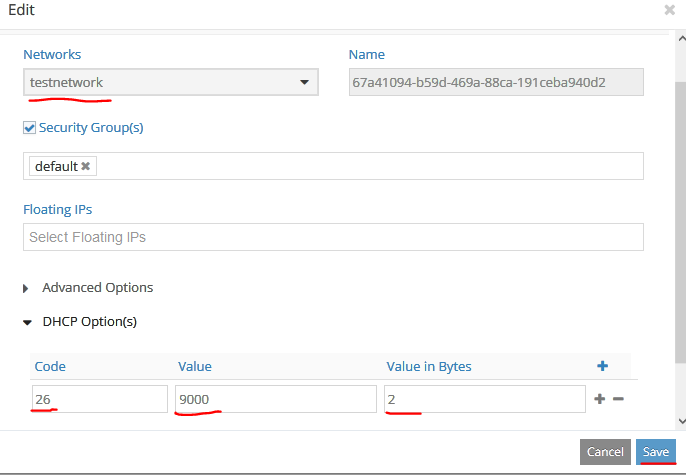

Then you only need to launch the VM attached to this pre-created neutron port:
```
neutron port-list
+------------------+------------------+------------------+--------------------+
| id               | name             | mac_address      | fixed_ips          |
+------------------+------------------+------------------+--------------------+
| 67a41094-b59d-   | 67a41094-b59d-   | 02:67:a4:10:94:b | {"subnet_id": "d44 |
| 469a-88ca-       | 469a-88ca-       | 5                | 75877-0645-402d-98 |
| 191ceba940d2     | 191ceba940d2     |                  | 13-3ed89a18458a",  |
|                  |                  |                  | "ip_address":      |
|                  |                  |                  | "10.10.10.3"}      |
+------------------+------------------+------------------+--------------------+

nova boot --image cirros --flavor testflavor --nic port-id=67a41094-b59d-469a-88ca-191ceba940d2 testvm1
```
And then login to the VM and verify if the procedure was successful:
```
admin@DC90-CE-MX80-Lab-2-R8> ssh cirros@10.10.10.3 routing-instance testvrf
cirros@10.10.10.3's password: gocubsgo
$ ifconfig
eth0      Link encap:Ethernet  HWaddr 02:67:A4:10:94:B5
          inet addr:10.10.10.3  Bcast:10.10.10.255  Mask:255.255.255.0
          inet6 addr: fe80::67:a4ff:fe10:94b5/64 Scope:Link
          UP BROADCAST RUNNING MULTICAST  MTU:9000  Metric:1
          RX packets:243 errors:0 dropped:0 overruns:0 frame:0
          TX packets:254 errors:0 dropped:0 overruns:0 carrier:0
          collisions:0 txqueuelen:1000
          RX bytes:23482 (22.9 KiB)  TX bytes:21849 (21.3 KiB)
```
Finally, plan how you implement your large MTU environment in your data center fabric.

To cause the least amount of fragmentation and de-fragmentation, and also be able to change the tunnel protocol used in the underlay without causing any updates, we suggest the following configuration:
* For all VMs, use MTU 9000 (via DHCP as above, if desired). This will allow the traffic between the VMs and the vRouter on the internal dynamically created Linux tap-* interfaces. This is your <span style="color:red">base MTU</span> setting, from which all others will be derived.
* 	The NICs or bond interfaces where the vRouter is attached will get an MTU that is 100 bytes higher than the base MTU (e.g. 9100 Bytes). This will hopefully ensure that no traffic from the VM, regardless of tunnel type, will ever force fragmentation to happen between physical and virtual environments due to the added payload of the tunneling protocols.
Also this practice will avoid the need for the vRouter to perform any fragmentation reassembly for traffic back to the VM, as it always has more MTU capacity in the underlay then the VM will ever send.
* Between the Compute node (physical interface) and leaf switch, use the higher MTU of 9100 bytes.
* Between leaf switch and spine switches, use the higher MTU of 9100 bytes.
* Between spine switches, use the higher MTU of 9100 bytes.
With this configuration, all east-west traffic between Compute nodes will never need to be re-assembled when traveling over leaf/spine devices.
•	The MTU between spine switches and the DC router can be either the base MTU or the higher MTU, as it can be assumed the connected WAN at the DC router uses a lower MTU on its WAN links.

<span style="color:red">Note: If you intend to utilize DPDK-enabled Compute nodes, make sure to use a version (>=V3.6.8) that support jumbo frames.</span>

## 2.8	Other Options: DPDK, Contrail BMS, etc.
If you want to use options like:
* DPDK support for Compute nodes. (A novel way to get more packets per second throughput supported if needed for the application.)
* A Compute node as ToR services nod (TSN) for Contrail bare-metal
* Other Contrail Releases, such as >= Contrail 4.0

See the [following page](https://github.com/Juniper/contrail-tripleo-heat-templates/tree/stable/newton) on GitHub.

Note: This is a living document that can change.

# 3	Installing OpenStack + Contrail
## 3.1	Our Test Environment for this Configuration Example
In this Chapter, we are executing and installing a full working setup, including ALL the configuration steps.

This environment meets the following guidelines and should be easy to re-implement:
* Reduced number of servers to the minimum allowable combination. As a result, this setup work with three servers. If you wish, you can reduce this setup by one server, however you will not able to see Ccompute node-to-Compute node traffic.
* As a result of this reduction, this setup does not provide HA and reuires more nodes to be production grade (which can be done easily).
* We did not setup CEPH storage and only used ephemeral storage for the VMs, which is fine for most simple VMs and NFVIs.
* Mixed setup of VMs and bare-metal hosts so that you can see the individual changes.
* Usage of bond interfaces and large MTUs, to demo the usage.
* DC router uses MPLSoUDP towards the Compute nodes (and vice versa)
* Multiplexing of provisioning and management network onto the same LAN, to keep things simple.
* vRouter bond interface also has other VLANs attached, but is kept native as in the design suggestion in Chapter 2.3.

In our example, we have used:
* Contrail Networking: V3.2.6 newton
* Host OS: RedHat Enterprise Linux V7.4
* Director/Tripleo: V10

### 3.1.1	Networks, Subnets, Routes and VM/Node Addresses
In our lab we used the following assignment:

| Network Name | IP-Subnet | VLAN-ID |
|---|---|---|
| Provisioning | 192.0.2.0/24 | 1 |
| Management/IPMI | 10.10.16.20/22 | 1 |
| Internal-Api | 192.168.150.0/24 | 150 |
| External/Public | 192.168.10.0/24 | 20 |
| Storage | 192.168.30.0/24 | 30 |
| Storage_mgmt. | 192.168.40.0/24 | 40 |
| Leaf_to_Spine | 192.168.140.0/24 | N/A |
| Spine_to_DCR | 192.168.130.0/24 | N/A |

| Network w. Route | Range | Gateway | Used for |
|---|---|---|---|
| Provisioning | 0.0.0.0/0 | 192.0.2.1 | Software Download |
| Provisioning | 169.254.169.254/32 | 192.0.2.1 | Undercloud Metadata |
| Internal-Api | 169.254.169.15/32 | 192.168.150.1 | Loopback DC-R |
| Internal-Api | 169.254.169.12/32 | 192.168.150.1 | Loopback Leaf |
| Management | 0.0.0.0/0 | 10.10.16.2	Lab Internet | Access |

<span style="color:red">Note: In a production environment, the default gateway should be in the external/public network as this is exposed to the outside and accessible over the WAN and not, as in this example, in the Provisioning network.</span>

Note: If the software is installed via a local Red Hat [Satellite Server](https://en.wikipedia.org/wiki/Satellite_(software)), and not via Internet as in this example, you will need to add an additional appropriate route to reach this network.

| Name | Type | 1st Address | 2nd Address | Other Address |
|---|---|---|---|---|
| server2 | Host | 10.10.16.22/24 | | |
| undercloud | VM | 10.10.16.55/24 | 192.0.2.1/24 | 169.254.169.254/32 |
| controller | VM | 192.168.150.60/24 | 192.0.2.x/24 | 192.168.10+30+40.x/24 |
| contrailcontroller | VM | 192.168.150.61/24 | 192.0.2.x/24 | 192.168.10+30+40.x/24 |
| contrailanalytics | VM | 192.168.150.62/24 | 192.0.2.x/24 | 192.168.10+30+40.x/24 |
| contrailanalyticsdb | VM | 192.168.150.63/24 | 192.0.2.x/24 | 192.168.10+30+40.x/24 |
| novacompute-0 | Host | 192.168.150.70/24 | 192.0.2.x/24 | 192.168.10+30+40.x/24 |
| novacompute-1 | Host | 192.168.150.71/24 | 192.0.2.x/24 | 192.168.10+30+40.x/24 |
| server3 | IPMI | 10.10.16.25/24 | | |
| server4 | IPMI | 10.10.16.27/24 | | |
| MX80 | DC-R | 10.10.16.15/24 | 169.254.169.15 | 192.168.130.1/24 |
| Leaf-VC | Leaf | 10.10.16.12/24 | 169.254.169.12 | 192.168.150.1/24 + 192.168.140.2/24 |
| Spine | Spine | 10.10.16.14/24 | 192.168.140.1/24 | 192.168.130.2/24 |

### 3.1.2	Network Topology
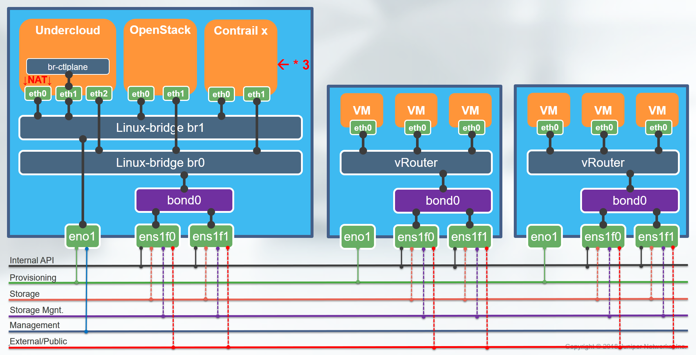

The Undercloud VM needs to have MINIMUM 2 interfaces; most designs use three interfaces so we follow this practice here. Configure the first interface which is “eth0” (and maybe “eth2” as well). During the installation process OpenStack will always create a bf-ctlplane OVS bridge and assign it to the second interface (“eth1” in this case). It will bind the DHCP and PXE boot server to the bf-ctlplane bridge and listen on 192.0.2.1/24 (and 169.254.169.254/32 for the metadata server) over this interface. Ensure this interface is able to reach the other VMs and bare-metal hosts UNTAGGED to ensure PXE boot is working.
AFTER completing the undercloud OpenStack installation, you may also configure eth2 to be attached to interal API and/or public IP networks, though this is not required.

## 3.2	Install the Undercloud Host
In this setup, it is assumed that you have installed Red Hat Linux V7.4 onto the first server (server2 in our lab) that is used to launched the various VMs and acts as Linux KVM hypervisor.

Allow the root user to use SSH to access this host. This is needed on every host where OpenStack Ironic needs to start and shutdown the VMs.
```
sed -i "s/PasswordAuthentication no/PasswordAuthentication yes/g" /etc/ssh/sshd_config
```
Register your server to Red Hat, if you haven’t done so already.
```
# register server
subscription-manager register --username RedHatCustomerAccount --password RedHatCustomerPassword --auto-attach

subscription-manager list --available | egrep "Subscription Name|Pool" | grep Linux -A1
subscription-manager attach --pool=8a85f9875cce764f015ccefafa4516c7
#subscription-manager repos --disable=*
#subscription-manager repos --enable=rhel-7-server-rpms --enable=rhel-7-server-extras-rpms --enable=rhel-7-server-rh-common-rpms --enable=rhelha-for-rhel-7-server-rpms --enable=rhel-7-server-openstack-10-rpms --enable=rhel-7-server-openstack-10-tools-rpms --enable=rhel-7-serveropenstack-10-optools-rpms  --enable=rhel-7-server-openstack-10-devtools-rpms
```
Update package info.
```
yum update -y
```
Install basic packages for KVM hypervisor, and any other needed packages.
```
yum install -y libguestfs libguestfs-tools openvswitch virt-install kvm libvirt libvirt-python python-virtinst
```
Start libvirtd to enable KVM for the VMs.
```
systemctl start libvirtd
```
Create virtual switches for the undercloud VMs.
Note: This may differ according to your setup.
```
rmmod bonding
modprobe bonding
echo 4 > /sys/class/net/bond0/bonding/mode
echo 1 > /sys/class/net/bond0/bonding/xmit_hash_policy
ifconfig bond0 0.0.0.0 mtu 9100 up
ifenslave bond0 ens1f0 ens1f1
sleep 10
ethtool bond0

brctl addbr br0
brctl addbr br1
brctl addif br0 bond0 ; ifconfig br0 up

# get parameters of current ssh interface
DEVICE=eno1
HOSTNAME=`uname -n`
IPADDR=`ifconfig $DEVICE|grep 'inet '|awk '{sub(/addr:/,""); print $2}'`
NETMASK=`ifconfig $DEVICE|grep 'netmask '|awk '{sub(/Mask:/,""); print $4}'`
GATEWAY=`route -n|grep '^0.0.0.0'|awk '{print $2}'`
# this HAS to be on a single line not to lose the SSH connection
ifconfig $DEVICE 0.0.0.0 up; brctl addif br1 $DEVICE ; ifconfig br1 $IPADDR netmask $NETMASK up ; route add default gw $GATEWAY
```
Review the created bridges and interfaces.
```
brctl show
bridge name     bridge id               STP enabled     interfaces
br0             8000.90e2bad9ce50       no              bond0
br1             8000.ac1f6b01e688       no              eno1
virbr0          8000.5254000fd076       yes             virbr0-nic

ifconfig
bond0: flags=5187<UP,BROADCAST,RUNNING,MASTER,MULTICAST>  mtu 9100
        inet6 fe80::92e2:baff:fed9:ce50  prefixlen 64  scopeid 0x20<link>
        ether 90:e2:ba:d9:ce:50  txqueuelen 1000  (Ethernet)
        RX packets 95  bytes 19348 (18.8 KiB)
        RX errors 0  dropped 12  overruns 0  frame 0
        TX packets 391  bytes 47850 (46.7 KiB)
        TX errors 0  dropped 0 overruns 0  carrier 0  collisions 0

br0: flags=4163<UP,BROADCAST,RUNNING,MULTICAST>  mtu 9100
        inet6 fe80::92e2:baff:fed9:ce50  prefixlen 64  scopeid 0x20<link>
        ether 90:e2:ba:d9:ce:50  txqueuelen 1000  (Ethernet)
        RX packets 58  bytes 10672 (10.4 KiB)
        RX errors 0  dropped 0  overruns 0  frame 0
        TX packets 8  bytes 648 (648.0 B)
        TX errors 0  dropped 0 overruns 0  carrier 0  collisions 0

br1: flags=4163<UP,BROADCAST,RUNNING,MULTICAST>  mtu 1500
        inet 10.10.16.22  netmask 255.255.252.0  broadcast 10.10.19.255
        inet6 fe80::ae1f:6bff:fe01:e688  prefixlen 64  scopeid 0x20<link>
        ether ac:1f:6b:01:e6:88  txqueuelen 1000  (Ethernet)
        RX packets 102  bytes 9648 (9.4 KiB)
        RX errors 0  dropped 0  overruns 0  frame 0
        TX packets 32  bytes 3452 (3.3 KiB)
        TX errors 0  dropped 0 overruns 0  carrier 0  collisions 0

eno1: flags=4163<UP,BROADCAST,RUNNING,MULTICAST>  mtu 1500
        inet6 fe80::ae1f:6bff:fe01:e688  prefixlen 64  scopeid 0x20<link>
        ether ac:1f:6b:01:e6:88  txqueuelen 1000  (Ethernet)
        RX packets 2071  bytes 308414 (301.1 KiB)
        RX errors 0  dropped 2  overruns 0  frame 0
        TX packets 819  bytes 129321 (126.2 KiB)
        TX errors 0  dropped 0 overruns 0  carrier 0  collisions 0
        device memory 0xc7120000-c713ffff

eno2: flags=4099<UP,BROADCAST,MULTICAST>  mtu 1500
        ether ac:1f:6b:01:e6:89  txqueuelen 1000  (Ethernet)
        RX packets 0  bytes 0 (0.0 B)
        RX errors 0  dropped 0  overruns 0  frame 0
        TX packets 0  bytes 0 (0.0 B)
        TX errors 0  dropped 0 overruns 0  carrier 0  collisions 0
        device memory 0xc7100000-c711ffff

ens1f0: flags=6211<UP,BROADCAST,RUNNING,SLAVE,MULTICAST>  mtu 9100
        ether 90:e2:ba:d9:ce:50  txqueuelen 1000  (Ethernet)
        RX packets 57  bytes 13822 (13.4 KiB)
        RX errors 0  dropped 0  overruns 0  frame 0
        TX packets 203  bytes 24538 (23.9 KiB)
        TX errors 0  dropped 0 overruns 0  carrier 0  collisions 0

ens1f1: flags=6211<UP,BROADCAST,RUNNING,SLAVE,MULTICAST>  mtu 9100
        ether 90:e2:ba:d9:ce:50  txqueuelen 1000  (Ethernet)
        RX packets 38  bytes 5526 (5.3 KiB)
        RX errors 0  dropped 0  overruns 0  frame 0
        TX packets 188  bytes 23312 (22.7 KiB)
        TX errors 0  dropped 0 overruns 0  carrier 0  collisions 0

ens2f0: flags=4099<UP,BROADCAST,MULTICAST>  mtu 1500
        ether 90:e2:ba:d9:da:8c  txqueuelen 1000  (Ethernet)
        RX packets 0  bytes 0 (0.0 B)
        RX errors 0  dropped 0  overruns 0  frame 0
        TX packets 0  bytes 0 (0.0 B)
        TX errors 0  dropped 0 overruns 0  carrier 0  collisions 0

ens2f1: flags=4099<UP,BROADCAST,MULTICAST>  mtu 1500
        ether 90:e2:ba:d9:da:8d  txqueuelen 1000  (Ethernet)
        RX packets 0  bytes 0 (0.0 B)
        RX errors 0  dropped 0  overruns 0  frame 0
        TX packets 0  bytes 0 (0.0 B)
        TX errors 0  dropped 0 overruns 0  carrier 0  collisions 0

lo: flags=73<UP,LOOPBACK,RUNNING>  mtu 65536
        inet 127.0.0.1  netmask 255.0.0.0
        inet6 ::1  prefixlen 128  scopeid 0x10<host>
        loop  txqueuelen 1  (Local Loopback)
        RX packets 2  bytes 208 (208.0 B)
        RX errors 0  dropped 0  overruns 0  frame 0
        TX packets 2  bytes 208 (208.0 B)
        TX errors 0  dropped 0 overruns 0  carrier 0  collisions 0

virbr0: flags=4099<UP,BROADCAST,MULTICAST>  mtu 1500
        inet 192.168.122.1  netmask 255.255.255.0  broadcast 192.168.122.255
        ether 52:54:00:0f:d0:76  txqueuelen 1000  (Ethernet)
        RX packets 0  bytes 0 (0.0 B)
        RX errors 0  dropped 0  overruns 0  frame 0
        TX packets 0  bytes 0 (0.0 B)
        TX errors 0  dropped 0 overruns 0  carrier 0  collisions 0

```
Create and bind the bridges to the KVM hypervisor.
```
cat << EOF > br0.xml
<network>
  <name>br0</name>
  <forward mode='bridge'/>
  <bridge name='br0'/>
</network>
EOF

cat << EOF > br1.xml
<network>
  <name>br1</name>
  <forward mode='bridge'/>
  <bridge name='br1'/>
</network>
EOF

virsh net-define br0.xml
virsh net-start br0
virsh net-autostart br0
virsh net-define br1.xml
virsh net-start br1
virsh net-autostart br1

virsh net-list
 Name                 State      Autostart     Persistent
----------------------------------------------------------
 br0                  active     yes           yes
 br1                  active     yes           yes
 default              active     yes           yes
```
In the following step, we make our network configuration changes permanent so that if you ever happen to reboot the host, the configuration will be re-applied.
```
cat <<EOF >/etc/sysconfig/network-scripts/ifcfg-eno1
DEVICE=eno1
ONBOOT=yes
HOTPLUG=no
NM_CONTROLLED=no
BRIDGE=br1
EOF

cat <<EOF >/etc/sysconfig/network-scripts/ifcfg-bond0
DEVICE=bond0
ONBOOT=yes
HOTPLUG=no
NM_CONTROLLED=no
PEERDNS=no
BONDING_OPTS="mode=802.3ad xmit_hash_policy=layer3+4 lacp_rate=fast miimon=100"
MTU=9100
BRIDGE=br0
EOF

cat <<EOF >/etc/sysconfig/network-scripts/ifcfg-ens1f0
DEVICE=ens1f0
ONBOOT=yes
HOTPLUG=no
NM_CONTROLLED=no
PEERDNS=no
MASTER=bond0
SLAVE=yes
BOOTPROTO=none
MTU=9100
EOF

cat <<EOF >/etc/sysconfig/network-scripts/ifcfg-ens1f1
DEVICE=ens1f1
ONBOOT=yes
HOTPLUG=no
NM_CONTROLLED=no
PEERDNS=no
MASTER=bond0
SLAVE=yes
BOOTPROTO=none
MTU=9100
EOF

cat <<EOF >/etc/sysconfig/network-scripts/ifcfg-br0
DEVICE=br0
TYPE=Bridge
ONBOOT=yes
BOOTPROTO=none
NM_CONTROLLED=no
DELAY=0
EOF

cat <<EOF >/etc/sysconfig/network-scripts/ifcfg-br1
DEVICE=br1
TYPE=Bridge
IPADDR=10.10.16.22
NETMASK=255.255.252.0
GATEWAY=10.10.16.2
PEERDNS=yes
DNS1=8.8.8.8
ONBOOT=yes
BOOTPROTO=none
NM_CONTROLLED=no
DELAY=0
EOF

systemctl restart network
```
If desired, reboot the host at this time to verify that your network setup is indeed permanent and the settings are recreated as expected.

## 3.3	Add Controller VMs to Host
Here we use a script to create the four needed Controller VMs with an empty disk and the necessary vCPU and RAM requirements. Review Chapter 2.1 for the requirements of your production environment. Also, note the order in which we attach the networking bridges in accordance with Chapter 3.1.2, as this attaches them to eth0 and eth1 of the VM. As mentioned earlier: <span style="color:red">The first interface of the VM (eth0) must contain the ‘ProvisionNetwork’ in an untagged manner.</span>
```
num=0
for i in control contrail-controller contrail-analytics contrail-analytics-database
do
  num=$(expr $num + 1)
  qemu-img create -f qcow2 /var/lib/libvirt/images/${i}_${num}.qcow2 100G
  virsh define /dev/stdin <<EOF
$(virt-install --name ${i} --disk /var/lib/libvirt/images/${i}_${num}.qcow2 --vcpus=6 --ram=25000 --network network=br1,model=virtio --network network=br0,model=virtio --virt-type kvm --import --os-variant rhel7 --graphics vnc,listen=0.0.0.0 --noautoconsole --serial pty --console pty,target_type=virtio --print-xml)
EOF
done
```
Stop and disable the firewall service (on this host ONLY) for the VNC remote connection. <span style="color:red">Do not disable any other firewall (especially the one in the undercloud VM).</span>
```
service firewalld stop
systemctl disable firewalld
```
The VMs should all now be in shutdown state, with empty virtual disks and dynamic  MAC addresses pre-generated for them (KVM does this during install).
```
virsh list  --all
 Id    Name                           State
----------------------------------------------------
 -     contrail-analytics             shut off
 -     contrail-analytics-database    shut off
 -     contrail-controller            shut off
 -     control                        shut off
```
This script captures the MAC address of the FIRST interface (eth0) where the PXE boot for the VM has to happen. This MAC is for OpenStack Ironic needed to be known to install the host OS into the VM later.
```
rm ironic_list

for i in control contrail-controller contrail-analytics contrail-analytics-database    
do
  prov_mac=`virsh dumpxml ${i} | grep "mac address" | head -n1 | sed 's/ //g' | sed 's/<macaddress=//g' | sed 's/\/>//g' | sed "s/'//g"`
  echo ${prov_mac} ${i} >> ironic_list
done
```
Then review the assigned MAC addresses that are extracted in this list. **We will need this generated list again later.**
```
cat ironic_list
52:54:00:b1:b5:5c control
52:54:00:46:e2:cc contrail-controller
52:54:00:e5:4a:8a contrail-analytics
52:54:00:87:64:2e contrail-analytics-database
```
## 3.4	Create, Start, and Configure the Undercloud VM
Set password and subscription information. Note: You must use the pool ID for OpenStack, as the Undercloud VM is built on OpenStack packages.
```
subscription-manager register --username RedHatCustomerAccount --password RedHatCustomerPassword --auto-attach

subscription-manager list --available | egrep "Subscription Name|Pool" | grep OpenStack -A1

export USER=RedHatCustomerAccount
export PASSWORD=RedHatCustomerPassword
export POOLID=8a85f9895cce2f3a015ccf0eb79749f8
export ROOTPASSWORD=c0ntrail123
export STACKPASSWORD=c0ntrail123
```
Create the stack user, which will be used later for all undercloud commands.
```
useradd -G libvirt stack
echo $STACKPASSWORD |passwd stack --stdin
echo "stack ALL=(root) NOPASSWD:ALL" | sudo tee -a /etc/sudoers.d/stack
chmod 0440 /etc/sudoers.d/stack
```
Adjust the permissions for KVM.
```
chgrp -R libvirt /var/lib/libvirt/images
chmod g+rw /var/lib/libvirt/images
```
Download the Red Hat Enterprise Linux 7.4 KVM guest image, which is usually available at the following URL: https://access.redhat.com/downloads/content/69/ver=/rhel---7/7.4/x86_64/product-software
```
scp root@10.10.16.20://root/RHOSP/rhel-server-7.4-x86_64-kvm.qcow2 /root
```
Prepare the undercloud VM (this step deletes previous creations and is therefore optional).
```
virsh destroy undercloud
virsh snapshot-delete undercloud undercloud-save
virsh undefine undercloud
```
This snippet creates the undercloud VM, registers it, and makes some changes. The image is then copied to libvirtd, to launch it in KVM.
```
export LIBGUESTFS_BACKEND=direct
qemu-img create -f qcow2 undercloud.qcow2 100G
virt-resize --expand /dev/sda1 /root/rhel-server-7.4-x86_64-kvm.qcow2 undercloud.qcow2
virt-customize  -a undercloud.qcow2 \
  --run-command 'xfs_growfs /' \
  --root-password password:$ROOTPASSWORD \
  --hostname undercloud.local \
  --sm-credentials $USER:password:$PASSWORD --sm-register --sm-attach auto --sm-attach pool:$POOLID \
  --run-command 'useradd stack' \
  --password stack:password:$STACKPASSWORD \
  --run-command 'echo "stack ALL=(root) NOPASSWD:ALL" | tee -a /etc/sudoers.d/stack' \
  --chmod 0440:/etc/sudoers.d/stack \
  --run-command 'subscription-manager repos --enable=rhel-7-server-rpms --enable=rhel-7-server-extras-rpms --enable=rhel-7-server-rh-common-rpms --enable=rhel-ha-for-rhel-7-server-rpms --enable=rhel-7-server-openstack-10-rpms  --enable=rhel-7-server-openstack-10-devtools-rpms' \
  --install python-tripleoclient \
  --run-command 'sed -i "s/PasswordAuthentication no/PasswordAuthentication yes/g" /etc/ssh/sshd_config' \
  --run-command 'systemctl enable sshd' \
  --run-command 'yum remove -y cloud-init' \
  --selinux-relabel

cp undercloud.qcow2 /var/lib/libvirt/images/undercloud.qcow2
```
Install the undercloud VM and launch it in KVM. Again, make sure that the second (eth1) interface of the undercloud VM is connected to a bridge or interface on the host OS that has the untagged ‘ProvisionNetwork’. In this example, we multiplex it with the Management network.
```
virt-install --name undercloud \
  --disk /var/lib/libvirt/images/undercloud.qcow2 \
  --vcpus=8 \
  --ram=32696 \
  --network network=br1,model=virtio\
  --network network=br1,model=virtio\
  --network network=br0,model=virtio\
  --virt-type kvm \
  --import \
  --os-variant rhel7 \
  --graphics vnc,listen=0.0.0.0 \
  --serial pty \
  --noautoconsole \
  --console pty,target_type=virtio
```
Log into the undercloud VM from the host, once it has started.
```
virsh console undercloud
```
Apply the networking configuration into the undercloud VM. <span style="color:red">**We do NOT configure eth1 or eth2 as this will be done by the OpenStack installation later.**</span>
```
cat <<EOF >/etc/sysconfig/network-scripts/ifcfg-eth0
DEVICE=eth0
BOOTPROTO=none
IPADDR=10.10.16.55
NETMASK=255.255.252.0
GATEWAY=10.10.16.2
PEERDNS=yes
DNS1=8.8.8.8
ONBOOT=yes
USERCTL=no
EOF

hostnamectl set-hostname undercloud.example.com
hostnamectl set-hostname --transient undercloud.example.com
echo "10.10.16.55 undercloud undercloud.example.com" >> /etc/hosts
sleep 10

systemctl restart network
```
Configure the undercloud config file (optionally), or else edit it using “vi ~/undercloud.conf”.
```
cp /usr/share/instack-undercloud/undercloud.conf.sample ~/undercloud.conf
sed -i -e 's/#undercloud_hostname = <None>/undercloud_hostname = undercloud.example.com/g' undercloud.conf
sed -i -e 's/#local_interface = eth1/local_interface = eth1/g' undercloud.conf
sed -i -e 's/#undercloud_admin_password = <None>/undercloud_admin_password = c0ntrail123/g' undercloud.conf
```
## 3.5	Install Undercloud OpenStack
Change to the user stack, as it will be used to initiate all future installations and changes, and install the undercloud packages.
```
su - stack

openstack undercloud install
.
.
.
```
Apply a mandatory bugfix for dnsmasq, to ensure it will still work after a reboot. See more information here: https://bugzilla.redhat.com/show_bug.cgi?id=1348700 and here https://bugs.launchpad.net/tripleo/+bug/1615996.

Use the following command to evaluate the state of dnsmasq: “sudo journalctl -u openstack-ironic-inspector-dnsmasq”.

```
sudo sed -i 's/bind-interfaces/bind-dynamic/g' /etc/ironic-inspector/dnsmasq.conf

ps aux | grep dnsmasq
nobody     872  0.0  0.0  15580   416 ?        S    09:56   0:00 /sbin/dnsmasq --conf-file=/etc/ironic-inspector/dnsmasq.conf
nobody    3572  0.0  0.0  15608   904 ?        S    09:58   0:00 dnsmasq --no-hosts --no-resolv --strict-order --except-interface=lo --pid-file=/var/lib/neutron/dhcp/ef61bf10-ca64-474f-ade8-61b27ca2cf42/pid --dhcp-hostsfile=/var/lib/neutron/dhcp/ef61bf10-ca64-474f-ade8-61b27ca2cf42/host --addn-hosts=/var/lib/neutron/dhcp/ef61bf10-ca64-474f-ade8-61b27ca2cf42/addn_hosts --dhcp-optsfile=/var/lib/neutron/dhcp/ef61bf10-ca64-474f-ade8-61b27ca2cf42/opts --dhcp-leasefile=/var/lib/neutron/dhcp/ef61bf10-ca64-474f-ade8-61b27ca2cf42/leases --dhcp-match=set:ipxe,175 --bind-interfaces --interface=tapeff6e358-cb --dhcp-range=set:tag0,192.0.2.0,static,86400s --dhcp-option-force=option:mtu,1500 --dhcp-lease-max=256 --conf-file=/etc/dnsmasq-ironic.conf --domain=openstacklocal
```
MANDATORY: save the iptables state. This may help if you have problems later.
```
sudo iptables-save > /home/stack/undercloud.fw

cat /home/stack/undercloud.fw
# Generated by iptables-save v1.4.21 on Mon Feb  5 04:53:44 2018
*mangle
:PREROUTING ACCEPT [77964:33241977]
:INPUT ACCEPT [77964:33241977]
:FORWARD ACCEPT [0:0]
:OUTPUT ACCEPT [77457:33094370]
:POSTROUTING ACCEPT [77457:33094370]
COMMIT
# Completed on Mon Feb  5 04:53:44 2018
# Generated by iptables-save v1.4.21 on Mon Feb  5 04:53:44 2018
*raw
:PREROUTING ACCEPT [77703:33127952]
:OUTPUT ACCEPT [77196:32980345]
:neutron-openvswi-OUTPUT - [0:0]
:neutron-openvswi-PREROUTING - [0:0]
-A PREROUTING -j neutron-openvswi-PREROUTING
-A OUTPUT -j neutron-openvswi-OUTPUT
COMMIT
# Completed on Mon Feb  5 04:53:44 2018
# Generated by iptables-save v1.4.21 on Mon Feb  5 04:53:44 2018
*nat
:PREROUTING ACCEPT [22:1866]
:INPUT ACCEPT [41:3006]
:OUTPUT ACCEPT [1840:110937]
:POSTROUTING ACCEPT [1840:110937]
:BOOTSTACK_MASQ - [0:0]
:DOCKER - [0:0]
-A PREROUTING -d 169.254.169.254/32 -i br-ctlplane -p tcp -m tcp --dport 80 -j REDIRECT --to-ports 8775
-A PREROUTING -m addrtype --dst-type LOCAL -j DOCKER
-A OUTPUT ! -d 127.0.0.0/8 -m addrtype --dst-type LOCAL -j DOCKER
-A POSTROUTING -j BOOTSTACK_MASQ
-A POSTROUTING -s 172.17.0.0/16 ! -o docker0 -j MASQUERADE
-A POSTROUTING -s 192.0.2.0/24 -o eth0 -j MASQUERADE
-A BOOTSTACK_MASQ -s 192.0.2.0/24 -d 192.168.122.1/32 -j RETURN
-A BOOTSTACK_MASQ -s 192.0.2.0/24 ! -d 192.0.2.0/24 -j MASQUERADE
-A DOCKER -i docker0 -j RETURN
COMMIT
# Completed on Mon Feb  5 04:53:44 2018
# Generated by iptables-save v1.4.21 on Mon Feb  5 04:53:44 2018
*filter
:INPUT ACCEPT [0:0]
:FORWARD ACCEPT [0:0]
:OUTPUT ACCEPT [77196:32980345]
:DOCKER - [0:0]
:DOCKER-ISOLATION - [0:0]
:ironic-inspector - [0:0]
:neutron-filter-top - [0:0]
:neutron-openvswi-FORWARD - [0:0]
:neutron-openvswi-INPUT - [0:0]
:neutron-openvswi-OUTPUT - [0:0]
:neutron-openvswi-local - [0:0]
:neutron-openvswi-sg-chain - [0:0]
:neutron-openvswi-sg-fallback - [0:0]
-A INPUT -j neutron-openvswi-INPUT
-A INPUT -i br-ctlplane -p udp -m udp --dport 67 -j ironic-inspector
-A INPUT -m comment --comment "000 accept related established rules" -m state --state RELATED,ESTABLISHED -j ACCEPT
-A INPUT -p icmp -m comment --comment "001 accept all icmp" -m state --state NEW -j ACCEPT
-A INPUT -i lo -m comment --comment "002 accept all to lo interface" -m state --state NEW -j ACCEPT
-A INPUT -p tcp -m multiport --dports 22 -m comment --comment "003 accept ssh" -m state --state NEW -j ACCEPT
-A INPUT -p tcp -m multiport --dports 27019 -m comment --comment "101 mongodb_config" -m state --state NEW -j ACCEPT
-A INPUT -p tcp -m multiport --dports 27018 -m comment --comment "102 mongodb_sharding" -m state --state NEW -j ACCEPT
-A INPUT -p tcp -m multiport --dports 27017 -m comment --comment "103 mongod" -m state --state NEW -j ACCEPT
-A INPUT -p udp -m multiport --dports 123 -m comment --comment "105 ntp" -m state --state NEW -j ACCEPT
-A INPUT -p vrrp -m comment --comment "106 vrrp" -m state --state NEW -j ACCEPT
-A INPUT -p tcp -m multiport --dports 1993 -m comment --comment "107 haproxy stats" -m state --state NEW -j ACCEPT
-A INPUT -p tcp -m multiport --dports 6379,26379 -m comment --comment "108 redis" -m state --state NEW -j ACCEPT
-A INPUT -p tcp -m multiport --dports 6789,6800:6810 -m comment --comment "110 ceph" -m state --state NEW -j ACCEPT
-A INPUT -p tcp -m multiport --dports 5000,13000,35357,13357 -m comment --comment "111 keystone" -m state --state NEW -j ACCEPT
-A INPUT -p tcp -m multiport --dports 9292,9191,13292 -m comment --comment "112 glance" -m state --state NEW -j ACCEPT
-A INPUT -p tcp -m multiport --dports 6080,13080,8773,13773,8774,13774,8775,13775 -m comment --comment "113 nova" -m state --state NEW -j ACCEPT
-A INPUT -p tcp -m multiport --dports 9696,13696 -m comment --comment "114 neutron server" -m state --state NEW -j ACCEPT
-A INPUT -p udp -m multiport --dports 67 -m comment --comment "115 neutron dhcp input" -m state --state NEW -j ACCEPT
-A INPUT -p udp -m multiport --dports 4789 -m comment --comment "118 neutron vxlan networks" -m state --state NEW -j ACCEPT
-A INPUT -p tcp -m multiport --dports 8776,13776 -m comment --comment "119 cinder" -m state --state NEW -j ACCEPT
-A INPUT -p tcp -m multiport --dports 3260 -m comment --comment "120 iscsi initiator" -m state --state NEW -j ACCEPT
-A INPUT -p tcp -m multiport --dports 11211 -m comment --comment "121 memcached" -m state --state NEW -j ACCEPT
-A INPUT -p tcp -m multiport --dports 8080,13808 -m comment --comment "122 swift proxy" -m state --state NEW -j ACCEPT
-A INPUT -p tcp -m multiport --dports 873,6000,6001,6002 -m comment --comment "123 swift storage" -m state --state NEW -j ACCEPT
-A INPUT -p tcp -m multiport --dports 8777,13777 -m comment --comment "124 ceilometer" -m state --state NEW -j ACCEPT
-A INPUT -p tcp -m multiport --dports 8000,13800,8003,13003,8004,13004 -m comment --comment "125 heat" -m state --state NEW -j ACCEPT
-A INPUT -p tcp -m multiport --dports 80,443 -m comment --comment "126 horizon" -m state --state NEW -j ACCEPT
-A INPUT -p udp -m multiport --dports 161 -m comment --comment "127 snmp" -m state --state NEW -j ACCEPT
-A INPUT -p tcp -m multiport --dports 8042,13042 -m comment --comment "128 aodh" -m state --state NEW -j ACCEPT
-A INPUT -p tcp -m multiport --dports 8041,13041 -m comment --comment "129 gnocchi-api" -m state --state NEW -j ACCEPT
-A INPUT -p udp -m multiport --dports 69 -m comment --comment "130 tftp" -m state --state NEW -j ACCEPT
-A INPUT -p tcp -m multiport --dports 5900:5999 -m comment --comment "131 novnc" -m state --state NEW -j ACCEPT
-A INPUT -p tcp -m multiport --dports 8989,13989 -m comment --comment "132 mistral" -m state --state NEW -j ACCEPT
-A INPUT -p tcp -m multiport --dports 8888,13888 -m comment --comment "133 zaqar" -m state --state NEW -j ACCEPT
-A INPUT -p tcp -m multiport --dports 9000 -m comment --comment "134 zaqar websockets" -m state --state NEW -j ACCEPT
-A INPUT -p tcp -m multiport --dports 6385,13385 -m comment --comment "135 ironic" -m state --state NEW -j ACCEPT
-A INPUT -p tcp -m multiport --dports 8779,13779 -m comment --comment "136 trove" -m state --state NEW -j ACCEPT
-A INPUT -p tcp -m multiport --dports 5050 -m comment --comment "137 ironic-inspector" -m state --state NEW -j ACCEPT
-A INPUT -p tcp -m multiport --dports 8787 -m comment --comment "138 docker registry" -m state --state NEW -j ACCEPT
-A INPUT -p tcp -m multiport --dports 8088 -m comment --comment "139 apache vhost" -m state --state NEW -j ACCEPT
-A INPUT -p tcp -m multiport --dports 3000 -m comment --comment "142 tripleo-ui" -m state --state NEW -j ACCEPT
-A INPUT -m comment --comment "998 log all" -m state --state NEW -j LOG
-A INPUT -m comment --comment "999 drop all" -m state --state NEW -j DROP
-A FORWARD -j neutron-filter-top
-A FORWARD -j neutron-openvswi-FORWARD
-A FORWARD -d 192.0.2.0/24 -p tcp -m comment --comment "140 network cidr nat" -m state --state NEW -j ACCEPT
-A FORWARD -d 192.168.122.0/24 -p tcp -m comment --comment "141 libvirt network nat" -m state --state NEW -j ACCEPT
-A FORWARD -j DOCKER-ISOLATION
-A FORWARD -o docker0 -j DOCKER
-A FORWARD -o docker0 -m conntrack --ctstate RELATED,ESTABLISHED -j ACCEPT
-A FORWARD -i docker0 ! -o docker0 -j ACCEPT
-A FORWARD -i docker0 -o docker0 -j ACCEPT
-A OUTPUT -j neutron-filter-top
-A OUTPUT -j neutron-openvswi-OUTPUT
-A OUTPUT -p udp -m multiport --dports 68 -m comment --comment "116 neutron dhcp output" -m state --state NEW -j ACCEPT
-A DOCKER-ISOLATION -j RETURN
-A ironic-inspector -j REJECT --reject-with icmp-port-unreachable
-A neutron-filter-top -j neutron-openvswi-local
-A neutron-openvswi-sg-chain -j ACCEPT
-A neutron-openvswi-sg-fallback -m comment --comment "Default drop rule for unmatched traffic." -j DROP
COMMIT
# Completed on Mon Feb  5 04:53:44 2018
```
Now source the environment variables for the underlay stack. Note that in the future, you must always be the stack user to source these environment variables.
```
source ~/stackrc
```
Optional: Install openstack-utils to be able to view the status of the services.
```
sudo yum install -y openstack-utils

openstack-status
== Nova services ==
openstack-nova-api:                     active
openstack-nova-compute:                 active
openstack-nova-network:                 inactive  (disabled on boot)
openstack-nova-scheduler:               active
openstack-nova-cert:                    active
openstack-nova-conductor:               active
== Glance services ==
openstack-glance-api:                   active
openstack-glance-registry:              active
== Keystone service ==
openstack-keystone:                     inactive  (disabled on boot)
== neutron services ==
neutron-server:                         active
neutron-dhcp-agent:                     active
neutron-l3-agent:                       inactive  (disabled on boot)
neutron-metadata-agent:                 inactive  (disabled on boot)
neutron-openvswitch-agent:              active
== Ceilometer services ==
openstack-ceilometer-api:               inactive  (disabled on boot)
openstack-ceilometer-central:           active
openstack-ceilometer-compute:           inactive  (disabled on boot)
openstack-ceilometer-collector:         active
openstack-ceilometer-notification:      active
== Heat services ==
openstack-heat-api:                     active
openstack-heat-api-cfn:                 active
openstack-heat-api-cloudwatch:          inactive  (disabled on boot)
openstack-heat-engine:                  active
== Ironic services ==
openstack-ironic-api:                   active
openstack-ironic-conductor:             active
== Support services ==
openvswitch:                            active
dbus:                                   active
rabbitmq-server:                        active
memcached:                              active
== Keystone users ==
/bin/openstack-status: line 267: keystone: command not found
== Glance images ==
+----+------+-------------+------------------+------+--------+
| ID | Name | Disk Format | Container Format | Size | Status |
+----+------+-------------+------------------+------+--------+
+----+------+-------------+------------------+------+--------+
== Nova managed services ==
+----+----------------+------------------------+----------+---------+-------+----------------------------+-----------------+
| Id | Binary         | Host                   | Zone     | Status  | State | Updated_at                 | Disabled Reason |
+----+----------------+------------------------+----------+---------+-------+----------------------------+-----------------+
| 1  | nova-cert      | undercloud.example.com | internal | enabled | up    | 2018-02-05T09:47:48.000000 | -               |
| 2  | nova-scheduler | undercloud.example.com | internal | enabled | up    | 2018-02-05T09:47:50.000000 | -               |
| 3  | nova-conductor | undercloud.example.com | internal | enabled | up    | 2018-02-05T09:47:52.000000 | -               |
| 4  | nova-compute   | undercloud.example.com | nova     | enabled | up    | 2018-02-05T09:47:45.000000 | -               |
+----+----------------+------------------------+----------+---------+-------+----------------------------+-----------------+
== Nova networks ==
WARNING: Command network-list is deprecated and will be removed after Nova 15.0.0 is released. Use python-neutronclient or python-openstackclient instead.
+--------------------------------------+----------+------+
| ID                                   | Label    | Cidr |
+--------------------------------------+----------+------+
| 82018b61-5924-4267-85e4-7f2a2788d22f | ctlplane | -    |
+--------------------------------------+----------+------+
== Nova instance flavors ==
+--------------------------------------+---------------+-----------+------+-----------+------+-------+-------------+-----------+
| ID                                   | Name          | Memory_MB | Disk | Ephemeral | Swap | VCPUs | RXTX_Factor | Is_Public |
+--------------------------------------+---------------+-----------+------+-----------+------+-------+-------------+-----------+
| 0121e3fb-d4a7-42f5-9835-4c25c78ae430 | control       | 4096      | 40   | 0         |      | 1     | 1.0         | True      |
| 05809171-85d2-4fdc-9cea-f1e6038d2d71 | baremetal     | 4096      | 40   | 0         |      | 1     | 1.0         | True      |
| 401cf4a9-99c8-450b-9b8d-0da046fa1f79 | swift-storage | 4096      | 40   | 0         |      | 1     | 1.0         | True      |
| 40f36372-b3ea-4353-9b1f-de63de19db04 | compute       | 4096      | 40   | 0         |      | 1     | 1.0         | True      |
| 6e931d82-94f2-4298-ab8e-40f0c2cf2775 | block-storage | 4096      | 40   | 0         |      | 1     | 1.0         | True      |
| c50c6658-7cd7-420e-bc47-e002300cb75c | ceph-storage  | 4096      | 40   | 0         |      | 1     | 1.0         | True      |
+--------------------------------------+---------------+-----------+------+-----------+------+-------+-------------+-----------+
== Nova instances ==
+----+------+-----------+--------+------------+-------------+----------+
| ID | Name | Tenant ID | Status | Task State | Power State | Networks |
+----+------+-----------+--------+------------+-------------+----------+
+----+------+-----------+--------+------------+-------------+----------+
```
Review the hypervisor statistics. At this point they should be empty.
```
openstack hypervisor stats show
+----------------------+-------+
| Field                | Value |
+----------------------+-------+
| count                | 0     |
| current_workload     | 0     |
| disk_available_least | 0     |
| free_disk_gb         | 0     |
| free_ram_mb          | 0     |
| local_gb             | 0     |
| local_gb_used        | 0     |
| memory_mb            | 0     |
| memory_mb_used       | 0     |
| running_vms          | 0     |
| vcpus                | 0     |
| vcpus_used           | 0     |
+----------------------+-------+
```
## 3.6	Install Red Hat and Contrail repos in Undercloud VM
Find the latest Ironic images to be able to utilize the latest server hardware.
```
repoquery --show-duplicates rhosp-director-images*
.
.
rhosp-director-images-0:10.0-20161212.1.el7ost.noarch
.
rhosp-director-images-0:10.0-20171108.1.el7ost.noarch      # Image to use
rhosp-director-images-ipa-0:10.0-20161212.1.el7ost.noarch
.
rhosp-director-images-ipa-0:10.0-20171108.1.el7ost.noarch  # Image to use
```
Get the Ironic overcloud images to be used during PXE boot.
```
sudo yum install -y rhosp-director-images-0:10.0-20171108.1.el7ost.noarch rhosp-director-images-0:10.0-20171108.1.el7ost.noarch
mkdir ~/images
cd ~/images
```
Upload the Ironic overcloud images to OSP10 and make sure you see five files like the ones below.
```
for i in /usr/share/rhosp-director-images/overcloud-full-latest-10.0.tar /usr/share/rhosp-director-images/ironic-python-agent-latest-10.0.tar; do tar -xvf $i; done
openstack overcloud image upload --image-path /home/stack/images/
cd ~

ls -l /home/stack/images/
-rw-r--r--. 1 stack stack  379929277 Nov  8 11:59 ironic-python-agent.initramfs
-rwxr-xr-x. 1 stack stack    5877008 Nov  8 11:59 ironic-python-agent.kernel
-rw-r--r--. 1 stack stack   58679072 Nov  8 12:33 overcloud-full.initrd
-rw-r--r--. 1 stack stack 1375876608 Nov  8 12:37 overcloud-full.qcow2
-rwxr-xr-x. 1 stack stack    5877008 Nov  8 12:33 overcloud-full.vmlinuz


openstack image list
+--------------------------------------+------------------------+--------+
| ID                                   | Name                   | Status |
+--------------------------------------+------------------------+--------+
| 4f63b58d-cd8a-483a-b70c-5b0810815809 | bm-deploy-ramdisk      | active |
| a8e01111-7a8d-4ae4-9fff-cd40bce4575e | bm-deploy-kernel       | active |
| 78d4d0ad-60f8-4e7f-b742-fb675a43a6bb | overcloud-full         | active |
| 8ffd7d00-187b-4a9d-a6ec-a364f7de2b60 | overcloud-full-initrd  | active |
| 897039bd-5b80-4fd6-93fb-35d9371e722b | overcloud-full-vmlinuz | active |
+--------------------------------------+------------------------+--------+
```
Review the PXE boot files and if you don’t see them check this section again, as without the agent* files the PXE boot will not happen.
```
ls -l /httpboot
-rwxr-xr-x. 1 root             root               5877008 Feb  5 05:05 agent.kernel
-rw-r--r--. 1 root             root             379929277 Feb  5 05:05 agent.ramdisk
-rw-r--r--. 1 ironic-inspector ironic-inspector       447 Feb  5 04:36 inspector.ipxe
```
Create a Contrail repo.
```
sudo mkdir /var/www/html/contrail
```
Download the Contrail repo files.
```
# https://webdownload.juniper.net/swdl/dl/secure/site/1/record/70858.html
#curl -o contrail-install-packages-3.2.6.0-60~redhat73newton.tgz ""
scp root@10.10.16.20://root/contrail-install-packages-3.2.6.0-60~redhat73newton.tgz .
```
Unpack and install the tarball.
```
sudo tar zxvf ~/contrail-install-packages-3.2.6.0-60~redhat73newton.tgz -C /var/www/html/contrail/
```
## 3.7	Import the Nodes to Ironic
In this Chapter, we will provide information to OpenStack Ironic about the different roles a bare-metal host or a VM will have based on the MAC address that can be used to PXE boot the instance or host.

Ironic will then use:
*	An SSH session to a host containing a VM
*	IPMI towards the bare-metal hosts
to turn on the instances and have them, via PXE boot, load and start a Linux detection image into RAM. This detection image then inspects the VM or bare-metal host and sends the results back to Ironic so that it understands the capabilities of these hosts for use later.

**Note: To enable SSH to the host, you must enable SSH to allow the root account to login and control the VMs.**

As the user stack, ensure the appropriate environment variables are set.
```
su - stack
source ~/stackrc
```
Import the VMs. Using the VM information from Chapter 3.3, add a second column with name of the VM, and a third column with the IP address of the KVM host where the machine is located (for SSH access).
```
cat <<EOF >ironic_list
52:54:00:b1:b5:5c openstack1 10.10.16.22 control
52:54:00:46:e2:cc contrail1 10.10.16.22 contrail-controller
52:54:00:e5:4a:8a contrail2 10.10.16.22 contrail-analytics
52:54:00:87:64:2e contrail3 10.10.16.22 contrail-analytics-database
EOF

ssh_user=root
ssh_password=c0ntrail123
while IFS= read -r line
do   
  mac=`echo $line|awk '{print $1}'`
  name=`echo $line|awk '{print $2}'`
  kvm_ip=`echo $line|awk '{print $3}'`
  profile=`echo $line|awk '{print $4}'`
  uuid=`ironic node-create -d pxe_ssh -p cpus=4 -p memory_mb=16348 -p local_gb=100 -p cpu_arch=x86_64 -i ssh_username=${ssh_user} -i ssh_virt_type=virsh -i ssh_address=${kvm_ip} -i ssh_password=${ssh_password} -n $name -p capabilities=profile:${profile} | tail -2|awk '{print $4}'`
  ironic port-create -a ${mac} -n ${uuid}
done < <(cat ironic_list)
+-----------------------+--------------------------------------+
| Property              | Value                                |
+-----------------------+--------------------------------------+
| address               | 52:54:00:b1:b5:5c                    |
| extra                 | {}                                   |
| local_link_connection |                                      |
| node_uuid             | bd009530-7cea-44cd-8db8-cbaeec2e1d80 |
| pxe_enabled           |                                      |
| uuid                  | 864507a9-8dd0-4ab3-88b5-c17d759822e3 |
+-----------------------+--------------------------------------+
+-----------------------+--------------------------------------+
| Property              | Value                                |
+-----------------------+--------------------------------------+
| address               | 52:54:00:46:e2:cc                    |
| extra                 | {}                                   |
| local_link_connection |                                      |
| node_uuid             | 43b3837f-8320-442d-b858-8aaef07c334b |
| pxe_enabled           |                                      |
| uuid                  | be19f184-acca-4c58-8845-5145c8b018f3 |
+-----------------------+--------------------------------------+
+-----------------------+--------------------------------------+
| Property              | Value                                |
+-----------------------+--------------------------------------+
| address               | 52:54:00:e5:4a:8a                    |
| extra                 | {}                                   |
| local_link_connection |                                      |
| node_uuid             | c047c5fa-26e7-47e9-9678-ec5d4784bcd9 |
| pxe_enabled           |                                      |
| uuid                  | 67548215-8297-4fd9-8678-7a53b63c3953 |
+-----------------------+--------------------------------------+
+-----------------------+--------------------------------------+
| Property              | Value                                |
+-----------------------+--------------------------------------+
| address               | 52:54:00:87:64:2e                    |
| extra                 | {}                                   |
| local_link_connection |                                      |
| node_uuid             | 30ddcbbb-e450-4114-a189-b8b84151d059 |
| pxe_enabled           |                                      |
| uuid                  | 503b6573-7362-4714-9abb-6e226a5e10ce |
+-----------------------+--------------------------------------+
```
Import the physical nodes. Build a new table with the PXE boot MAC address as the first column, the name of the bare-metal host as the second column, the IP address of the IPMI Controller of the server as the third column, and the role in OpenStack as the last column.

If you don’t know the MAC address yet, the best way to determine it is to use an IPMI command to boot the server and then to listen via tcpdump on the br-ctlplane bridge to see the DHCP discover packet of the bare-metal host, as shown below.
```
ipmitool -I lanplus -H 10.10.16.25 -U ADMIN -P ADMIN chassis power off
Chassis Power Control: Down/Off
ipmitool -I lanplus -H 10.10.16.25 -U ADMIN -P ADMIN chassis bootdev pxe
Set Boot Device to pxe
ipmitool -I lanplus -H 10.10.16.25 -U ADMIN -P ADMIN chassis power on
Chassis Power Control: Up/On
sudo tcpdump -n -i br-ctlplane -vvv -s 1500 '((port 67 or port 68) and (udp[8:1] = 0x1))'
tcpdump: listening on br-ctlplane, link-type EN10MB (Ethernet), capture size 1500 bytes
04:46:05.715598 IP (tos 0x0, ttl 20, id 8, offset 0, flags [none], proto UDP (17), length 576)
    0.0.0.0.bootpc > 255.255.255.255.bootps: [udp sum ok] BOOTP/DHCP, Request from ac:1f:6b:01:e7:38, length 548, xid 0x6b01e738, secs 32, Flags [Broadcast] (0x8000)
          Client-Ethernet-Address ac:1f:6b:01:e7:38     This is the MAC of this BareMetal Host
          Vendor-rfc1048 Extensions
            Magic Cookie 0x63825363
            DHCP-Message Option 53, length 1: Discover
            Parameter-Request Option 55, length 36:
              Subnet-Mask, Time-Zone, Default-Gateway, Time-Server
              IEN-Name-Server, Domain-Name-Server, RL, Hostname
              BS, Domain-Name, SS, RP
              EP, RSZ, TTL, BR
              YD, YS, NTP, Vendor-Option
              Requested-IP, Lease-Time, Server-ID, RN
              RB, Vendor-Class, TFTP, BF
              Option 128, Option 129, Option 130, Option 131
              Option 132, Option 133, Option 134, Option 135
            MSZ Option 57, length 2: 1260
            GUID Option 97, length 17: 0.0.0.0.0.0.0.0.0.0.0.172.31.107.1.231.56
            ARCH Option 93, length 2: 0
            NDI Option 94, length 3: 1.2.1
            Vendor-Class Option 60, length 32: "PXEClient:Arch:00000:UNDI:002001"
            END Option 255, length 0
            PAD Option 0, length 0, occurs 200
.
.
```
Now that the table is complete, let’s add the bare-metal host information into Ironic.
```
cat <<EOF >ironic_list_bms
ac:1f:6b:01:e7:38 compute1 10.10.16.25 compute
ac:1f:6b:01:e8:1e compute2 10.10.16.27 compute
EOF

ipmi_user=ADMIN
ipmi_password=ADMIN
while IFS= read -r line
do
  mac=`echo $line|awk '{print $1}'`
  name=`echo $line|awk '{print $2}'`
  ipmi_address=`echo $line|awk '{print $3}'`
  profile=`echo $line|awk '{print $4}'`
  uuid=`ironic node-create -d pxe_ipmitool -p cpus=4 -p memory_mb=16348 -p local_gb=100 -p cpu_arch=x86_64 -i ipmi_username=${ipmi_user} -i ipmi_address=${ipmi_address} -i ipmi_password=${ipmi_password} -n $name -p capabilities=profile:${profile} | tail -2|awk '{print $4}'`
  ironic port-create -a ${mac} -n ${uuid}
done < <(cat ironic_list_bms)
+-----------------------+--------------------------------------+
| Property              | Value                                |
+-----------------------+--------------------------------------+
| address               | ac:1f:6b:01:e7:38                    |
| extra                 | {}                                   |
| local_link_connection |                                      |
| node_uuid             | 681f50b4-c7ae-48b2-8703-b7f036842b27 |
| pxe_enabled           |                                      |
| uuid                  | a76246c3-b469-4f5b-b1e8-678a38910dbc |
+-----------------------+--------------------------------------+
+-----------------------+--------------------------------------+
| Property              | Value                                |
+-----------------------+--------------------------------------+
| address               | ac:1f:6b:01:e8:1e                    |
| extra                 | {}                                   |
| local_link_connection |                                      |
| node_uuid             | e6a284a4-3c85-4748-b196-c1c555e90083 |
| pxe_enabled           |                                      |
| uuid                  | d4d1a68d-a12f-485e-b1dd-0aa013c2c620 |
+-----------------------+--------------------------------------+
```
Review all imported nodes. Note that at this stage the bare-metal hosts can be on or off.
```
openstack baremetal node list
+--------------------------------------+------------+---------------+-------------+--------------------+-------------+
| UUID                                 | Name       | Instance UUID | Power State | Provisioning State | Maintenance |
+--------------------------------------+------------+---------------+-------------+--------------------+-------------+
| bd009530-7cea-44cd-8db8-cbaeec2e1d80 | openstack1 | None          | power off   | available          | False       |
| 43b3837f-8320-442d-b858-8aaef07c334b | contrail1  | None          | power off   | available          | False       |
| c047c5fa-26e7-47e9-9678-ec5d4784bcd9 | contrail2  | None          | power off   | available          | False       |
| 30ddcbbb-e450-4114-a189-b8b84151d059 | contrail3  | None          | power off   | available          | False       |
| 681f50b4-c7ae-48b2-8703-b7f036842b27 | compute1   | None          | power on    | available          | False       |
| e6a284a4-3c85-4748-b196-c1c555e90083 | compute2   | None          | power on    | available          | False       |
+--------------------------------------+------------+---------------+-------------+--------------------+-------------+
```
Configure the boot mode and make all nodes manageable by Ironic.
```
openstack baremetal configure boot

for node in $(openstack baremetal node list -c UUID -f value) ; do openstack baremetal node manage $node ; done

openstack baremetal node list
+--------------------------------------+------------+---------------+-------------+--------------------+-------------+
| UUID                                 | Name       | Instance UUID | Power State | Provisioning State | Maintenance |
+--------------------------------------+------------+---------------+-------------+--------------------+-------------+
| bd009530-7cea-44cd-8db8-cbaeec2e1d80 | openstack1 | None          | power off   | manageable         | False       |
| 43b3837f-8320-442d-b858-8aaef07c334b | contrail1  | None          | power off   | manageable         | False       |
| c047c5fa-26e7-47e9-9678-ec5d4784bcd9 | contrail2  | None          | power off   | manageable         | False       |
| 30ddcbbb-e450-4114-a189-b8b84151d059 | contrail3  | None          | power off   | manageable         | False       |
| 681f50b4-c7ae-48b2-8703-b7f036842b27 | compute1   | None          | power on    | manageable         | False       |
| e6a284a4-3c85-4748-b196-c1c555e90083 | compute2   | None          | power on    | manageable         | False       |
+--------------------------------------+------------+---------------+-------------+--------------------+-------------+
```
<span style="color:red">**Note: Make sure that at this point there are no other DHCP servers in the Provisioning network assigning IP addresses.**</span>

Now we configure Ironic to boot every node into PXE, and inspect every node. The length of this process largely depends on how fast your bare-metal hosts boot in the BIOS.
```
openstack overcloud node introspect --all-manageable --provide
Started Mistral Workflow. Execution ID: 052bbbaf-d4f9-48e7-b31c-6813df9bfbcc
Waiting for introspection to finish...

# the next process usually takes ~10-15minutes with NO output during it

Introspection for UUID 43b3837f-8320-442d-b858-8aaef07c334b finished successfully.
Introspection for UUID 30ddcbbb-e450-4114-a189-b8b84151d059 finished successfully.
Introspection for UUID c047c5fa-26e7-47e9-9678-ec5d4784bcd9 finished successfully.
Introspection for UUID 681f50b4-c7ae-48b2-8703-b7f036842b27 finished successfully.
Introspection for UUID bd009530-7cea-44cd-8db8-cbaeec2e1d80 finished successfully.
Introspection for UUID e6a284a4-3c85-4748-b196-c1c555e90083 finished successfully.
Introspection completed.
Started Mistral Workflow. Execution ID: 22b7029a-91ff-4768-b410-93b67ed32f21
```
Note: At the end of this inspection process, all bare-metal hosts and VMs will be in off/shut-off state. Leave them this way.

Now the nodes should be recognized as hypervisors in the undercloud.
```
openstack hypervisor list
+----+--------------------------------------+
| ID | Hypervisor Hostname                  |
+----+--------------------------------------+
|  1 | c047c5fa-26e7-47e9-9678-ec5d4784bcd9 |
|  2 | 43b3837f-8320-442d-b858-8aaef07c334b |
|  3 | 30ddcbbb-e450-4114-a189-b8b84151d059 |
|  4 | bd009530-7cea-44cd-8db8-cbaeec2e1d80 |
|  5 | 681f50b4-c7ae-48b2-8703-b7f036842b27 |
|  6 | e6a284a4-3c85-4748-b196-c1c555e90083 |
+----+--------------------------------------+
```
Review the hypervisor statistics again, and this time you should see some values.  If not, something went wrong and you will need to repeat the process above.
```
openstack hypervisor stats show
+----------------------+--------+
| Field                | Value  |
+----------------------+--------+
| count                | 6      |
| current_workload     | 0      |
| disk_available_least | 4120   |
| free_disk_gb         | 4120   |
| free_ram_mb          | 362144 |
| local_gb             | 4120   |
| local_gb_used        | 0      |
| memory_mb            | 362144 |
| memory_mb_used       | 0      |
| running_vms          | 0      |
| vcpus                | 104    |
| vcpus_used           | 0      |
+----------------------+--------+
```
(Optional) Examine a virtual node.
```
openstack baremetal node show c047c5fa-26e7-47e9-9678-ec5d4784bcd9
+------------------------+-------------------------------------------------------------------------------------------------------------------------+
| Field                  | Value                                                                                                                   |
+------------------------+-------------------------------------------------------------------------------------------------------------------------+
| clean_step             | {}                                                                                                                      |
| console_enabled        | False                                                                                                                   |
| created_at             | 2018-02-05T10:08:03+00:00                                                                                               |
| driver                 | pxe_ssh                                                                                                                 |
| driver_info            | {u'ssh_username': u'root', u'deploy_kernel': u'a8e01111-7a8d-4ae4-9fff-cd40bce4575e', u'deploy_ramdisk': u'4f63b58d-    |
|                        | cd8a-483a-b70c-5b0810815809', u'ssh_password': u'******', u'ssh_virt_type': u'virsh', u'ssh_address': u'10.10.16.22'}   |
| driver_internal_info   | {}                                                                                                                      |
| extra                  | {u'hardware_swift_object': u'extra_hardware-c047c5fa-26e7-47e9-9678-ec5d4784bcd9'}                                      |
| inspection_finished_at | None                                                                                                                    |
| inspection_started_at  | None                                                                                                                    |
| instance_info          | {}                                                                                                                      |
| instance_uuid          | None                                                                                                                    |
| last_error             | None                                                                                                                    |
| maintenance            | False                                                                                                                   |
| maintenance_reason     | None                                                                                                                    |
| name                   | contrail2                                                                                                               |
| ports                  | [{u'href': u'http://192.0.2.1:6385/v1/nodes/c047c5fa-26e7-47e9-9678-ec5d4784bcd9/ports', u'rel': u'self'}, {u'href':    |
|                        | u'http://192.0.2.1:6385/nodes/c047c5fa-26e7-47e9-9678-ec5d4784bcd9/ports', u'rel': u'bookmark'}]                        |
| power_state            | power off                                                                                                               |
| properties             | {u'memory_mb': u'25000', u'cpu_arch': u'x86_64', u'local_gb': u'99', u'cpus': u'6', u'capabilities': u'profile          |
|                        | :contrail-analytics,cpu_aes:true,cpu_hugepages:true,boot_option:local'}                                                 |
| provision_state        | available                                                                                                               |
| provision_updated_at   | 2018-02-05T10:17:33+00:00                                                                                               |
| raid_config            | {}                                                                                                                      |
| reservation            | None                                                                                                                    |
| states                 | [{u'href': u'http://192.0.2.1:6385/v1/nodes/c047c5fa-26e7-47e9-9678-ec5d4784bcd9/states', u'rel': u'self'}, {u'href':   |
|                        | u'http://192.0.2.1:6385/nodes/c047c5fa-26e7-47e9-9678-ec5d4784bcd9/states', u'rel': u'bookmark'}]                       |
| target_power_state     | None                                                                                                                    |
| target_provision_state | None                                                                                                                    |
| target_raid_config     | {}                                                                                                                      |
| updated_at             | 2018-02-05T10:17:44+00:00                                                                                               |
| uuid                   | c047c5fa-26e7-47e9-9678-ec5d4784bcd9                                                                                    |
+------------------------+-------------------------------------------------------------------------------------------------------------------------+
```
(Optional) Examine a physical node.
```
openstack baremetal node show 681f50b4-c7ae-48b2-8703-b7f036842b27
+------------------------+-------------------------------------------------------------------------------------------------------------------------+
| Field                  | Value                                                                                                                   |
+------------------------+-------------------------------------------------------------------------------------------------------------------------+
| clean_step             | {}                                                                                                                      |
| console_enabled        | False                                                                                                                   |
| created_at             | 2018-02-05T10:08:32+00:00                                                                                               |
| driver                 | pxe_ipmitool                                                                                                            |
| driver_info            | {u'deploy_kernel': u'a8e01111-7a8d-4ae4-9fff-cd40bce4575e', u'ipmi_address': u'10.10.16.25', u'ipmi_username':          |
|                        | u'ADMIN', u'ipmi_password': u'******', u'deploy_ramdisk': u'4f63b58d-cd8a-483a-b70c-5b0810815809'}                      |
| driver_internal_info   | {}                                                                                                                      |
| extra                  | {u'hardware_swift_object': u'extra_hardware-681f50b4-c7ae-48b2-8703-b7f036842b27'}                                      |
| inspection_finished_at | None                                                                                                                    |
| inspection_started_at  | None                                                                                                                    |
| instance_info          | {}                                                                                                                      |
| instance_uuid          | None                                                                                                                    |
| last_error             | None                                                                                                                    |
| maintenance            | False                                                                                                                   |
| maintenance_reason     | None                                                                                                                    |
| name                   | compute1                                                                                                                |
| ports                  | [{u'href': u'http://192.0.2.1:6385/v1/nodes/681f50b4-c7ae-48b2-8703-b7f036842b27/ports', u'rel': u'self'}, {u'href':    |
|                        | u'http://192.0.2.1:6385/nodes/681f50b4-c7ae-48b2-8703-b7f036842b27/ports', u'rel': u'bookmark'}]                        |
| power_state            | power off                                                                                                               |
| properties             | {u'memory_mb': u'131072', u'cpu_arch': u'x86_64', u'local_gb': u'1862', u'cpus': u'40', u'capabilities':                |
|                        | u'profile:compute,cpu_vt:true,cpu_hugepages:true,boot_option:local,cpu_txt:true,cpu_aes:true,cpu_hugepages_1g:true'}    |
| provision_state        | available                                                                                                               |
| provision_updated_at   | 2018-02-05T10:17:33+00:00                                                                                               |
| raid_config            | {}                                                                                                                      |
| reservation            | None                                                                                                                    |
| states                 | [{u'href': u'http://192.0.2.1:6385/v1/nodes/681f50b4-c7ae-48b2-8703-b7f036842b27/states', u'rel': u'self'}, {u'href':   |
|                        | u'http://192.0.2.1:6385/nodes/681f50b4-c7ae-48b2-8703-b7f036842b27/states', u'rel': u'bookmark'}]                       |
| target_power_state     | None                                                                                                                    |
| target_provision_state | None                                                                                                                    |
| target_raid_config     | {}                                                                                                                      |
| updated_at             | 2018-02-05T10:17:43+00:00                                                                                               |
| uuid                   | 681f50b4-c7ae-48b2-8703-b7f036842b27                                                                                    |
+------------------------+-------------------------------------------------------------------------------------------------------------------------+
```
Note: Getting to know the PXE boot MAC address (you should know this already).
```
openstack baremetal introspection data save 681f50b4-c7ae-48b2-8703-b7f036842b27 | jq '.boot_interface'
"ac:1f:6b:01:e7:38"
```
Review the NIC information, especially for the bare-metal hosts, from the inspection to ensure it matches the expected results. <span style="color:red">**This information will be of tremendous help later to craft the correct NIC templates.**</span>

The output below shows a list of interfaces for a particular virtual node.
```
openstack baremetal introspection data save c047c5fa-26e7-47e9-9678-ec5d4784bcd9 | jq '.extra.network|keys'
[
  "eth0",  # NIC1
  "eth1"   # NIC2
]
```
The output below shows a list of interfaces for a particular physical node.
```
openstack baremetal introspection data save 681f50b4-c7ae-48b2-8703-b7f036842b27 | jq '.extra.network|keys'
[
  "eno1",    # NIC1
  "eno2",    # NIC2
  "ens1f0",  # NIC3
  "ens1f1",  # NIC4
  "ens2f0",  # NIC5
  "ens2f1"   # NIC6
]
```
The “keys” function of jq also **sorts** the output. Currently TripleO seems to use a similar mechanism to then assign the NIC* numbers for the Heat templates one by one.
This is why we have added this mapping on the right side of our examples.
<span style="color:red">**This is an ASSUMPTION with no 100% guarantee this is always and forever true!**</span>
Please check this for yourself and if in doubt, we suggest using <span style="color:red">the NIC names shown here,</span> extracted when you create your templates.

Example: Extracting all the NIC information from a physical node (truncated info here).
```
openstack baremetal introspection data save 681f50b4-c7ae-48b2-8703-b7f036842b27 | jq '.extra.network'
{
  "ens1f0": {
    "hw-tc-offload": "off [fixed]",
    "tx-checksumming/tx-checksum-fcoe-crc": "on [fixed]",
    "tx-sctp-segmentation": "off [fixed]",
    "large-receive-offload": "off",
    "tcp-segmentation-offload/tx-tcp-ecn-segmentation": "off [fixed]",
    "fcoe-mtu": "off [fixed]",
    "firmware": "0x61c10001",
    "RX": "on",
    "tx-udp_tnl-segmentation": "on",
    "Autonegotiate": "off",
    "tcp-segmentation-offload": "on",
    "duplex": "full",
    "tx-fcoe-segmentation": "on [fixed]",
    "tx-checksumming/tx-checksum-ipv4": "off [fixed]",
    "tx-gre-segmentation": "on",
    "tx-checksumming/tx-checksum-ipv6": "off [fixed]",
    "latency": 0,
    "tx-gso-robust": "off [fixed]",
    "autonegotiation": "off",
    "highdma": "on [fixed]",
    "rx-vlan-stag-filter": "off [fixed]",
    "tx-vlan-stag-hw-insert": "off [fixed]",
    "rx-vlan-offload": "on",
    "vlan-challenged": "off [fixed]",
    "tx-udp_tnl-csum-segmentation": "on",
    "tcp-segmentation-offload/tx-tcp-mangleid-segmentation": "off",
    "netns-local": "off [fixed]",
    "vendor": "Intel Corporation",
    "serial": "90:e2:ba:d9:ec:00",
    "speed": "10Gbit/s",
    "tx-mpls-segmentation": "off [fixed]",
    "size": 1e+10,
    "l2-fwd-offload": "off",
    "rx-vlan-stag-hw-parse": "off [fixed]",
    "businfo": "pci@0000:81:00.0",
    "tx-vlan-offload": "on",
    "product": "82599ES 10-Gigabit SFI/SFP+ Network Connection",
    "tx-nocache-copy": "off",
    "udp-fragmentation-offload": "off [fixed]",
    "tx-checksumming/tx-checksum-sctp": "on",
    "driver": "ixgbe",
    "tx-sit-segmentation": "on",
    "busy-poll": "on [fixed]",
    "scatter-gather/tx-scatter-gather": "on",
    "tx-checksumming/tx-checksum-ip-generic": "on",
    "link": "yes",
    "rx-all": "off",
    "tx-ipip-segmentation": "on",
    "tcp-segmentation-offload/tx-tcp6-segmentation": "on",
    "rx-checksumming": "on",
    "tcp-segmentation-offload/tx-tcp-segmentation": "on",
    "TX": "on",
    "generic-segmentation-offload": "on",
    "loopback": "off [fixed]",
    "tx-lockless": "off [fixed]",
    "tx-checksumming": "on",
    "ntuple-filters": "off",
    "rx-vlan-filter": "on",
    "tx-gre-csum-segmentation": "on",
    "tx-gso-partial": "on",
    "receive-hashing": "on",
    "scatter-gather/tx-scatter-gather-fraglist": "off [fixed]",
    "generic-receive-offload": "on",
    "rx-fcs": "off [fixed]",
    "scatter-gather": "on"
  },
.
.
```
## 3.8	Prepare Contrail Networking Integration
Add Nova flavours for Contrail to undercloud OpenStack so that they  can be used as roles. There is no need to modify anything here even if you don’t currently need all the roles. Just execute the configuration snippet.
```
for i in contrail-controller contrail-analytics contrail-analytics-database contrail-tsn contrail-dpdk; do
  openstack flavor create $i --ram 4096 --vcpus 1 --disk 40
  openstack flavor set --property "capabilities:boot_option"="local" --property "capabilities:profile"="${i}" ${i}
done

+----------------------------+--------------------------------------+
| Field                      | Value                                |
+----------------------------+--------------------------------------+
| OS-FLV-DISABLED:disabled   | False                                |
| OS-FLV-EXT-DATA:ephemeral  | 0                                    |
| disk                       | 40                                   |
| id                         | 259f72c4-e06f-4299-a339-53834ecc6840 |
| name                       | contrail-controller                  |
| os-flavor-access:is_public | True                                 |
| properties                 |                                      |
| ram                        | 4096                                 |
| rxtx_factor                | 1.0                                  |
| swap                       |                                      |
| vcpus                      | 1                                    |
+----------------------------+--------------------------------------+
+----------------------------+--------------------------------------+
| Field                      | Value                                |
+----------------------------+--------------------------------------+
| OS-FLV-DISABLED:disabled   | False                                |
| OS-FLV-EXT-DATA:ephemeral  | 0                                    |
| disk                       | 40                                   |
| id                         | b96ed736-36f5-4be2-ac00-d7d7c1b0bbc0 |
| name                       | contrail-analytics                   |
| os-flavor-access:is_public | True                                 |
| properties                 |                                      |
| ram                        | 4096                                 |
| rxtx_factor                | 1.0                                  |
| swap                       |                                      |
| vcpus                      | 1                                    |
+----------------------------+--------------------------------------+
+----------------------------+--------------------------------------+
| Field                      | Value                                |
+----------------------------+--------------------------------------+
| OS-FLV-DISABLED:disabled   | False                                |
| OS-FLV-EXT-DATA:ephemeral  | 0                                    |
| disk                       | 40                                   |
| id                         | e34e6786-4c94-46d4-9bad-1713f3632b4e |
| name                       | contrail-analytics-database          |
| os-flavor-access:is_public | True                                 |
| properties                 |                                      |
| ram                        | 4096                                 |
| rxtx_factor                | 1.0                                  |
| swap                       |                                      |
| vcpus                      | 1                                    |
+----------------------------+--------------------------------------+
+----------------------------+--------------------------------------+
| Field                      | Value                                |
+----------------------------+--------------------------------------+
| OS-FLV-DISABLED:disabled   | False                                |
| OS-FLV-EXT-DATA:ephemeral  | 0                                    |
| disk                       | 40                                   |
| id                         | 4074cf12-99af-4f15-94f1-0b471c9d843f |
| name                       | contrail-tsn                         |
| os-flavor-access:is_public | True                                 |
| properties                 |                                      |
| ram                        | 4096                                 |
| rxtx_factor                | 1.0                                  |
| swap                       |                                      |
| vcpus                      | 1                                    |
+----------------------------+--------------------------------------+
+----------------------------+--------------------------------------+
| Field                      | Value                                |
+----------------------------+--------------------------------------+
| OS-FLV-DISABLED:disabled   | False                                |
| OS-FLV-EXT-DATA:ephemeral  | 0                                    |
| disk                       | 40                                   |
| id                         | 9a9f3453-d5c8-4537-818e-caa6119fa932 |
| name                       | contrail-dpdk                        |
| os-flavor-access:is_public | True                                 |
| properties                 |                                      |
| ram                        | 4096                                 |
| rxtx_factor                | 1.0                                  |
| swap                       |                                      |
| vcpus                      | 1                                    |
+----------------------------+--------------------------------------+
```
Configure Contrail for the overcloud and deploy the templates.
```
sudo yum -y localinstall /var/www/html/contrail/contrail-tripleo-heat-templates-3.2.6.0-60.el7.noarch.rpm

cp -r /usr/share/openstack-tripleo-heat-templates/ ~/tripleo-heat-templates
cp -r /usr/share/contrail-tripleo-heat-templates/environments/* ~/tripleo-heat-templates/environments
cp -r /usr/share/contrail-tripleo-heat-templates/puppet/services/network/* ~/tripleo-heat-templates/puppet/services/network
```
Now all of the software elements are pre-installed and we can move on to template creation.

## 3.9	(Optional) Install NAT from Undercloud VM to Lab Network
For our lab, we use the ‘ProvisionNetwork’ (as default route) for the VMs and bare-metal hosts to provide Internet access to download the software repos and register themselves to your RedHat subscription. To enable this, we also need to enable NAT from the br-ctlplane (192.0.2.1/24) bridge towards the eth0 Interface of the undercloud VM.

<span style="color:red">**For production networks follow the instructions in Chapter 3.1.2.**</span>
```
sudo su root
id
uid=0(root) gid=0(root) groups=0(root) context=unconfined_u:unconfined_r:unconfined_t:s0-s0:c0.c1023


cat <<EOF > /root/nat-on.sh
#!/bin/bash
echo "Enable Kernel forwarding between Interfaces (Router mode)"
echo 1 > /proc/sys/net/ipv4/ip_forward
echo "Enable NAT on eth0 and forwarding between br-ctlplane --NAT--> eth0"
/sbin/iptables -t nat -A POSTROUTING -o eth0 -j MASQUERADE
/sbin/iptables -A FORWARD -i eth0 -o br-ctlplane -m state --state RELATED,ESTABLISHED -j ACCEPT
/sbin/iptables -A FORWARD -i br-ctlplane -o eth0 -j ACCEPT
EOF

cat <<EOF > /root/nat-off.sh
#!/bin/bash
echo "Disable Kernel forwarding between Interfaces"
echo 0 > /proc/sys/net/ipv4/ip_forward
echo "Stopping firewall and allowing everyone..."
/sbin/iptables -t nat -D POSTROUTING -o eth0 -j MASQUERADE
/sbin/iptables -D FORWARD -i eth0 -o br-ctlplane -m state --state RELATED,ESTABLISHED -j ACCEPT
/sbin/iptables -D FORWARD -i br-ctlplane -o eth0 -j ACCEPT
EOF

chmod 777 /root/nat-o*.sh

/root/nat-on.sh

exit
id
uid=1000(stack) gid=1000(stack) groups=1000(stack) context=unconfined_u:unconfined_r:unconfined_t:s0-s0:c0.c1023
```
## 3.10	Configure the Heat Templates for Deployment
Now let’s create the Heat templates as per Chapter 2.6.

<span style="color:red">**Note: Don’t forget to add “ContrailVersion: 3” in this file; otherwise, the deployment won’t work (as the default now assumes Contrail version 4).**</span>
```
vi ~/tripleo-heat-templates/environments/contrail/contrail-services.yaml

cat <<EOF >~/tripleo-heat-templates/environments/contrail/contrail-services.yaml
# A Heat environment file which can be used to enable OpenContrail
# # extensions, configured via puppet
resource_registry:
  OS::TripleO::Services::NeutronDhcpAgent: OS::Heat::None
  OS::TripleO::Services::NeutronL3Agent: OS::Heat::None
  OS::TripleO::Services::NeutronMetadataAgent: OS::Heat::None
  OS::TripleO::Services::NeutronOvsAgent: OS::Heat::None
  OS::TripleO::Services::ComputeNeutronOvsAgent: OS::Heat::None
  OS::TripleO::NodeUserData: install_vrouter_kmod.yaml
  OS::TripleO::Services::ContrailHeat: ../../puppet/services/network/contrail-heat.yaml
  OS::TripleO::Services::ContrailAnalytics: ../../puppet/services/network/contrail-analytics.yaml
  OS::TripleO::Services::ContrailAnalyticsDatabase: ../../puppet/services/network/contrail-analytics-database.yaml
  OS::TripleO::Services::ContrailConfig: ../../puppet/services/network/contrail-config.yaml
  OS::TripleO::Services::ContrailControl: ../../puppet/services/network/contrail-control.yaml
  OS::TripleO::Services::ContrailDatabase: ../../puppet/services/network/contrail-database.yaml
  OS::TripleO::Services::ContrailWebUI: ../../puppet/services/network/contrail-webui.yaml
  OS::TripleO::Services::ContrailTsn: ../../puppet/services/network/contrail-tsn.yaml
  OS::TripleO::Services::ContrailDpdk: ../../puppet/services/network/contrail-dpdk.yaml
  OS::TripleO::Services::ComputeNeutronCorePlugin: ../../puppet/services/network/contrail-vrouter.yaml
  OS::TripleO::Services::NeutronCorePlugin: ../../puppet/services/network/contrail-neutron-plugin.yaml
parameter_defaults:
  ServiceNetMap:
    ContrailAnalyticsNetwork: internal_api
    ContrailAnalyticsDatabaseNetwork: internal_api
    ContrailConfigNetwork: internal_api
    ContrailControlNetwork: internal_api
    ContrailDatabaseNetwork: internal_api
    ContrailWebuiNetwork: internal_api
    ContrailTsnNetwork: internal_api
    ContrailVrouterNetwork: internal_api
    ContrailDpdkNetwork: internal_api
#   KeystoneAdminApiNetwork: internal_api
  ContrailControlManageNamed: true
  ContrailRepo: http://192.0.2.1/contrail
  EnablePackageInstall: true
  ContrailConfigIfmapUserName: api-server
  ContrailConfigIfmapUserPassword: api-server
  OvercloudControlFlavor: control
  OvercloudContrailControllerFlavor: contrail-controller
  OvercloudContrailAnalyticsFlavor: contrail-analytics
  OvercloudContrailAnalyticsDatabaseFlavor: contrail-analytics-database
  OvercloudContrailTsnFlavor: contrail-tsn
  OvercloudComputeFlavor: compute
  OvercloudContrailDpdkFlavor: compute-dpdk
  ContrailVersion: 3
  ControllerCount: 1
  ContrailControllerCount: 1
  ContrailAnalyticsCount: 1
  ContrailAnalyticsDatabaseCount: 1
  ContrailTsnCount: 0
  ComputeCount: 2
  ContrailDpdkCount: 0
  DnsServers: ["9.9.9.9"]
  NtpServer: 10.10.16.20
  NeutronCorePlugin: neutron_plugin_contrail.plugins.opencontrail.contrail_plugin.NeutronPluginContrailCoreV2
  NeutronServicePlugins: 'neutron_plugin_contrail.plugins.opencontrail.loadbalancer.v2.plugin.LoadBalancerPluginV2'
  NeutronTunnelTypes: ''
  NeutronMetadataProxySharedSecret: secret
  ContrailControlRNDCSecret: sHE1SM8nsySdgsoRxwARtA==
  NovaComputeExtraConfig:
    # Required for Centos 7.3 and Qemu 2.6.0
    nova::compute::libvirt::libvirt_cpu_mode: 'none'
EOF
```
Edit the NIC configuration templates.
```
vi ~/tripleo-heat-templates/environments/contrail/contrail-net.yaml
vi ~/tripleo-heat-templates/environments/contrail/contrail-nic-config-compute.yaml
vi ~/tripleo-heat-templates/environments/contrail/contrail-nic-config.yaml
```
Here is our contrail-net.yaml file:
```
cat <<EOF >~/tripleo-heat-templates/environments/contrail/contrail-net.yaml
resource_registry:
  OS::TripleO::Compute::Net::SoftwareConfig: contrail-nic-config-compute.yaml
  OS::TripleO::ContrailDpdk::Net::SoftwareConfig: contrail-nic-config-compute.yaml
  OS::TripleO::Controller::Net::SoftwareConfig: contrail-nic-config.yaml
  OS::TripleO::ContrailController::Net::SoftwareConfig: contrail-nic-config.yaml
  OS::TripleO::ContrailAnalytics::Net::SoftwareConfig: contrail-nic-config.yaml
  OS::TripleO::ContrailAnalyticsDatabase::Net::SoftwareConfig: contrail-nic-config.yaml
  OS::TripleO::ContrailTsn::Net::SoftwareConfig: contrail-nic-config-compute.yaml

parameter_defaults:
  # the controlplane here is the undercloud not any contrail control plane
  ControlPlaneSubnetCidr: '24'
  ControlPlaneDefaultRoute: 192.0.2.254
  InternalApiNetCidr: 192.168.150.0/24
  InternalApiAllocationPools: [{'start': '192.168.150.100', 'end': '192.168.150.200'}]
  InternalApiDefaultRoute: 192.168.150.1
  ManagementNetCidr: 10.10.16.0/22
  ManagementAllocationPools: [{'start': '10.10.16.60', 'end': '10.10.16.99'}]
  ManagementInterfaceDefaultRoute: 10.10.16.2
  ExternalNetCidr: 192.168.10.0/24
  ExternalAllocationPools: [{'start': '192.168.10.10', 'end': '192.168.10.200'}]
  EC2MetadataIp: 192.0.2.1  # Generally the IP of the Undercloud
  DnsServers: ["9.9.9.9"]
#
# Fill this section with values for the COMPUTE NODES with Contrail vRouter.
# This is MANDATORY to help the changed deployment scripts
#
# This must be PYSICAL Interface or bondX of vRouter OR a vlanxXX (with a parent below)
  VrouterPhysicalInterface: bond0
#  VrouterDpdkPhysicalInterface: eth1
#  VrouterTsnPhysicalInterface: eth1
  VrouterGateway: 192.168.150.1
  VrouterNetmask: 255.255.255.0
# This must be PYSICAL Interface of computenode
  ControlVirtualInterface: eno1
# Public means ExternalNetwork
  PublicVirtualInterface: vlan20
## if VrouterPhysicalInterface is a vlan interface using vlanX notation then you need to set the parent
# VlanParentInterface: bond0
# VlanDpdkParentInterface: eth1
# VlanTsnParentInterface: eth1
## if vhost0 is based on a bond
## check https://www.kernel.org/doc/Documentation/networking/bonding.txt
  BondInterface: bond0
# BondDpdkInterface: bond0
# BondTsnInterface: bond0
  BondInterfaceMembers: 'ens1f0,ens1f1'
# BondDpdkInterfaceMembers: 'eth0,eth1'
# BondTsnInterfaceMembers: 'eth0,eth1'
## use IEEE 802.3ad
  BondMode: 4
# BondDpdkMode: 4
# BondTsnMode: 4
## https://access.redhat.com/solutions/71883
## use layer3+4 even if it's not 802.3ad compliant
  BondPolicy: 1
# BondDpdkPolicy: 1
# BondTsnPolicy: 1
## dpdk parameter
# ContrailDpdkHugePages: 2048
# ContrailDpdkCoremask: 0xf
# ContrailDpdkDriver: uio_pci_generic
EOF
```
Here is our configuration file for the Compute hosts:
```
cat <<EOF >~/tripleo-heat-templates/environments/contrail/contrail-nic-config-compute.yaml
heat_template_version: 2015-04-30

description: >
  Software Config to drive os-net-config to configure multiple interfaces
  for the compute role.

parameters:
  ControlPlaneIp:
    default: ''
    description: IP address/subnet on the ctlplane network
    type: string
  ExternalIpSubnet:
    default: ''
    description: IP address/subnet on the external network
    type: string
  InternalApiIpSubnet:
    default: ''
    description: IP address/subnet on the internal API network
    type: string
  InternalApiDefaultRoute: # Not used by default in this template
    default: ''
    description: The default route of the internal api network.
    type: string
  StorageIpSubnet:
    default: ''
    description: IP address/subnet on the storage network
    type: string
  StorageMgmtIpSubnet:
    default: ''
    description: IP address/subnet on the storage mgmt network
    type: string
  TenantIpSubnet:
    default: ''
    description: IP address/subnet on the tenant network
    type: string
  ManagementIpSubnet: # Only populated when including environments/network-management.yaml
    default: ''
    description: IP address/subnet on the management network
    type: string
  ExternalNetworkVlanID:
    default: 20
    description: Vlan ID for the external network traffic.
    type: number
  InternalApiNetworkVlanID:
    default: 150
    description: Vlan ID for the internal_api network traffic.
    type: number
  StorageNetworkVlanID:
    default: 30
    description: Vlan ID for the storage network traffic.
    type: number
  StorageMgmtNetworkVlanID:
    default: 40
    description: Vlan ID for the storage mgmt network traffic.
    type: number
  TenantNetworkVlanID:
    default: 50
    description: Vlan ID for the tenant network traffic.
    type: number
  ManagementNetworkVlanID:
    default: 60
    description: Vlan ID for the management network traffic.
    type: number
  ControlPlaneSubnetCidr: # Override this via parameter_defaults
    default: '24'
    description: The subnet CIDR of the control plane network.
    type: string
  ControlPlaneDefaultRoute: # Override this via parameter_defaults
    description: The default route of the control plane network.
    type: string
  ExternalInterfaceDefaultRoute: # Not used by default in this template
    default: '192.168.10.1'
    description: The default route of the external network.
    type: string
  ManagementInterfaceDefaultRoute: # Commented out by default in this template
    default: unset
    description: The default route of the management network.
    type: string
  DnsServers: # Override this via parameter_defaults
    default: []
    description: A list of DNS servers (2 max for some implementations) that will be added to resolv.conf.
    type: comma_delimited_list
  EC2MetadataIp: # Override this via parameter_defaults
    description: The IP address of the EC2 metadata server.
    type: string

resources:
  OsNetConfigImpl:
    type: OS::Heat::StructuredConfig
    properties:
      group: os-apply-config
      config:
        os_net_config:
          network_config:

              - type: interface
                name: nic1
                use_dhcp: false
                dns_servers:
                  get_param: DnsServers
                addresses:
                - ip_netmask:
                    list_join:
                      - '/'
                      - - get_param: ControlPlaneIp
                        - get_param: ControlPlaneSubnetCidr
                routes:
                - default: true
                  next_hop:
                    get_param: EC2MetadataIp
                - ip_netmask: 169.254.169.254/32
                  next_hop:
                    get_param: EC2MetadataIp

              - type: linux_bond
                name: bond0
                mtu: 9100
                use_dhcp: false
                members:
                  - type: interface
                    name: ens1f0
                    mtu: 9100
                    primary: true
                  - type: interface
                    name: ens1f1
                    mtu: 9100
                bonding_options: "mode=802.3ad xmit_hash_policy=layer3+4 lacp_rate=fast miimon=100"
              - type: interface
                name: vhost0
                mtu: 9100
                use_dhcp: false
                addresses:
                - ip_netmask:
                    get_param: InternalApiIpSubnet
                routes:
                - ip_netmask: 169.254.169.15/32
                  next_hop: {get_param: InternalApiDefaultRoute}
                - ip_netmask: 169.254.169.12/32
                  next_hop: {get_param: InternalApiDefaultRoute}
              - type: vlan
                vlan_id: {get_param: ExternalNetworkVlanID}
                device: bond0
                use_dhcp: false
                addresses:
                - ip_netmask: {get_param: ExternalIpSubnet}
              - type: vlan
                vlan_id: {get_param: StorageNetworkVlanID}
                device: bond0
                use_dhcp: false
                addresses:
                  - ip_netmask: {get_param: StorageIpSubnet}
              - type: vlan
                vlan_id: {get_param: StorageMgmtNetworkVlanID}
                device: bond0
                use_dhcp: false
                addresses:
                  - ip_netmask: {get_param: StorageMgmtIpSubnet}

outputs:
  OS::stack_id:
    description: The OsNetConfigImpl resource.
    value: {get_resource: OsNetConfigImpl}
EOF
```
Here is our configuration file for the Controller VMs (which is much simpler as creation of the bond* interfaces happened manually earlier on the KVM host):
```
cat <<EOF >~/tripleo-heat-templates/environments/contrail/contrail-nic-config.yaml
heat_template_version: 2015-04-30

description: >
  Software Config to drive os-net-config to configure multiple interfaces
  for the compute role.

parameters:
  ControlPlaneIp:
    default: ''
    description: IP address/subnet on the ctlplane network
    type: string
  ExternalIpSubnet:
    default: ''
    description: IP address/subnet on the external network
    type: string
  InternalApiIpSubnet:
    default: ''
    description: IP address/subnet on the internal API network
    type: string
  InternalApiDefaultRoute: # Not used by default in this template
    default: ''
    description: The default route of the internal api network.
    type: string
  StorageIpSubnet:
    default: ''
    description: IP address/subnet on the storage network
    type: string
  StorageMgmtIpSubnet:
    default: ''
    description: IP address/subnet on the storage mgmt network
    type: string
  TenantIpSubnet:
    default: ''
    description: IP address/subnet on the tenant network
    type: string
  ManagementIpSubnet: # Only populated when including environments/network-management.yaml
    default: ''
    description: IP address/subnet on the management network
    type: string
  ExternalNetworkVlanID:
    default: 20
    description: Vlan ID for the external network traffic.
    type: number
  InternalApiNetworkVlanID:
    default: 150
    description: Vlan ID for the internal_api network traffic.
    type: number
  StorageNetworkVlanID:
    default: 30
    description: Vlan ID for the storage network traffic.
    type: number
  StorageMgmtNetworkVlanID:
    default: 40
    description: Vlan ID for the storage mgmt network traffic.
    type: number
  TenantNetworkVlanID:
    default: 50
    description: Vlan ID for the tenant network traffic.
    type: number
  ManagementNetworkVlanID:
    default: 60
    description: Vlan ID for the management network traffic.
    type: number
  ControlPlaneSubnetCidr: # Override this via parameter_defaults
    default: '24'
    description: The subnet CIDR of the control plane network.
    type: string
  ControlPlaneDefaultRoute: # Override this via parameter_defaults
    description: The default route of the control plane network.
    type: string
  ExternalInterfaceDefaultRoute: # Not used by default in this template
    default: '192.168.10.1'
    description: The default route of the external network.
    type: string
  ManagementInterfaceDefaultRoute: # Commented out by default in this template
    default: unset
    description: The default route of the management network.
    type: string
  DnsServers: # Override this via parameter_defaults
    default: []
    description: A list of DNS servers (2 max for some implementations) that will be added to resolv.conf.
    type: comma_delimited_list
  EC2MetadataIp: # Override this via parameter_defaults
    description: The IP address of the EC2 metadata server.
    type: string

resources:
  OsNetConfigImpl:
    type: OS::Heat::StructuredConfig
    properties:
      group: os-apply-config
      config:
        os_net_config:
          network_config:

              - type: interface
                name: nic1
                use_dhcp: false
                dns_servers:
                  get_param: DnsServers
                addresses:
                - ip_netmask:
                    list_join:
                      - '/'
                      - - get_param: ControlPlaneIp
                        - get_param: ControlPlaneSubnetCidr
                routes:
                - default: true
                  next_hop:
                    get_param: EC2MetadataIp
                - ip_netmask: 169.254.169.254/32
                  next_hop:
                    get_param: EC2MetadataIp
              - type: interface
                name: nic2
                mtu: 9100
                use_dhcp: false
                addresses:
                - ip_netmask:
                    get_param: InternalApiIpSubnet
                routes:
                - ip_netmask: 169.254.169.15/32
                  next_hop: {get_param: InternalApiDefaultRoute}
                - ip_netmask: 169.254.169.12/32
                  next_hop: {get_param: InternalApiDefaultRoute}
              - type: vlan
                vlan_id: {get_param: ExternalNetworkVlanID}
                device: nic2
                use_dhcp: false
                addresses:
                - ip_netmask: {get_param: ExternalIpSubnet}
              - type: vlan
                vlan_id: {get_param: StorageNetworkVlanID}
                device: nic2
                use_dhcp: false
                addresses:
                  - ip_netmask: {get_param: StorageIpSubnet}
              - type: vlan
                vlan_id: {get_param: StorageMgmtNetworkVlanID}
                device: nic2
                use_dhcp: false
                addresses:
                  - ip_netmask: {get_param: StorageMgmtIpSubnet}

outputs:
  OS::stack_id:
    description: The OsNetConfigImpl resource.
    value: {get_resource: OsNetConfigImpl}
EOF
```
You can now populate the file for static IP address assignment. We advise you to assign at least the IP’s of the ‘InternalAPINetwork’ statically and not let the OpenStack undercloud installer selecting them.
```
vi ~/tripleo-heat-templates/environments/contrail/ips-from-pool-all.yaml
```
Example file:
```
cat <<EOF >~/tripleo-heat-templates/environments/contrail/ips-from-pool-all.yaml
# Environment file demonstrating how to pre-assign IPs to all node types
resource_registry:
  #OS::TripleO::Controller::Ports::ExternalPort: ../../network/ports/external_from_pool.yaml
  OS::TripleO::Controller::Ports::InternalApiPort: ../../network/ports/internal_api_from_pool.yaml
  #OS::TripleO::Controller::Ports::StoragePort: ../../network/ports/storage_from_pool.yaml
  #OS::TripleO::Controller::Ports::StorageMgmtPort: ../../network/ports/storage_mgmt_from_pool.yaml
  #OS::TripleO::Controller::Ports::TenantPort: ../../network/ports/tenant_from_pool.yaml
  # Management network is optional and disabled by default
  #OS::TripleO::Controller::Ports::ManagementPort: ../../network/ports/management_from_pool.yaml

  #OS::TripleO::Compute::Ports::ExternalPort: ../../network/ports/noop.yaml
  OS::TripleO::Compute::Ports::InternalApiPort: ../../network/ports/internal_api_from_pool.yaml
  #OS::TripleO::Compute::Ports::StoragePort: ../../network/ports/storage_from_pool.yaml
  #OS::TripleO::Compute::Ports::StorageMgmtPort: ../../network/ports/noop.yaml
  #OS::TripleO::Compute::Ports::TenantPort: ../../network/ports/tenant_from_pool.yaml
  #OS::TripleO::Compute::Ports::ManagementPort: ../../network/ports/management_from_pool.yaml
  OS::TripleO::ContrailController::Ports::InternalApiPort: ../../network/ports/internal_api_from_pool.yaml
  OS::TripleO::ContrailAnalytics::Ports::InternalApiPort: ../../network/ports/internal_api_from_pool.yaml
  OS::TripleO::ContrailAnalyticsDatabase::Ports::InternalApiPort: ../../network/ports/internal_api_from_pool.yaml
  OS::TripleO::ContrailTsn::Ports::InternalApiPort: ../../network/ports/internal_api_from_pool.yaml

  #OS::TripleO::CephStorage::Ports::ExternalPort: ../../network/ports/noop.yaml
  #OS::TripleO::CephStorage::Ports::InternalApiPort: ../../network/ports/noop.yaml
  #OS::TripleO::CephStorage::Ports::StoragePort: ../../network/ports/storage_from_pool.yaml
  #OS::TripleO::CephStorage::Ports::StorageMgmtPort: ../../network/ports/storage_mgmt_from_pool.yaml
  #OS::TripleO::CephStorage::Ports::TenantPort: ../../network/ports/noop.yaml
  #OS::TripleO::CephStorage::Ports::ManagementPort: ../../network/ports/management_from_pool.yaml

  #OS::TripleO::SwiftStorage::Ports::ExternalPort: ../../network/ports/noop.yaml
  #OS::TripleO::SwiftStorage::Ports::InternalApiPort: ../../network/ports/internal_api_from_pool.yaml
  #OS::TripleO::SwiftStorage::Ports::StoragePort: ../../network/ports/storage_from_pool.yaml
  #OS::TripleO::SwiftStorage::Ports::StorageMgmtPort: ../../network/ports/storage_mgmt_from_pool.yaml
  #OS::TripleO::SwiftStorage::Ports::TenantPort: ../../network/ports/noop.yaml
  #OS::TripleO::SwiftStorage::Ports::ManagementPort: ../../network/ports/management_from_pool.yaml

  #OS::TripleO::BlockStorage::Ports::ExternalPort: ../../network/ports/noop.yaml
  #OS::TripleO::BlockStorage::Ports::InternalApiPort: ../../network/ports/internal_api_from_pool.yaml
  #OS::TripleO::BlockStorage::Ports::StoragePort: ../../network/ports/storage_from_pool.yaml
  #OS::TripleO::BlockStorage::Ports::StorageMgmtPort: ../../network/ports/storage_mgmt_from_pool.yaml
  #OS::TripleO::BlockStorage::Ports::TenantPort: ../../network/ports/noop.yaml
  #OS::TripleO::BlockStorage::Ports::ManagementPort: ../../network/ports/management_from_pool.yaml

parameter_defaults:
  PublicVirtualFixedIPs:
    - ip_address: 192.168.10.10
  InternalApiVirtualFixedIPs:
    - ip_address: 192.168.150.56
  ControllerIPs:
    internal_api:
    - 192.168.150.60
  NovaComputeIPs:
    # Each compute will get an IP from the lists below, first compute, first IP
    internal_api:
    - 192.168.150.70
    - 192.168.150.71
  ContrailControllerIPs:
    internal_api:
    - 192.168.150.61
  ContrailAnalyticsIPs:
    internal_api:
    - 192.168.150.62
  ContrailAnalyticsDatabaseIPs:
    internal_api:
    - 192.168.150.63
EOF
```
<span style="color:red">**Note: Ensure that the IP addresses under “ContrailControllerIPs: internal_api” are registered BGP peers at the DC router.**</span>

Provide subscription mgr credentials (rhel_reg_password, rhel_reg_pool_id, rhel_reg_repos, rhel_reg_user and method).
```
vi ~/tripleo-heat-templates/extraconfig/pre_deploy/rhel-registration/environment-rhel-registration.yaml
```
```
cat <<EOF > ~/tripleo-heat-templates/extraconfig/pre_deploy/rhel-registration/environment-rhel-registration.yaml
# Note this can be specified either in the call
# to heat stack-create via an additional -e option
# or via the global environment on the seed in
# /etc/heat/environment.d/default.yaml
parameter_defaults:
  rhel_reg_activation_key: ""
  rhel_reg_auto_attach: "true"
  rhel_reg_base_url: ""
  rhel_reg_environment: ""
  rhel_reg_force: ""
  rhel_reg_machine_name: ""
  rhel_reg_org: ""
  rhel_reg_password: "RedHatCustomerPassword"
  rhel_reg_pool_id: ""
  rhel_reg_release: ""
  rhel_reg_repos: "rhel-7-server-rpms,rhel-7-server-extras-rpms,rhel-7-server-rh-common-rpms,rhel-ha-for-rhel-7-server-rpms,rhel-7-server-openstack-10-rpms,rhel-7-server-openstack-10-devtools-rpms"
  rhel_reg_sat_url: ""
  rhel_reg_server_url: ""
  rhel_reg_service_level: ""
  rhel_reg_user: "RedHatCustomerAccount"
  rhel_reg_type: "system"
  rhel_reg_method: "portal"
  rhel_reg_sat_repo: "rhel-7-server-satellite-tools-6.1-rpms"
  rhel_reg_http_proxy_host: ""
  rhel_reg_http_proxy_port: ""
  rhel_reg_http_proxy_username: ""
  rhel_reg_http_proxy_password: ""
EOF
```
## 3.11	Executing the Overcloud Installation
Before we execute the install script, here are some good practices to follow:

(Optional) Install and invoke “screen”.
```
sudo yum install -y screen

screen
```
(Optional) Perform a backup of your undercloud VM before installation. This will save notable time if something fails. Note: During the backup the VM will not respond. Use the snapshot-revert command below to get back to the old state in case your installation has failed and removal of the deployment fails for some reason.
```
ssh root@10.10.16.22

virsh snapshot-create-as --domain undercloud --name undercloud-save --atomic
#virsh snapshot-revert --domain undercloud --snapshotname undercloud-save --running --force

virsh snapshot-list undercloud
 Name                 Creation Time             State
------------------------------------------------------------
 undercloud-save      2018-02-05 07:31:41 -0800 running


virsh snapshot-list undercloud --tree
undercloud-save


qemu-img info /var/lib/libvirt/images/undercloud.qcow2
image: /var/lib/libvirt/images/undercloud.qcow2
file format: qcow2
virtual size: 100G (107374182400 bytes)
disk size: 42G
cluster_size: 65536
Snapshot list:
ID        TAG                 VM SIZE                DATE       VM CLOCK
1         undercloud-save        4.8G 2018-02-05 07:32:05   00:09:12.063
Format specific information:
    compat: 1.1
    lazy refcounts: false
    refcount bits: 16
    corrupt: false

exit
```
(Optional) Wipe the disks of all Controller VMs and issue the ‘ipmitool’ command to cause PXE boot at the next boot for bare-metal nodes. This is a best practice in lab situations where you need to repeat a failed overcloud installation and the state may not be fully cleared.

Physical Servers:
```
# set servers to poweroff (just to be sure)
ipmitool -I lanplus -H 10.10.16.25 -U ADMIN -P ADMIN chassis power off
ipmitool -I lanplus -H 10.10.16.27 -U ADMIN -P ADMIN chassis power off
# set servers to boot via pxe on next bootup
ipmitool -I lanplus -H 10.10.16.25 -U ADMIN -P ADMIN chassis bootdev pxe
ipmitool -I lanplus -H 10.10.16.27 -U ADMIN -P ADMIN chassis bootdev pxe
```
Virtual Machines:
```
ssh root@10.10.16.22

virsh destroy contrail-analytics
virsh destroy contrail-analytics-database
virsh destroy contrail-controller
virsh destroy control

num=0
for i in control contrail-controller contrail-analytics contrail-analytics-database
do
  num=$(expr $num + 1)
  qemu-img create -f qcow2 /var/lib/libvirt/images/${i}_${num}.qcow2 100G
done

exit
```
Now we are ready to start the overcloud installation:
```
openstack overcloud deploy --templates tripleo-heat-templates/ \
  --roles-file tripleo-heat-templates/environments/contrail/roles_data.yaml \
  -e tripleo-heat-templates/environments/puppet-pacemaker.yaml \
  -e tripleo-heat-templates/environments/contrail/contrail-services.yaml \
  -e tripleo-heat-templates/environments/contrail/network-isolation.yaml \
  -e tripleo-heat-templates/environments/contrail/contrail-net.yaml \
  -e tripleo-heat-templates/environments/contrail/ips-from-pool-all.yaml \
  -e tripleo-heat-templates/environments/network-management.yaml \
  -e tripleo-heat-templates/extraconfig/pre_deploy/rhel-registration/environment-rhel-registration.yaml \
  -e tripleo-heat-templates/extraconfig/pre_deploy/rhel-registration/rhel-registration-resource-registry.yaml \
  --libvirt-type kvm --validation-errors-fatal --validation-warnings-fatal --timeout 240
```
<span style="color:red">**Note: Make sure that you use “libvirt-type kvm” and NOT “qemu”, as in some examples you might see from developer lab environments. You don’t want to cause the guest x86 CPU to be emulated and lose performance!**</span>

After the overcloud stack is deployed, connect to the KVM host and instruct it to automatically boot the Controller VMs if the host ever loses power or is rebooted.
```
ssh root@10.10.16.22

virsh autostart control
virsh autostart contrail-controller
virsh autostart contrail-analytics
virsh autostart contrail-analytics-database

exit
```
# 4	Debugging the Overcloud Installation
Probably the best source of tips for debugging the installation comes from Red Hat and is covered in the following article: https://access.redhat.com/documentation/en-us/red_hat_openstack_platform/9/html/director_installation_and_usage/chap-troubleshooting_director_issues. You can find other articles in the Internet about this subject.

In this Chapter, we will cover common problems and items that are not mentioned in the article above, but we have found very useful.

## 4.1	Monitor the PXE oot of the VMs and Bare-Metal Hosts
During the Ironic inspection of the nodes, and during the overcloud installation, the undercloud reboots the bare-metal hosts and VMs and expects them to make a DHCP request for an IP address on the Provisioning network. This is then followed by a PXE boot of Linux installation images, which are then executed.

We have observed situations where this process doesn’t work correctly at all times, in particular:
* The VMs to get stuck and don’t load the Linux image.
* The bare-metal hosts do not execute the PXE boot and directly load a previous hard disk installation. You may spot this if you see a login prompt on the console too fast and not see the harddisk preparation and other configuration screens.

You should monitor this process from the start; otherwise, you may wait for a long time where nothing happens.

For bare-metal hosts, if you have a BMC option you can open a remote console to the video screen of the server. For the VMs, our example enables the VNC server in KVM so you only need a VNC client to watch the screen.

The following example shows the PXE boot process starting correctly. Notice that the device has a DHCP-assigned IP address and is preparing for the next step.
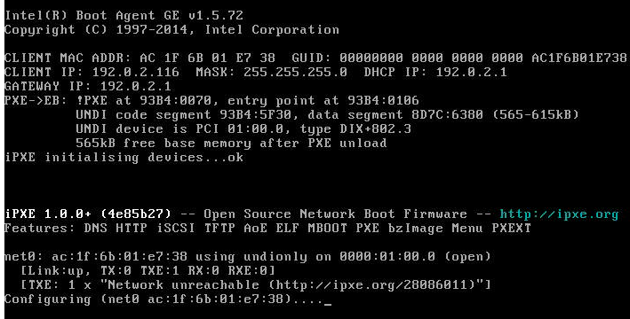

The next example shows a <span style="color:red">**failed boot**</span> of a VM that got stuck during the process.

In this case, login to the KVM host where this VM is started and do a “virt destroy <vm-name>” and then a “virt start <vm-name>” for a second try. This may avoid to abort the whole installation and start again.
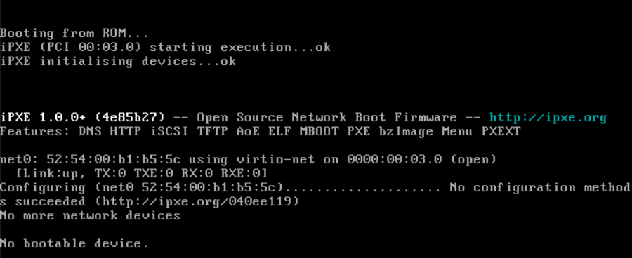

The next example shows a successful PXE boot, as the last messages indicate the download of the kernel images. These messages don’t appear for very long, but are a good sign that things are going well.
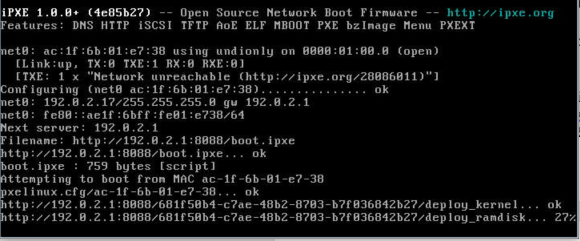

## 4.2	How to Restart a Failed Installation
Let’s assume there was an error during the installation, you have adjusted your templates, and now want to run a new trial of the overcloud installation.

First, instruct the undercloud OpenStack to remove the overcloud.
```
openstack stack delete --yes overcloud
```
Then issue a “watch” command to monitor this process (usually ~5-8 minutes in our reduced environment) and wait until you see the response "Stack not found: overcloud".
```
watch "openstack stack show overcloud | grep stack_status"
```
Now connect to the KVM host and verify that all relevant VMs are in “shut off” state.
```
ssh root@10.10.16.22
virsh list --all
 Id    Name                           State
----------------------------------------------------
 176   undercloud                     running
 207   contrail-analytics-database    shut off # expected result
 208   contrail-analytics             running  # NOT expected
 209   control                        shut off # expected result
 210   contrail-controller            shut off # expected result
```
Also, connect via remote console or ipmi to verify that all the  bare-metal servers are off.
```
ipmitool -I lanplus -H 10.10.16.25 -U ADMIN -P ADMIN chassis power status
Chassis Power is on   # NOT expected
ipmitool -I lanplus -H 10.10.16.27 -U ADMIN -P ADMIN chassis power status
Chassis Power is off  # expected result
```
If any of the baremetal hosts or VMs are still running, you must clear them and also delete and re-issue them into Ironic, as shown below.

Note: Only the first three mini-scripts are new; the rest is a copy of the Ironic on-boarding procedure from above.
```
# stop node inspection if it "hangs"
for node in $(openstack baremetal node list -c UUID -f value) ; do openstack baremetal introspection abort $node ; done

# undeploy all still active nodes to be able to start again with the process
for node in $(openstack baremetal node list -c UUID -f value) ; do openstack baremetal node undeploy $node ; done

# delete all nodes to be able to start again with the process
for node in $(openstack baremetal node list -c UUID -f value) ; do openstack baremetal node delete $node ; done

ssh_user=root
ssh_password=c0ntrail123
while IFS= read -r line
do   
  mac=`echo $line|awk '{print $1}'`
  name=`echo $line|awk '{print $2}'`
  kvm_ip=`echo $line|awk '{print $3}'`
  profile=`echo $line|awk '{print $4}'`
  uuid=`ironic node-create -d pxe_ssh -p cpus=4 -p memory_mb=16348 -p local_gb=100 -p cpu_arch=x86_64 -i ssh_username=${ssh_user} -i ssh_virt_type=virsh -i ssh_address=${kvm_ip} -i ssh_password=${ssh_password} -n $name -p capabilities=profile:${profile} | tail -2|awk '{print $4}'`
  ironic port-create -a ${mac} -n ${uuid}
done < <(cat ironic_list)


ipmi_user=ADMIN
ipmi_password=ADMIN
while IFS= read -r line
do
  mac=`echo $line|awk '{print $1}'`
  name=`echo $line|awk '{print $2}'`
  ipmi_address=`echo $line|awk '{print $3}'`
  profile=`echo $line|awk '{print $4}'`
  uuid=`ironic node-create -d pxe_ipmitool -p cpus=4 -p memory_mb=16348 -p local_gb=100 -p cpu_arch=x86_64 -i ipmi_username=${ipmi_user} -i ipmi_address=${ipmi_address} -i ipmi_password=${ipmi_password} -n $name -p capabilities=profile:${profile} | tail -2|awk '{print $4}'`
  ironic port-create -a ${mac} -n ${uuid}
done < <(cat ironic_list_bms)


openstack baremetal configure boot

for node in $(openstack baremetal node list -c UUID -f value) ; do openstack baremetal node manage $node ; done

openstack overcloud node introspect --all-manageable --provide
```
Regardless of the state, it is a good practice to wipe the virtual disk of the VMs and make sure all bare-metal servers are off and will PXE boot.

Physical Servers:
```
# set servers to poweroff (just to be sure)
ipmitool -I lanplus -H 10.10.16.25 -U ADMIN -P ADMIN chassis power off
ipmitool -I lanplus -H 10.10.16.27 -U ADMIN -P ADMIN chassis power off
# set servers to boot via pxe on next bootup
ipmitool -I lanplus -H 10.10.16.25 -U ADMIN -P ADMIN chassis bootdev pxe
ipmitool -I lanplus -H 10.10.16.27 -U ADMIN -P ADMIN chassis bootdev pxe
```
Virtual Machines:
```
ssh root@10.10.16.22

virsh destroy contrail-analytics
virsh destroy contrail-analytics-database
virsh destroy contrail-controller
virsh destroy control

num=0
for i in control contrail-controller contrail-analytics contrail-analytics-database
do
  num=$(expr $num + 1)
  qemu-img create -f qcow2 /var/lib/libvirt/images/${i}_${num}.qcow2 100G
done

exit
```
Now we are ready to start the overcloud installation again:
```
openstack overcloud deploy --templates tripleo-heat-templates/ \
  --roles-file tripleo-heat-templates/environments/contrail/roles_data.yaml \
  -e tripleo-heat-templates/environments/puppet-pacemaker.yaml \
  -e tripleo-heat-templates/environments/contrail/contrail-services.yaml \
  -e tripleo-heat-templates/environments/contrail/network-isolation.yaml \
  -e tripleo-heat-templates/environments/contrail/contrail-net.yaml \
  -e tripleo-heat-templates/environments/contrail/ips-from-pool-all.yaml \
  -e tripleo-heat-templates/environments/network-management.yaml \
  -e tripleo-heat-templates/extraconfig/pre_deploy/rhel-registration/environment-rhel-registration.yaml \
  -e tripleo-heat-templates/extraconfig/pre_deploy/rhel-registration/rhel-registration-resource-registry.yaml \
  --libvirt-type kvm --validation-errors-fatal --validation-warnings-fatal --timeout 240
```

## 4.3	Quick Hints and Time-savers
In general, the system hangs during the network installation because of a mistake during the installation/configuration steps, or because of a loss of connection to the undercloud due to incorrect NIC assignments or other issues such as no Internet connection (or connection to the install satellite).

During the installation, if you don’t see any output messages for more than 10 minutes, something may have gone wrong and you should troubleshoot the issue.

We recommend attempting to ping and login (using SSH) to each VM  and bare-metal host from the undercloud VM. First, do a nova list to find the IP addresses.
```
su – stack
source stackrc
nova list
+--------------------------------------+---------------------------------------+--------+------------+-------------+---------------------+
| ID                                   | Name                                  | Status | Task State | Power State | Networks            |
+--------------------------------------+---------------------------------------+--------+------------+-------------+---------------------+
| 8dbdc9e9-9998-4d51-b268-4cd71dde7be5 | overcloud-contrailanalytics-0         | ACTIVE | -          | Running     | ctlplane=192.0.2.9  |
| fc71d679-729d-4667-b76f-2afa58284848 | overcloud-contrailanalyticsdatabase-0 | ACTIVE | -          | Running     | ctlplane=192.0.2.12 |
| 360b987d-f835-4a41-9a4d-d411a509610e | overcloud-contrailcontroller-0        | ACTIVE | -          | Running     | ctlplane=192.0.2.17 |
| 455247cf-0c0f-4b10-9a37-ea0d2f2feb56 | overcloud-controller-0                | ACTIVE | -          | Running     | ctlplane=192.0.2.18 |
| 0adb7db0-0f24-4b8e-ba29-77710c1fa87a | overcloud-novacompute-0               | ACTIVE | -          | Running     | ctlplane=192.0.2.10 |
| 6b14c319-fdcd-4f08-b891-dd17987ebfb0 | overcloud-novacompute-1               | ACTIVE | -          | Running     | ctlplane=192.0.2.16 |
+--------------------------------------+---------------------------------------+--------+------------+-------------+---------------------+
```
Try to login into each host as “heat-admin”.
```
[stack@undercloud ~]$ ssh heat-admin@192.0.2.16
Last login: Tue Feb  6 15:32:08 2018 from gateway
[heat-admin@overcloud-novacompute-1 ~]$ sudo su
```
Try to ping a node on the Internet.
```
[root@overcloud-novacompute-1 heat-admin]# ping 8.8.8.8
PING 8.8.8.8 (8.8.8.8) 56(84) bytes of data.
64 bytes from 8.8.8.8: icmp_seq=1 ttl=57 time=8.24 ms
64 bytes from 8.8.8.8: icmp_seq=2 ttl=57 time=8.29 ms
64 bytes from 8.8.8.8: icmp_seq=3 ttl=57 time=8.27 ms
^C
--- 8.8.8.8 ping statistics ---
3 packets transmitted, 3 received, 0% packet loss, time 2002ms
rtt min/avg/max/mdev = 8.245/8.269/8.294/0.106 ms
```
Review the interface configuration.
```
[root@overcloud-novacompute-1 heat-admin]# ifconfig -a
bond0: flags=5187<UP,BROADCAST,RUNNING,MASTER,MULTICAST>  mtu 9000
        inet6 fe80::92e2:baff:fed9:da48  prefixlen 64  scopeid 0x20<link>
        ether 90:e2:ba:d9:da:48  txqueuelen 1000  (Ethernet)
        RX packets 1203839  bytes 255914582 (244.0 MiB)
        RX errors 0  dropped 0  overruns 0  frame 0
        TX packets 1883486  bytes 1021079678 (973.7 MiB)
        TX errors 0  dropped 0 overruns 0  carrier 0  collisions 0

eno1: flags=4163<UP,BROADCAST,RUNNING,MULTICAST>  mtu 1500
        inet 192.0.2.16  netmask 255.255.255.0  broadcast 192.0.2.255
        inet6 fe80::ae1f:6bff:fe01:e81e  prefixlen 64  scopeid 0x20<link>
        ether ac:1f:6b:01:e8:1e  txqueuelen 1000  (Ethernet)
        RX packets 1433994  bytes 1436936217 (1.3 GiB)
        RX errors 0  dropped 130  overruns 0  frame 0
        TX packets 502001  bytes 89023687 (84.8 MiB)
        TX errors 0  dropped 0 overruns 0  carrier 0  collisions 0
        device memory 0xc7120000-c713ffff

eno2: flags=4099<UP,BROADCAST,MULTICAST>  mtu 1500
        ether ac:1f:6b:01:e8:1f  txqueuelen 1000  (Ethernet)
        RX packets 0  bytes 0 (0.0 B)
        RX errors 0  dropped 0  overruns 0  frame 0
        TX packets 0  bytes 0 (0.0 B)
        TX errors 0  dropped 0 overruns 0  carrier 0  collisions 0
        device memory 0xc7100000-c711ffff

ens1f0: flags=6211<UP,BROADCAST,RUNNING,SLAVE,MULTICAST>  mtu 9000
        ether 90:e2:ba:d9:da:48  txqueuelen 1000  (Ethernet)
        RX packets 662843  bytes 204488097 (195.0 MiB)
        RX errors 0  dropped 0  overruns 0  frame 0
        TX packets 605070  bytes 73561213 (70.1 MiB)
        TX errors 0  dropped 0 overruns 0  carrier 0  collisions 0

ens1f1: flags=6211<UP,BROADCAST,RUNNING,SLAVE,MULTICAST>  mtu 9000
        ether 90:e2:ba:d9:da:48  txqueuelen 1000  (Ethernet)
        RX packets 540996  bytes 51426485 (49.0 MiB)
        RX errors 0  dropped 0  overruns 0  frame 0
        TX packets 1278486  bytes 947529877 (903.6 MiB)
        TX errors 0  dropped 0 overruns 0  carrier 0  collisions 0

ens2f0: flags=4099<UP,BROADCAST,MULTICAST>  mtu 1500
        ether 90:e2:ba:d9:eb:94  txqueuelen 1000  (Ethernet)
        RX packets 0  bytes 0 (0.0 B)
        RX errors 0  dropped 0  overruns 0  frame 0
        TX packets 0  bytes 0 (0.0 B)
        TX errors 0  dropped 0 overruns 0  carrier 0  collisions 0

ens2f1: flags=4099<UP,BROADCAST,MULTICAST>  mtu 1500
        ether 90:e2:ba:d9:eb:95  txqueuelen 1000  (Ethernet)
        RX packets 0  bytes 0 (0.0 B)
        RX errors 0  dropped 0  overruns 0  frame 0
        TX packets 0  bytes 0 (0.0 B)
        TX errors 0  dropped 0 overruns 0  carrier 0  collisions 0

lo: flags=73<UP,LOOPBACK,RUNNING>  mtu 65536
        inet 127.0.0.1  netmask 255.0.0.0
        inet6 ::1  prefixlen 128  scopeid 0x10<host>
        loop  txqueuelen 1  (Local Loopback)
        RX packets 6769320  bytes 358079668 (341.4 MiB)
        RX errors 0  dropped 0  overruns 0  frame 0
        TX packets 6769320  bytes 358079668 (341.4 MiB)
        TX errors 0  dropped 0 overruns 0  carrier 0  collisions 0

pkt0: flags=4163<UP,BROADCAST,RUNNING,MULTICAST>  mtu 1500
        inet6 fe80::e867:36ff:fe15:bd27  prefixlen 64  scopeid 0x20<link>
        ether ea:67:36:15:bd:27  txqueuelen 1000  (Ethernet)
        RX packets 28939  bytes 2491320 (2.3 MiB)
        RX errors 0  dropped 0  overruns 0  frame 0
        TX packets 34944  bytes 3233413 (3.0 MiB)
        TX errors 0  dropped 0 overruns 0  carrier 0  collisions 0

pkt1: flags=65<UP,RUNNING>  mtu 65535
        unspec 82-8E-AA-D3-68-FD-10-CA-00-00-00-00-00-00-00-00  txqueuelen 1  (UNSPEC)
        RX packets 0  bytes 0 (0.0 B)
        RX errors 0  dropped 0  overruns 0  frame 0
        TX packets 0  bytes 0 (0.0 B)
        TX errors 0  dropped 0 overruns 0  carrier 0  collisions 0

pkt2: flags=65<UP,RUNNING>  mtu 65535
        unspec 8A-45-39-C6-13-34-10-CA-00-00-00-00-00-00-00-00  txqueuelen 1  (UNSPEC)
        RX packets 0  bytes 0 (0.0 B)
        RX errors 0  dropped 0  overruns 0  frame 0
        TX packets 0  bytes 0 (0.0 B)
        TX errors 0  dropped 0 overruns 0  carrier 0  collisions 0

pkt3: flags=65<UP,RUNNING>  mtu 65535
        unspec F6-80-47-69-9D-BB-10-CA-00-00-00-00-00-00-00-00  txqueuelen 1  (UNSPEC)
        RX packets 0  bytes 0 (0.0 B)
        RX errors 0  dropped 0  overruns 0  frame 0
        TX packets 0  bytes 0 (0.0 B)
        TX errors 0  dropped 0 overruns 0  carrier 0  collisions 0

vhost0: flags=4163<UP,BROADCAST,RUNNING,MULTICAST>  mtu 9000
        inet 192.168.150.71  netmask 255.255.255.0  broadcast 192.168.150.255
        inet6 fe80::92e2:baff:fed9:da48  prefixlen 64  scopeid 0x20<link>
        ether 90:e2:ba:d9:da:48  txqueuelen 1000  (Ethernet)
        RX packets 1184581  bytes 253569902 (241.8 MiB)
        RX errors 0  dropped 0  overruns 0  frame 0
        TX packets 1300076  bytes 950968110 (906.9 MiB)
        TX errors 0  dropped 0 overruns 0  carrier 0  collisions 0

vlan20: flags=4163<UP,BROADCAST,RUNNING,MULTICAST>  mtu 9000
        inet 192.168.10.24  netmask 255.255.255.0  broadcast 192.168.10.255
        inet6 fe80::92e2:baff:fed9:da48  prefixlen 64  scopeid 0x20<link>
        ether 90:e2:ba:d9:da:48  txqueuelen 1000  (Ethernet)
        RX packets 32  bytes 1540 (1.5 KiB)
        RX errors 0  dropped 0  overruns 0  frame 0
        TX packets 17  bytes 1082 (1.0 KiB)
        TX errors 0  dropped 0 overruns 0  carrier 0  collisions 0

vlan30: flags=4163<UP,BROADCAST,RUNNING,MULTICAST>  mtu 9000
        inet 172.16.1.10  netmask 255.255.255.0  broadcast 172.16.1.255
        inet6 fe80::92e2:baff:fed9:da48  prefixlen 64  scopeid 0x20<link>
        ether 90:e2:ba:d9:da:48  txqueuelen 1000  (Ethernet)
        RX packets 32  bytes 1540 (1.5 KiB)
        RX errors 0  dropped 0  overruns 0  frame 0
        TX packets 17  bytes 1082 (1.0 KiB)
        TX errors 0  dropped 0 overruns 0  carrier 0  collisions 0

vlan40: flags=4163<UP,BROADCAST,RUNNING,MULTICAST>  mtu 9000
        inet 172.16.3.17  netmask 255.255.255.0  broadcast 172.16.3.255
        inet6 fe80::92e2:baff:fed9:da48  prefixlen 64  scopeid 0x20<link>
        ether 90:e2:ba:d9:da:48  txqueuelen 1000  (Ethernet)
        RX packets 41  bytes 1954 (1.9 KiB)
        RX errors 0  dropped 0  overruns 0  frame 0
        TX packets 17  bytes 1082 (1.0 KiB)
        TX errors 0  dropped 0 overruns 0  carrier 0  collisions 0
```
Review the local routes.
```
[root@overcloud-novacompute-1 heat-admin]# route -n
Kernel IP routing table
Destination     Gateway         Genmask         Flags Metric Ref    Use Iface
0.0.0.0         192.0.2.1       0.0.0.0         UG    0      0        0 eno1
169.254.169.12  192.168.150.1   255.255.255.255 UGH   0      0        0 vhost0
169.254.169.15  192.168.150.1   255.255.255.255 UGH   0      0        0 vhost0
169.254.169.254 192.0.2.1       255.255.255.255 UGH   0      0        0 eno1
172.16.1.0      0.0.0.0         255.255.255.0   U     0      0        0 vlan30
172.16.3.0      0.0.0.0         255.255.255.0   U     0      0        0 vlan40
192.0.2.0       0.0.0.0         255.255.255.0   U     0      0        0 eno1
192.168.10.0    0.0.0.0         255.255.255.0   U     0      0        0 vlan20
192.168.150.0   0.0.0.0         255.255.255.0   U     0      0        0 vhost0
```
Review the status of the bond interfaces.
```
[root@overcloud-novacompute-1 heat-admin]# cat /proc/net/bonding/bond0
Ethernet Channel Bonding Driver: v3.7.1 (April 27, 2011)

Bonding Mode: IEEE 802.3ad Dynamic link aggregation
Transmit Hash Policy: layer3+4 (1)
MII Status: up
MII Polling Interval (ms): 0
Up Delay (ms): 0
Down Delay (ms): 0

802.3ad info
LACP rate: slow
Min links: 0
Aggregator selection policy (ad_select): stable
System priority: 65535
System MAC address: 90:e2:ba:d9:da:48
Active Aggregator Info:
        Aggregator ID: 2
        Number of ports: 2
        Actor Key: 13
        Partner Key: 5
        Partner Mac Address: f4:a7:39:6a:5d:20

Slave Interface: ens1f0
MII Status: up
Speed: 10000 Mbps
Duplex: full
Link Failure Count: 0
Permanent HW addr: 90:e2:ba:d9:da:48
Slave queue ID: 0
Aggregator ID: 2
Actor Churn State: none
Partner Churn State: none
Actor Churned Count: 0
Partner Churned Count: 0
details actor lacp pdu:
    system priority: 65535
    system mac address: 90:e2:ba:d9:da:48
    port key: 13
    port priority: 255
    port number: 1
    port state: 61
details partner lacp pdu:
    system priority: 127
    system mac address: f4:a7:39:6a:5d:20
    oper key: 5
    port priority: 127
    port number: 4
    port state: 63

Slave Interface: ens1f1
MII Status: up
Speed: 10000 Mbps
Duplex: full
Link Failure Count: 0
Permanent HW addr: 90:e2:ba:d9:da:49
Slave queue ID: 0
Aggregator ID: 2
Actor Churn State: none
Partner Churn State: none
Actor Churned Count: 0
Partner Churned Count: 0
details actor lacp pdu:
    system priority: 65535
    system mac address: 90:e2:ba:d9:da:48
    port key: 13
    port priority: 255
    port number: 2
    port state: 61
details partner lacp pdu:
    system priority: 127
    system mac address: f4:a7:39:6a:5d:20
    oper key: 5
    port priority: 127
    port number: 17
    port state: 63
```
Verify whether the metadata server in the underlay VM responds to a curl (it is not ping-able). If there is no response, restore the saved firewall settings on the undercloud VM.
```
[root@overcloud-novacompute-1 heat-admin]# curl http://169.254.169.254
1.0
2007-01-19
2007-03-01
2007-08-29
2007-10-10
2007-12-15
2008-02-01
2008-09-01
2009-04-04
latest
```
Finally, review the local log file.
```
journalctl -u os-collect-config > res.txt
tail -f -n100 res.txt
```
Note: A message like the below means that this host has executed all configuration scripts in its queue , which means the issue is most likely on a different host or VM.
```
Feb 09 13:07:02 overcloud-novacompute-1 os-collect-config[9199]: No local metadata found (['/var/lib/os-collect-config/local-data'])
```
## 4.4	(Optional) Install a squid-proxy in the Undercloud VM
The lab, used to create this example is somewhat constrained as it does not have access via the external/public network to the OpenStack Horizon and Contrail GUI.

If you have similar challenge, you can use extended SSH tunnel forwarding or, like we do in this example, install a local proxy.
```
sudo su root

ifconfig eth2 192.168.150.55/24 up
ping 192.168.150.60 -c3
.
.

yum install -y squid
iptables -I INPUT 1 -p tcp --dport 3128 -j ACCEPT

vi /etc/squid/squid.conf

# add the following ports to the config file
acl SSL_ports port 8143
acl SSL_ports port 8443
acl Safe_ports port 8080
acl Safe_ports port 8181
acl Safe_ports port 5000

# and change the http_port to listen on all interfaces
http_port 0.0.0.0:3128

# save your changed config file an exit the editor

service squid stop
sleep 10
service squid start
ps -eZ | grep squid
system_u:system_r:squid_t:s0     5030 ?        00:00:00 squid
system_u:system_r:squid_t:s0     5032 ?        00:00:00 squid
netstat -antp | grep squid
tcp        0      0 0.0.0.0:3128            0.0.0.0:*               LISTEN      12367/(squid-1)

exit
```
Now, in your Mozilla browser install and configure the FoxyProxy plugin.
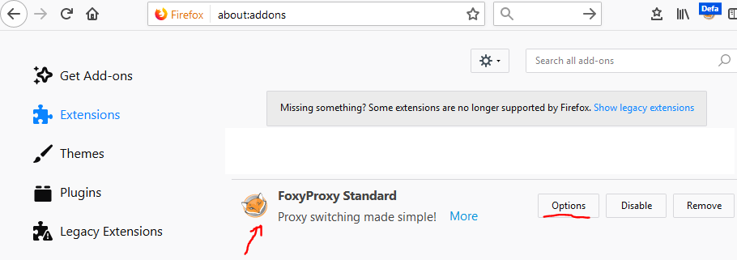

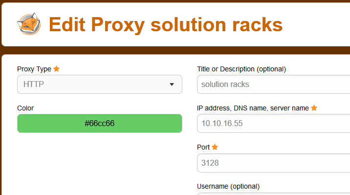

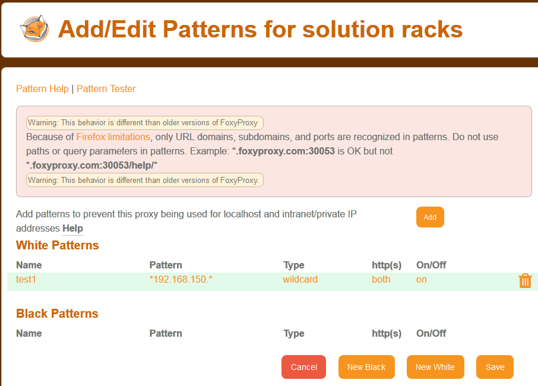

With the proxy in your browser enabled, you should be able to access the GUIs.
```
http://192.168.150.60        # Horizon GUI
https://192.168.150.61:8143  # Contrail GUI
```
The username will be “admin” and the password is stored in the file /home/stack/overcloudrc as variable OS_PASSWORD.

## 4.5	Testing the Installation With One VM and Traffic to the DC Router
First, let’s review the overcloudrc file to obtain the necessary credentials and other information.

Then find the IP address of the OpenStack Controller and access it using SSH.

Then find the IP address of the Internal-API (192.168.150.0/24) network that is assigned to the Controller.

Use a modified version of the overcloudrc from last step where you change the IP address to the Internal-API network and apply the new variables. This will provide access to the local APIs, regardless of the state of the public network. (Generally, you should be able to just copy and execute the overcloudrc. This step is just in case.)
```
su – stack
source stackrc

cat overcloudrc
# Clear any old environment that may conflict.
for key in $( set | awk '{FS="="}  /^OS_/ {print $1}' ); do unset $key ; done
export OS_USERNAME=admin
export OS_TENANT_NAME=admin
export NOVA_VERSION=1.1
export OS_PROJECT_NAME=admin
export OS_PASSWORD=2aRCVBN7aTyXqWBrbDrZbGMZG
export OS_NO_CACHE=True
export COMPUTE_API_VERSION=1.1
export no_proxy=,192.168.10.10,192.0.2.14
export OS_CLOUDNAME=overcloud
export OS_AUTH_URL=http://192.168.10.10:5000/v2.0
export PYTHONWARNINGS="ignore:Certificate has no, ignore:A true SSLContext object is not available"

nova list | grep '\-controller'
| 455247cf-0c0f-4b10-9a37-ea0d2f2feb56 | overcloud-controller-0                | ACTIVE | -          | Running     | ctlplane=192.0.2.18 |

ssh heat-admin@192.0.2.18
sudo su

ifconfig | grep 192.168.150.
        inet 192.168.150.60  netmask 255.255.255.0  broadcast 192.168.150.255

export OS_USERNAME=admin
export OS_TENANT_NAME=admin
export NOVA_VERSION=1.1
export OS_PROJECT_NAME=admin
export OS_PASSWORD=2aRCVBN7aTyXqWBrbDrZbGMZG
export OS_NO_CACHE=True
export COMPUTE_API_VERSION=1.1
export no_proxy=,192.168.10.10,192.0.2.14
export OS_CLOUDNAME=overcloud
export OS_AUTH_URL=http://192.168.150.60:5000/v2.0
export PYTHONWARNINGS="ignore:Certificate has no, ignore:A true SSLContext object is not available"
```
Now download a small VM (cirros) from the Internet (or another suitable location) to the OpenStack Controller, and upload the image to glance. Then create the flavor of VM you wish to use.

<span style="color:red">**Note: Do NOT attempt to use the Horizon GUI to upload the VM to glance.**</span>
```
curl http://download.cirros-cloud.net/0.4.0/cirros-0.4.0-x86_64-disk.img --output cirros.img

openstack image create "cirros" --disk-format qcow2 --container-format bare --public --file cirros.img
+------------------+-----------------------------------------------------------+
| Field            | Value                                                     |
+------------------+-----------------------------------------------------------+
| checksum         | 443b7623e27ecf03dc9e01ee93f67afe                          |
| container_format | bare                                                      |
| created_at       | 2018-02-06T09:15:41Z                                      |
| disk_format      | qcow2                                                     |
| file             | /v2/images/a6eec9eb-bee0-4d7a-a0c3-9a6703521206/file      |
| id               | a6eec9eb-bee0-4d7a-a0c3-9a6703521206                      |
| min_disk         | 0                                                         |
| min_ram          | 0                                                         |
| name             | cirros                                                    |
| owner            | 572bfa0be39e4c5399221cd65a48fd81                          |
| properties       | direct_url='swift+config://ref1/glance/a6eec9eb-bee0      |
|                  | -4d7a-a0c3-9a6703521206'                                  |
| protected        | False                                                     |
| schema           | /v2/schemas/image                                         |
| size             | 12716032                                                  |
| status           | active                                                    |
| tags             |                                                           |
| updated_at       | 2018-02-06T09:15:42Z                                      |
| virtual_size     | None                                                      |
| visibility       | public                                                    |
+------------------+-----------------------------------------------------------+

openstack flavor create --ram 1024 --disk 20 --vcpus 1 --public testflavor
+----------------------------+--------------------------------------+
| Field                      | Value                                |
+----------------------------+--------------------------------------+
| OS-FLV-DISABLED:disabled   | False                                |
| OS-FLV-EXT-DATA:ephemeral  | 0                                    |
| disk                       | 20                                   |
| id                         | 16c21ebf-e6dd-41d7-962d-69aacabe8110 |
| name                       | testflavor                           |
| os-flavor-access:is_public | True                                 |
| properties                 |                                      |
| ram                        | 1024                                 |
| rxtx_factor                | 1.0                                  |
| swap                       |                                      |
| vcpus                      | 1                                    |
+----------------------------+--------------------------------------+
```
Next, access the Contrail GUI (https://192.168.150.61:8143 in this case). As before, the username will be “admin” and the password is in the file /home/stack/overcloudrc as variable OS_PASSWORD.

If you don’t know the IP address of the Contrail Controller, use the same method as above.
```
nova list | grep 'contrailcontroller'
| 360b987d-f835-4a41-9a4d-d411a509610e | overcloud-contrailcontroller-0        | ACTIVE | -          | Running     | ctlplane=192.0.2.17 |

ssh heat-admin@192.0.2.17
ifconfig | grep 192.168.150.
        inet 192.168.150.61  netmask 255.255.255.0  broadcast 192.168.150.255
```
You should now see the Contrail dashboard.
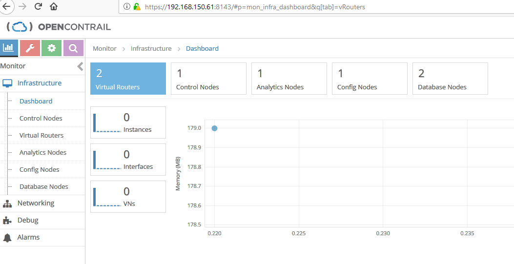

Navigate to Configure -> BGP Routers -> Add (+).

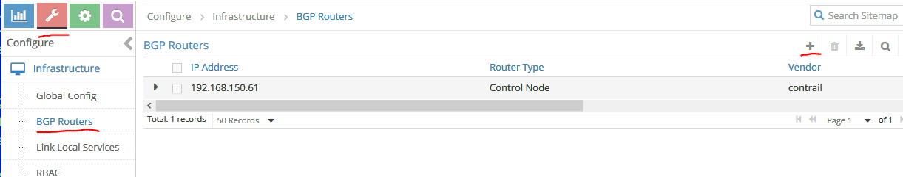

Create a new BGP Router Type for your DC router. In the IP Address and Router ID fields, enter the  loopback IP address of the DC router (169.254.169.15 in this case).

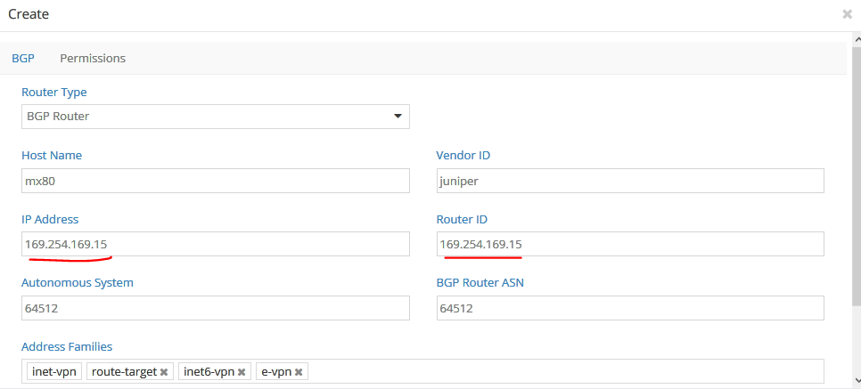

Then, under Associate Peer -> Add (+) -> Peer = overcloud-contrailcontroller-0,.
 add other peers if applicable (a production grade system should have a minimum of three).

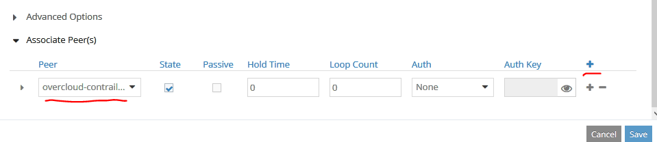

After you click Save, the new node should appear.

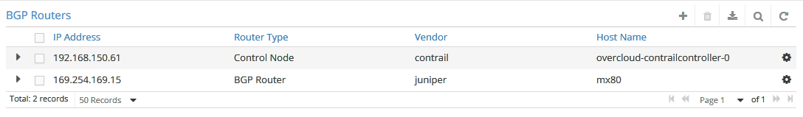

To verify that a BGP peering session has been established, go to
Monitor -> Control Nodes -> overcloud-contrailcontroller-???.

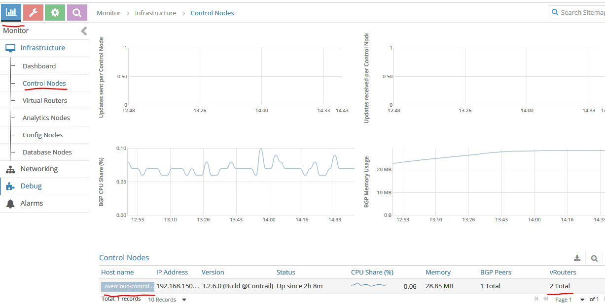

In the Peers ab,  all nodes with a Peer Type of BGP should have a  Status of Established.

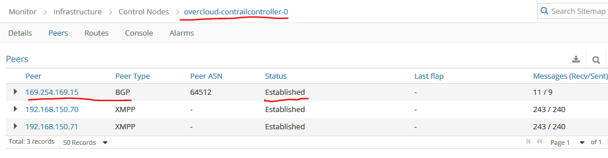

If you do not see these results, two probable causes are:
1.	The loopback IP address of the DC router is not reachable via the Contrail Controller, or the path MTUs are broken somewhere.
2.	The new BGP neighbor’s IP address is not configured on the DC router.

For 1, you can check this by sending a large ping from the Controller to the loopback IP with a size that is HIGHER than any MTU in the fabric and the ICMP packet to allow fragmentation.
```
[heat-admin@overcloud-contrailcontroller-0 ~]$ sudo ping 169.254.169.15 -s 20000
PING 169.254.169.15 (169.254.169.15) 20000(20028) bytes of data.
20008 bytes from 169.254.169.15: icmp_seq=1 ttl=62 time=2.16 ms
20008 bytes from 169.254.169.15: icmp_seq=2 ttl=62 time=1.99 ms
^C
--- 169.254.169.15 ping statistics ---
2 packets transmitted, 2 received, 0% packet loss, time 1001ms
rtt min/avg/max/mdev = 1.998/2.079/2.160/0.081 msm
```
For 2, configure the BGPneighbour’s IP address on the DC router.
```
set protocols bgp group contrail neighbor 192.168.150.61
```
With the BGP configuration working on the Contrail side, you can also login to the DC router and review the peering with the Contrail Controller.
```
ssh admin@10.10.16.15

show bgp summary
Groups: 1 Peers: 1 Down peers: 0
Table          Tot Paths  Act Paths Suppressed    History Damp State    Pending
bgp.rtarget.0
                       0          0          0          0          0          0
bgp.l3vpn.0
                       0          0          0          0          0          0
bgp.l3vpn-inet6.0
                       0          0          0          0          0          0
bgp.evpn.0
                       0          0          0          0          0          0
Peer                     AS      InPkt     OutPkt    OutQ   Flaps Last Up/Dwn State|#Active/Received/Accepted/Damped...
192.168.150.61        64512         24         19       0       5        9:16 Establ
  bgp.rtarget.0: 0/0/0/0
  bgp.l3vpn.0: 0/0/0/0
  bgp.l3vpn-inet6.0: 0/0/0/0
  bgp.evpn.0: 0/0/0/0

show bgp neighbor
Peer: 192.168.150.61+34098 AS 64512 Local: 169.254.169.15+179 AS 64512
  Group: contrail              Routing-Instance: master
  Forwarding routing-instance: master
  Type: Internal    State: Established    Flags: <Sync>
  Last State: OpenConfirm   Last Event: RecvKeepAlive
  Last Error: Hold Timer Expired Error
  Export: [ addudp ] Import: [ getudp ]
  Options: <Multihop Preference LocalAddress HoldTime AddressFamily Rib-group Refresh>
  Options: <VpnApplyExport>
  Address families configured: inet-vpn-unicast inet6-vpn-unicast route-target evpn
  Local Address: 169.254.169.15 Holdtime: 90 Preference: 170
  Number of flaps: 5
  Last flap event: HoldTime
  Error: 'Hold Timer Expired Error' Sent: 5 Recv: 0
  Error: 'Cease' Sent: 0 Recv: 2010
  Peer ID: 192.168.150.61  Local ID: 169.254.169.15    Active Holdtime: 90
  Keepalive Interval: 30         Group index: 0    Peer index: 0
  I/O Session Thread: bgpio-0 State: Enabled
  BFD: disabled, down
  NLRI for restart configured on peer: inet-vpn-unicast inet6-vpn-unicast route-target evpn
  NLRI advertised by peer: inet-vpn-unicast inet6-vpn-unicast route-target evpn
  NLRI for this session: inet-vpn-unicast inet6-vpn-unicast route-target evpn
  Peer does not support Refresh capability
  Stale routes from peer are kept for: 300
  Peer does not support Restarter functionality
  NLRI that restart is negotiated for: inet-vpn-unicast inet6-vpn-unicast route-target evpn
  NLRI of received end-of-rib markers: inet-vpn-unicast inet6-vpn-unicast route-target evpn
  NLRI of all end-of-rib markers sent: inet-vpn-unicast inet6-vpn-unicast route-target evpn
  Peer does not support LLGR Restarter or Receiver functionality
  Peer does not support 4 byte AS extension
  Peer does not support Addpath
  Table bgp.rtarget.0 Bit: 10000
    RIB State: BGP restart is complete
    RIB State: VPN restart is complete
    Send state: in sync
    Active prefixes:              0
    Received prefixes:            0
    Accepted prefixes:            0
    Suppressed due to damping:    0
    Advertised prefixes:          1
  Table bgp.l3vpn.0
    RIB State: BGP restart is complete
    RIB State: VPN restart is complete
    Send state: not advertising
    Active prefixes:              0
    Received prefixes:            0
    Accepted prefixes:            0
    Suppressed due to damping:    0
  Table bgp.l3vpn-inet6.0
    RIB State: BGP restart is complete
    RIB State: VPN restart is complete
    Send state: not advertising
    Active prefixes:              0
    Received prefixes:            0
    Accepted prefixes:            0
    Suppressed due to damping:    0
  Table bgp.evpn.0
    RIB State: BGP restart is complete
    RIB State: VPN restart is complete
    Send state: not advertising
    Active prefixes:              0
    Received prefixes:            0
    Accepted prefixes:            0
    Suppressed due to damping:    0
  Table testvrf.inet.0 Bit: 50000
    RIB State: BGP restart is complete
    RIB State: VPN restart is complete
    Send state: in sync
    Active prefixes:              0
    Received prefixes:            0
    Accepted prefixes:            0
    Suppressed due to damping:    0
    Advertised prefixes:          0
  Table testvrf.inet6.0 Bit: 60000
    RIB State: BGP restart is complete
    RIB State: VPN restart is complete
    Send state: in sync
    Active prefixes:              0
    Received prefixes:            0
    Accepted prefixes:            0
    Suppressed due to damping:    0
    Advertised prefixes:          0
  Last traffic (seconds): Received 941646 Sent 565 Checked 941646
  Input messages:  Total 24     Updates 4       Refreshes 0     Octets 540
  Output messages: Total 19     Updates 1       Refreshes 0     Octets 574
  Output Queue[0]: 0            (bgp.rtarget.0, route-target)
  Output Queue[4]: 0            (testvrf.inet.0, inet-vpn-unicast)
  Output Queue[5]: 0            (testvrf.inet6.0, inet6-vpn-unicast)


show route
.
.
testvrf.inet.0: 1 destinations, 1 routes (1 active, 0 holddown, 0 hidden)
+ = Active Route, - = Last Active, * = Both

1.1.1.1/32         *[Direct/0] 1w1d 01:19:36
                    > via lo0.1111
.
.
```
Our testvrf will only show the configured loopback IP address for this VRF.

Now let’s change the default OpenStack security group for this project.

<span style="color:red">**Note: If you forget to change the security group, you will not be able to send traffic via the DC router to the VMs.**</span>

Navigate to Configure -> Networking -> Security Groups -> select=default -> Edit (the gear).

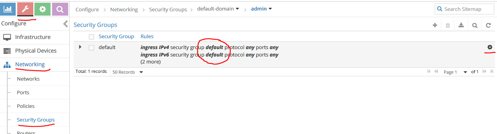

As you can see, there are two INGRESS policies where the address=default. However, default is not defined yet, therefore <span style="color:red">**ALL INGRESS TRAFFIC IS CURRENTLY BLOCKED!**</span> This makes communication rather half-duplex.

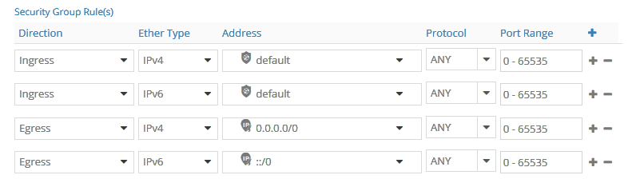

Edit these policies to be similar to the Egress policies and allow all traffic. Then save the rule set.

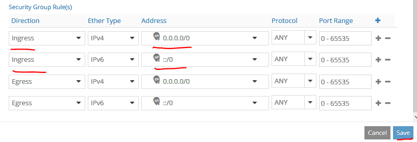

Verify that the policies now allow all traffic.

<span style="color:red">**Note: Whenever you create a new OpenStack project / tenant, you will need to again perform this step.**</span>


Now create a new Contrail policy that is also wide open.
Note: Depending on the assignment of OpenStack security rules and Contrail policies, typically you need to pass BOTH rule sets.

Navigate to Configure -> Networking -> Policies -> Add (+).

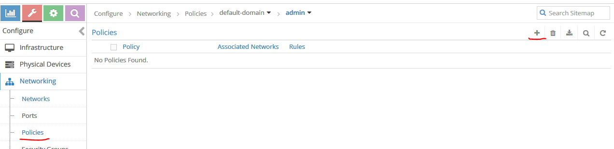

Give the policy a name and use Add (+) to create a rule, then click Save. The default policy is wide open allowing everything, as shown below.


Now it’s finally time to create a virtual network.

Navigate to Configure -> Networking -> Networks -> Add (+).

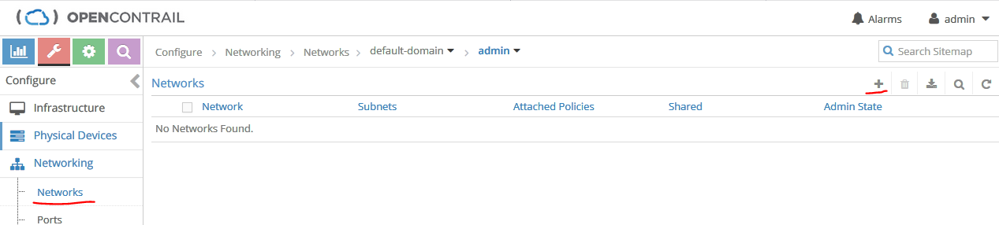

Use the name testnetwork and attach the Contrail policy you created in the prevoius step. Use a CIDR (like 10.10.10.0/24) and leave DNS and DHCP enabled.

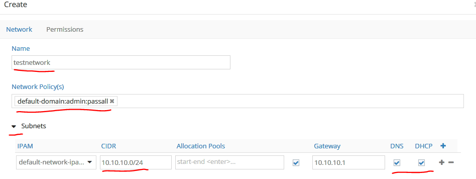

Before you save this network, under Route Target  Add (+) you need to fill in the Route Target (64512:10000 in this case) to enable the testvrf to communicate with and update the DC router. Then you can save your configuration.

<span style="color:red">Note: If you forget to fill in the route target information, this network will always be isolated inside the fabric and will not be able to talk to the outside/WAN via the DC router. OpenStack Neutron doesn’t know what a route target is so you can’t configure this important variable via the OpenStack CLI / REST or Horizon GUI; you must use the Contrail GUI, Contrail REST interface, or the OpenStack Heat extensions added during the installation.</span>

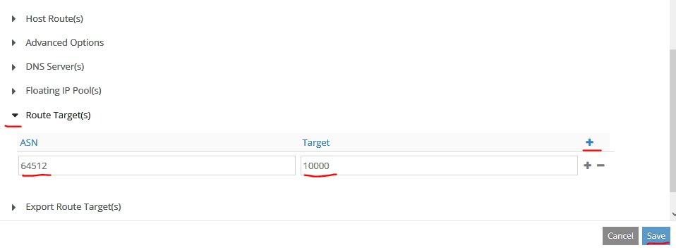

The resulting configuration should look like this:

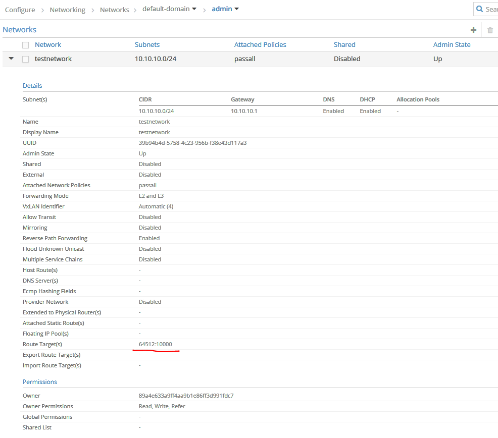

Now it’s time to launch a VM inside OpenStack. It’s faster via CLI then through the Horizon GUI, so re-use your shell on the OpenStack Controller and
display the UUID of the network you created in the Contrail GUI to a variable.
Then launch the VM, defining the image, flavor, and the network variable to use.
```
VMNET=`neutron net-list | grep testnetwork | awk '{print $2}'`
echo $VMNET
39b94b4d-5758-4c23-956b-f38e43d117a3

nova boot --image cirros --flavor testflavor --nic net-id=$VMNET testvm1
+--------------------------------------+---------------------------------------------------+
| Property                             | Value                                             |
+--------------------------------------+---------------------------------------------------+
| OS-DCF:diskConfig                    | MANUAL                                            |
| OS-EXT-AZ:availability_zone          |                                                   |
| OS-EXT-SRV-ATTR:host                 | -                                                 |
| OS-EXT-SRV-ATTR:hostname             | testvm1                                           |
| OS-EXT-SRV-ATTR:hypervisor_hostname  | -                                                 |
| OS-EXT-SRV-ATTR:instance_name        |                                                   |
| OS-EXT-SRV-ATTR:kernel_id            |                                                   |
| OS-EXT-SRV-ATTR:launch_index         | 0                                                 |
| OS-EXT-SRV-ATTR:ramdisk_id           |                                                   |
| OS-EXT-SRV-ATTR:reservation_id       | r-dqn6pyc9                                        |
| OS-EXT-SRV-ATTR:root_device_name     | -                                                 |
| OS-EXT-SRV-ATTR:user_data            | -                                                 |
| OS-EXT-STS:power_state               | 0                                                 |
| OS-EXT-STS:task_state                | scheduling                                        |
| OS-EXT-STS:vm_state                  | building                                          |
| OS-SRV-USG:launched_at               | -                                                 |
| OS-SRV-USG:terminated_at             | -                                                 |
| accessIPv4                           |                                                   |
| accessIPv6                           |                                                   |
| adminPass                            | 7Ba5uyVz75xp                                      |
| config_drive                         |                                                   |
| created                              | 2018-02-06T14:21:56Z                              |
| description                          | -                                                 |
| flavor                               | testflavor (16c21ebf-e6dd-41d7-962d-69aacabe8110) |
| hostId                               |                                                   |
| host_status                          |                                                   |
| id                                   | 02bd4873-5547-4106-adbc-a2b671a12bae              |
| image                                | cirros (fb8a07c8-3148-4128-9baa-358f8a9212e3)     |
| key_name                             | -                                                 |
| locked                               | False                                             |
| metadata                             | {}                                                |
| name                                 | testvm1                                           |
| os-extended-volumes:volumes_attached | []                                                |
| progress                             | 0                                                 |
| security_groups                      | default                                           |
| status                               | BUILD                                             |
| tags                                 | []                                                |
| tenant_id                            | 89a4e633a9ff4aa9b1e86ff3d991fdc7                  |
| updated                              | 2018-02-06T14:21:57Z                              |
| user_id                              | 980ed8973f5348468eb20ac8ac92c9da                  |
+--------------------------------------+---------------------------------------------------+

nova list
+--------------------------------------+---------+--------+------------+-------------+------------------------+
| ID                                   | Name    | Status | Task State | Power State | Networks               |
+--------------------------------------+---------+--------+------------+-------------+------------------------+
| 02bd4873-5547-4106-adbc-a2b671a12bae | testvm1 | ACTIVE | -          | Running     | testnetwork=10.10.10.3 |
+--------------------------------------+---------+--------+------------+-------------+------------------------+
```
After a short time (usually 1-2 minutes; if it takes more than 5 minutes you have an issue) you should see status=ACTIVE and be able to view the IP address that OpenStack has reserved for this VM.

<span style="color:red">Note: Active state only means that OpenStack has started the VM, NOT that it’s fully up and running. The time it takes for the VM to boot up can vary from a few seconds up to >10 minutes, depending on the guest VM and what it contains.</span>
<span style="color:red">Note: The reserved IP address here doesn’t mean that the VM has already requested and configured this VM to be reachable. OpenStack (not Contrail) is in charge of  defining what the vRouter (with its built-in DHCP server) should assign/hand-out when the VM requests an IP address. OpenStack’s security features will not allow this VM to use any other IP address than the one assigned through this process.</span>

Now verify the testvrf status on the DC router. You should now see the host IP address of the VM with a next hop/destination as “Tunnel”. This is because we have configured MPLSoUDP instead of MPLSoGRE. The latter method would display a gr-* interface instead.
```
show route
.
.
testvrf.inet.0: 2 destinations, 2 routes (2 active, 0 holddown, 0 hidden)
+ = Active Route, - = Last Active, * = Both

1.1.1.1/32         *[Direct/0] 1w1d 01:53:10
                    > via lo0.1111
10.10.10.3/32      *[BGP/170] 00:04:13, MED 100, localpref 200, from 192.168.150.61
                      AS path: ?, validation-state: unverified
                    > via Tunnel Composite, Push 17

Ping from the testvrf routing instance on the DC router to the VM, using the local loopback IP (1.1.1.1) as the source.

ping 10.10.10.3 routing-instance testvrf source 1.1.1.1
PING 10.10.10.3 (10.10.10.3): 56 data bytes
64 bytes from 10.10.10.3: icmp_seq=0 ttl=63 time=1.169 ms
64 bytes from 10.10.10.3: icmp_seq=1 ttl=63 time=0.648 ms
64 bytes from 10.10.10.3: icmp_seq=2 ttl=63 time=0.727 ms
^C
--- 10.10.10.3 ping statistics ---
3 packets transmitted, 3 packets received, 0% packet loss
round-trip min/avg/max/stddev = 0.648/0.848/1.169/0.229 ms
```
As a final test, connect from the DC router to the VM using SSH.
```
ssh cirros@10.10.10.3 routing-instance testvrf source 1.1.1.1
The authenticity of host '10.10.10.3 (10.10.10.3)' can't be established.
ECDSA key fingerprint is SHA256:a8kBF690+OgpluQtKXkzqtOOtPfH36pr8voYERwj5ms.
Are you sure you want to continue connecting (yes/no)? yes
Warning: Permanently added '10.10.10.3' (ECDSA) to the list of known hosts.
cirros@10.10.10.3's password: gocubsgo
$ ifconfig
eth0      Link encap:Ethernet  HWaddr 02:E3:8B:EF:E5:A0
          inet addr:10.10.10.3  Bcast:10.10.10.255  Mask:255.255.255.0
          inet6 addr: fe80::e3:8bff:feef:e5a0/64 Scope:Link
          UP BROADCAST RUNNING MULTICAST  MTU:1500  Metric:1
          RX packets:336 errors:0 dropped:0 overruns:0 frame:0
          TX packets:351 errors:0 dropped:0 overruns:0 carrier:0
          collisions:0 txqueuelen:1000
          RX bytes:25145 (24.5 KiB)  TX bytes:24513 (23.9 KiB)

lo        Link encap:Local Loopback
          inet addr:127.0.0.1  Mask:255.0.0.0
          inet6 addr: ::1/128 Scope:Host
          UP LOOPBACK RUNNING  MTU:65536  Metric:1
          RX packets:0 errors:0 dropped:0 overruns:0 frame:0
          TX packets:0 errors:0 dropped:0 overruns:0 carrier:0
          collisions:0 txqueuelen:1
          RX bytes:0 (0.0 B)  TX bytes:0 (0.0 B)

$
```
# <span style="color:red">**Hurray you are done!**</span>

# 5	Appendix A: DC Fabric Network Configuration

## 5.1	Switch/Router Firmware Upgrades
```
ssh root@10.10.16.12

cd /var/tmp
scp root@10.10.16.20://root/jinstall-host-qfx-5-17.2R1.13-signed.tgz .
cli
request system software add /var/tmp/jinstall-host-qfx-5-17.2R1.13-signed.tgz no-validate reboot
.
.


ssh root@10.10.16.13

cd /var/tmp
scp root@10.10.16.20://root/jinstall-host-qfx-5-17.2R1.13-signed.tgz .
cli
request system software add /var/tmp/jinstall-host-qfx-5-17.2R1.13-signed.tgz no-validate reboot
.
.


ssh root@10.10.16.14

cd /var/tmp
scp root@10.10.16.20://root/jinstall-host-qfx-5-17.2R1.13-signed.tgz .
cli
request system software add /var/tmp/jinstall-host-qfx-5-17.2R1.13-signed.tgz no-validate reboot
.
.


ssh root@10.10.16.15
cd /var/tmp
scp root@10.10.16.20://root/jinstall-ppc-17.2R1.13-signed.tgz .
cli
request system software add /var/tmp/jinstall-ppc-17.2R1.13-signed.tgz no-validate reboot
.
.
```

## 5.2	Create Virtual Chassis using Leaf-1 and Leaf-2
This is based on http://blog.marquis.co/configuring-a-virtual-chassis-on-qfx5100/
```
ssh admin@10.10.16.12
run show chassis hardware
set system commit synchronize
set chassis redundancy graceful-switchover
set routing-options nonstop-routing
set protocols layer2-control nonstop-bridging
commit

ssh admin@10.10.16.13
run show chassis hardware
set system commit synchronize
set chassis redundancy graceful-switchover
set routing-options nonstop-routing
set protocols layer2-control nonstop-bridging
commit

ssh admin@10.10.16.12
set virtual-chassis preprovisioned
set virtual-chassis no-split-detection
set virtual-chassis member 0 role routing-engine
set virtual-chassis member 0 serial-number TA3717020354
set virtual-chassis member 1 role routing-engine
set virtual-chassis member 1 serial-number TA3717020145

#set interfaces et-0/0/48 disable
#delete interfaces et-0/0/48 disable
set interfaces et-0/0/48 description "VC-link to DC90-leaf-2 et-0/0/48"
set interfaces et-0/0/49 description "Uplink to DC90-spine et-0/0/49"
commit and-quit
request virtual-chassis vc-port set pic-slot 0 port 48

ssh admin@10.10.16.13
set interfaces et-0/0/48 description "VC-link to DC90-leaf-1 et-0/0/48"
set interfaces et-0/0/50 description "Uplink to DC90-spine et-0/0/50"
commit and-quit
request virtual-chassis vc-port set pic-slot 0 port 48
# MANDATORY
request system reboot
```
After the system is up again, login and review the setup.
```
ssh admin@10.10.16.12
show virtual-chassis

Virtual Chassis ID: ed7c.3366.547b
Virtual Chassis Mode: Enabled
                                                Mstr           Mixed Route Neighbor List
Member ID  Status   Serial No    Model          prio  Role      Mode  Mode ID  Interface
0 (FPC 0)  Prsnt    TA3717020354 qfx5100-48s-6q 128   Master*      N  VC   1  vcp-255/0/48
1 (FPC 1)  Prsnt    TA3717020145 qfx5100-48s-6q 128   Backup       N  VC   0  vcp-255/0/48

Member ID for next new member: 2 (FPC 2)


show virtual-chassis vc-port
fpc0:
--------------------------------------------------------------------------
Interface   Type              Trunk  Status       Speed        Neighbor
or                             ID                 (mbps)       ID  Interface
PIC / Port
0/48        Configured         -1    Up           40000        1   vcp-255/0/48

fpc1:
--------------------------------------------------------------------------
Interface   Type              Trunk  Status       Speed        Neighbor
or                             ID                 (mbps)       ID  Interface
PIC / Port
0/48        Configured         -1    Up           40000        0   vcp-255/0/48


admin@DC90-leaf-1> show interfaces terse
Interface               Admin Link Proto    Local                 Remote
vcp-255/0/48            up    up
vcp-255/0/48.32768      up    up
gr-0/0/0                up    up
pfe-0/0/0               up    up
pfe-0/0/0.16383         up    up   inet
                                   inet6
pfh-0/0/0               up    up
pfh-0/0/0.16383         up    up   inet
pfh-0/0/0.16384         up    up   inet
xe-0/0/1                up    up
xe-0/0/1.0              up    up   inet
xe-0/0/2                up    up
xe-0/0/2.0              up    up   inet
xe-0/0/3                up    up
xe-0/0/3.0              up    up   inet
xe-0/0/4                up    up
xe-0/0/4.0              up    up   inet
xe-0/0/5                up    up
xe-0/0/5.0              up    up   inet
xe-0/0/6                up    up
xe-0/0/6.0              up    up   inet
xe-0/0/7                up    up
xe-0/0/7.0              up    up   inet
xe-0/0/8                up    up
xe-0/0/8.0              up    up   inet
xe-0/0/9                up    up
xe-0/0/9.0              up    up   inet
xe-0/0/10               up    up
xe-0/0/10.0             up    up   inet
xe-0/0/11               up    up
xe-0/0/11.0             up    up   inet
xe-0/0/12               up    up
xe-0/0/12.0             up    up   inet
et-0/0/49               up    up
et-0/0/49.0             up    up   inet
pfe-1/0/0               up    up
pfe-1/0/0.16383         up    up   inet
                                   inet6
pfh-1/0/0               up    up
pfh-1/0/0.16383         up    up   inet
pfh-1/0/0.16384         up    up   inet
xe-1/0/1                up    up
xe-1/0/1.16386          up    up
xe-1/0/2                up    up
xe-1/0/2.16386          up    up
xe-1/0/3                up    up
xe-1/0/3.16386          up    up
xe-1/0/4                up    up
xe-1/0/4.16386          up    up
xe-1/0/5                up    up
xe-1/0/5.16386          up    up
xe-1/0/6                up    up
xe-1/0/6.16386          up    up
xe-1/0/7                up    up
xe-1/0/7.16386          up    up
xe-1/0/8                up    up
xe-1/0/8.16386          up    up
xe-1/0/9                up    up
xe-1/0/9.16386          up    up
xe-1/0/10               up    up
xe-1/0/10.16386         up    up
xe-1/0/11               up    up
xe-1/0/11.16386         up    up
xe-1/0/12               up    up
xe-1/0/12.16386         up    up
et-1/0/50               up    up
et-1/0/50.16386         up    up
bme0                    up    up
bme0.0                  up    up   inet     128.0.0.1/2
                                            128.0.0.4/2
                                            128.0.0.16/2
                                            128.0.0.63/2
bme0.32770              down  up   eth-switch
bme1                    up    up
cbp0                    up    up
dsc                     up    up
em0                     up    up
em0.0                   up    up   inet     10.10.16.12/22
em1                     up    down
em1.0                   up    down inet
em2                     up    up
em2.32768               up    up   inet     192.168.1.2/24
esi                     up    up
gre                     up    up
ipip                    up    up
irb                     up    up
irb.0                   up    down inet
jsrv                    up    up
jsrv.1                  up    up   inet     128.0.0.127/2
lo0                     up    up
lo0.16385               up    up   inet
lsi                     up    up
mtun                    up    up
pimd                    up    up
pime                    up    up
pip0                    up    up
tap                     up    up
vme                     up    down
vme.0                   up    down inet
vtep                    up    up
```
## 5.3	LEAF-VC Server (bond) Interface Creation
```
ssh admin@10.10.16.12
set chassis aggregated-devices ethernet device-count 15

set interfaces irb mtu 9114
set interfaces irb unit 150 family inet address 192.168.150.1/24
set vlans contrail description "Contrail control & data"
set vlans contrail vlan-id 150
set vlans contrail l3-interface irb.150


delete interfaces ae1
set interfaces ae1 description "server-1 bond0"
set interfaces ae1 mtu 9114
set interfaces ae1 aggregated-ether-options lacp active
set interfaces ae1 unit 0 family ethernet-switching vlan members contrail

delete interfaces xe-0/0/1
delete interfaces xe-1/0/1
set interfaces xe-0/0/1 description "server-1 p513p1"
set interfaces xe-0/0/1 ether-options 802.3ad ae1
set interfaces xe-1/0/1 description "server-1 p513p2"
set interfaces xe-1/0/1 ether-options 802.3ad ae1

delete interfaces ae2
set interfaces ae2 description "server-2 bond0"
set interfaces ae2 mtu 9114
set interfaces ae2 aggregated-ether-options lacp active
set interfaces ae2 unit 0 family ethernet-switching vlan members contrail

delete interfaces xe-0/0/2
delete interfaces xe-1/0/2
set interfaces xe-0/0/2 description "server-2 p513p1"
set interfaces xe-0/0/2 ether-options 802.3ad ae2
set interfaces xe-1/0/2 description "server-2 p513p2"
set interfaces xe-1/0/2 ether-options 802.3ad ae2

delete interfaces ae3
set interfaces ae3 description "server-3 bond0"
set interfaces ae3 mtu 9114
set interfaces ae3 aggregated-ether-options lacp active
set interfaces ae3 unit 0 family ethernet-switching vlan members contrail

delete interfaces xe-0/0/3
delete interfaces xe-1/0/3
set interfaces xe-0/0/3 description "server-3 p513p1"
set interfaces xe-0/0/3 ether-options 802.3ad ae3
set interfaces xe-1/0/3 description "server-3 p513p2"
set interfaces xe-1/0/3 ether-options 802.3ad ae3

delete interfaces ae4
set interfaces ae4 description "server-4 bond0"
set interfaces ae4 mtu 9114
set interfaces ae4 aggregated-ether-options lacp active
set interfaces ae4 unit 0 family ethernet-switching vlan members contrail

delete interfaces xe-0/0/4
delete interfaces xe-1/0/4
set interfaces xe-0/0/4 description "server-4 p513p1"
set interfaces xe-0/0/4 ether-options 802.3ad ae4
set interfaces xe-1/0/4 description "server-4 p513p2"
set interfaces xe-1/0/4 ether-options 802.3ad ae4

delete interfaces ae5
set interfaces ae5 description "server-5 bond0"
set interfaces ae5 mtu 9114
set interfaces ae5 aggregated-ether-options lacp active
set interfaces ae5 unit 0 family ethernet-switching vlan members contrail

delete interfaces xe-0/0/5
delete interfaces xe-1/0/5
set interfaces xe-0/0/5 description "server-5 p513p1"
set interfaces xe-0/0/5 ether-options 802.3ad ae5
set interfaces xe-1/0/5 description "server-5 p513p2"
set interfaces xe-1/0/5 ether-options 802.3ad ae5

delete interfaces ae6
set interfaces ae6 description "server-6 bond0"
set interfaces ae6 mtu 9114
set interfaces ae6 aggregated-ether-options lacp active
set interfaces ae6 unit 0 family ethernet-switching vlan members contrail

delete interfaces xe-0/0/6
delete interfaces xe-1/0/6
set interfaces xe-0/0/6 description "server-6 p513p1"
set interfaces xe-0/0/6 ether-options 802.3ad ae6
set interfaces xe-1/0/6 description "server-6 p513p2"
set interfaces xe-1/0/6 ether-options 802.3ad ae6

delete interfaces ae7
set interfaces ae7 description "server-7 bond0"
set interfaces ae7 mtu 9114
set interfaces ae7 aggregated-ether-options lacp active
set interfaces ae7 unit 0 family ethernet-switching vlan members contrail

delete interfaces xe-0/0/7
delete interfaces xe-1/0/7
set interfaces xe-0/0/7 description "server-7 p513p1"
set interfaces xe-0/0/7 ether-options 802.3ad ae7
set interfaces xe-1/0/7 description "server-7 p513p2"
set interfaces xe-1/0/7 ether-options 802.3ad ae7

delete interfaces ae8
set interfaces ae8 description "server-8 bond0"
set interfaces ae8 mtu 9114
set interfaces ae8 aggregated-ether-options lacp active
set interfaces ae8 unit 0 family ethernet-switching vlan members contrail

delete interfaces xe-0/0/8
delete interfaces xe-1/0/8
set interfaces xe-0/0/8 description "server-8 p513p1"
set interfaces xe-0/0/8 ether-options 802.3ad ae8
set interfaces xe-1/0/8 description "server-8 p513p2"
set interfaces xe-1/0/8 ether-options 802.3ad ae8

delete interfaces ae9
set interfaces ae9 description "server-9 bond0"
set interfaces ae9 mtu 9114
set interfaces ae9 aggregated-ether-options lacp active
set interfaces ae9 unit 0 family ethernet-switching vlan members contrail

delete interfaces xe-0/0/9
delete interfaces xe-1/0/9
set interfaces xe-0/0/9 description "server-9 p513p1"
set interfaces xe-0/0/9 ether-options 802.3ad ae9
set interfaces xe-1/0/9 description "server-9 p513p2"
set interfaces xe-1/0/9 ether-options 802.3ad ae9

delete interfaces ae10
set interfaces ae10 description "server-10 bond0"
set interfaces ae10 mtu 9114
set interfaces ae10 aggregated-ether-options lacp active
set interfaces ae10 unit 0 family ethernet-switching vlan members contrail

delete interfaces xe-0/0/10
delete interfaces xe-1/0/10
set interfaces xe-0/0/10 description "server-10 p513p1"
set interfaces xe-0/0/10 ether-options 802.3ad ae10
set interfaces xe-1/0/10 description "server-10 p513p2"
set interfaces xe-1/0/10 ether-options 802.3ad ae10

delete interfaces ae11
set interfaces ae11 description "server-11 bond0"
set interfaces ae11 mtu 9114
set interfaces ae11 aggregated-ether-options lacp active
set interfaces ae11 unit 0 family ethernet-switching vlan members contrail

delete interfaces xe-0/0/11
delete interfaces xe-1/0/11
set interfaces xe-0/0/11 description "server-11 p513p1"
set interfaces xe-0/0/11 ether-options 802.3ad ae11
set interfaces xe-1/0/11 description "server-11 p513p2"
set interfaces xe-1/0/11 ether-options 802.3ad ae11

delete interfaces ae12
set interfaces ae12 description "server-12 bond0"
set interfaces ae12 mtu 9114
set interfaces ae12 aggregated-ether-options lacp active
set interfaces ae12 unit 0 family ethernet-switching vlan members contrail

delete interfaces xe-0/0/12
delete interfaces xe-1/0/12
set interfaces xe-0/0/12 description "server-12 p513p1"
set interfaces xe-0/0/12 ether-options 802.3ad ae12
set interfaces xe-1/0/12 description "server-12 p513p2"
set interfaces xe-1/0/12 ether-options 802.3ad ae12
```
To test the configuration, you need to create temporary bond interfaces on the hosts.
```
apt-get install ifenslave
rmmod bonding
modprobe bonding
echo 4 > /sys/class/net/bond0/bonding/mode
echo 1 > /sys/class/net/bond0/bonding/xmit_hash_policy
ifconfig bond0 192.168.150.42/24 mtu 9100 up
ifenslave bond0 p513p1 p513p2
route add -net 169.254.169.0/24 gw 192.168.150.1
route add -net 192.168.140.0/24 gw 192.168.150.1
route add -net 192.168.130.0/24 gw 192.168.150.1
sleep 5

ping -s 20000 -c6 192.168.150.1
PING 192.168.150.1 (192.168.150.1) 20000(20028) bytes of data.
From 192.168.150.40 icmp_seq=3 Destination Host Unreachable
20008 bytes from 192.168.150.40: icmp_seq=4 ttl=64 time=31.1 ms
20008 bytes from 192.168.150.40: icmp_seq=5 ttl=64 time=3.18 ms
20008 bytes from 192.168.150.40: icmp_seq=6 ttl=64 time=2.57 ms

--- 192.168.150.1 ping statistics ---
6 packets transmitted, 3 received, +1 errors, 50% packet loss, time 5019ms
rtt min/avg/max/mdev = 2.575/12.288/31.101/13.305 ms

ping -s 20000 -c3 169.254.169.15
PING 169.254.169.15 (169.254.169.15) 20000(20028) bytes of data.
20008 bytes from 169.254.169.15: icmp_seq=1 ttl=62 time=1.90 ms
20008 bytes from 169.254.169.15: icmp_seq=2 ttl=62 time=1.96 ms
20008 bytes from 169.254.169.15: icmp_seq=3 ttl=62 time=1.89 ms

--- 169.254.169.15 ping statistics ---
3 packets transmitted, 3 received, 0% packet loss, time 2002ms
rtt min/avg/max/mdev = 1.890/1.919/1.962/0.047 ms

cat /proc/net/bonding/bond0
Ethernet Channel Bonding Driver: v3.7.1 (April 27, 2011)

Bonding Mode: IEEE 802.3ad Dynamic link aggregation
Transmit Hash Policy: layer2 (0)
MII Status: up
MII Polling Interval (ms): 0
Up Delay (ms): 0
Down Delay (ms): 0

802.3ad info
LACP rate: slow
Min links: 0
Aggregator selection policy (ad_select): stable
System priority: 65535
System MAC address: 90:e2:ba:d9:e5:80
Active Aggregator Info:
        Aggregator ID: 2
        Number of ports: 2
        Actor Key: 13
        Partner Key: 13
        Partner Mac Address: f4:a7:39:67:2e:20

Slave Interface: p513p1
MII Status: up
Speed: 10000 Mbps
Duplex: full
Link Failure Count: 0
Permanent HW addr: 90:e2:ba:d9:e5:80
Slave queue ID: 0
Aggregator ID: 2
Actor Churn State: none
Partner Churn State: none
Actor Churned Count: 0
Partner Churned Count: 0
details actor lacp pdu:
    system priority: 65535
    system mac address: 90:e2:ba:d9:e5:80
    port key: 13
    port priority: 255
    port number: 1
    port state: 61
details partner lacp pdu:
    system priority: 127
    system mac address: f4:a7:39:67:2e:20
    oper key: 13
    port priority: 127
    port number: 25
    port state: 63

Slave Interface: p513p2
MII Status: up
Speed: 10000 Mbps
Duplex: full
Link Failure Count: 0
Permanent HW addr: 90:e2:ba:d9:e5:81
Slave queue ID: 0
Aggregator ID: 2
Actor Churn State: none
Partner Churn State: none
Actor Churned Count: 0
Partner Churned Count: 0
details actor lacp pdu:
    system priority: 65535
    system mac address: 90:e2:ba:d9:e5:80
    port key: 13
    port priority: 255
    port number: 2
    port state: 61
details partner lacp pdu:
    system priority: 127
    system mac address: f4:a7:39:67:2e:20
    oper key: 13
    port priority: 127
    port number: 26
    port state: 63
```

## 5.4	LEAF-VC Server Uplink Interface Creation

```
delete interfaces ae0
set interfaces ae0 description "uplink to spine"
set interfaces ae0 mtu 9114
set interfaces ae0 unit 0 family inet address 192.168.140.2/24
set interfaces ae0 aggregated-ether-options lacp active

delete interfaces et-0/0/49
delete interfaces et-1/0/50
set interfaces et-0/0/49 description "spine et-0/0/49"
set interfaces et-0/0/49 ether-options 802.3ad ae0
set interfaces et-1/0/50 description "spine et-0/0/50"
set interfaces et-1/0/50 ether-options 802.3ad ae0
```

## 5.5	Spine Uplink/Down Interface Creation

```
set chassis aggregated-devices ethernet device-count 15

delete interfaces ae0
set interfaces ae0 description "downlink to leaf"
set interfaces ae0 mtu 9114
set interfaces ae0 unit 0 family inet address 192.168.140.1/24
set interfaces ae0 aggregated-ether-options lacp active

set chassis fpc 0 pic 0 port-range 49 50 channel-speed disable-auto-speed-detection
delete interfaces et-0/0/49
delete interfaces et-0/0/50
set interfaces et-0/0/49 description "leaf xe-0/0/49"
set interfaces et-0/0/49 ether-options 802.3ad ae0
set interfaces et-0/0/50 description "leaf xe-0/0/50"
set interfaces et-0/0/50 ether-options 802.3ad ae0

delete interfaces xe-0/0/46
set interfaces xe-0/0/46 description "uplink to DC-R"
set interfaces xe-0/0/46 mtu 9114
set interfaces xe-0/0/46 unit 0 family inet address 192.168.130.2/24
```

## 5.6	DC Router Loopback, Tunnel PIC, and Downlink Creation

```
show chassis hardware
Hardware inventory:
Item             Version  Part number  Serial number     Description
Chassis                                V2109             MX80
Midplane         REV 06   711-061181   ABDM2920          MX80
PEM 0            Rev 06   740-028288   1GA76420175       AC Power Entry Module
Routing Engine            BUILTIN      BUILTIN           Routing Engine
TFEB 0                    BUILTIN      BUILTIN           Forwarding Engine Processor
  QXM 0          REV 08   711-028408   ABDM3283          MPC QXM
FPC 0                     BUILTIN      BUILTIN           MPC BUILTIN
  MIC 0                   BUILTIN      BUILTIN           4x 10GE XFP
    PIC 0                 BUILTIN      BUILTIN           4x 10GE XFP <- PIC that will be used for MPLSo* tunnel traffic
      Xcvr 0     REV 01   740-033777   UVJ1KCZ           XFP-10G-SR
      Xcvr 1     REV 03   740-014289   CB42BQ0BL         XFP-10G-SR
FPC 1                     BUILTIN      BUILTIN           MPC BUILTIN
  MIC 0          REV 36   750-028392   CAGZ2499          3D 20x 1GE(LAN) SFP
    PIC 0                 BUILTIN      BUILTIN           10x 1GE(LAN) SFP
    PIC 1                 BUILTIN      BUILTIN           10x 1GE(LAN) SFP
Fan Tray                                                 Fan Tray


set chassis fpc 0 pic 0 tunnel-services

set system services netconf ssh
set system services netconf traceoptions file nc
set system services netconf traceoptions flag all

set interfaces lo0 unit 0 family inet address 169.254.169.15/32 preferred

set interfaces xe-0/0/0 description "spine xe-0/0/46"
set interfaces xe-0/0/0 unit 0 family inet address 192.168.130.1/24
set interfaces xe-0/0/0 mtu 9114
```

## 5.7	DC Router, Contrail BGP, and MPLSoUDP Configuration

```
set routing-options router-id 169.254.169.15
set routing-options route-distinguisher-id 169.254.169.15
set routing-options autonomous-system 64512
set routing-options dynamic-tunnels gre next-hop-based-tunnel
set routing-options dynamic-tunnels contrail-udp source-address 169.254.169.15
set routing-options dynamic-tunnels contrail-udp udp
set routing-options dynamic-tunnels contrail-udp destination-networks 192.168.150.0/24

delete protocols bgp group contrail
set protocols bgp group contrail type internal
set protocols bgp group contrail local-address 169.254.169.15
set protocols bgp group contrail multihop
set protocols bgp group contrail hold-time 90
set protocols bgp group contrail keep-all
set protocols bgp group contrail family inet-vpn unicast
set protocols bgp group contrail family inet6-vpn unicast
set protocols bgp group contrail family evpn signaling
set protocols bgp group contrail family route-target
set protocols bgp group contrail export addudp
set protocols bgp group contrail vpn-apply-export
set protocols bgp group contrail import getudp
set protocols bgp group contrail vpn-apply-import
set protocols bgp group contrail neighbor 192.168.150.61  neighbor needs to be changed to your Contrail Controller IP

set policy-options policy-statement addudp term 1 from protocol direct
set policy-options policy-statement addudp then community add udpcommunity
set policy-options policy-statement addudp then accept
set policy-options policy-statement getudp term 1 from community udpcommunity
set policy-options policy-statement getudp then accept
set policy-options community udpcommunity members 0x030c:64512:13
```
Create a basic test VRF with loopback IP 1.1.1.1 to send traffic.
```
set interfaces lo0 unit 1111 family inet address 1.1.1.1/32
set routing-instances testvrf instance-type vrf
set routing-instances testvrf interface lo0.1111
set routing-instances testvrf vrf-target target:64512:10000
set routing-instances testvrf route-distinguisher 169.254.169.15:10000
set routing-instances testvrf vrf-table-label

ping 10.10.10.3 routing-instance testvrf source 1.1.1.1

ssh cirros@10.10.10.3 routing-instance testvrf source 1.1.1.1
```

## 5.8	Set some static Routes in IP Fabric (for testing without BGP in IP Fabric)

https://www.juniper.net/documentation/en_US/junos-space-apps/network-director2.5/topics/concept/layer3-fabrics-understanding.html

### 5.8.1	DC Router
```
set routing-options static route 192.168.140.0/24 next-hop 192.168.130.2
set routing-options static route 192.168.150.0/24 next-hop 192.168.130.2
set routing-options static route 169.254.169.12/32 next-hop 192.168.130.2
5.8.2	Spine
set routing-options static route 169.254.169.15/32 next-hop 192.168.130.1
set routing-options static route 169.254.169.12/32 next-hop 192.168.140.2
set routing-options static route 192.168.150.0/24 next-hop 192.168.140.2
5.8.3	LEAF-VC
set routing-options static route 169.254.169.15/32 next-hop 192.168.140.1
set routing-options static route 192.168.130.0/24 next-hop 192.168.140.1
```

## 5.9	(Optional) LEAF-VC Loopback and OVSDB Configuration (for future BMS support)
```
show configuration system host-name
host-name DC90-leaf-1;


root@DC90-leaf-1> show system license
License usage: none

Licenses installed: none


lab@qfx5100-119> show system license
License usage:
                                 Licenses     Licenses    Licenses    Expiry
  Feature name                       used    installed      needed
  bgp                                   0            1           0    permanent
  isis                                  0            1           0    permanent
  mpls                                  0            1           0    permanent
  vcf                                   0            1           0    permanent
  vxlan                                 0            1           0    permanent

Licenses installed:
  License identifier: JUNOS646987
  License version: 4
  Valid for device: TA3715150024
  Features:
    QFX-ADV-FEATURE-LIC - QFX Series Edge Advanced feature license 1
      permanent

  License identifier: JUNOS646988
  License version: 4
  Valid for device: TA3715150024
  Features:
    vcf              - Virtual Chassis Fabric
      permanent


set interfaces lo0 unit 0 family inet address 169.254.169.12/32 preferred
set switch-options ovsdb-managed
set switch-options vtep-interface-source lo0.0

set protocols ovsdb traceoptions file ovsdb.log
set protocols ovsdb traceoptions flag all
# must be changed later
#set protocols ovsdb interfaces ge-0/0/0
set protocols ovsdb passive-connection protocol tcp port 9999
```

5.10	Additional OpenStack Ttransport VLAN and Trunk Information

```
set vlans openstack vlan-range 10-60

set interfaces ae2 unit 0 family ethernet-switching interface-mode trunk
set interfaces ae2 native-vlan-id 150
set interfaces ae2 unit 0 family ethernet-switching vlan members openstack
set interfaces ae3 unit 0 family ethernet-switching interface-mode trunk
set interfaces ae3 native-vlan-id 150
set interfaces ae3 unit 0 family ethernet-switching vlan members openstack
set interfaces ae4 unit 0 family ethernet-switching interface-mode trunk
set interfaces ae4 native-vlan-id 150
set interfaces ae4 unit 0 family ethernet-switching vlan members openstack
set interfaces ae5 unit 0 family ethernet-switching interface-mode trunk
set interfaces ae5 native-vlan-id 150
set interfaces ae5 unit 0 family ethernet-switching vlan members openstack
set interfaces ae6 unit 0 family ethernet-switching interface-mode trunk
set interfaces ae6 native-vlan-id 150
set interfaces ae6 unit 0 family ethernet-switching vlan members openstack
set interfaces ae7 unit 0 family ethernet-switching interface-mode trunk
set interfaces ae7 native-vlan-id 150
set interfaces ae7 unit 0 family ethernet-switching vlan members openstack
set interfaces ae8 unit 0 family ethernet-switching interface-mode trunk
set interfaces ae8 native-vlan-id 150
set interfaces ae8 unit 0 family ethernet-switching vlan members openstack
set interfaces ae9 unit 0 family ethernet-switching interface-mode trunk
set interfaces ae9 native-vlan-id 150
set interfaces ae9 unit 0 family ethernet-switching vlan members openstack
set interfaces ae10 unit 0 family ethernet-switching interface-mode trunk
set interfaces ae10 native-vlan-id 150
set interfaces ae10 unit 0 family ethernet-switching vlan members openstack
set interfaces ae11 unit 0 family ethernet-switching interface-mode trunk
set interfaces ae11 native-vlan-id 150
set interfaces ae11 unit 0 family ethernet-switching vlan members openstack
set interfaces ae12 unit 0 family ethernet-switching interface-mode trunk
set interfaces ae12 native-vlan-id 150
set interfaces ae12 unit 0 family ethernet-switching vlan members openstack
```

# 6	Appendix B: Sample Log Messages During Overcloud deployment
```
Removing the current plan files
Uploading new plan files
Started Mistral Workflow. Execution ID: fa327e81-dddf-41ef-8d44-4efcd81f30ce
Plan updated
Deploying templates in the directory /tmp/tripleoclient-Tu314w/tripleo-heat-templates
Started Mistral Workflow. Execution ID: 830223aa-f677-4e38-b873-7d8fa78b8702
2018-02-06 11:13:33Z [overcloud]: CREATE_IN_PROGRESS  Stack CREATE started
2018-02-06 11:13:33Z [overcloud.RabbitCookie]: CREATE_IN_PROGRESS  state changed
2018-02-06 11:13:33Z [overcloud.HeatAuthEncryptionKey]: CREATE_IN_PROGRESS  state changed
2018-02-06 11:13:33Z [overcloud.PcsdPassword]: CREATE_IN_PROGRESS  state changed
2018-02-06 11:13:33Z [overcloud.Networks]: CREATE_IN_PROGRESS  state changed
2018-02-06 11:13:33Z [overcloud.ServiceNetMap]: CREATE_IN_PROGRESS  state changed
2018-02-06 11:13:33Z [overcloud.Networks]: CREATE_IN_PROGRESS  Stack CREATE started
2018-02-06 11:13:33Z [overcloud.Networks.ManagementNetwork]: CREATE_IN_PROGRESS  state changed
2018-02-06 11:13:34Z [overcloud.ServiceNetMap]: CREATE_IN_PROGRESS  Stack CREATE started
2018-02-06 11:13:34Z [overcloud.HorizonSecret]: CREATE_IN_PROGRESS  state changed
2018-02-06 11:13:34Z [overcloud.ServiceNetMap.ServiceNetMapValue]: CREATE_IN_PROGRESS  state changed
2018-02-06 11:13:34Z [overcloud.Networks.TenantNetwork]: CREATE_IN_PROGRESS  state changed
2018-02-06 11:13:34Z [overcloud.MysqlRootPassword]: CREATE_IN_PROGRESS  state changed
2018-02-06 11:13:34Z [overcloud.ServiceNetMap.ServiceNetMapValue]: CREATE_COMPLETE  state changed
2018-02-06 11:13:34Z [overcloud.Networks.ManagementNetwork]: CREATE_IN_PROGRESS  Stack CREATE started
2018-02-06 11:13:34Z [overcloud.ServiceNetMap]: CREATE_COMPLETE  Stack CREATE completed successfully
2018-02-06 11:13:34Z [overcloud.Networks.ManagementNetwork.ManagementNetwork]: CREATE_IN_PROGRESS  state changed
2018-02-06 11:13:34Z [overcloud.PcsdPassword]: CREATE_COMPLETE  state changed
2018-02-06 11:13:34Z [overcloud.MysqlRootPassword]: CREATE_COMPLETE  state changed
2018-02-06 11:13:34Z [overcloud.Networks.InternalNetwork]: CREATE_IN_PROGRESS  state changed
2018-02-06 11:13:34Z [overcloud.ServiceNetMap]: CREATE_COMPLETE  state changed
2018-02-06 11:13:34Z [overcloud.Networks.TenantNetwork]: CREATE_IN_PROGRESS  Stack CREATE started
2018-02-06 11:13:34Z [overcloud.HeatAuthEncryptionKey]: CREATE_COMPLETE  state changed
2018-02-06 11:13:34Z [overcloud.RabbitCookie]: CREATE_COMPLETE  state changed
2018-02-06 11:13:34Z [overcloud.Networks.TenantNetwork.TenantNetwork]: CREATE_IN_PROGRESS  state changed
2018-02-06 11:13:34Z [overcloud.HorizonSecret]: CREATE_COMPLETE  state changed
2018-02-06 11:13:34Z [overcloud.Networks.StorageNetwork]: CREATE_IN_PROGRESS  state changed
2018-02-06 11:13:34Z [overcloud.DefaultPasswords]: CREATE_IN_PROGRESS  state changed
2018-02-06 11:13:34Z [overcloud.Networks.InternalNetwork]: CREATE_IN_PROGRESS  Stack CREATE started
2018-02-06 11:13:34Z [overcloud.Networks.InternalNetwork.InternalApiNetwork]: CREATE_IN_PROGRESS  state changed
2018-02-06 11:13:34Z [overcloud.Networks.TenantNetwork.TenantNetwork]: CREATE_COMPLETE  state changed
2018-02-06 11:13:34Z [overcloud.Networks.TenantNetwork.TenantSubnet]: CREATE_IN_PROGRESS  state changed
2018-02-06 11:13:34Z [overcloud.Networks.StorageMgmtNetwork]: CREATE_IN_PROGRESS  state changed
2018-02-06 11:13:34Z [overcloud.Networks.StorageNetwork]: CREATE_IN_PROGRESS  Stack CREATE started
2018-02-06 11:13:34Z [overcloud.Networks.StorageNetwork.StorageNetwork]: CREATE_IN_PROGRESS  state changed
2018-02-06 11:13:35Z [overcloud.Networks.ManagementNetwork.ManagementNetwork]: CREATE_COMPLETE  state changed
2018-02-06 11:13:35Z [overcloud.Networks.NetworkExtraConfig]: CREATE_IN_PROGRESS  state changed
2018-02-06 11:13:35Z [overcloud.Networks.ManagementNetwork.ManagementSubnet]: CREATE_IN_PROGRESS  state changed
2018-02-06 11:13:35Z [overcloud.Networks.ExternalNetwork]: CREATE_IN_PROGRESS  state changed
2018-02-06 11:13:35Z [overcloud.Networks.StorageMgmtNetwork]: CREATE_IN_PROGRESS  Stack CREATE started
2018-02-06 11:13:35Z [overcloud.Networks.StorageMgmtNetwork.StorageMgmtNetwork]: CREATE_IN_PROGRESS  state changed
2018-02-06 11:13:35Z [overcloud.Networks.NetworkExtraConfig]: CREATE_COMPLETE  state changed
2018-02-06 11:13:35Z [overcloud.Networks.StorageMgmtNetwork.StorageMgmtNetwork]: CREATE_COMPLETE  state changed
2018-02-06 11:13:35Z [overcloud.Networks.StorageNetwork.StorageNetwork]: CREATE_COMPLETE  state changed
2018-02-06 11:13:35Z [overcloud.Networks.InternalNetwork.InternalApiNetwork]: CREATE_COMPLETE  state changed
2018-02-06 11:13:35Z [overcloud.Networks.ExternalNetwork]: CREATE_IN_PROGRESS  Stack CREATE started
2018-02-06 11:13:35Z [overcloud.Networks.StorageMgmtNetwork.StorageMgmtSubnet]: CREATE_IN_PROGRESS  state changed
2018-02-06 11:13:35Z [overcloud.Networks.StorageNetwork.StorageSubnet]: CREATE_IN_PROGRESS  state changed
2018-02-06 11:13:35Z [overcloud.Networks.InternalNetwork.InternalApiSubnet]: CREATE_IN_PROGRESS  state changed
2018-02-06 11:13:35Z [overcloud.Networks.ExternalNetwork.ExternalNetwork]: CREATE_IN_PROGRESS  state changed
2018-02-06 11:13:35Z [overcloud.DefaultPasswords]: CREATE_COMPLETE  state changed
2018-02-06 11:13:36Z [overcloud.Networks.ExternalNetwork.ExternalNetwork]: CREATE_COMPLETE  state changed
2018-02-06 11:13:36Z [overcloud.Networks.ExternalNetwork.ExternalSubnet]: CREATE_IN_PROGRESS  state changed
2018-02-06 11:13:36Z [overcloud.Networks.TenantNetwork.TenantSubnet]: CREATE_COMPLETE  state changed
2018-02-06 11:13:36Z [overcloud.Networks.TenantNetwork]: CREATE_COMPLETE  Stack CREATE completed successfully
2018-02-06 11:13:36Z [overcloud.Networks.TenantNetwork]: CREATE_COMPLETE  state changed
2018-02-06 11:13:36Z [overcloud.Networks.ManagementNetwork.ManagementSubnet]: CREATE_COMPLETE  state changed
2018-02-06 11:13:36Z [overcloud.Networks.ManagementNetwork]: CREATE_COMPLETE  Stack CREATE completed successfully
2018-02-06 11:13:37Z [overcloud.Networks.StorageMgmtNetwork.StorageMgmtSubnet]: CREATE_COMPLETE  state changed
2018-02-06 11:13:37Z [overcloud.Networks.StorageMgmtNetwork]: CREATE_COMPLETE  Stack CREATE completed successfully
2018-02-06 11:13:37Z [overcloud.Networks.StorageNetwork.StorageSubnet]: CREATE_COMPLETE  state changed
2018-02-06 11:13:37Z [overcloud.Networks.InternalNetwork.InternalApiSubnet]: CREATE_COMPLETE  state changed
2018-02-06 11:13:37Z [overcloud.Networks.StorageNetwork]: CREATE_COMPLETE  Stack CREATE completed successfully
2018-02-06 11:13:37Z [overcloud.Networks.InternalNetwork]: CREATE_COMPLETE  Stack CREATE completed successfully
2018-02-06 11:13:37Z [overcloud.Networks.ExternalNetwork.ExternalSubnet]: CREATE_COMPLETE  state changed
2018-02-06 11:13:37Z [overcloud.Networks.StorageNetwork]: CREATE_COMPLETE  state changed
2018-02-06 11:13:37Z [overcloud.Networks.ExternalNetwork]: CREATE_COMPLETE  Stack CREATE completed successfully
2018-02-06 11:13:37Z [overcloud.Networks.ManagementNetwork]: CREATE_COMPLETE  state changed
2018-02-06 11:13:37Z [overcloud.Networks.InternalNetwork]: CREATE_COMPLETE  state changed
2018-02-06 11:13:37Z [overcloud.Networks.StorageMgmtNetwork]: CREATE_COMPLETE  state changed
2018-02-06 11:13:37Z [overcloud.Networks.ExternalNetwork]: CREATE_COMPLETE  state changed
2018-02-06 11:13:37Z [overcloud.Networks]: CREATE_COMPLETE  Stack CREATE completed successfully
2018-02-06 11:13:37Z [overcloud.Networks]: CREATE_COMPLETE  state changed
2018-02-06 11:13:37Z [overcloud.ControlVirtualIP]: CREATE_IN_PROGRESS  state changed
2018-02-06 11:13:39Z [overcloud.ControlVirtualIP]: CREATE_COMPLETE  state changed
2018-02-06 11:13:39Z [overcloud.RedisVirtualIP]: CREATE_IN_PROGRESS  state changed
2018-02-06 11:13:40Z [overcloud.InternalApiVirtualIP]: CREATE_IN_PROGRESS  state changed
2018-02-06 11:13:40Z [overcloud.RedisVirtualIP]: CREATE_IN_PROGRESS  Stack CREATE started
2018-02-06 11:13:40Z [overcloud.RedisVirtualIP.VipPort]: CREATE_IN_PROGRESS  state changed
2018-02-06 11:13:40Z [overcloud.InternalApiVirtualIP]: CREATE_IN_PROGRESS  Stack CREATE started
2018-02-06 11:13:40Z [overcloud.PublicVirtualIP]: CREATE_IN_PROGRESS  state changed
2018-02-06 11:13:40Z [overcloud.InternalApiVirtualIP.InternalApiPort]: CREATE_IN_PROGRESS  state changed
2018-02-06 11:13:40Z [overcloud.StorageMgmtVirtualIP]: CREATE_IN_PROGRESS  state changed
2018-02-06 11:13:40Z [overcloud.PublicVirtualIP]: CREATE_IN_PROGRESS  Stack CREATE started
2018-02-06 11:13:40Z [overcloud.RedisVirtualIP.VipPort]: CREATE_COMPLETE  state changed
2018-02-06 11:13:40Z [overcloud.RedisVirtualIP]: CREATE_COMPLETE  Stack CREATE completed successfully
2018-02-06 11:13:41Z [overcloud.StorageMgmtVirtualIP]: CREATE_IN_PROGRESS  Stack CREATE started
2018-02-06 11:13:41Z [overcloud.StorageVirtualIP]: CREATE_IN_PROGRESS  state changed
2018-02-06 11:13:41Z [overcloud.PublicVirtualIP.ExternalPort]: CREATE_IN_PROGRESS  state changed
2018-02-06 11:13:41Z [overcloud.StorageMgmtVirtualIP.StorageMgmtPort]: CREATE_IN_PROGRESS  state changed
2018-02-06 11:13:41Z [overcloud.StorageVirtualIP]: CREATE_IN_PROGRESS  Stack CREATE started
2018-02-06 11:13:41Z [overcloud.InternalApiVirtualIP.InternalApiPort]: CREATE_COMPLETE  state changed
2018-02-06 11:13:41Z [overcloud.InternalApiVirtualIP]: CREATE_COMPLETE  Stack CREATE completed successfully
2018-02-06 11:13:41Z [overcloud.StorageVirtualIP.StoragePort]: CREATE_IN_PROGRESS  state changed
2018-02-06 11:13:42Z [overcloud.StorageMgmtVirtualIP.StorageMgmtPort]: CREATE_COMPLETE  state changed
2018-02-06 11:13:42Z [overcloud.StorageMgmtVirtualIP]: CREATE_COMPLETE  Stack CREATE completed successfully
2018-02-06 11:13:42Z [overcloud.PublicVirtualIP.ExternalPort]: CREATE_COMPLETE  state changed
2018-02-06 11:13:42Z [overcloud.PublicVirtualIP]: CREATE_COMPLETE  Stack CREATE completed successfully
2018-02-06 11:13:42Z [overcloud.StorageVirtualIP.StoragePort]: CREATE_COMPLETE  state changed
2018-02-06 11:13:42Z [overcloud.StorageVirtualIP]: CREATE_COMPLETE  Stack CREATE completed successfully
2018-02-06 11:13:42Z [overcloud.InternalApiVirtualIP]: CREATE_COMPLETE  state changed
2018-02-06 11:13:42Z [overcloud.StorageVirtualIP]: CREATE_COMPLETE  state changed
2018-02-06 11:13:42Z [overcloud.RedisVirtualIP]: CREATE_COMPLETE  state changed
2018-02-06 11:13:42Z [overcloud.PublicVirtualIP]: CREATE_COMPLETE  state changed
2018-02-06 11:13:42Z [overcloud.StorageMgmtVirtualIP]: CREATE_COMPLETE  state changed
2018-02-06 11:13:43Z [overcloud.VipMap]: CREATE_IN_PROGRESS  state changed
2018-02-06 11:13:45Z [overcloud.VipMap]: CREATE_COMPLETE  state changed
2018-02-06 11:13:45Z [overcloud.EndpointMap]: CREATE_IN_PROGRESS  state changed
2018-02-06 11:13:46Z [overcloud.EndpointMap]: CREATE_COMPLETE  state changed
2018-02-06 11:13:46Z [overcloud.BlockStorageServiceChain]: CREATE_IN_PROGRESS  state changed
2018-02-06 11:13:47Z [overcloud.ContrailAnalyticsServiceChain]: CREATE_IN_PROGRESS  state changed
2018-02-06 11:13:47Z [overcloud.BlockStorageServiceChain]: CREATE_IN_PROGRESS  Stack CREATE started
2018-02-06 11:13:47Z [overcloud.BlockStorageServiceChain.LoggingConfiguration]: CREATE_IN_PROGRESS  state changed
2018-02-06 11:13:47Z [overcloud.BlockStorageServiceChain.ServiceChain]: CREATE_IN_PROGRESS  state changed
2018-02-06 11:13:47Z [overcloud.ObjectStorageServiceChain]: CREATE_IN_PROGRESS  state changed
2018-02-06 11:13:47Z [overcloud.BlockStorageServiceChain.LoggingConfiguration]: CREATE_COMPLETE  state changed
2018-02-06 11:13:47Z [overcloud.ContrailAnalyticsServiceChain]: CREATE_IN_PROGRESS  Stack CREATE started
2018-02-06 11:13:48Z [overcloud.ContrailAnalyticsServiceChain.LoggingConfiguration]: CREATE_IN_PROGRESS  state changed
2018-02-06 11:13:48Z [overcloud.ContrailAnalyticsServiceChain.ServiceChain]: CREATE_IN_PROGRESS  state changed
2018-02-06 11:13:48Z [overcloud.ContrailDpdkServiceChain]: CREATE_IN_PROGRESS  state changed
2018-02-06 11:13:48Z [overcloud.ObjectStorageServiceChain]: CREATE_IN_PROGRESS  Stack CREATE started
2018-02-06 11:13:48Z [overcloud.BlockStorageServiceChain.ServiceChain]: CREATE_IN_PROGRESS  Stack CREATE started
2018-02-06 11:13:48Z [overcloud.ObjectStorageServiceChain.LoggingConfiguration]: CREATE_IN_PROGRESS  state changed
2018-02-06 11:13:49Z [overcloud.ContrailAnalyticsServiceChain.LoggingConfiguration]: CREATE_COMPLETE  state changed
2018-02-06 11:13:49Z [overcloud.ContrailTsnServiceChain]: CREATE_IN_PROGRESS  state changed
2018-02-06 11:13:49Z [overcloud.BlockStorageServiceChain.ServiceChain.5]: CREATE_IN_PROGRESS  state changed
2018-02-06 11:13:49Z [overcloud.ContrailDpdkServiceChain]: CREATE_IN_PROGRESS  Stack CREATE started
2018-02-06 11:13:49Z [overcloud.ContrailDpdkServiceChain.LoggingConfiguration]: CREATE_IN_PROGRESS  state changed
2018-02-06 11:13:49Z [overcloud.ObjectStorageServiceChain.ServiceChain]: CREATE_IN_PROGRESS  state changed
2018-02-06 11:13:49Z [overcloud.ContrailDpdkServiceChain.ServiceChain]: CREATE_IN_PROGRESS  state changed
2018-02-06 11:13:50Z [overcloud.ContrailAnalyticsDatabaseServiceChain]: CREATE_IN_PROGRESS  state changed
2018-02-06 11:13:50Z [overcloud.BlockStorageServiceChain.ServiceChain.0]: CREATE_IN_PROGRESS  state changed
2018-02-06 11:13:50Z [overcloud.ContrailTsnServiceChain]: CREATE_IN_PROGRESS  Stack CREATE started
2018-02-06 11:13:50Z [overcloud.ContrailDpdkServiceChain.LoggingConfiguration]: CREATE_COMPLETE  state changed
2018-02-06 11:13:50Z [overcloud.ObjectStorageServiceChain.LoggingConfiguration]: CREATE_COMPLETE  state changed
2018-02-06 11:13:50Z [overcloud.ComputeServiceChain]: CREATE_IN_PROGRESS  state changed
2018-02-06 11:13:50Z [overcloud.ContrailAnalyticsDatabaseServiceChain]: CREATE_IN_PROGRESS  Stack CREATE started
2018-02-06 11:13:51Z [overcloud.ContrailTsnServiceChain.LoggingConfiguration]: CREATE_IN_PROGRESS  state changed
2018-02-06 11:13:51Z [overcloud.BlockStorageServiceChain.ServiceChain.3]: CREATE_IN_PROGRESS  state changed
2018-02-06 11:13:51Z [overcloud.ContrailAnalyticsServiceChain.ServiceChain]: CREATE_IN_PROGRESS  Stack CREATE started
2018-02-06 11:13:51Z [overcloud.ContrailAnalyticsDatabaseServiceChain.LoggingConfiguration]: CREATE_IN_PROGRESS  state changed
2018-02-06 11:13:51Z [overcloud.ContrailControllerServiceChain]: CREATE_IN_PROGRESS  state changed
2018-02-06 11:13:51Z [overcloud.ContrailAnalyticsServiceChain.ServiceChain.4]: CREATE_IN_PROGRESS  state changed
2018-02-06 11:13:51Z [overcloud.ComputeServiceChain]: CREATE_IN_PROGRESS  Stack CREATE started
2018-02-06 11:13:51Z [overcloud.ContrailAnalyticsDatabaseServiceChain.ServiceChain]: CREATE_IN_PROGRESS  state changed
2018-02-06 11:13:51Z [overcloud.ContrailTsnServiceChain.ServiceChain]: CREATE_IN_PROGRESS  state changed
2018-02-06 11:13:52Z [overcloud.BlockStorageServiceChain.ServiceChain.4]: CREATE_IN_PROGRESS  state changed
2018-02-06 11:13:52Z [overcloud.ComputeServiceChain.LoggingConfiguration]: CREATE_IN_PROGRESS  state changed
2018-02-06 11:13:52Z [overcloud.ContrailAnalyticsServiceChain.ServiceChain.9]: CREATE_IN_PROGRESS  state changed
2018-02-06 11:13:52Z [overcloud.ObjectStorageServiceChain.ServiceChain]: CREATE_IN_PROGRESS  Stack CREATE started
2018-02-06 11:13:52Z [overcloud.ControllerServiceChain]: CREATE_IN_PROGRESS  state changed
2018-02-06 11:13:52Z [overcloud.ContrailControllerServiceChain]: CREATE_IN_PROGRESS  Stack CREATE started
2018-02-06 11:13:52Z [overcloud.ComputeServiceChain.ServiceChain]: CREATE_IN_PROGRESS  state changed
2018-02-06 11:13:52Z [overcloud.ObjectStorageServiceChain.ServiceChain.1]: CREATE_IN_PROGRESS  state changed
2018-02-06 11:13:53Z [overcloud.BlockStorageServiceChain.ServiceChain.6]: CREATE_IN_PROGRESS  state changed
2018-02-06 11:13:53Z [overcloud.ContrailControllerServiceChain.LoggingConfiguration]: CREATE_IN_PROGRESS  state changed
2018-02-06 11:13:53Z [overcloud.ComputeServiceChain.LoggingConfiguration]: CREATE_COMPLETE  state changed
2018-02-06 11:13:54Z [overcloud.ContrailTsnServiceChain.ServiceChain]: CREATE_IN_PROGRESS  Stack CREATE started
2018-02-06 11:13:54Z [overcloud.ContrailTsnServiceChain.ServiceChain.7]: CREATE_IN_PROGRESS  state changed
2018-02-06 11:13:54Z [overcloud.ContrailTsnServiceChain.ServiceChain.0]: CREATE_IN_PROGRESS  state changed
2018-02-06 11:13:54Z [overcloud.ContrailTsnServiceChain.ServiceChain.3]: CREATE_IN_PROGRESS  state changed
2018-02-06 11:13:55Z [overcloud.ComputeServiceChain.ServiceChain]: CREATE_IN_PROGRESS  Stack CREATE started
2018-02-06 11:13:55Z [overcloud.ComputeServiceChain.ServiceChain.8]: CREATE_IN_PROGRESS  state changed
2018-02-06 11:13:55Z [overcloud.ComputeServiceChain.ServiceChain.19]: CREATE_IN_PROGRESS  state changed
2018-02-06 11:13:55Z [overcloud.ComputeServiceChain.ServiceChain.14]: CREATE_IN_PROGRESS  state changed
2018-02-06 11:13:55Z [overcloud.ContrailAnalyticsServiceChain.ServiceChain.8]: CREATE_IN_PROGRESS  state changed
2018-02-06 11:13:55Z [overcloud.ContrailAnalyticsDatabaseServiceChain.LoggingConfiguration]: CREATE_COMPLETE  state changed
2018-02-06 11:13:55Z [overcloud.CephStorageServiceChain]: CREATE_IN_PROGRESS  state changed
2018-02-06 11:13:56Z [overcloud.ContrailTsnServiceChain.LoggingConfiguration]: CREATE_COMPLETE  state changed
2018-02-06 11:13:56Z [overcloud.CephStorageServiceChain]: CREATE_IN_PROGRESS  Stack CREATE started
2018-02-06 11:13:56Z [overcloud.ObjectStorageServiceChain.ServiceChain.10]: CREATE_IN_PROGRESS  state changed
2018-02-06 11:13:56Z [overcloud.ContrailAnalyticsServiceChain.ServiceChain.5]: CREATE_IN_PROGRESS  state changed
2018-02-06 11:13:56Z [overcloud.CephStorageServiceChain.LoggingConfiguration]: CREATE_IN_PROGRESS  state changed
2018-02-06 11:13:56Z [overcloud.ComputeServiceChain.ServiceChain.12]: CREATE_IN_PROGRESS  state changed
2018-02-06 11:13:56Z [overcloud.ContrailTsnServiceChain.ServiceChain.5]: CREATE_IN_PROGRESS  state changed
2018-02-06 11:13:56Z [overcloud.ContrailControllerServiceChain.ServiceChain]: CREATE_IN_PROGRESS  state changed
2018-02-06 11:13:56Z [overcloud.ContrailDpdkServiceChain.ServiceChain]: CREATE_IN_PROGRESS  Stack CREATE started
2018-02-06 11:13:56Z [overcloud.ObjectStorageServiceChain.ServiceChain.9]: CREATE_IN_PROGRESS  state changed
2018-02-06 11:13:56Z [overcloud.ControllerServiceChain]: CREATE_IN_PROGRESS  Stack CREATE started
2018-02-06 11:13:56Z [overcloud.ComputeServiceChain.ServiceChain.10]: CREATE_IN_PROGRESS  state changed
2018-02-06 11:13:56Z [overcloud.BlockStorageServiceChain.ServiceChain.7]: CREATE_IN_PROGRESS  state changed
2018-02-06 11:13:56Z [overcloud.ComputeServiceChain.ServiceChain.9]: CREATE_IN_PROGRESS  state changed
2018-02-06 11:13:56Z [overcloud.ContrailTsnServiceChain.ServiceChain.2]: CREATE_IN_PROGRESS  state changed
2018-02-06 11:13:57Z [overcloud.CephStorageServiceChain.ServiceChain]: CREATE_IN_PROGRESS  state changed
2018-02-06 11:13:57Z [overcloud.ContrailDpdkServiceChain.ServiceChain.8]: CREATE_IN_PROGRESS  state changed
2018-02-06 11:13:57Z [overcloud.ContrailTsnServiceChain.ServiceChain.9]: CREATE_IN_PROGRESS  state changed
2018-02-06 11:13:57Z [overcloud.ControllerServiceChain.LoggingConfiguration]: CREATE_IN_PROGRESS  state changed
2018-02-06 11:13:57Z [overcloud.ObjectStorageServiceChain.ServiceChain.2]: CREATE_IN_PROGRESS  state changed
2018-02-06 11:13:57Z [overcloud.ContrailAnalyticsServiceChain.ServiceChain.2]: CREATE_IN_PROGRESS  state changed
2018-02-06 11:13:57Z [overcloud.ContrailControllerServiceChain.LoggingConfiguration]: CREATE_COMPLETE  state changed
2018-02-06 11:13:57Z [overcloud.ComputeServiceChain.ServiceChain.1]: CREATE_IN_PROGRESS  state changed
2018-02-06 11:13:58Z [overcloud.BlockStorageServiceChain.ServiceChain.1]: CREATE_IN_PROGRESS  state changed
2018-02-06 11:13:58Z [overcloud.ComputeServiceChain.ServiceChain.6]: CREATE_IN_PROGRESS  state changed
2018-02-06 11:13:58Z [overcloud.ContrailDpdkServiceChain.ServiceChain.0]: CREATE_IN_PROGRESS  state changed
2018-02-06 11:13:58Z [overcloud.ContrailTsnServiceChain.ServiceChain.1]: CREATE_IN_PROGRESS  state changed
2018-02-06 11:13:58Z [overcloud.ComputeServiceChain.ServiceChain.18]: CREATE_IN_PROGRESS  state changed
2018-02-06 11:13:58Z [overcloud.ContrailAnalyticsServiceChain.ServiceChain.1]: CREATE_IN_PROGRESS  state changed
2018-02-06 11:13:58Z [overcloud.ComputeServiceChain.ServiceChain.4]: CREATE_IN_PROGRESS  state changed
2018-02-06 11:13:58Z [overcloud.ContrailTsnServiceChain.ServiceChain.6]: CREATE_IN_PROGRESS  state changed
2018-02-06 11:13:58Z [overcloud.ControllerServiceChain.ServiceChain]: CREATE_IN_PROGRESS  state changed
2018-02-06 11:13:59Z [overcloud.CephStorageServiceChain.LoggingConfiguration]: CREATE_COMPLETE  state changed
2018-02-06 11:13:59Z [overcloud.ComputeServiceChain.ServiceChain.15]: CREATE_IN_PROGRESS  state changed
2018-02-06 11:13:59Z [overcloud.ContrailAnalyticsDatabaseServiceChain.ServiceChain]: CREATE_IN_PROGRESS  Stack CREATE started
2018-02-06 11:13:59Z [overcloud.ObjectStorageServiceChain.ServiceChain.3]: CREATE_IN_PROGRESS  state changed
2018-02-06 11:13:59Z [overcloud.BlockStorageServiceChain.ServiceChain.2]: CREATE_IN_PROGRESS  state changed
2018-02-06 11:13:59Z [overcloud.ContrailDpdkServiceChain.ServiceChain.12]: CREATE_IN_PROGRESS  state changed
2018-02-06 11:14:00Z [overcloud.ComputeServiceChain.ServiceChain.20]: CREATE_IN_PROGRESS  state changed
2018-02-06 11:14:00Z [overcloud.ContrailAnalyticsDatabaseServiceChain.ServiceChain.0]: CREATE_IN_PROGRESS  state changed
2018-02-06 11:14:00Z [overcloud.ContrailTsnServiceChain.ServiceChain.8]: CREATE_IN_PROGRESS  state changed
2018-02-06 11:14:00Z [overcloud.ContrailAnalyticsServiceChain.ServiceChain.3]: CREATE_IN_PROGRESS  state changed
2018-02-06 11:14:00Z [overcloud.ContrailTsnServiceChain.ServiceChain.4]: CREATE_IN_PROGRESS  state changed
2018-02-06 11:14:01Z [overcloud.ContrailTsnServiceChain.ServiceChain.0]: CREATE_COMPLETE  state changed
2018-02-06 11:14:01Z [overcloud.ContrailTsnServiceChain.ServiceChain.5]: CREATE_COMPLETE  state changed
2018-02-06 11:14:01Z [overcloud.ContrailTsnServiceChain.ServiceChain.4]: CREATE_COMPLETE  state changed
2018-02-06 11:14:01Z [overcloud.ContrailTsnServiceChain.ServiceChain.3]: CREATE_COMPLETE  state changed
2018-02-06 11:14:01Z [overcloud.ContrailTsnServiceChain.ServiceChain.7]: CREATE_COMPLETE  state changed
2018-02-06 11:14:01Z [overcloud.ContrailTsnServiceChain.ServiceChain.2]: CREATE_COMPLETE  state changed
2018-02-06 11:14:01Z [overcloud.ContrailTsnServiceChain.ServiceChain.9]: CREATE_COMPLETE  state changed
2018-02-06 11:14:01Z [overcloud.ContrailTsnServiceChain.ServiceChain.8]: CREATE_COMPLETE  state changed
2018-02-06 11:14:02Z [overcloud.BlockStorageServiceChain.ServiceChain.8]: CREATE_IN_PROGRESS  state changed
2018-02-06 11:14:02Z [overcloud.ContrailDpdkServiceChain.ServiceChain.9]: CREATE_IN_PROGRESS  state changed
2018-02-06 11:14:03Z [overcloud.ComputeServiceChain.ServiceChain.16]: CREATE_IN_PROGRESS  state changed
2018-02-06 11:14:03Z [overcloud.ContrailAnalyticsServiceChain.ServiceChain.6]: CREATE_IN_PROGRESS  state changed
2018-02-06 11:14:03Z [overcloud.ComputeServiceChain.ServiceChain.7]: CREATE_IN_PROGRESS  state changed
2018-02-06 11:14:03Z [overcloud.ContrailTsnServiceChain.ServiceChain.6]: CREATE_COMPLETE  state changed
2018-02-06 11:14:03Z [overcloud.ObjectStorageServiceChain.ServiceChain.7]: CREATE_IN_PROGRESS  state changed
2018-02-06 11:14:04Z [overcloud.ContrailAnalyticsDatabaseServiceChain.ServiceChain.7]: CREATE_IN_PROGRESS  state changed
2018-02-06 11:14:04Z [overcloud.ControllerServiceChain.LoggingConfiguration]: CREATE_COMPLETE  state changed
2018-02-06 11:14:04Z [overcloud.BlockStorageServiceChain.ServiceChain.10]: CREATE_IN_PROGRESS  state changed
2018-02-06 11:14:04Z [overcloud.ContrailDpdkServiceChain.ServiceChain.4]: CREATE_IN_PROGRESS  state changed
2018-02-06 11:14:04Z [overcloud.ContrailAnalyticsServiceChain.ServiceChain.7]: CREATE_IN_PROGRESS  state changed
2018-02-06 11:14:04Z [overcloud.ComputeServiceChain.ServiceChain.11]: CREATE_IN_PROGRESS  state changed
2018-02-06 11:14:04Z [overcloud.ContrailAnalyticsDatabaseServiceChain.ServiceChain.3]: CREATE_IN_PROGRESS  state changed
2018-02-06 11:14:04Z [overcloud.CephStorageServiceChain.ServiceChain]: CREATE_IN_PROGRESS  Stack CREATE started
2018-02-06 11:14:04Z [overcloud.ContrailAnalyticsServiceChain.ServiceChain.0]: CREATE_IN_PROGRESS  state changed
2018-02-06 11:14:04Z [overcloud.BlockStorageServiceChain.ServiceChain.9]: CREATE_IN_PROGRESS  state changed
2018-02-06 11:14:04Z [overcloud.ComputeServiceChain.ServiceChain.5]: CREATE_IN_PROGRESS  state changed
2018-02-06 11:14:04Z [overcloud.ContrailTsnServiceChain.ServiceChain.1]: CREATE_COMPLETE  state changed
2018-02-06 11:14:04Z [overcloud.ContrailTsnServiceChain.ServiceChain]: CREATE_COMPLETE  Stack CREATE completed successfully
2018-02-06 11:14:05Z [overcloud.ObjectStorageServiceChain.ServiceChain.6]: CREATE_IN_PROGRESS  state changed
2018-02-06 11:14:05Z [overcloud.ContrailControllerServiceChain.ServiceChain]: CREATE_IN_PROGRESS  Stack CREATE started
2018-02-06 11:14:05Z [overcloud.CephStorageServiceChain.ServiceChain.5]: CREATE_IN_PROGRESS  state changed
2018-02-06 11:14:05Z [overcloud.ContrailTsnServiceChain.ServiceChain]: CREATE_COMPLETE  state changed
2018-02-06 11:14:05Z [overcloud.BlockStorageServiceChain.ServiceChain.0]: CREATE_COMPLETE  state changed
2018-02-06 11:14:05Z [overcloud.ContrailControllerServiceChain.ServiceChain.9]: CREATE_IN_PROGRESS  state changed
2018-02-06 11:14:05Z [overcloud.ContrailDpdkServiceChain.ServiceChain.5]: CREATE_IN_PROGRESS  state changed
2018-02-06 11:14:05Z [overcloud.ContrailTsnServiceChain]: CREATE_COMPLETE  Stack CREATE completed successfully
2018-02-06 11:14:05Z [overcloud.ComputeServiceChain.ServiceChain.13]: CREATE_IN_PROGRESS  state changed
2018-02-06 11:14:05Z [overcloud.ContrailAnalyticsServiceChain.ServiceChain.9]: CREATE_COMPLETE  state changed
2018-02-06 11:14:05Z [overcloud.ContrailAnalyticsDatabaseServiceChain.ServiceChain.8]: CREATE_IN_PROGRESS  state changed
2018-02-06 11:14:05Z [overcloud.ComputeServiceChain.ServiceChain.2]: CREATE_IN_PROGRESS  state changed
2018-02-06 11:14:05Z [overcloud.BlockStorageServiceChain.ServiceChain.3]: CREATE_COMPLETE  state changed
2018-02-06 11:14:05Z [overcloud.ComputeServiceChain.ServiceChain.3]: CREATE_IN_PROGRESS  state changed
2018-02-06 11:14:05Z [overcloud.ContrailAnalyticsServiceChain.ServiceChain.8]: CREATE_COMPLETE  state changed
2018-02-06 11:14:06Z [overcloud.ContrailTsnServiceChain]: CREATE_COMPLETE  state changed
2018-02-06 11:14:06Z [overcloud.ContrailAnalyticsDatabaseServiceChain.ServiceChain.4]: CREATE_IN_PROGRESS  state changed
2018-02-06 11:14:06Z [overcloud.ContrailDpdkServiceChain.ServiceChain.3]: CREATE_IN_PROGRESS  state changed
2018-02-06 11:14:06Z [overcloud.BlockStorageServiceChain.ServiceChain.6]: CREATE_COMPLETE  state changed
2018-02-06 11:14:06Z [overcloud.ObjectStorageServiceChain.ServiceChain.0]: CREATE_IN_PROGRESS  state changed
2018-02-06 11:14:06Z [overcloud.CephStorageServiceChain.ServiceChain.8]: CREATE_IN_PROGRESS  state changed
2018-02-06 11:14:06Z [overcloud.ComputeServiceChain.ServiceChain.17]: CREATE_IN_PROGRESS  state changed
2018-02-06 11:14:06Z [overcloud.ContrailAnalyticsServiceChain.ServiceChain.4]: CREATE_COMPLETE  state changed
2018-02-06 11:14:06Z [overcloud.ContrailControllerServiceChain.ServiceChain.0]: CREATE_IN_PROGRESS  state changed
2018-02-06 11:14:06Z [overcloud.ComputeServiceChain.ServiceChain.0]: CREATE_IN_PROGRESS  state changed
2018-02-06 11:14:06Z [overcloud.BlockStorageServiceChain.ServiceChain.4]: CREATE_COMPLETE  state changed
2018-02-06 11:14:06Z [overcloud.ContrailAnalyticsDatabaseServiceChain.ServiceChain.1]: CREATE_IN_PROGRESS  state changed
2018-02-06 11:14:06Z [overcloud.CephStorageServiceChain.ServiceChain.3]: CREATE_IN_PROGRESS  state changed
2018-02-06 11:14:06Z [overcloud.ContrailAnalyticsServiceChain.ServiceChain.2]: CREATE_COMPLETE  state changed
2018-02-06 11:14:07Z [overcloud.ObjectStorageServiceChain.ServiceChain.4]: CREATE_IN_PROGRESS  state changed
2018-02-06 11:14:07Z [overcloud.BlockStorageServiceChain.ServiceChain.5]: CREATE_COMPLETE  state changed
2018-02-06 11:14:07Z [overcloud.ContrailControllerServiceChain.ServiceChain.6]: CREATE_IN_PROGRESS  state changed
2018-02-06 11:14:07Z [overcloud.ContrailAnalyticsServiceChain.ServiceChain.1]: CREATE_COMPLETE  state changed
2018-02-06 11:14:07Z [overcloud.ComputeServiceChain.ServiceChain.10]: CREATE_COMPLETE  state changed
2018-02-06 11:14:07Z [overcloud.ComputeServiceChain.ServiceChain.19]: CREATE_COMPLETE  state changed
2018-02-06 11:14:07Z [overcloud.ComputeServiceChain.ServiceChain.16]: CREATE_COMPLETE  state changed
2018-02-06 11:14:07Z [overcloud.ContrailDpdkServiceChain.ServiceChain.15]: CREATE_IN_PROGRESS  state changed
2018-02-06 11:14:07Z [overcloud.ComputeServiceChain.ServiceChain.20]: CREATE_COMPLETE  state changed
2018-02-06 11:14:07Z [overcloud.BlockStorageServiceChain.ServiceChain.2]: CREATE_COMPLETE  state changed
2018-02-06 11:14:07Z [overcloud.ContrailAnalyticsServiceChain.ServiceChain.3]: CREATE_COMPLETE  state changed
2018-02-06 11:14:07Z [overcloud.ComputeServiceChain.ServiceChain.12]: CREATE_COMPLETE  state changed
2018-02-06 11:14:07Z [overcloud.ContrailAnalyticsDatabaseServiceChain.ServiceChain.5]: CREATE_IN_PROGRESS  state changed
2018-02-06 11:14:07Z [overcloud.CephStorageServiceChain.ServiceChain.1]: CREATE_IN_PROGRESS  state changed
2018-02-06 11:14:07Z [overcloud.ComputeServiceChain.ServiceChain.18]: CREATE_COMPLETE  state changed
2018-02-06 11:14:07Z [overcloud.ComputeServiceChain.ServiceChain.15]: CREATE_COMPLETE  state changed
2018-02-06 11:14:07Z [overcloud.ComputeServiceChain.ServiceChain.7]: CREATE_COMPLETE  state changed
2018-02-06 11:14:07Z [overcloud.ObjectStorageServiceChain.ServiceChain.11]: CREATE_IN_PROGRESS  state changed
2018-02-06 11:14:07Z [overcloud.BlockStorageServiceChain.ServiceChain.1]: CREATE_COMPLETE  state changed
2018-02-06 11:14:07Z [overcloud.ContrailAnalyticsServiceChain.ServiceChain.6]: CREATE_COMPLETE  state changed
2018-02-06 11:14:07Z [overcloud.ContrailControllerServiceChain.ServiceChain.10]: CREATE_IN_PROGRESS  state changed
2018-02-06 11:14:08Z [overcloud.ComputeServiceChain.ServiceChain.11]: CREATE_COMPLETE  state changed
2018-02-06 11:14:08Z [overcloud.CephStorageServiceChain.ServiceChain.7]: CREATE_IN_PROGRESS  state changed
2018-02-06 11:14:08Z [overcloud.ComputeServiceChain.ServiceChain.14]: CREATE_COMPLETE  state changed
2018-02-06 11:14:08Z [overcloud.ComputeServiceChain.ServiceChain.13]: CREATE_COMPLETE  state changed
2018-02-06 11:14:08Z [overcloud.BlockStorageServiceChain.ServiceChain.8]: CREATE_COMPLETE  state changed
2018-02-06 11:14:08Z [overcloud.ContrailAnalyticsServiceChain.ServiceChain.7]: CREATE_COMPLETE  state changed
2018-02-06 11:14:08Z [overcloud.ContrailDpdkServiceChain.ServiceChain.10]: CREATE_IN_PROGRESS  state changed
2018-02-06 11:14:08Z [overcloud.ComputeServiceChain.ServiceChain.4]: CREATE_COMPLETE  state changed
2018-02-06 11:14:08Z [overcloud.ComputeServiceChain.ServiceChain.8]: CREATE_COMPLETE  state changed
2018-02-06 11:14:08Z [overcloud.ContrailControllerServiceChain.ServiceChain.11]: CREATE_IN_PROGRESS  state changed
2018-02-06 11:14:08Z [overcloud.ContrailAnalyticsDatabaseServiceChain.ServiceChain.9]: CREATE_IN_PROGRESS  state changed
2018-02-06 11:14:08Z [overcloud.ComputeServiceChain.ServiceChain.9]: CREATE_COMPLETE  state changed
2018-02-06 11:14:08Z [overcloud.BlockStorageServiceChain.ServiceChain.7]: CREATE_COMPLETE  state changed
2018-02-06 11:14:08Z [overcloud.ContrailAnalyticsServiceChain.ServiceChain.0]: CREATE_COMPLETE  state changed
2018-02-06 11:14:08Z [overcloud.ComputeServiceChain.ServiceChain.0]: CREATE_COMPLETE  state changed
2018-02-06 11:14:08Z [overcloud.ContrailControllerServiceChain.ServiceChain.4]: CREATE_IN_PROGRESS  state changed
2018-02-06 11:14:08Z [overcloud.ComputeServiceChain.ServiceChain.1]: CREATE_COMPLETE  state changed
2018-02-06 11:14:08Z [overcloud.CephStorageServiceChain.ServiceChain.6]: CREATE_IN_PROGRESS  state changed
2018-02-06 11:14:08Z [overcloud.BlockStorageServiceChain.ServiceChain.10]: CREATE_COMPLETE  state changed
2018-02-06 11:14:08Z [overcloud.ContrailDpdkServiceChain.ServiceChain.6]: CREATE_IN_PROGRESS  state changed
2018-02-06 11:14:08Z [overcloud.ContrailAnalyticsServiceChain.ServiceChain.5]: CREATE_COMPLETE  state changed
2018-02-06 11:14:08Z [overcloud.ObjectStorageServiceChain.ServiceChain.5]: CREATE_IN_PROGRESS  state changed
2018-02-06 11:14:08Z [overcloud.ComputeServiceChain.ServiceChain.17]: CREATE_COMPLETE  state changed
2018-02-06 11:14:09Z [overcloud.ContrailAnalyticsServiceChain.ServiceChain]: CREATE_COMPLETE  Stack CREATE completed successfully
2018-02-06 11:14:09Z [overcloud.ComputeServiceChain.ServiceChain.5]: CREATE_COMPLETE  state changed
2018-02-06 11:14:09Z [overcloud.BlockStorageServiceChain.ServiceChain.9]: CREATE_COMPLETE  state changed
2018-02-06 11:14:09Z [overcloud.ContrailAnalyticsDatabaseServiceChain.ServiceChain.2]: CREATE_IN_PROGRESS  state changed
2018-02-06 11:14:09Z [overcloud.BlockStorageServiceChain.ServiceChain]: CREATE_COMPLETE  Stack CREATE completed successfully
2018-02-06 11:14:09Z [overcloud.ContrailControllerServiceChain.ServiceChain.3]: CREATE_IN_PROGRESS  state changed
2018-02-06 11:14:09Z [overcloud.ContrailAnalyticsServiceChain.ServiceChain]: CREATE_COMPLETE  state changed
2018-02-06 11:14:09Z [overcloud.ObjectStorageServiceChain.ServiceChain.8]: CREATE_IN_PROGRESS  state changed
2018-02-06 11:14:09Z [overcloud.CephStorageServiceChain.ServiceChain.0]: CREATE_IN_PROGRESS  state changed
2018-02-06 11:14:09Z [overcloud.ContrailAnalyticsServiceChain]: CREATE_COMPLETE  Stack CREATE completed successfully
2018-02-06 11:14:09Z [overcloud.ComputeServiceChain.ServiceChain.3]: CREATE_COMPLETE  state changed
2018-02-06 11:14:09Z [overcloud.ContrailDpdkServiceChain.ServiceChain.14]: CREATE_IN_PROGRESS  state changed
2018-02-06 11:14:10Z [overcloud.ComputeServiceChain.ServiceChain.6]: CREATE_COMPLETE  state changed
2018-02-06 11:14:10Z [overcloud.BlockStorageServiceChain.ServiceChain]: CREATE_COMPLETE  state changed
2018-02-06 11:14:10Z [overcloud.ContrailDpdkServiceChain.ServiceChain.13]: CREATE_IN_PROGRESS  state changed
2018-02-06 11:14:10Z [overcloud.ContrailAnalyticsDatabaseServiceChain.ServiceChain.6]: CREATE_IN_PROGRESS  state changed
2018-02-06 11:14:10Z [overcloud.BlockStorageServiceChain]: CREATE_COMPLETE  Stack CREATE completed successfully
2018-02-06 11:14:10Z [overcloud.ComputeServiceChain.ServiceChain.2]: CREATE_COMPLETE  state changed
2018-02-06 11:14:10Z [overcloud.ComputeServiceChain.ServiceChain]: CREATE_COMPLETE  Stack CREATE completed successfully
2018-02-06 11:14:10Z [overcloud.ContrailControllerServiceChain.ServiceChain.8]: CREATE_IN_PROGRESS  state changed
2018-02-06 11:14:10Z [overcloud.ContrailDpdkServiceChain.ServiceChain.11]: CREATE_IN_PROGRESS  state changed
2018-02-06 11:14:10Z [overcloud.CephStorageServiceChain.ServiceChain.9]: CREATE_IN_PROGRESS  state changed
2018-02-06 11:14:10Z [overcloud.ObjectStorageServiceChain.ServiceChain.7]: CREATE_COMPLETE  state changed
2018-02-06 11:14:10Z [overcloud.ComputeServiceChain.ServiceChain]: CREATE_COMPLETE  state changed
2018-02-06 11:14:10Z [overcloud.ObjectStorageServiceChain.ServiceChain.10]: CREATE_COMPLETE  state changed
2018-02-06 11:14:10Z [overcloud.CephStorageServiceChain.ServiceChain.4]: CREATE_IN_PROGRESS  state changed
2018-02-06 11:14:10Z [overcloud.ComputeServiceChain]: CREATE_COMPLETE  Stack CREATE completed successfully
2018-02-06 11:14:11Z [overcloud.ObjectStorageServiceChain.ServiceChain.9]: CREATE_COMPLETE  state changed
2018-02-06 11:14:11Z [overcloud.ContrailAnalyticsDatabaseServiceChain.ServiceChain.7]: CREATE_COMPLETE  state changed
2018-02-06 11:14:11Z [overcloud.ContrailAnalyticsDatabaseServiceChain.ServiceChain.8]: CREATE_COMPLETE  state changed
2018-02-06 11:14:11Z [overcloud.ObjectStorageServiceChain.ServiceChain.2]: CREATE_COMPLETE  state changed
2018-02-06 11:14:11Z [overcloud.ContrailAnalyticsServiceChain]: CREATE_COMPLETE  state changed
2018-02-06 11:14:11Z [overcloud.ContrailDpdkServiceChain.ServiceChain.7]: CREATE_IN_PROGRESS  state changed
2018-02-06 11:14:11Z [overcloud.ContrailControllerServiceChain.ServiceChain.12]: CREATE_IN_PROGRESS  state changed
2018-02-06 11:14:11Z [overcloud.BlockStorageServiceChain]: CREATE_COMPLETE  state changed
2018-02-06 11:14:11Z [overcloud.ComputeServiceChain]: CREATE_COMPLETE  state changed
2018-02-06 11:14:11Z [overcloud.ContrailAnalyticsDatabaseServiceChain.ServiceChain.6]: CREATE_COMPLETE  state changed
2018-02-06 11:14:11Z [overcloud.ObjectStorageServiceChain.ServiceChain.3]: CREATE_COMPLETE  state changed
2018-02-06 11:14:11Z [overcloud.CephStorageServiceChain.ServiceChain.10]: CREATE_IN_PROGRESS  state changed
2018-02-06 11:14:11Z [overcloud.ContrailControllerServiceChain.ServiceChain.2]: CREATE_IN_PROGRESS  state changed
2018-02-06 11:14:11Z [overcloud.ObjectStorageServiceChain.ServiceChain.1]: CREATE_COMPLETE  state changed
2018-02-06 11:14:11Z [overcloud.ContrailAnalyticsDatabaseServiceChain.ServiceChain.3]: CREATE_COMPLETE  state changed
2018-02-06 11:14:12Z [overcloud.ContrailDpdkServiceChain.ServiceChain.2]: CREATE_IN_PROGRESS  state changed
2018-02-06 11:14:12Z [overcloud.ContrailAnalyticsDatabaseServiceChain.ServiceChain.0]: CREATE_COMPLETE  state changed
2018-02-06 11:14:12Z [overcloud.ObjectStorageServiceChain.ServiceChain.6]: CREATE_COMPLETE  state changed
2018-02-06 11:14:12Z [overcloud.CephStorageServiceChain.ServiceChain.2]: CREATE_IN_PROGRESS  state changed
2018-02-06 11:14:12Z [overcloud.ContrailDpdkServiceChain.ServiceChain.1]: CREATE_IN_PROGRESS  state changed
2018-02-06 11:14:12Z [overcloud.ContrailAnalyticsDatabaseServiceChain.ServiceChain.4]: CREATE_COMPLETE  state changed
2018-02-06 11:14:12Z [overcloud.ObjectStorageServiceChain.ServiceChain.0]: CREATE_COMPLETE  state changed
2018-02-06 11:14:12Z [overcloud.ContrailControllerServiceChain.ServiceChain.1]: CREATE_IN_PROGRESS  state changed
2018-02-06 11:14:12Z [overcloud.ContrailAnalyticsDatabaseServiceChain.ServiceChain.5]: CREATE_COMPLETE  state changed
2018-02-06 11:14:12Z [overcloud.ObjectStorageServiceChain.ServiceChain.4]: CREATE_COMPLETE  state changed
2018-02-06 11:14:12Z [overcloud.CephStorageServiceChain.ServiceChain.8]: CREATE_COMPLETE  state changed
2018-02-06 11:14:12Z [overcloud.ContrailDpdkServiceChain.ServiceChain.9]: CREATE_COMPLETE  state changed
2018-02-06 11:14:12Z [overcloud.CephStorageServiceChain.ServiceChain.3]: CREATE_COMPLETE  state changed
2018-02-06 11:14:12Z [overcloud.ContrailAnalyticsDatabaseServiceChain.ServiceChain.9]: CREATE_COMPLETE  state changed
2018-02-06 11:14:12Z [overcloud.ObjectStorageServiceChain.ServiceChain.11]: CREATE_COMPLETE  state changed
2018-02-06 11:14:12Z [overcloud.ContrailDpdkServiceChain.ServiceChain.0]: CREATE_COMPLETE  state changed
2018-02-06 11:14:13Z [overcloud.CephStorageServiceChain.ServiceChain.2]: CREATE_COMPLETE  state changed
2018-02-06 11:14:13Z [overcloud.ContrailControllerServiceChain.ServiceChain.5]: CREATE_IN_PROGRESS  state changed
2018-02-06 11:14:13Z [overcloud.ContrailAnalyticsDatabaseServiceChain.ServiceChain.2]: CREATE_COMPLETE  state changed
2018-02-06 11:14:13Z [overcloud.ContrailDpdkServiceChain.ServiceChain.11]: CREATE_COMPLETE  state changed
2018-02-06 11:14:13Z [overcloud.ObjectStorageServiceChain.ServiceChain.5]: CREATE_COMPLETE  state changed
2018-02-06 11:14:13Z [overcloud.CephStorageServiceChain.ServiceChain.5]: CREATE_COMPLETE  state changed
2018-02-06 11:14:13Z [overcloud.ContrailAnalyticsDatabaseServiceChain.ServiceChain.1]: CREATE_COMPLETE  state changed
2018-02-06 11:14:13Z [overcloud.ContrailDpdkServiceChain.ServiceChain.6]: CREATE_COMPLETE  state changed
2018-02-06 11:14:13Z [overcloud.ObjectStorageServiceChain.ServiceChain.8]: CREATE_COMPLETE  state changed
2018-02-06 11:14:13Z [overcloud.ContrailAnalyticsDatabaseServiceChain.ServiceChain]: CREATE_COMPLETE  Stack CREATE completed successfully
2018-02-06 11:14:13Z [overcloud.ObjectStorageServiceChain.ServiceChain]: CREATE_COMPLETE  Stack CREATE completed successfully
2018-02-06 11:14:13Z [overcloud.ContrailDpdkServiceChain.ServiceChain.13]: CREATE_COMPLETE  state changed
2018-02-06 11:14:13Z [overcloud.ContrailControllerServiceChain.ServiceChain.7]: CREATE_IN_PROGRESS  state changed
2018-02-06 11:14:13Z [overcloud.CephStorageServiceChain.ServiceChain.0]: CREATE_COMPLETE  state changed
2018-02-06 11:14:13Z [overcloud.ContrailDpdkServiceChain.ServiceChain.3]: CREATE_COMPLETE  state changed
2018-02-06 11:14:13Z [overcloud.CephStorageServiceChain.ServiceChain.7]: CREATE_COMPLETE  state changed
2018-02-06 11:14:13Z [overcloud.ContrailDpdkServiceChain.ServiceChain.12]: CREATE_COMPLETE  state changed
2018-02-06 11:14:13Z [overcloud.ObjectStorageServiceChain.ServiceChain]: CREATE_COMPLETE  state changed
2018-02-06 11:14:13Z [overcloud.CephStorageServiceChain.ServiceChain.6]: CREATE_COMPLETE  state changed
2018-02-06 11:14:13Z [overcloud.ObjectStorageServiceChain]: CREATE_COMPLETE  Stack CREATE completed successfully
2018-02-06 11:14:13Z [overcloud.ContrailControllerServiceChain.ServiceChain.0]: CREATE_COMPLETE  state changed
2018-02-06 11:14:13Z [overcloud.ContrailDpdkServiceChain.ServiceChain.14]: CREATE_COMPLETE  state changed
2018-02-06 11:14:13Z [overcloud.CephStorageServiceChain.ServiceChain.1]: CREATE_COMPLETE  state changed
2018-02-06 11:14:14Z [overcloud.ContrailControllerServiceChain.ServiceChain.4]: CREATE_COMPLETE  state changed
2018-02-06 11:14:14Z [overcloud.CephStorageServiceChain.ServiceChain.9]: CREATE_COMPLETE  state changed
2018-02-06 11:14:14Z [overcloud.ContrailDpdkServiceChain.ServiceChain.8]: CREATE_COMPLETE  state changed
2018-02-06 11:14:14Z [overcloud.ContrailControllerServiceChain.ServiceChain.6]: CREATE_COMPLETE  state changed
2018-02-06 11:14:14Z [overcloud.ContrailAnalyticsDatabaseServiceChain.ServiceChain]: CREATE_COMPLETE  state changed
2018-02-06 11:14:14Z [overcloud.ContrailDpdkServiceChain.ServiceChain.7]: CREATE_COMPLETE  state changed
2018-02-06 11:14:14Z [overcloud.CephStorageServiceChain.ServiceChain.4]: CREATE_COMPLETE  state changed
2018-02-06 11:14:14Z [overcloud.ContrailControllerServiceChain.ServiceChain.10]: CREATE_COMPLETE  state changed
2018-02-06 11:14:14Z [overcloud.ContrailAnalyticsDatabaseServiceChain]: CREATE_COMPLETE  Stack CREATE completed successfully
2018-02-06 11:14:14Z [overcloud.CephStorageServiceChain.ServiceChain.10]: CREATE_COMPLETE  state changed
2018-02-06 11:14:14Z [overcloud.ContrailControllerServiceChain.ServiceChain.11]: CREATE_COMPLETE  state changed
2018-02-06 11:14:14Z [overcloud.ContrailDpdkServiceChain.ServiceChain.4]: CREATE_COMPLETE  state changed
2018-02-06 11:14:14Z [overcloud.ContrailAnalyticsDatabaseServiceChain]: CREATE_COMPLETE  state changed
2018-02-06 11:14:14Z [overcloud.CephStorageServiceChain.ServiceChain]: CREATE_COMPLETE  Stack CREATE completed successfully
2018-02-06 11:14:14Z [overcloud.ObjectStorageServiceChain]: CREATE_COMPLETE  state changed
2018-02-06 11:14:14Z [overcloud.ContrailDpdkServiceChain.ServiceChain.15]: CREATE_COMPLETE  state changed
2018-02-06 11:14:14Z [overcloud.ContrailControllerServiceChain.ServiceChain.9]: CREATE_COMPLETE  state changed
2018-02-06 11:14:14Z [overcloud.ContrailDpdkServiceChain.ServiceChain.5]: CREATE_COMPLETE  state changed
2018-02-06 11:14:14Z [overcloud.ContrailControllerServiceChain.ServiceChain.3]: CREATE_COMPLETE  state changed
2018-02-06 11:14:14Z [overcloud.ContrailDpdkServiceChain.ServiceChain.1]: CREATE_COMPLETE  state changed
2018-02-06 11:14:14Z [overcloud.ContrailControllerServiceChain.ServiceChain.8]: CREATE_COMPLETE  state changed
2018-02-06 11:14:14Z [overcloud.ContrailDpdkServiceChain.ServiceChain.2]: CREATE_COMPLETE  state changed
2018-02-06 11:14:15Z [overcloud.ContrailControllerServiceChain.ServiceChain.12]: CREATE_COMPLETE  state changed
2018-02-06 11:14:15Z [overcloud.ContrailDpdkServiceChain.ServiceChain.10]: CREATE_COMPLETE  state changed
2018-02-06 11:14:15Z [overcloud.ContrailDpdkServiceChain.ServiceChain]: CREATE_COMPLETE  Stack CREATE completed successfully
2018-02-06 11:14:15Z [overcloud.ContrailControllerServiceChain.ServiceChain.2]: CREATE_COMPLETE  state changed
2018-02-06 11:14:15Z [overcloud.ContrailDpdkServiceChain.ServiceChain]: CREATE_COMPLETE  state changed
2018-02-06 11:14:15Z [overcloud.ContrailDpdkServiceChain]: CREATE_COMPLETE  Stack CREATE completed successfully
2018-02-06 11:14:15Z [overcloud.ContrailControllerServiceChain.ServiceChain.1]: CREATE_COMPLETE  state changed
2018-02-06 11:14:15Z [overcloud.ContrailControllerServiceChain.ServiceChain.5]: CREATE_COMPLETE  state changed
2018-02-06 11:14:15Z [overcloud.ContrailControllerServiceChain.ServiceChain.7]: CREATE_COMPLETE  state changed
2018-02-06 11:14:15Z [overcloud.ContrailControllerServiceChain.ServiceChain]: CREATE_COMPLETE  Stack CREATE completed successfully
2018-02-06 11:14:15Z [overcloud.ControllerServiceChain.ServiceChain]: CREATE_IN_PROGRESS  Stack CREATE started
2018-02-06 11:14:15Z [overcloud.ControllerServiceChain.ServiceChain.73]: CREATE_IN_PROGRESS  state changed
2018-02-06 11:14:15Z [overcloud.ControllerServiceChain.ServiceChain.22]: CREATE_IN_PROGRESS  state changed
2018-02-06 11:14:15Z [overcloud.CephStorageServiceChain.ServiceChain]: CREATE_COMPLETE  state changed
2018-02-06 11:14:15Z [overcloud.ContrailDpdkServiceChain]: CREATE_COMPLETE  state changed
2018-02-06 11:14:15Z [overcloud.ControllerServiceChain.ServiceChain.2]: CREATE_IN_PROGRESS  state changed
2018-02-06 11:14:16Z [overcloud.ControllerServiceChain.ServiceChain.41]: CREATE_IN_PROGRESS  state changed
2018-02-06 11:14:16Z [overcloud.CephStorageServiceChain]: CREATE_COMPLETE  Stack CREATE completed successfully
2018-02-06 11:14:16Z [overcloud.ContrailControllerServiceChain.ServiceChain]: CREATE_COMPLETE  state changed
2018-02-06 11:14:16Z [overcloud.ContrailControllerServiceChain]: CREATE_COMPLETE  Stack CREATE completed successfully
2018-02-06 11:14:16Z [overcloud.ControllerServiceChain.ServiceChain.59]: CREATE_IN_PROGRESS  state changed
2018-02-06 11:14:16Z [overcloud.ControllerServiceChain.ServiceChain.62]: CREATE_IN_PROGRESS  state changed
2018-02-06 11:14:16Z [overcloud.ControllerServiceChain.ServiceChain.60]: CREATE_IN_PROGRESS  state changed
2018-02-06 11:14:17Z [overcloud.ContrailControllerServiceChain]: CREATE_COMPLETE  state changed
2018-02-06 11:14:17Z [overcloud.CephStorageServiceChain]: CREATE_COMPLETE  state changed
2018-02-06 11:14:17Z [overcloud.ControllerServiceChain.ServiceChain.56]: CREATE_IN_PROGRESS  state changed
2018-02-06 11:14:17Z [overcloud.ControllerServiceChain.ServiceChain.11]: CREATE_IN_PROGRESS  state changed
2018-02-06 11:14:17Z [overcloud.ControllerServiceChain.ServiceChain.44]: CREATE_IN_PROGRESS  state changed
2018-02-06 11:14:18Z [overcloud.ControllerServiceChain.ServiceChain.66]: CREATE_IN_PROGRESS  state changed
2018-02-06 11:14:18Z [overcloud.ControllerServiceChain.ServiceChain.8]: CREATE_IN_PROGRESS  state changed
2018-02-06 11:14:18Z [overcloud.ControllerServiceChain.ServiceChain.25]: CREATE_IN_PROGRESS  state changed
2018-02-06 11:14:19Z [overcloud.ControllerServiceChain.ServiceChain.68]: CREATE_IN_PROGRESS  state changed
2018-02-06 11:14:19Z [overcloud.ControllerServiceChain.ServiceChain.61]: CREATE_IN_PROGRESS  state changed
2018-02-06 11:14:19Z [overcloud.ControllerServiceChain.ServiceChain.3]: CREATE_IN_PROGRESS  state changed
2018-02-06 11:14:19Z [overcloud.ControllerServiceChain.ServiceChain.21]: CREATE_IN_PROGRESS  state changed
2018-02-06 11:14:20Z [overcloud.ControllerServiceChain.ServiceChain.71]: CREATE_IN_PROGRESS  state changed
2018-02-06 11:14:20Z [overcloud.ControllerServiceChain.ServiceChain.35]: CREATE_IN_PROGRESS  state changed
2018-02-06 11:14:20Z [overcloud.ControllerServiceChain.ServiceChain.0]: CREATE_IN_PROGRESS  state changed
2018-02-06 11:14:20Z [overcloud.ControllerServiceChain.ServiceChain.49]: CREATE_IN_PROGRESS  state changed
2018-02-06 11:14:20Z [overcloud.ControllerServiceChain.ServiceChain.74]: CREATE_IN_PROGRESS  state changed
2018-02-06 11:14:22Z [overcloud.ControllerServiceChain.ServiceChain.4]: CREATE_IN_PROGRESS  state changed
2018-02-06 11:14:22Z [overcloud.ControllerServiceChain.ServiceChain.34]: CREATE_IN_PROGRESS  state changed
2018-02-06 11:14:22Z [overcloud.ControllerServiceChain.ServiceChain.1]: CREATE_IN_PROGRESS  state changed
2018-02-06 11:14:22Z [overcloud.ControllerServiceChain.ServiceChain.7]: CREATE_IN_PROGRESS  state changed
2018-02-06 11:14:22Z [overcloud.ControllerServiceChain.ServiceChain.46]: CREATE_IN_PROGRESS  state changed
2018-02-06 11:14:23Z [overcloud.ControllerServiceChain.ServiceChain.67]: CREATE_IN_PROGRESS  state changed
2018-02-06 11:14:23Z [overcloud.ControllerServiceChain.ServiceChain.43]: CREATE_IN_PROGRESS  state changed
2018-02-06 11:14:23Z [overcloud.ControllerServiceChain.ServiceChain.64]: CREATE_IN_PROGRESS  state changed
2018-02-06 11:14:23Z [overcloud.ControllerServiceChain.ServiceChain.12]: CREATE_IN_PROGRESS  state changed
2018-02-06 11:14:23Z [overcloud.ControllerServiceChain.ServiceChain.28]: CREATE_IN_PROGRESS  state changed
2018-02-06 11:14:24Z [overcloud.ControllerServiceChain.ServiceChain.16]: CREATE_IN_PROGRESS  state changed
2018-02-06 11:14:24Z [overcloud.ControllerServiceChain.ServiceChain.9]: CREATE_IN_PROGRESS  state changed
2018-02-06 11:14:24Z [overcloud.ControllerServiceChain.ServiceChain.13]: CREATE_IN_PROGRESS  state changed
2018-02-06 11:14:24Z [overcloud.ControllerServiceChain.ServiceChain.55]: CREATE_IN_PROGRESS  state changed
2018-02-06 11:14:24Z [overcloud.ControllerServiceChain.ServiceChain.51]: CREATE_IN_PROGRESS  state changed
2018-02-06 11:14:24Z [overcloud.ControllerServiceChain.ServiceChain.15]: CREATE_IN_PROGRESS  state changed
2018-02-06 11:14:25Z [overcloud.ControllerServiceChain.ServiceChain.6]: CREATE_IN_PROGRESS  state changed
2018-02-06 11:14:25Z [overcloud.ControllerServiceChain.ServiceChain.70]: CREATE_IN_PROGRESS  state changed
2018-02-06 11:14:25Z [overcloud.ControllerServiceChain.ServiceChain.42]: CREATE_IN_PROGRESS  state changed
2018-02-06 11:14:26Z [overcloud.ControllerServiceChain.ServiceChain.31]: CREATE_IN_PROGRESS  state changed
2018-02-06 11:14:26Z [overcloud.ControllerServiceChain.ServiceChain.18]: CREATE_IN_PROGRESS  state changed
2018-02-06 11:14:26Z [overcloud.ControllerServiceChain.ServiceChain.20]: CREATE_IN_PROGRESS  state changed
2018-02-06 11:14:26Z [overcloud.ControllerServiceChain.ServiceChain.26]: CREATE_IN_PROGRESS  state changed
2018-02-06 11:14:27Z [overcloud.ControllerServiceChain.ServiceChain.72]: CREATE_IN_PROGRESS  state changed
2018-02-06 11:14:27Z [overcloud.ControllerServiceChain.ServiceChain.10]: CREATE_IN_PROGRESS  state changed
2018-02-06 11:14:27Z [overcloud.ControllerServiceChain.ServiceChain.23]: CREATE_IN_PROGRESS  state changed
2018-02-06 11:14:28Z [overcloud.ControllerServiceChain.ServiceChain.30]: CREATE_IN_PROGRESS  state changed
2018-02-06 11:14:28Z [overcloud.ControllerServiceChain.ServiceChain.58]: CREATE_IN_PROGRESS  state changed
2018-02-06 11:14:28Z [overcloud.ControllerServiceChain.ServiceChain.47]: CREATE_IN_PROGRESS  state changed
2018-02-06 11:14:28Z [overcloud.ControllerServiceChain.ServiceChain.45]: CREATE_IN_PROGRESS  state changed
2018-02-06 11:14:29Z [overcloud.ControllerServiceChain.ServiceChain.69]: CREATE_IN_PROGRESS  state changed
2018-02-06 11:14:29Z [overcloud.ControllerServiceChain.ServiceChain.53]: CREATE_IN_PROGRESS  state changed
2018-02-06 11:14:29Z [overcloud.ControllerServiceChain.ServiceChain.37]: CREATE_IN_PROGRESS  state changed
2018-02-06 11:14:30Z [overcloud.ControllerServiceChain.ServiceChain.48]: CREATE_IN_PROGRESS  state changed
2018-02-06 11:14:30Z [overcloud.ControllerServiceChain.ServiceChain.39]: CREATE_IN_PROGRESS  state changed
2018-02-06 11:14:30Z [overcloud.ControllerServiceChain.ServiceChain.57]: CREATE_IN_PROGRESS  state changed
2018-02-06 11:14:31Z [overcloud.ControllerServiceChain.ServiceChain.33]: CREATE_IN_PROGRESS  state changed
2018-02-06 11:14:31Z [overcloud.ControllerServiceChain.ServiceChain.54]: CREATE_IN_PROGRESS  state changed
2018-02-06 11:14:31Z [overcloud.ControllerServiceChain.ServiceChain.29]: CREATE_IN_PROGRESS  state changed
2018-02-06 11:14:31Z [overcloud.ControllerServiceChain.ServiceChain.63]: CREATE_IN_PROGRESS  state changed
2018-02-06 11:14:31Z [overcloud.ControllerServiceChain.ServiceChain.50]: CREATE_IN_PROGRESS  state changed
2018-02-06 11:14:32Z [overcloud.ControllerServiceChain.ServiceChain.36]: CREATE_IN_PROGRESS  state changed
2018-02-06 11:14:32Z [overcloud.ControllerServiceChain.ServiceChain.24]: CREATE_IN_PROGRESS  state changed
2018-02-06 11:14:32Z [overcloud.ControllerServiceChain.ServiceChain.32]: CREATE_IN_PROGRESS  state changed
2018-02-06 11:14:33Z [overcloud.ControllerServiceChain.ServiceChain.17]: CREATE_IN_PROGRESS  state changed
2018-02-06 11:14:33Z [overcloud.ControllerServiceChain.ServiceChain.38]: CREATE_IN_PROGRESS  state changed
2018-02-06 11:14:34Z [overcloud.ControllerServiceChain.ServiceChain.5]: CREATE_IN_PROGRESS  state changed
2018-02-06 11:14:34Z [overcloud.ControllerServiceChain.ServiceChain.65]: CREATE_IN_PROGRESS  state changed
2018-02-06 11:14:34Z [overcloud.ControllerServiceChain.ServiceChain.19]: CREATE_IN_PROGRESS  state changed
2018-02-06 11:14:34Z [overcloud.ControllerServiceChain.ServiceChain.14]: CREATE_IN_PROGRESS  state changed
2018-02-06 11:14:34Z [overcloud.ControllerServiceChain.ServiceChain.40]: CREATE_IN_PROGRESS  state changed
2018-02-06 11:14:34Z [overcloud.ControllerServiceChain.ServiceChain.52]: CREATE_IN_PROGRESS  state changed
2018-02-06 11:14:35Z [overcloud.ControllerServiceChain.ServiceChain.27]: CREATE_IN_PROGRESS  state changed
2018-02-06 11:14:35Z [overcloud.ControllerServiceChain.ServiceChain.73]: CREATE_COMPLETE  state changed
2018-02-06 11:14:35Z [overcloud.ControllerServiceChain.ServiceChain.13]: CREATE_COMPLETE  state changed
2018-02-06 11:14:35Z [overcloud.ControllerServiceChain.ServiceChain.2]: CREATE_COMPLETE  state changed
2018-02-06 11:14:35Z [overcloud.ControllerServiceChain.ServiceChain.41]: CREATE_COMPLETE  state changed
2018-02-06 11:14:35Z [overcloud.ControllerServiceChain.ServiceChain.69]: CREATE_COMPLETE  state changed
2018-02-06 11:14:35Z [overcloud.ControllerServiceChain.ServiceChain.34]: CREATE_COMPLETE  state changed
2018-02-06 11:14:35Z [overcloud.ControllerServiceChain.ServiceChain.51]: CREATE_COMPLETE  state changed
2018-02-06 11:14:35Z [overcloud.ControllerServiceChain.ServiceChain.15]: CREATE_COMPLETE  state changed
2018-02-06 11:14:36Z [overcloud.ControllerServiceChain.ServiceChain.17]: CREATE_COMPLETE  state changed
2018-02-06 11:14:36Z [overcloud.ControllerServiceChain.ServiceChain.22]: CREATE_COMPLETE  state changed
2018-02-06 11:14:36Z [overcloud.ControllerServiceChain.ServiceChain.59]: CREATE_COMPLETE  state changed
2018-02-06 11:14:36Z [overcloud.ControllerServiceChain.ServiceChain.45]: CREATE_COMPLETE  state changed
2018-02-06 11:14:36Z [overcloud.ControllerServiceChain.ServiceChain.70]: CREATE_COMPLETE  state changed
2018-02-06 11:14:36Z [overcloud.ControllerServiceChain.ServiceChain.62]: CREATE_COMPLETE  state changed
2018-02-06 11:14:36Z [overcloud.ControllerServiceChain.ServiceChain.60]: CREATE_COMPLETE  state changed
2018-02-06 11:14:36Z [overcloud.ControllerServiceChain.ServiceChain.56]: CREATE_COMPLETE  state changed
2018-02-06 11:14:36Z [overcloud.ControllerServiceChain.ServiceChain.18]: CREATE_COMPLETE  state changed
2018-02-06 11:14:36Z [overcloud.ControllerServiceChain.ServiceChain.11]: CREATE_COMPLETE  state changed
2018-02-06 11:14:36Z [overcloud.ControllerServiceChain.ServiceChain.31]: CREATE_COMPLETE  state changed
2018-02-06 11:14:36Z [overcloud.ControllerServiceChain.ServiceChain.55]: CREATE_COMPLETE  state changed
2018-02-06 11:14:36Z [overcloud.ControllerServiceChain.ServiceChain.72]: CREATE_COMPLETE  state changed
2018-02-06 11:14:36Z [overcloud.ControllerServiceChain.ServiceChain.20]: CREATE_COMPLETE  state changed
2018-02-06 11:14:36Z [overcloud.ControllerServiceChain.ServiceChain.44]: CREATE_COMPLETE  state changed
2018-02-06 11:14:36Z [overcloud.ControllerServiceChain.ServiceChain.6]: CREATE_COMPLETE  state changed
2018-02-06 11:14:36Z [overcloud.ControllerServiceChain.ServiceChain.8]: CREATE_COMPLETE  state changed
2018-02-06 11:14:36Z [overcloud.ControllerServiceChain.ServiceChain.25]: CREATE_COMPLETE  state changed
2018-02-06 11:14:36Z [overcloud.ControllerServiceChain.ServiceChain.58]: CREATE_COMPLETE  state changed
2018-02-06 11:14:36Z [overcloud.ControllerServiceChain.ServiceChain.47]: CREATE_COMPLETE  state changed
2018-02-06 11:14:36Z [overcloud.ControllerServiceChain.ServiceChain.10]: CREATE_COMPLETE  state changed
2018-02-06 11:14:36Z [overcloud.ControllerServiceChain.ServiceChain.12]: CREATE_COMPLETE  state changed
2018-02-06 11:14:36Z [overcloud.ControllerServiceChain.ServiceChain.68]: CREATE_COMPLETE  state changed
2018-02-06 11:14:36Z [overcloud.ControllerServiceChain.ServiceChain.38]: CREATE_COMPLETE  state changed
2018-02-06 11:14:36Z [overcloud.ControllerServiceChain.ServiceChain.53]: CREATE_COMPLETE  state changed
2018-02-06 11:14:37Z [overcloud.ControllerServiceChain.ServiceChain.23]: CREATE_COMPLETE  state changed
2018-02-06 11:14:37Z [overcloud.ControllerServiceChain.ServiceChain.61]: CREATE_COMPLETE  state changed
2018-02-06 11:14:37Z [overcloud.ControllerServiceChain.ServiceChain.39]: CREATE_COMPLETE  state changed
2018-02-06 11:14:37Z [overcloud.ControllerServiceChain.ServiceChain.3]: CREATE_COMPLETE  state changed
2018-02-06 11:14:37Z [overcloud.ControllerServiceChain.ServiceChain.37]: CREATE_COMPLETE  state changed
2018-02-06 11:14:37Z [overcloud.ControllerServiceChain.ServiceChain.40]: CREATE_COMPLETE  state changed
2018-02-06 11:14:37Z [overcloud.ControllerServiceChain.ServiceChain.48]: CREATE_COMPLETE  state changed
2018-02-06 11:14:37Z [overcloud.ControllerServiceChain.ServiceChain.42]: CREATE_COMPLETE  state changed
2018-02-06 11:14:37Z [overcloud.ControllerServiceChain.ServiceChain.21]: CREATE_COMPLETE  state changed
2018-02-06 11:14:37Z [overcloud.ControllerServiceChain.ServiceChain.50]: CREATE_COMPLETE  state changed
2018-02-06 11:14:37Z [overcloud.ControllerServiceChain.ServiceChain.71]: CREATE_COMPLETE  state changed
2018-02-06 11:14:37Z [overcloud.ControllerServiceChain.ServiceChain.46]: CREATE_COMPLETE  state changed
2018-02-06 11:14:37Z [overcloud.ControllerServiceChain.ServiceChain.0]: CREATE_COMPLETE  state changed
2018-02-06 11:14:37Z [overcloud.ControllerServiceChain.ServiceChain.54]: CREATE_COMPLETE  state changed
2018-02-06 11:14:37Z [overcloud.ControllerServiceChain.ServiceChain.29]: CREATE_COMPLETE  state changed
2018-02-06 11:14:37Z [overcloud.ControllerServiceChain.ServiceChain.49]: CREATE_COMPLETE  state changed
2018-02-06 11:14:37Z [overcloud.ControllerServiceChain.ServiceChain.27]: CREATE_COMPLETE  state changed
2018-02-06 11:14:37Z [overcloud.ControllerServiceChain.ServiceChain.74]: CREATE_COMPLETE  state changed
2018-02-06 11:14:37Z [overcloud.ControllerServiceChain.ServiceChain.4]: CREATE_COMPLETE  state changed
2018-02-06 11:14:37Z [overcloud.ControllerServiceChain.ServiceChain.30]: CREATE_COMPLETE  state changed
2018-02-06 11:14:37Z [overcloud.ControllerServiceChain.ServiceChain.26]: CREATE_COMPLETE  state changed
2018-02-06 11:14:37Z [overcloud.ControllerServiceChain.ServiceChain.36]: CREATE_COMPLETE  state changed
2018-02-06 11:14:37Z [overcloud.ControllerServiceChain.ServiceChain.32]: CREATE_COMPLETE  state changed
2018-02-06 11:14:37Z [overcloud.ControllerServiceChain.ServiceChain.35]: CREATE_COMPLETE  state changed
2018-02-06 11:14:37Z [overcloud.ControllerServiceChain.ServiceChain.1]: CREATE_COMPLETE  state changed
2018-02-06 11:14:37Z [overcloud.ControllerServiceChain.ServiceChain.64]: CREATE_COMPLETE  state changed
2018-02-06 11:14:37Z [overcloud.ControllerServiceChain.ServiceChain.7]: CREATE_COMPLETE  state changed
2018-02-06 11:14:37Z [overcloud.ControllerServiceChain.ServiceChain.33]: CREATE_COMPLETE  state changed
2018-02-06 11:14:37Z [overcloud.ControllerServiceChain.ServiceChain.67]: CREATE_COMPLETE  state changed
2018-02-06 11:14:37Z [overcloud.ControllerServiceChain.ServiceChain.43]: CREATE_COMPLETE  state changed
2018-02-06 11:14:38Z [overcloud.ControllerServiceChain.ServiceChain.66]: CREATE_COMPLETE  state changed
2018-02-06 11:14:38Z [overcloud.ControllerServiceChain.ServiceChain.5]: CREATE_COMPLETE  state changed
2018-02-06 11:14:38Z [overcloud.ControllerServiceChain.ServiceChain.65]: CREATE_COMPLETE  state changed
2018-02-06 11:14:38Z [overcloud.ControllerServiceChain.ServiceChain.19]: CREATE_COMPLETE  state changed
2018-02-06 11:14:38Z [overcloud.ControllerServiceChain.ServiceChain.24]: CREATE_COMPLETE  state changed
2018-02-06 11:14:38Z [overcloud.ControllerServiceChain.ServiceChain.14]: CREATE_COMPLETE  state changed
2018-02-06 11:14:38Z [overcloud.ControllerServiceChain.ServiceChain.63]: CREATE_COMPLETE  state changed
2018-02-06 11:14:38Z [overcloud.ControllerServiceChain.ServiceChain.28]: CREATE_COMPLETE  state changed
2018-02-06 11:14:38Z [overcloud.ControllerServiceChain.ServiceChain.57]: CREATE_COMPLETE  state changed
2018-02-06 11:14:38Z [overcloud.ControllerServiceChain.ServiceChain.16]: CREATE_COMPLETE  state changed
2018-02-06 11:14:38Z [overcloud.ControllerServiceChain.ServiceChain.9]: CREATE_COMPLETE  state changed
2018-02-06 11:14:39Z [overcloud.ControllerServiceChain.ServiceChain.52]: CREATE_COMPLETE  state changed
2018-02-06 11:14:39Z [overcloud.ControllerServiceChain.ServiceChain]: CREATE_COMPLETE  Stack CREATE completed successfully
2018-02-06 11:14:40Z [overcloud.ControllerServiceChain.ServiceChain]: CREATE_COMPLETE  state changed
2018-02-06 11:14:40Z [overcloud.ControllerServiceChain]: CREATE_COMPLETE  Stack CREATE completed successfully
2018-02-06 11:14:41Z [overcloud.ControllerServiceChain]: CREATE_COMPLETE  state changed
2018-02-06 11:14:52Z [overcloud.ContrailAnalyticsDatabase]: CREATE_IN_PROGRESS  state changed
2018-02-06 11:14:53Z [overcloud.ContrailAnalyticsDatabase]: CREATE_IN_PROGRESS  Stack CREATE started
2018-02-06 11:14:54Z [overcloud.Compute]: CREATE_IN_PROGRESS  state changed
2018-02-06 11:14:54Z [overcloud.ContrailAnalyticsDatabase.0]: CREATE_IN_PROGRESS  state changed
2018-02-06 11:14:55Z [overcloud.Compute]: CREATE_IN_PROGRESS  Stack CREATE started
2018-02-06 11:14:55Z [overcloud.Compute.1]: CREATE_IN_PROGRESS  state changed
2018-02-06 11:14:55Z [overcloud.ObjectStorage]: CREATE_IN_PROGRESS  state changed
2018-02-06 11:14:56Z [overcloud.BlockStorage]: CREATE_IN_PROGRESS  state changed
2018-02-06 11:14:56Z [overcloud.Compute.0]: CREATE_IN_PROGRESS  state changed
2018-02-06 11:14:57Z [overcloud.ContrailController]: CREATE_IN_PROGRESS  state changed
2018-02-06 11:14:57Z [overcloud.Compute.1]: CREATE_IN_PROGRESS  Stack CREATE started
2018-02-06 11:14:57Z [overcloud.Compute.1.NodeUserData]: CREATE_IN_PROGRESS  state changed
2018-02-06 11:14:57Z [overcloud.ContrailController]: CREATE_IN_PROGRESS  Stack CREATE started
2018-02-06 11:14:58Z [overcloud.ContrailController.0]: CREATE_IN_PROGRESS  state changed
2018-02-06 11:14:58Z [overcloud.ContrailAnalyticsDatabase.0]: CREATE_IN_PROGRESS  Stack CREATE started
2018-02-06 11:14:58Z [overcloud.CephStorage]: CREATE_IN_PROGRESS  state changed
2018-02-06 11:14:58Z [overcloud.Compute.1.UpdateConfig]: CREATE_IN_PROGRESS  state changed
2018-02-06 11:14:58Z [overcloud.ContrailAnalyticsDatabase.0.UpdateConfig]: CREATE_IN_PROGRESS  state changed
2018-02-06 11:14:58Z [overcloud.Compute.1.NodeAdminUserData]: CREATE_IN_PROGRESS  state changed
2018-02-06 11:14:58Z [overcloud.ContrailAnalyticsDatabase.0.NodeAdminUserData]: CREATE_IN_PROGRESS  state changed
2018-02-06 11:14:58Z [overcloud.ContrailAnalytics]: CREATE_IN_PROGRESS  state changed
2018-02-06 11:14:59Z [overcloud.ContrailAnalyticsDatabase.0.NodeUserData]: CREATE_IN_PROGRESS  state changed
2018-02-06 11:14:59Z [overcloud.Compute.1.UpdateConfig]: CREATE_COMPLETE  state changed
2018-02-06 11:15:00Z [overcloud.ContrailAnalyticsDatabase.0.UpdateConfig]: CREATE_COMPLETE  state changed
2018-02-06 11:15:00Z [overcloud.ContrailController.0]: CREATE_IN_PROGRESS  Stack CREATE started
2018-02-06 11:15:00Z [overcloud.ContrailAnalytics]: CREATE_IN_PROGRESS  Stack CREATE started
2018-02-06 11:15:00Z [overcloud.ContrailDpdk]: CREATE_IN_PROGRESS  state changed
2018-02-06 11:15:00Z [overcloud.ContrailController.0.UpdateConfig]: CREATE_IN_PROGRESS  state changed
2018-02-06 11:15:00Z [overcloud.ContrailAnalytics.0]: CREATE_IN_PROGRESS  state changed
2018-02-06 11:15:00Z [overcloud.ContrailController.0.NodeUserData]: CREATE_IN_PROGRESS  state changed
2018-02-06 11:15:00Z [overcloud.Controller]: CREATE_IN_PROGRESS  state changed
2018-02-06 11:15:01Z [overcloud.Compute.1.NodeAdminUserData]: CREATE_COMPLETE  state changed
2018-02-06 11:15:01Z [overcloud.ContrailAnalyticsDatabase.0.NodeAdminUserData]: CREATE_COMPLETE  state changed
2018-02-06 11:15:01Z [overcloud.ContrailController.0.NodeAdminUserData]: CREATE_IN_PROGRESS  state changed
2018-02-06 11:15:01Z [overcloud.Compute.0]: CREATE_IN_PROGRESS  Stack CREATE started
2018-02-06 11:15:01Z [overcloud.Compute.0.UpdateConfig]: CREATE_IN_PROGRESS  state changed
2018-02-06 11:15:02Z [overcloud.ContrailTsn]: CREATE_IN_PROGRESS  state changed
2018-02-06 11:15:02Z [overcloud.ContrailController.0.UpdateConfig]: CREATE_COMPLETE  state changed
2018-02-06 11:15:02Z [overcloud.Controller]: CREATE_IN_PROGRESS  Stack CREATE started
2018-02-06 11:15:02Z [overcloud.Compute.0.NodeAdminUserData]: CREATE_IN_PROGRESS  state changed
2018-02-06 11:15:02Z [overcloud.Compute.1.NodeUserData]: CREATE_COMPLETE  state changed
2018-02-06 11:15:02Z [overcloud.Controller.0]: CREATE_IN_PROGRESS  state changed
2018-02-06 11:15:03Z [overcloud.Compute.0.NodeUserData]: CREATE_IN_PROGRESS  state changed
2018-02-06 11:15:03Z [overcloud.Compute.1.UserData]: CREATE_IN_PROGRESS  state changed
2018-02-06 11:15:03Z [overcloud.ContrailAnalyticsDatabase.0.NodeUserData]: CREATE_COMPLETE  state changed
2018-02-06 11:15:03Z [overcloud.ContrailController.0.NodeUserData]: CREATE_COMPLETE  state changed
2018-02-06 11:15:03Z [overcloud.ObjectStorage]: CREATE_COMPLETE  state changed
2018-02-06 11:15:03Z [overcloud.BlockStorage]: CREATE_COMPLETE  state changed
2018-02-06 11:15:03Z [overcloud.ContrailAnalyticsDatabase.0.UserData]: CREATE_IN_PROGRESS  state changed
2018-02-06 11:15:03Z [overcloud.ContrailDpdk]: CREATE_COMPLETE  state changed
2018-02-06 11:15:04Z [overcloud.ContrailAnalytics.0]: CREATE_IN_PROGRESS  Stack CREATE started
2018-02-06 11:15:04Z [overcloud.ContrailAnalytics.0.NodeUserData]: CREATE_IN_PROGRESS  state changed
2018-02-06 11:15:04Z [overcloud.ContrailTsn]: CREATE_COMPLETE  state changed
2018-02-06 11:15:04Z [overcloud.CephStorage]: CREATE_COMPLETE  state changed
2018-02-06 11:15:04Z [overcloud.Compute.1.UserData]: CREATE_COMPLETE  state changed
2018-02-06 11:15:04Z [overcloud.Compute.0.UpdateConfig]: CREATE_COMPLETE  state changed
2018-02-06 11:15:04Z [overcloud.ContrailAnalytics.0.UpdateConfig]: CREATE_IN_PROGRESS  state changed
2018-02-06 11:15:04Z [overcloud.ObjectStorageIpListMap]: CREATE_IN_PROGRESS  state changed
2018-02-06 11:15:04Z [overcloud.Compute.1.NovaCompute]: CREATE_IN_PROGRESS  state changed
2018-02-06 11:15:05Z [overcloud.ContrailAnalyticsDatabase.0.UserData]: CREATE_COMPLETE  state changed
2018-02-06 11:15:05Z [overcloud.ContrailAnalytics.0.NodeAdminUserData]: CREATE_IN_PROGRESS  state changed
2018-02-06 11:15:05Z [overcloud.ContrailController.0.NodeAdminUserData]: CREATE_COMPLETE  state changed
2018-02-06 11:15:05Z [overcloud.Compute.0.NodeAdminUserData]: CREATE_COMPLETE  state changed
2018-02-06 11:15:05Z [overcloud.ContrailController.0.UserData]: CREATE_IN_PROGRESS  state changed
2018-02-06 11:15:05Z [overcloud.ObjectStorageIpListMap]: CREATE_IN_PROGRESS  Stack CREATE started
2018-02-06 11:15:05Z [overcloud.ContrailAnalyticsDatabase.0.ContrailAnalyticsDatabase]: CREATE_IN_PROGRESS  state changed
2018-02-06 11:15:05Z [overcloud.Compute.0.NodeUserData]: CREATE_COMPLETE  state changed
2018-02-06 11:15:06Z [overcloud.ObjectStorageIpListMap.EnabledServicesValue]: CREATE_IN_PROGRESS  state changed
2018-02-06 11:15:06Z [overcloud.BlockStorageIpListMap]: CREATE_IN_PROGRESS  state changed
2018-02-06 11:15:06Z [overcloud.Compute.0.UserData]: CREATE_IN_PROGRESS  state changed
2018-02-06 11:15:06Z [overcloud.ObjectStorageIpListMap.EnabledServicesValue]: CREATE_COMPLETE  state changed
2018-02-06 11:15:06Z [overcloud.ObjectStorageIpListMap]: CREATE_COMPLETE  Stack CREATE completed successfully
2018-02-06 11:15:06Z [overcloud.BlockStorageIpListMap]: CREATE_IN_PROGRESS  Stack CREATE started
2018-02-06 11:15:06Z [overcloud.BlockStorageIpListMap.EnabledServicesValue]: CREATE_IN_PROGRESS  state changed
2018-02-06 11:15:06Z [overcloud.CephStorageIpListMap]: CREATE_IN_PROGRESS  state changed
2018-02-06 11:15:07Z [overcloud.Controller.0]: CREATE_IN_PROGRESS  Stack CREATE started
2018-02-06 11:15:07Z [overcloud.BlockStorageIpListMap.EnabledServicesValue]: CREATE_COMPLETE  state changed
2018-02-06 11:15:07Z [overcloud.ContrailAnalytics.0.UpdateConfig]: CREATE_COMPLETE  state changed
2018-02-06 11:15:07Z [overcloud.BlockStorageIpListMap]: CREATE_COMPLETE  Stack CREATE completed successfully
2018-02-06 11:15:07Z [overcloud.ContrailController.0.UserData]: CREATE_COMPLETE  state changed
2018-02-06 11:15:07Z [overcloud.Controller.0.UpdateConfig]: CREATE_IN_PROGRESS  state changed
2018-02-06 11:15:07Z [overcloud.CephStorageIpListMap]: CREATE_IN_PROGRESS  Stack CREATE started
2018-02-06 11:15:07Z [overcloud.ContrailController.0.ContrailController]: CREATE_IN_PROGRESS  state changed
2018-02-06 11:15:07Z [overcloud.ContrailDpdkIpListMap]: CREATE_IN_PROGRESS  state changed
2018-02-06 11:15:07Z [overcloud.CephStorageIpListMap.EnabledServicesValue]: CREATE_IN_PROGRESS  state changed
2018-02-06 11:15:07Z [overcloud.Compute.0.UserData]: CREATE_COMPLETE  state changed
2018-02-06 11:15:07Z [overcloud.Controller.0.NodeAdminUserData]: CREATE_IN_PROGRESS  state changed
2018-02-06 11:15:07Z [overcloud.CephStorageIpListMap.EnabledServicesValue]: CREATE_COMPLETE  state changed
2018-02-06 11:15:07Z [overcloud.CephStorageIpListMap]: CREATE_COMPLETE  Stack CREATE completed successfully
2018-02-06 11:15:07Z [overcloud.Compute.0.NovaCompute]: CREATE_IN_PROGRESS  state changed
2018-02-06 11:15:08Z [overcloud.Controller.0.NodeUserData]: CREATE_IN_PROGRESS  state changed
2018-02-06 11:15:08Z [overcloud.ContrailDpdkIpListMap]: CREATE_IN_PROGRESS  Stack CREATE started
2018-02-06 11:15:08Z [overcloud.ContrailDpdkIpListMap.EnabledServicesValue]: CREATE_IN_PROGRESS  state changed
2018-02-06 11:15:08Z [overcloud.ContrailDpdkIpListMap.EnabledServicesValue]: CREATE_COMPLETE  state changed
2018-02-06 11:15:08Z [overcloud.ContrailTsnIpListMap]: CREATE_IN_PROGRESS  state changed
2018-02-06 11:15:08Z [overcloud.ContrailDpdkIpListMap]: CREATE_COMPLETE  Stack CREATE completed successfully
2018-02-06 11:15:08Z [overcloud.ContrailTsnIpListMap]: CREATE_IN_PROGRESS  Stack CREATE started
2018-02-06 11:15:08Z [overcloud.ContrailTsnIpListMap.EnabledServicesValue]: CREATE_IN_PROGRESS  state changed
2018-02-06 11:15:08Z [overcloud.ContrailAnalytics.0.NodeUserData]: CREATE_COMPLETE  state changed
2018-02-06 11:15:09Z [overcloud.ContrailTsnIpListMap.EnabledServicesValue]: CREATE_COMPLETE  state changed
2018-02-06 11:15:09Z [overcloud.ContrailAnalytics.0.NodeAdminUserData]: CREATE_COMPLETE  state changed
2018-02-06 11:15:09Z [overcloud.ContrailTsnIpListMap]: CREATE_COMPLETE  Stack CREATE completed successfully
2018-02-06 11:15:09Z [overcloud.ContrailAnalytics.0.UserData]: CREATE_IN_PROGRESS  state changed
2018-02-06 11:15:09Z [overcloud.Controller.0.UpdateConfig]: CREATE_COMPLETE  state changed
2018-02-06 11:15:09Z [overcloud.ContrailDpdkIpListMap]: CREATE_COMPLETE  state changed
2018-02-06 11:15:10Z [overcloud.CephStorageIpListMap]: CREATE_COMPLETE  state changed
2018-02-06 11:15:10Z [overcloud.BlockStorageIpListMap]: CREATE_COMPLETE  state changed
2018-02-06 11:15:10Z [overcloud.ContrailAnalytics.0.UserData]: CREATE_COMPLETE  state changed
2018-02-06 11:15:10Z [overcloud.ObjectStorageIpListMap]: CREATE_COMPLETE  state changed
2018-02-06 11:15:10Z [overcloud.ContrailTsnIpListMap]: CREATE_COMPLETE  state changed
2018-02-06 11:15:10Z [overcloud.ContrailAnalytics.0.ContrailAnalytics]: CREATE_IN_PROGRESS  state changed
2018-02-06 11:15:10Z [overcloud.Controller.0.NodeUserData]: CREATE_COMPLETE  state changed
2018-02-06 11:15:10Z [overcloud.Controller.0.NodeAdminUserData]: CREATE_COMPLETE  state changed
2018-02-06 11:15:11Z [overcloud.Controller.0.UserData]: CREATE_IN_PROGRESS  state changed
2018-02-06 11:15:12Z [overcloud.Controller.0.UserData]: CREATE_COMPLETE  state changed
2018-02-06 11:15:13Z [overcloud.Controller.0.Controller]: CREATE_IN_PROGRESS  state changed
2018-02-06 11:19:32Z [overcloud.ContrailAnalyticsDatabase.0.ContrailAnalyticsDatabase]: CREATE_COMPLETE  state changed
2018-02-06 11:19:32Z [overcloud.ContrailAnalyticsDatabase.0.ManagementPort]: CREATE_IN_PROGRESS  state changed
2018-02-06 11:19:33Z [overcloud.ContrailAnalyticsDatabase.0.StoragePort]: CREATE_IN_PROGRESS  state changed
2018-02-06 11:19:34Z [overcloud.ContrailAnalytics.0.ContrailAnalytics]: CREATE_COMPLETE  state changed
2018-02-06 11:19:34Z [overcloud.Controller.0.Controller]: CREATE_COMPLETE  state changed
2018-02-06 11:19:34Z [overcloud.ContrailAnalyticsDatabase.0.InternalApiPort]: CREATE_IN_PROGRESS  state changed
2018-02-06 11:19:35Z [overcloud.ContrailAnalytics.0.ExternalPort]: CREATE_IN_PROGRESS  state changed
2018-02-06 11:19:35Z [overcloud.Controller.0.TenantPort]: CREATE_IN_PROGRESS  state changed
2018-02-06 11:19:36Z [overcloud.ContrailAnalyticsDatabase.0.ExternalPort]: CREATE_IN_PROGRESS  state changed
2018-02-06 11:19:36Z [overcloud.ContrailController.0.ContrailController]: CREATE_COMPLETE  state changed
2018-02-06 11:19:36Z [overcloud.ContrailAnalytics.0.TenantPort]: CREATE_IN_PROGRESS  state changed
2018-02-06 11:19:37Z [overcloud.Controller.0.InternalApiPort]: CREATE_IN_PROGRESS  state changed
2018-02-06 11:19:37Z [overcloud.ContrailAnalyticsDatabase.0.UpdateDeployment]: CREATE_IN_PROGRESS  state changed
2018-02-06 11:19:37Z [overcloud.ContrailController.0.ManagementPort]: CREATE_IN_PROGRESS  state changed
2018-02-06 11:19:38Z [overcloud.ContrailAnalytics.0.StoragePort]: CREATE_IN_PROGRESS  state changed
2018-02-06 11:19:38Z [overcloud.Controller.0.StoragePort]: CREATE_IN_PROGRESS  state changed
2018-02-06 11:19:38Z [overcloud.ContrailController.0.StorageMgmtPort]: CREATE_IN_PROGRESS  state changed
2018-02-06 11:19:39Z [overcloud.Controller.0.UpdateDeployment]: CREATE_IN_PROGRESS  state changed
2018-02-06 11:19:40Z [overcloud.ContrailAnalytics.0.UpdateDeployment]: CREATE_IN_PROGRESS  state changed
2018-02-06 11:19:40Z [overcloud.ContrailAnalyticsDatabase.0.TenantPort]: CREATE_IN_PROGRESS  state changed
2018-02-06 11:19:40Z [overcloud.ContrailController.0.UpdateDeployment]: CREATE_IN_PROGRESS  state changed
2018-02-06 11:19:41Z [overcloud.ContrailAnalyticsDatabase.0.StorageMgmtPort]: CREATE_IN_PROGRESS  state changed
2018-02-06 11:19:41Z [overcloud.Controller.0.ManagementPort]: CREATE_IN_PROGRESS  state changed
2018-02-06 11:19:42Z [overcloud.ContrailController.0.StoragePort]: CREATE_IN_PROGRESS  state changed
2018-02-06 11:19:42Z [overcloud.ContrailAnalytics.0.ManagementPort]: CREATE_IN_PROGRESS  state changed
2018-02-06 11:19:43Z [overcloud.ContrailAnalyticsDatabase.0.InternalApiPort]: CREATE_COMPLETE  state changed
2018-02-06 11:19:43Z [overcloud.ContrailAnalyticsDatabase.0.ManagementPort]: CREATE_COMPLETE  state changed
2018-02-06 11:19:43Z [overcloud.Controller.0.ExternalPort]: CREATE_IN_PROGRESS  state changed
2018-02-06 11:19:44Z [overcloud.ContrailAnalyticsDatabase.0.StoragePort]: CREATE_COMPLETE  state changed
2018-02-06 11:19:44Z [overcloud.ContrailAnalytics.0.InternalApiPort]: CREATE_IN_PROGRESS  state changed
2018-02-06 11:19:44Z [overcloud.ContrailController.0.TenantPort]: CREATE_IN_PROGRESS  state changed
2018-02-06 11:19:45Z [overcloud.Controller.0.StorageMgmtPort]: CREATE_IN_PROGRESS  state changed
2018-02-06 11:19:45Z [overcloud.ContrailAnalyticsDatabase.0.ExternalPort]: CREATE_COMPLETE  state changed
2018-02-06 11:19:46Z [overcloud.ContrailAnalytics.0.StorageMgmtPort]: CREATE_IN_PROGRESS  state changed
2018-02-06 11:19:46Z [overcloud.ContrailController.0.ExternalPort]: CREATE_IN_PROGRESS  state changed
2018-02-06 11:19:46Z [overcloud.ContrailAnalyticsDatabase.0.StorageMgmtPort]: CREATE_COMPLETE  state changed
2018-02-06 11:19:47Z [overcloud.ContrailController.0.InternalApiPort]: CREATE_IN_PROGRESS  state changed
2018-02-06 11:19:47Z [overcloud.Controller.0.StoragePort]: CREATE_COMPLETE  state changed
2018-02-06 11:19:48Z [overcloud.ContrailAnalyticsDatabase.0.TenantPort]: CREATE_COMPLETE  state changed
2018-02-06 11:19:48Z [overcloud.Controller.0.ManagementPort]: CREATE_COMPLETE  state changed
2018-02-06 11:19:48Z [overcloud.ContrailAnalytics.0.StoragePort]: CREATE_COMPLETE  state changed
2018-02-06 11:19:49Z [overcloud.Controller.0.ExternalPort]: CREATE_COMPLETE  state changed
2018-02-06 11:19:49Z [overcloud.Controller.0.InternalApiPort]: CREATE_COMPLETE  state changed
2018-02-06 11:19:49Z [overcloud.ContrailAnalytics.0.ExternalPort]: CREATE_COMPLETE  state changed
2018-02-06 11:19:49Z [overcloud.ContrailController.0.TenantPort]: CREATE_COMPLETE  state changed
2018-02-06 11:19:50Z [overcloud.Controller.0.TenantPort]: CREATE_COMPLETE  state changed
2018-02-06 11:19:50Z [overcloud.ContrailAnalytics.0.TenantPort]: CREATE_COMPLETE  state changed
2018-02-06 11:19:50Z [overcloud.ContrailController.0.ManagementPort]: CREATE_COMPLETE  state changed
2018-02-06 11:19:51Z [overcloud.ContrailAnalyticsDatabase.0.NetIpMap]: CREATE_IN_PROGRESS  state changed
2018-02-06 11:19:51Z [overcloud.ContrailAnalytics.0.ManagementPort]: CREATE_COMPLETE  state changed
2018-02-06 11:19:51Z [overcloud.ContrailController.0.StorageMgmtPort]: CREATE_COMPLETE  state changed
2018-02-06 11:19:51Z [overcloud.ContrailAnalyticsDatabase.0.NetworkConfig]: CREATE_IN_PROGRESS  state changed
2018-02-06 11:19:52Z [overcloud.Controller.0.StorageMgmtPort]: CREATE_COMPLETE  state changed
2018-02-06 11:19:52Z [overcloud.ContrailController.0.StoragePort]: CREATE_COMPLETE  state changed
2018-02-06 11:19:52Z [overcloud.ContrailAnalytics.0.InternalApiPort]: CREATE_COMPLETE  state changed
2018-02-06 11:19:52Z [overcloud.ContrailController.0.ExternalPort]: CREATE_COMPLETE  state changed
2018-02-06 11:19:53Z [overcloud.ContrailAnalytics.0.StorageMgmtPort]: CREATE_COMPLETE  state changed
2018-02-06 11:19:53Z [overcloud.ContrailController.0.InternalApiPort]: CREATE_COMPLETE  state changed
2018-02-06 11:19:53Z [overcloud.ContrailAnalyticsDatabase.0.NetIpMap]: CREATE_COMPLETE  state changed
2018-02-06 11:19:54Z [overcloud.ContrailAnalyticsDatabase.0.NetworkConfig]: CREATE_COMPLETE  state changed
2018-02-06 11:19:54Z [overcloud.ContrailAnalyticsDatabase.0.ContrailAnalyticsDatabaseConfig]: CREATE_IN_PROGRESS  state changed
2018-02-06 11:19:54Z [overcloud.ContrailAnalyticsDatabase.0.NetworkDeployment]: CREATE_IN_PROGRESS  state changed
2018-02-06 11:19:54Z [overcloud.Controller.0.NetworkConfig]: CREATE_IN_PROGRESS  state changed
2018-02-06 11:19:55Z [overcloud.ContrailAnalytics.0.NetIpMap]: CREATE_IN_PROGRESS  state changed
2018-02-06 11:19:55Z [overcloud.Controller.0.NetIpMap]: CREATE_IN_PROGRESS  state changed
2018-02-06 11:19:55Z [overcloud.ContrailController.0.NetIpMap]: CREATE_IN_PROGRESS  state changed
2018-02-06 11:19:56Z [overcloud.ContrailAnalytics.0.NetworkConfig]: CREATE_IN_PROGRESS  state changed
2018-02-06 11:19:56Z [overcloud.ContrailController.0.NetworkConfig]: CREATE_IN_PROGRESS  state changed
2018-02-06 11:19:57Z [overcloud.ContrailAnalyticsDatabase.0.ContrailAnalyticsDatabaseConfig]: CREATE_COMPLETE  state changed
2018-02-06 11:19:57Z [overcloud.Controller.0.NetIpMap]: CREATE_COMPLETE  state changed
2018-02-06 11:19:57Z [overcloud.Controller.0.NetworkConfig]: CREATE_COMPLETE  state changed
2018-02-06 11:19:58Z [overcloud.ContrailAnalytics.0.NetIpMap]: CREATE_COMPLETE  state changed
2018-02-06 11:19:58Z [overcloud.Controller.0.NetworkDeployment]: CREATE_IN_PROGRESS  state changed
2018-02-06 11:19:58Z [overcloud.ContrailController.0.NetIpMap]: CREATE_COMPLETE  state changed
2018-02-06 11:19:58Z [overcloud.ContrailAnalytics.0.NetworkConfig]: CREATE_COMPLETE  state changed
2018-02-06 11:19:58Z [overcloud.ContrailAnalytics.0.NetworkDeployment]: CREATE_IN_PROGRESS  state changed
2018-02-06 11:19:58Z [overcloud.ContrailController.0.NetworkConfig]: CREATE_COMPLETE  state changed
2018-02-06 11:19:58Z [overcloud.ContrailController.0.ContrailControllerConfig]: CREATE_IN_PROGRESS  state changed
2018-02-06 11:19:58Z [overcloud.ContrailController.0.NetworkDeployment]: CREATE_IN_PROGRESS  state changed
2018-02-06 11:19:59Z [overcloud.ContrailAnalytics.0.ContrailAnalyticsConfig]: CREATE_IN_PROGRESS  state changed
2018-02-06 11:20:00Z [overcloud.ContrailAnalytics.0.ContrailAnalyticsConfig]: CREATE_COMPLETE  state changed
2018-02-06 11:20:00Z [overcloud.ContrailController.0.ContrailControllerConfig]: CREATE_COMPLETE  state changed
2018-02-06 11:20:49Z [overcloud.Compute.1.NovaCompute]: CREATE_COMPLETE  state changed
2018-02-06 11:20:50Z [overcloud.Compute.1.StorageMgmtPort]: CREATE_IN_PROGRESS  state changed
2018-02-06 11:20:51Z [overcloud.Compute.1.StoragePort]: CREATE_IN_PROGRESS  state changed
2018-02-06 11:20:52Z [overcloud.Compute.1.UpdateDeployment]: CREATE_IN_PROGRESS  state changed
2018-02-06 11:20:53Z [overcloud.Compute.0.NovaCompute]: CREATE_COMPLETE  state changed
2018-02-06 11:20:54Z [overcloud.Compute.0.StorageMgmtPort]: CREATE_IN_PROGRESS  state changed
2018-02-06 11:20:55Z [overcloud.Compute.0.UpdateDeployment]: CREATE_IN_PROGRESS  state changed
2018-02-06 11:20:56Z [overcloud.Compute.1.ExternalPort]: CREATE_IN_PROGRESS  state changed
2018-02-06 11:20:57Z [overcloud.Compute.1.InternalApiPort]: CREATE_IN_PROGRESS  state changed
2018-02-06 11:20:58Z [overcloud.Compute.0.InternalApiPort]: CREATE_IN_PROGRESS  state changed
2018-02-06 11:20:58Z [overcloud.Compute.1.TenantPort]: CREATE_IN_PROGRESS  state changed
2018-02-06 11:20:58Z [overcloud.Compute.0.StoragePort]: CREATE_IN_PROGRESS  state changed
2018-02-06 11:21:00Z [overcloud.Compute.0.ManagementPort]: CREATE_IN_PROGRESS  state changed
2018-02-06 11:21:00Z [overcloud.Compute.1.ManagementPort]: CREATE_IN_PROGRESS  state changed
2018-02-06 11:21:01Z [overcloud.Compute.0.ExternalPort]: CREATE_IN_PROGRESS  state changed
2018-02-06 11:21:02Z [overcloud.Compute.1.TenantPort]: CREATE_COMPLETE  state changed
2018-02-06 11:21:03Z [overcloud.Compute.1.ExternalPort]: CREATE_COMPLETE  state changed
2018-02-06 11:21:03Z [overcloud.Compute.0.TenantPort]: CREATE_IN_PROGRESS  state changed
2018-02-06 11:21:04Z [overcloud.Compute.1.InternalApiPort]: CREATE_COMPLETE  state changed
2018-02-06 11:21:04Z [overcloud.Compute.1.StorageMgmtPort]: CREATE_COMPLETE  state changed
2018-02-06 11:21:05Z [overcloud.Compute.1.StoragePort]: CREATE_COMPLETE  state changed
2018-02-06 11:21:05Z [overcloud.Compute.0.StorageMgmtPort]: CREATE_COMPLETE  state changed
2018-02-06 11:21:06Z [overcloud.Compute.1.ManagementPort]: CREATE_COMPLETE  state changed
2018-02-06 11:21:06Z [overcloud.Compute.0.StoragePort]: CREATE_COMPLETE  state changed
2018-02-06 11:21:06Z [overcloud.Compute.0.ManagementPort]: CREATE_COMPLETE  state changed
2018-02-06 11:21:07Z [overcloud.Compute.0.ExternalPort]: CREATE_COMPLETE  state changed
2018-02-06 11:21:08Z [overcloud.Compute.0.InternalApiPort]: CREATE_COMPLETE  state changed
2018-02-06 11:21:09Z [overcloud.Compute.1.NetIpMap]: CREATE_IN_PROGRESS  state changed
2018-02-06 11:21:10Z [overcloud.Compute.0.TenantPort]: CREATE_COMPLETE  state changed
2018-02-06 11:21:11Z [overcloud.Compute.1.NetworkConfig]: CREATE_IN_PROGRESS  state changed
2018-02-06 11:21:13Z [overcloud.Compute.1.NetIpMap]: CREATE_COMPLETE  state changed
2018-02-06 11:21:13Z [overcloud.Compute.0.NetworkConfig]: CREATE_IN_PROGRESS  state changed
2018-02-06 11:21:14Z [overcloud.Compute.1.NovaComputeConfig]: CREATE_IN_PROGRESS  state changed
2018-02-06 11:21:14Z [overcloud.Compute.0.NetIpMap]: CREATE_IN_PROGRESS  state changed
2018-02-06 11:21:15Z [overcloud.Compute.1.NetworkConfig]: CREATE_COMPLETE  state changed
2018-02-06 11:21:15Z [overcloud.Compute.1.NovaComputeConfig]: CREATE_COMPLETE  state changed
2018-02-06 11:21:16Z [overcloud.Compute.1.NetworkDeployment]: CREATE_IN_PROGRESS  state changed
2018-02-06 11:21:16Z [overcloud.Compute.0.NetIpMap]: CREATE_COMPLETE  state changed
2018-02-06 11:21:16Z [overcloud.Compute.0.NetworkConfig]: CREATE_COMPLETE  state changed
2018-02-06 11:21:17Z [overcloud.Compute.0.NetworkDeployment]: CREATE_IN_PROGRESS  state changed
2018-02-06 11:21:18Z [overcloud.Compute.0.NovaComputeConfig]: CREATE_IN_PROGRESS  state changed
2018-02-06 11:21:19Z [overcloud.Compute.0.NovaComputeConfig]: CREATE_COMPLETE  state changed
2018-02-06 11:21:49Z [overcloud.Controller.0.UpdateDeployment]: SIGNAL_IN_PROGRESS  Signal: deployment 15ce5391-381b-4ce8-9fb7-f528964365b0 succeeded
2018-02-06 11:21:49Z [overcloud.Controller.0.UpdateDeployment]: CREATE_COMPLETE  state changed
2018-02-06 11:21:51Z [overcloud.ContrailAnalyticsDatabase.0.UpdateDeployment]: SIGNAL_IN_PROGRESS  Signal: deployment ba068702-2bb9-413d-a0fd-1300447e930c succeeded
2018-02-06 11:21:52Z [overcloud.ContrailAnalyticsDatabase.0.UpdateDeployment]: CREATE_COMPLETE  state changed
2018-02-06 11:21:52Z [overcloud.Controller.0.NetworkDeployment]: SIGNAL_IN_PROGRESS  Signal: deployment b600cf35-1f4b-4e1e-9299-501ca539ca94 succeeded
2018-02-06 11:21:53Z [overcloud.Controller.0.NetworkDeployment]: CREATE_COMPLETE  state changed
2018-02-06 11:21:53Z [overcloud.Controller.0.NodeTLSCAData]: CREATE_IN_PROGRESS  state changed
2018-02-06 11:21:54Z [overcloud.ContrailAnalyticsDatabase.0.NetworkDeployment]: SIGNAL_IN_PROGRESS  Signal: deployment 18269d56-d0c2-4a13-9400-1d632857ad3d succeeded
2018-02-06 11:21:55Z [overcloud.Controller.0.NodeTLSCAData]: CREATE_COMPLETE  state changed
2018-02-06 11:21:55Z [overcloud.Controller.0.NodeTLSData]: CREATE_IN_PROGRESS  state changed
2018-02-06 11:21:55Z [overcloud.ContrailAnalyticsDatabase.0.NetworkDeployment]: CREATE_COMPLETE  state changed
2018-02-06 11:21:55Z [overcloud.ContrailAnalyticsDatabase.0.ContrailAnalyticsDatabaseDeployment]: CREATE_IN_PROGRESS  state changed
2018-02-06 11:21:56Z [overcloud.Controller.0.NodeTLSData]: CREATE_COMPLETE  state changed
2018-02-06 11:21:56Z [overcloud.Controller.0.ControllerConfig]: CREATE_IN_PROGRESS  state changed
2018-02-06 11:21:57Z [overcloud.Controller.0.ControllerConfig]: CREATE_COMPLETE  state changed
2018-02-06 11:21:57Z [overcloud.Controller.0.ControllerDeployment]: CREATE_IN_PROGRESS  state changed
2018-02-06 11:21:58Z [overcloud.ContrailController.0.UpdateDeployment]: SIGNAL_IN_PROGRESS  Signal: deployment c182828b-260f-47f9-92f4-b6a853de36d4 succeeded
2018-02-06 11:21:58Z [overcloud.ContrailController.0.UpdateDeployment]: CREATE_COMPLETE  state changed
2018-02-06 11:22:00Z [overcloud.ContrailAnalytics.0.UpdateDeployment]: SIGNAL_IN_PROGRESS  Signal: deployment 6b6fd3e1-1ac1-4aa0-bce1-d9b1fb859024 succeeded
2018-02-06 11:22:00Z [overcloud.ContrailAnalytics.0.UpdateDeployment]: CREATE_COMPLETE  state changed
2018-02-06 11:22:03Z [overcloud.ContrailController.0.NetworkDeployment]: CREATE_COMPLETE  state changed
2018-02-06 11:22:03Z [overcloud.ContrailController.0.NetworkDeployment]: SIGNAL_IN_PROGRESS  Signal: deployment c76de39f-c2fd-44a3-9bab-17ea134cad62 succeeded
2018-02-06 11:22:03Z [overcloud.ContrailController.0.ContrailControllerDeployment]: CREATE_IN_PROGRESS  state changed
2018-02-06 11:22:04Z [overcloud.ContrailAnalytics.0.NetworkDeployment]: CREATE_COMPLETE  state changed
2018-02-06 11:22:04Z [overcloud.ContrailAnalytics.0.NetworkDeployment]: SIGNAL_IN_PROGRESS  Signal: deployment 62c0103c-d0c8-421a-b40b-cedfb976bc22 succeeded
2018-02-06 11:22:04Z [overcloud.ContrailAnalytics.0.ContrailAnalyticsDeployment]: CREATE_IN_PROGRESS  state changed
2018-02-06 11:22:10Z [overcloud.ContrailAnalyticsDatabase.0.ContrailAnalyticsDatabaseDeployment]: SIGNAL_IN_PROGRESS  Signal: deployment e4574c62-54b2-42a2-bd69-8f0d6a6806a2 succeeded
2018-02-06 11:22:10Z [overcloud.ContrailAnalyticsDatabase.0.ContrailAnalyticsDatabaseDeployment]: CREATE_COMPLETE  state changed
2018-02-06 11:22:10Z [overcloud.ContrailAnalyticsDatabase.0.ContrailAnalyticsDatabaseExtraConfigPre]: CREATE_IN_PROGRESS  state changed
2018-02-06 11:22:10Z [overcloud.ContrailAnalyticsDatabase.0.NodeTLSCAData]: CREATE_IN_PROGRESS  state changed
2018-02-06 11:22:11Z [overcloud.ContrailAnalyticsDatabase.0.SshHostPubKey]: CREATE_IN_PROGRESS  state changed
2018-02-06 11:22:12Z [overcloud.ContrailAnalyticsDatabase.0.NodeTLSCAData]: CREATE_COMPLETE  state changed
2018-02-06 11:22:12Z [overcloud.ContrailAnalyticsDatabase.0.ContrailAnalyticsDatabaseExtraConfigPre]: CREATE_COMPLETE  state changed
2018-02-06 11:22:12Z [overcloud.ContrailAnalyticsDatabase.0.NodeExtraConfig]: CREATE_IN_PROGRESS  state changed
2018-02-06 11:22:23Z [overcloud.ContrailController.0.ContrailControllerDeployment]: SIGNAL_IN_PROGRESS  Signal: deployment ac6ee34d-ea32-48b8-b641-8f448e12eede succeeded
2018-02-06 11:22:23Z [overcloud.ContrailController.0.ContrailControllerDeployment]: CREATE_COMPLETE  state changed
2018-02-06 11:22:23Z [overcloud.ContrailController.0.NodeTLSCAData]: CREATE_IN_PROGRESS  state changed
2018-02-06 11:22:23Z [overcloud.ContrailController.0.SshHostPubKey]: CREATE_IN_PROGRESS  state changed
2018-02-06 11:22:23Z [overcloud.ContrailController.0.ContrailControllerExtraConfigPre]: CREATE_IN_PROGRESS  state changed
2018-02-06 11:22:25Z [overcloud.ContrailController.0.NodeTLSCAData]: CREATE_COMPLETE  state changed
2018-02-06 11:22:25Z [overcloud.ContrailAnalytics.0.ContrailAnalyticsDeployment]: SIGNAL_IN_PROGRESS  Signal: deployment b236c315-a58f-4af6-8114-56961c75b44c succeeded
2018-02-06 11:22:25Z [overcloud.ContrailController.0.ContrailControllerExtraConfigPre]: CREATE_COMPLETE  state changed
2018-02-06 11:22:25Z [overcloud.ContrailController.0.NodeExtraConfig]: CREATE_IN_PROGRESS  state changed
2018-02-06 11:22:25Z [overcloud.ContrailAnalytics.0.ContrailAnalyticsDeployment]: CREATE_COMPLETE  state changed
2018-02-06 11:22:25Z [overcloud.ContrailAnalytics.0.SshHostPubKey]: CREATE_IN_PROGRESS  state changed
2018-02-06 11:22:25Z [overcloud.ContrailAnalytics.0.ContrailAnalyticsExtraConfigPre]: CREATE_IN_PROGRESS  state changed
2018-02-06 11:22:27Z [overcloud.ContrailAnalytics.0.NodeTLSCAData]: CREATE_IN_PROGRESS  state changed
2018-02-06 11:22:28Z [overcloud.ContrailAnalytics.0.NodeTLSCAData]: CREATE_COMPLETE  state changed
2018-02-06 11:22:28Z [overcloud.ContrailAnalytics.0.ContrailAnalyticsExtraConfigPre]: CREATE_COMPLETE  state changed
2018-02-06 11:22:28Z [overcloud.ContrailAnalytics.0.NodeExtraConfig]: CREATE_IN_PROGRESS  state changed
2018-02-06 11:22:28Z [overcloud.ContrailAnalyticsDatabase.0.SshHostPubKey]: CREATE_COMPLETE  state changed
2018-02-06 11:22:42Z [overcloud.ContrailController.0.SshHostPubKey]: CREATE_COMPLETE  state changed
2018-02-06 11:22:47Z [overcloud.ContrailAnalytics.0.SshHostPubKey]: CREATE_COMPLETE  state changed
2018-02-06 11:23:03Z [overcloud.Controller.0.ControllerDeployment]: SIGNAL_IN_PROGRESS  Signal: deployment cee873e9-7a66-4ba0-9009-99237ed38dc4 succeeded
2018-02-06 11:23:04Z [overcloud.Controller.0.ControllerDeployment]: CREATE_COMPLETE  state changed
2018-02-06 11:23:04Z [overcloud.Controller.0.SshHostPubKey]: CREATE_IN_PROGRESS  state changed
2018-02-06 11:23:04Z [overcloud.Controller.0.ControllerExtraConfigPre]: CREATE_IN_PROGRESS  state changed
2018-02-06 11:23:05Z [overcloud.Controller.0.ControllerExtraConfigPre]: CREATE_COMPLETE  state changed
2018-02-06 11:23:05Z [overcloud.Controller.0.NodeExtraConfig]: CREATE_IN_PROGRESS  state changed
2018-02-06 11:23:38Z [overcloud.ContrailAnalyticsDatabase.0.NodeExtraConfig]: CREATE_COMPLETE  state changed
2018-02-06 11:23:38Z [overcloud.ContrailAnalyticsDatabase.0]: CREATE_COMPLETE  Stack CREATE completed successfully
2018-02-06 11:23:39Z [overcloud.ContrailAnalyticsDatabase.0]: CREATE_COMPLETE  state changed
2018-02-06 11:23:39Z [overcloud.ContrailAnalyticsDatabase]: CREATE_COMPLETE  Stack CREATE completed successfully
2018-02-06 11:23:39Z [overcloud.ContrailAnalyticsDatabase]: CREATE_COMPLETE  state changed
2018-02-06 11:23:42Z [overcloud.ContrailAnalyticsDatabaseIpListMap]: CREATE_IN_PROGRESS  state changed
2018-02-06 11:23:43Z [overcloud.ContrailAnalyticsDatabaseIpListMap]: CREATE_IN_PROGRESS  Stack CREATE started
2018-02-06 11:23:43Z [overcloud.ContrailAnalyticsDatabaseIpListMap.EnabledServicesValue]: CREATE_IN_PROGRESS  state changed
2018-02-06 11:23:43Z [overcloud.ContrailAnalyticsDatabaseIpListMap.EnabledServicesValue]: CREATE_COMPLETE  state changed
2018-02-06 11:23:43Z [overcloud.ContrailAnalyticsDatabaseIpListMap]: CREATE_COMPLETE  Stack CREATE completed successfully
2018-02-06 11:23:44Z [overcloud.ContrailAnalyticsDatabaseIpListMap]: CREATE_COMPLETE  state changed
2018-02-06 11:23:55Z [overcloud.Controller.0.SshHostPubKey]: CREATE_COMPLETE  state changed
2018-02-06 11:23:57Z [overcloud.ContrailAnalytics.0.NodeExtraConfig]: CREATE_COMPLETE  state changed
2018-02-06 11:23:57Z [overcloud.ContrailAnalytics.0]: CREATE_COMPLETE  Stack CREATE completed successfully
2018-02-06 11:23:58Z [overcloud.ContrailAnalytics.0]: CREATE_COMPLETE  state changed
2018-02-06 11:23:58Z [overcloud.ContrailAnalytics]: CREATE_COMPLETE  Stack CREATE completed successfully
2018-02-06 11:23:58Z [overcloud.ContrailController.0.NodeExtraConfig]: CREATE_COMPLETE  state changed
2018-02-06 11:23:58Z [overcloud.ContrailController.0]: CREATE_COMPLETE  Stack CREATE completed successfully
2018-02-06 11:23:59Z [overcloud.ContrailAnalytics]: CREATE_COMPLETE  state changed
2018-02-06 11:23:59Z [overcloud.ContrailController.0]: CREATE_COMPLETE  state changed
2018-02-06 11:23:59Z [overcloud.ContrailController]: CREATE_COMPLETE  Stack CREATE completed successfully
2018-02-06 11:24:01Z [overcloud.ContrailAnalyticsIpListMap]: CREATE_IN_PROGRESS  state changed
2018-02-06 11:24:01Z [overcloud.ContrailAnalyticsIpListMap]: CREATE_IN_PROGRESS  Stack CREATE started
2018-02-06 11:24:01Z [overcloud.ContrailAnalyticsIpListMap.EnabledServicesValue]: CREATE_IN_PROGRESS  state changed
2018-02-06 11:24:01Z [overcloud.ContrailAnalyticsIpListMap.EnabledServicesValue]: CREATE_COMPLETE  state changed
2018-02-06 11:24:01Z [overcloud.ContrailAnalyticsIpListMap]: CREATE_COMPLETE  Stack CREATE completed successfully
2018-02-06 11:24:02Z [overcloud.ContrailAnalyticsIpListMap]: CREATE_COMPLETE  state changed
2018-02-06 11:24:02Z [overcloud.ContrailController]: CREATE_COMPLETE  state changed
2018-02-06 11:24:05Z [overcloud.ContrailControllerIpListMap]: CREATE_IN_PROGRESS  state changed
2018-02-06 11:24:05Z [overcloud.ContrailControllerIpListMap]: CREATE_IN_PROGRESS  Stack CREATE started
2018-02-06 11:24:05Z [overcloud.ContrailControllerIpListMap.EnabledServicesValue]: CREATE_IN_PROGRESS  state changed
2018-02-06 11:24:05Z [overcloud.ContrailControllerIpListMap.EnabledServicesValue]: CREATE_COMPLETE  state changed
2018-02-06 11:24:05Z [overcloud.ContrailControllerIpListMap]: CREATE_COMPLETE  Stack CREATE completed successfully
2018-02-06 11:24:06Z [overcloud.ContrailControllerIpListMap]: CREATE_COMPLETE  state changed
2018-02-06 11:24:32Z [overcloud.Compute.1.UpdateDeployment]: SIGNAL_IN_PROGRESS  Signal: deployment 7e2b5478-4bad-41be-adcd-d32553f1a713 succeeded
2018-02-06 11:24:33Z [overcloud.Compute.1.UpdateDeployment]: CREATE_COMPLETE  state changed
2018-02-06 11:24:35Z [overcloud.Compute.1.NetworkDeployment]: SIGNAL_IN_PROGRESS  Signal: deployment c59cea28-54a2-4f78-8855-a9dddc6206c1 succeeded
2018-02-06 11:24:36Z [overcloud.Compute.1.NetworkDeployment]: CREATE_COMPLETE  state changed
2018-02-06 11:24:36Z [overcloud.Compute.1.NovaComputeDeployment]: CREATE_IN_PROGRESS  state changed
2018-02-06 11:24:40Z [overcloud.Compute.0.UpdateDeployment]: SIGNAL_IN_PROGRESS  Signal: deployment 81e631a4-a41d-4b96-ae65-d7f8dd7a2d85 succeeded
2018-02-06 11:24:41Z [overcloud.Compute.0.UpdateDeployment]: CREATE_COMPLETE  state changed
2018-02-06 11:24:43Z [overcloud.Compute.0.NetworkDeployment]: SIGNAL_IN_PROGRESS  Signal: deployment 3206924a-77c8-4faf-83de-43f8b35702ed succeeded
2018-02-06 11:24:43Z [overcloud.Compute.0.NetworkDeployment]: CREATE_COMPLETE  state changed
2018-02-06 11:24:43Z [overcloud.Compute.0.NovaComputeDeployment]: CREATE_IN_PROGRESS  state changed
2018-02-06 11:24:48Z [overcloud.Compute.1.NovaComputeDeployment]: SIGNAL_IN_PROGRESS  Signal: deployment 7c2a2fc4-0963-4d4b-86d4-ce08ff15f76f succeeded
2018-02-06 11:24:48Z [overcloud.Compute.1.NovaComputeDeployment]: CREATE_COMPLETE  state changed
2018-02-06 11:24:48Z [overcloud.Compute.1.NodeTLSCAData]: CREATE_IN_PROGRESS  state changed
2018-02-06 11:24:48Z [overcloud.Compute.1.SshHostPubKey]: CREATE_IN_PROGRESS  state changed
2018-02-06 11:24:49Z [overcloud.Compute.1.ComputeExtraConfigPre]: CREATE_IN_PROGRESS  state changed
2018-02-06 11:24:50Z [overcloud.Compute.1.NodeTLSCAData]: CREATE_COMPLETE  state changed
2018-02-06 11:24:50Z [overcloud.Compute.1.ComputeExtraConfigPre]: CREATE_COMPLETE  state changed
2018-02-06 11:24:50Z [overcloud.Compute.1.NodeExtraConfig]: CREATE_IN_PROGRESS  state changed
2018-02-06 11:24:56Z [overcloud.Compute.0.NovaComputeDeployment]: SIGNAL_IN_PROGRESS  Signal: deployment 8f77d181-6540-4e76-8f51-b2be7fe88df6 succeeded
2018-02-06 11:24:56Z [overcloud.Compute.0.NovaComputeDeployment]: CREATE_COMPLETE  state changed
2018-02-06 11:24:56Z [overcloud.Compute.0.ComputeExtraConfigPre]: CREATE_IN_PROGRESS  state changed
2018-02-06 11:24:56Z [overcloud.Compute.0.SshHostPubKey]: CREATE_IN_PROGRESS  state changed
2018-02-06 11:24:57Z [overcloud.Compute.0.NodeTLSCAData]: CREATE_IN_PROGRESS  state changed
2018-02-06 11:24:58Z [overcloud.Compute.0.NodeTLSCAData]: CREATE_COMPLETE  state changed
2018-02-06 11:24:58Z [overcloud.Compute.0.ComputeExtraConfigPre]: CREATE_COMPLETE  state changed
2018-02-06 11:24:58Z [overcloud.Compute.0.NodeExtraConfig]: CREATE_IN_PROGRESS  state changed
2018-02-06 11:24:59Z [overcloud.Compute.1.SshHostPubKey]: CREATE_COMPLETE  state changed
2018-02-06 11:25:40Z [overcloud.Controller.0.NodeExtraConfig]: CREATE_COMPLETE  state changed
2018-02-06 11:25:40Z [overcloud.Controller.0]: CREATE_COMPLETE  Stack CREATE completed successfully
2018-02-06 11:25:41Z [overcloud.Controller.0]: CREATE_COMPLETE  state changed
2018-02-06 11:25:41Z [overcloud.Controller]: CREATE_COMPLETE  Stack CREATE completed successfully
2018-02-06 11:25:42Z [overcloud.Controller]: CREATE_COMPLETE  state changed
2018-02-06 11:25:43Z [overcloud.ControllerIpListMap]: CREATE_IN_PROGRESS  state changed
2018-02-06 11:25:44Z [overcloud.ControllerIpListMap]: CREATE_IN_PROGRESS  Stack CREATE started
2018-02-06 11:25:44Z [overcloud.AllNodesValidationConfig]: CREATE_IN_PROGRESS  state changed
2018-02-06 11:25:44Z [overcloud.ControllerIpListMap.EnabledServicesValue]: CREATE_IN_PROGRESS  state changed
2018-02-06 11:25:44Z [overcloud.ControllerIpListMap.EnabledServicesValue]: CREATE_COMPLETE  state changed
2018-02-06 11:25:44Z [overcloud.ControllerIpListMap]: CREATE_COMPLETE  Stack CREATE completed successfully
2018-02-06 11:25:44Z [overcloud.AllNodesValidationConfig]: CREATE_IN_PROGRESS  Stack CREATE started
2018-02-06 11:25:44Z [overcloud.AllNodesValidationConfig.AllNodesValidationsImpl]: CREATE_IN_PROGRESS  state changed
2018-02-06 11:25:44Z [overcloud.AllNodesValidationConfig.AllNodesValidationsImpl]: CREATE_COMPLETE  state changed
2018-02-06 11:25:44Z [overcloud.AllNodesValidationConfig]: CREATE_COMPLETE  Stack CREATE completed successfully
2018-02-06 11:25:45Z [overcloud.ControllerIpListMap]: CREATE_COMPLETE  state changed
2018-02-06 11:25:45Z [overcloud.AllNodesValidationConfig]: CREATE_COMPLETE  state changed
2018-02-06 11:26:03Z [overcloud.Compute.0.NodeExtraConfig]: CREATE_COMPLETE  state changed
2018-02-06 11:26:04Z [overcloud.Compute.1.NodeExtraConfig]: CREATE_COMPLETE  state changed
2018-02-06 11:26:04Z [overcloud.Compute.1]: CREATE_COMPLETE  Stack CREATE completed successfully
2018-02-06 11:26:05Z [overcloud.Compute.1]: CREATE_COMPLETE  state changed
2018-02-06 11:26:05Z [overcloud.Compute.0.SshHostPubKey]: CREATE_COMPLETE  state changed
2018-02-06 11:26:05Z [overcloud.Compute.0]: CREATE_COMPLETE  Stack CREATE completed successfully
2018-02-06 11:26:06Z [overcloud.Compute.0]: CREATE_COMPLETE  state changed
2018-02-06 11:26:06Z [overcloud.Compute]: CREATE_COMPLETE  Stack CREATE completed successfully
2018-02-06 11:26:06Z [overcloud.Compute]: CREATE_COMPLETE  state changed
2018-02-06 11:26:10Z [overcloud.ComputeIpListMap]: CREATE_IN_PROGRESS  state changed
2018-02-06 11:26:11Z [overcloud.ComputeIpListMap]: CREATE_IN_PROGRESS  Stack CREATE started
2018-02-06 11:26:11Z [overcloud.ComputeIpListMap.EnabledServicesValue]: CREATE_IN_PROGRESS  state changed
2018-02-06 11:26:11Z [overcloud.SshKnownHostsConfig]: CREATE_IN_PROGRESS  state changed
2018-02-06 11:26:11Z [overcloud.ComputeIpListMap.EnabledServicesValue]: CREATE_COMPLETE  state changed
2018-02-06 11:26:11Z [overcloud.ComputeIpListMap]: CREATE_COMPLETE  Stack CREATE completed successfully
2018-02-06 11:26:11Z [overcloud.SshKnownHostsConfig]: CREATE_IN_PROGRESS  Stack CREATE started
2018-02-06 11:26:11Z [overcloud.hostsConfig]: CREATE_IN_PROGRESS  state changed
2018-02-06 11:26:11Z [overcloud.SshKnownHostsConfig.SSHKnownHostsConfig]: CREATE_IN_PROGRESS  state changed
2018-02-06 11:26:11Z [overcloud.SshKnownHostsConfig.SSHKnownHostsConfig]: CREATE_COMPLETE  state changed
2018-02-06 11:26:11Z [overcloud.SshKnownHostsConfig]: CREATE_COMPLETE  Stack CREATE completed successfully
2018-02-06 11:26:11Z [overcloud.hostsConfig]: CREATE_IN_PROGRESS  Stack CREATE started
2018-02-06 11:26:11Z [overcloud.hostsConfig.hostsConfigImpl]: CREATE_IN_PROGRESS  state changed
2018-02-06 11:26:11Z [overcloud.hostsConfig.hostsConfigImpl]: CREATE_COMPLETE  state changed
2018-02-06 11:26:11Z [overcloud.hostsConfig]: CREATE_COMPLETE  Stack CREATE completed successfully
2018-02-06 11:26:12Z [overcloud.hostsConfig]: CREATE_COMPLETE  state changed
2018-02-06 11:26:12Z [overcloud.SshKnownHostsConfig]: CREATE_COMPLETE  state changed
2018-02-06 11:26:12Z [overcloud.ComputeIpListMap]: CREATE_COMPLETE  state changed
2018-02-06 11:26:13Z [overcloud.ControllerSshKnownHostsDeployment]: CREATE_IN_PROGRESS  state changed
2018-02-06 11:26:13Z [overcloud.ControllerSshKnownHostsDeployment]: CREATE_IN_PROGRESS  Stack CREATE started
2018-02-06 11:26:13Z [overcloud.ContrailAnalyticsSshKnownHostsDeployment]: CREATE_IN_PROGRESS  state changed
2018-02-06 11:26:13Z [overcloud.ControllerSshKnownHostsDeployment.0]: CREATE_IN_PROGRESS  state changed
2018-02-06 11:26:13Z [overcloud.CephStorageSshKnownHostsDeployment]: CREATE_IN_PROGRESS  state changed
2018-02-06 11:26:13Z [overcloud.ContrailAnalyticsSshKnownHostsDeployment]: CREATE_IN_PROGRESS  Stack CREATE started
2018-02-06 11:26:13Z [overcloud.ContrailAnalyticsSshKnownHostsDeployment.0]: CREATE_IN_PROGRESS  state changed
2018-02-06 11:26:13Z [overcloud.ContrailAnalyticsDatabaseSshKnownHostsDeployment]: CREATE_IN_PROGRESS  state changed
2018-02-06 11:26:13Z [overcloud.BlockStorageSshKnownHostsDeployment]: CREATE_IN_PROGRESS  state changed
2018-02-06 11:26:13Z [overcloud.ContrailAnalyticsDatabaseSshKnownHostsDeployment]: CREATE_IN_PROGRESS  Stack CREATE started
2018-02-06 11:26:13Z [overcloud.ContrailAnalyticsDatabaseSshKnownHostsDeployment.0]: CREATE_IN_PROGRESS  state changed
2018-02-06 11:26:13Z [overcloud.ContrailDpdkSshKnownHostsDeployment]: CREATE_IN_PROGRESS  state changed
2018-02-06 11:26:14Z [overcloud.ObjectStorageSshKnownHostsDeployment]: CREATE_IN_PROGRESS  state changed
2018-02-06 11:26:14Z [overcloud.ContrailTsnSshKnownHostsDeployment]: CREATE_IN_PROGRESS  state changed
2018-02-06 11:26:14Z [overcloud.ComputeSshKnownHostsDeployment]: CREATE_IN_PROGRESS  state changed
2018-02-06 11:26:14Z [overcloud.ComputeSshKnownHostsDeployment]: CREATE_IN_PROGRESS  Stack CREATE started
2018-02-06 11:26:14Z [overcloud.ContrailAnalyticsDatabaseHostsDeployment]: CREATE_IN_PROGRESS  state changed
2018-02-06 11:26:14Z [overcloud.ComputeSshKnownHostsDeployment.1]: CREATE_IN_PROGRESS  state changed
2018-02-06 11:26:14Z [overcloud.ContrailAnalyticsHostsDeployment]: CREATE_IN_PROGRESS  state changed
2018-02-06 11:26:14Z [overcloud.ContrailAnalyticsDatabaseHostsDeployment]: CREATE_IN_PROGRESS  Stack CREATE started
2018-02-06 11:26:15Z [overcloud.ContrailAnalyticsDatabaseHostsDeployment.0]: CREATE_IN_PROGRESS  state changed
2018-02-06 11:26:15Z [overcloud.ObjectStorageHostsDeployment]: CREATE_IN_PROGRESS  state changed
2018-02-06 11:26:15Z [overcloud.ContrailAnalyticsHostsDeployment]: CREATE_IN_PROGRESS  Stack CREATE started
2018-02-06 11:26:15Z [overcloud.ContrailAnalyticsHostsDeployment.0]: CREATE_IN_PROGRESS  state changed
2018-02-06 11:26:15Z [overcloud.BlockStorageHostsDeployment]: CREATE_IN_PROGRESS  state changed
2018-02-06 11:26:15Z [overcloud.ContrailControllerHostsDeployment]: CREATE_IN_PROGRESS  state changed
2018-02-06 11:26:16Z [overcloud.ContrailTsnHostsDeployment]: CREATE_IN_PROGRESS  state changed
2018-02-06 11:26:16Z [overcloud.ContrailControllerHostsDeployment]: CREATE_IN_PROGRESS  Stack CREATE started
2018-02-06 11:26:16Z [overcloud.ContrailControllerHostsDeployment.0]: CREATE_IN_PROGRESS  state changed
2018-02-06 11:26:16Z [overcloud.ControllerHostsDeployment]: CREATE_IN_PROGRESS  state changed
2018-02-06 11:26:16Z [overcloud.ComputeSshKnownHostsDeployment.0]: CREATE_IN_PROGRESS  state changed
2018-02-06 11:26:17Z [overcloud.CephStorageHostsDeployment]: CREATE_IN_PROGRESS  state changed
2018-02-06 11:26:17Z [overcloud.ControllerHostsDeployment]: CREATE_IN_PROGRESS  Stack CREATE started
2018-02-06 11:26:17Z [overcloud.ControllerHostsDeployment.0]: CREATE_IN_PROGRESS  state changed
2018-02-06 11:26:17Z [overcloud.ComputeHostsDeployment]: CREATE_IN_PROGRESS  state changed
2018-02-06 11:26:17Z [overcloud.ContrailControllerSshKnownHostsDeployment]: CREATE_IN_PROGRESS  state changed
2018-02-06 11:26:17Z [overcloud.ComputeHostsDeployment]: CREATE_IN_PROGRESS  Stack CREATE started
2018-02-06 11:26:17Z [overcloud.ComputeHostsDeployment.1]: CREATE_IN_PROGRESS  state changed
2018-02-06 11:26:17Z [overcloud.ContrailControllerSshKnownHostsDeployment]: CREATE_IN_PROGRESS  Stack CREATE started
2018-02-06 11:26:18Z [overcloud.ContrailControllerSshKnownHostsDeployment.0]: CREATE_IN_PROGRESS  state changed
2018-02-06 11:26:18Z [overcloud.ComputeHostsDeployment.0]: CREATE_IN_PROGRESS  state changed
2018-02-06 11:26:19Z [overcloud.allNodesConfig]: CREATE_IN_PROGRESS  state changed
2018-02-06 11:26:20Z [overcloud.allNodesConfig]: CREATE_IN_PROGRESS  Stack CREATE started
2018-02-06 11:26:20Z [overcloud.ContrailDpdkHostsDeployment]: CREATE_IN_PROGRESS  state changed
2018-02-06 11:26:21Z [overcloud.allNodesConfig.allNodesConfigImpl]: CREATE_IN_PROGRESS  state changed
2018-02-06 11:26:22Z [overcloud.allNodesConfig.allNodesConfigImpl]: CREATE_COMPLETE  state changed
2018-02-06 11:26:22Z [overcloud.allNodesConfig]: CREATE_COMPLETE  Stack CREATE completed successfully
2018-02-06 11:26:23Z [overcloud.allNodesConfig]: CREATE_COMPLETE  state changed
2018-02-06 11:26:24Z [overcloud.BlockStorageSshKnownHostsDeployment]: CREATE_COMPLETE  state changed
2018-02-06 11:26:24Z [overcloud.BlockStorageHostsDeployment]: CREATE_COMPLETE  state changed
2018-02-06 11:26:24Z [overcloud.ObjectStorageSshKnownHostsDeployment]: CREATE_COMPLETE  state changed
2018-02-06 11:26:24Z [overcloud.CephStorageHostsDeployment]: CREATE_COMPLETE  state changed
2018-02-06 11:26:24Z [overcloud.ContrailDpdkSshKnownHostsDeployment]: CREATE_COMPLETE  state changed
2018-02-06 11:26:24Z [overcloud.CephStorageSshKnownHostsDeployment]: CREATE_COMPLETE  state changed
2018-02-06 11:26:24Z [overcloud.ObjectStorageHostsDeployment]: CREATE_COMPLETE  state changed
2018-02-06 11:26:24Z [overcloud.ContrailDpdkHostsDeployment]: CREATE_COMPLETE  state changed
2018-02-06 11:26:24Z [overcloud.ContrailTsnSshKnownHostsDeployment]: CREATE_COMPLETE  state changed
2018-02-06 11:26:24Z [overcloud.ContrailTsnHostsDeployment]: CREATE_COMPLETE  state changed
2018-02-06 11:26:28Z [overcloud.ComputeSshKnownHostsDeployment.1]: SIGNAL_IN_PROGRESS  Signal: deployment d80184fa-d46a-4954-ac8c-a7ba8daf6d4f succeeded
2018-02-06 11:26:30Z [overcloud.ComputeSshKnownHostsDeployment.0]: SIGNAL_IN_PROGRESS  Signal: deployment 40b90985-5057-4388-a0f5-1af56f748f53 succeeded
2018-02-06 11:26:30Z [overcloud.ComputeSshKnownHostsDeployment.1]: CREATE_COMPLETE  state changed
2018-02-06 11:26:30Z [overcloud.ComputeSshKnownHostsDeployment.0]: CREATE_COMPLETE  state changed
2018-02-06 11:26:30Z [overcloud.ComputeSshKnownHostsDeployment]: CREATE_COMPLETE  Stack CREATE completed successfully
2018-02-06 11:26:30Z [overcloud.ComputeHostsDeployment.1]: SIGNAL_IN_PROGRESS  Signal: deployment 93c01f56-a485-4c78-8977-fc086312d2d7 succeeded
2018-02-06 11:26:30Z [overcloud.ComputeSshKnownHostsDeployment]: CREATE_COMPLETE  state changed
2018-02-06 11:26:31Z [overcloud.ComputeHostsDeployment.1]: CREATE_COMPLETE  state changed
2018-02-06 11:26:32Z [overcloud.ComputeHostsDeployment.0]: SIGNAL_IN_PROGRESS  Signal: deployment 5daeae50-a6b2-42b9-9eb8-eb7e3cdcbaa0 succeeded
2018-02-06 11:26:33Z [overcloud.ComputeHostsDeployment.0]: CREATE_COMPLETE  state changed
2018-02-06 11:26:33Z [overcloud.ComputeHostsDeployment]: CREATE_COMPLETE  Stack CREATE completed successfully
2018-02-06 11:26:34Z [overcloud.ComputeHostsDeployment]: CREATE_COMPLETE  state changed
2018-02-06 11:26:40Z [overcloud.ContrailAnalyticsSshKnownHostsDeployment.0]: SIGNAL_IN_PROGRESS  Signal: deployment 9460543a-5e36-4139-93aa-ba1bc924f749 succeeded
2018-02-06 11:26:41Z [overcloud.ContrailAnalyticsSshKnownHostsDeployment.0]: CREATE_COMPLETE  state changed
2018-02-06 11:26:41Z [overcloud.ContrailAnalyticsSshKnownHostsDeployment]: CREATE_COMPLETE  Stack CREATE completed successfully
2018-02-06 11:26:41Z [overcloud.ContrailAnalyticsSshKnownHostsDeployment]: CREATE_COMPLETE  state changed
2018-02-06 11:26:44Z [overcloud.ContrailAnalyticsHostsDeployment.0]: SIGNAL_IN_PROGRESS  Signal: deployment 2b93666d-44d1-49fe-8e5b-077756257baa succeeded
2018-02-06 11:26:44Z [overcloud.ContrailControllerSshKnownHostsDeployment.0]: SIGNAL_IN_PROGRESS  Signal: deployment 47a836a0-de1f-4d78-8a07-40a11e2f1118 succeeded
2018-02-06 11:26:44Z [overcloud.ContrailAnalyticsHostsDeployment.0]: CREATE_COMPLETE  state changed
2018-02-06 11:26:44Z [overcloud.ContrailAnalyticsHostsDeployment]: CREATE_COMPLETE  Stack CREATE completed successfully
2018-02-06 11:26:44Z [overcloud.ContrailControllerSshKnownHostsDeployment.0]: CREATE_COMPLETE  state changed
2018-02-06 11:26:44Z [overcloud.ContrailControllerSshKnownHostsDeployment]: CREATE_COMPLETE  Stack CREATE completed successfully
2018-02-06 11:26:45Z [overcloud.ContrailAnalyticsHostsDeployment]: CREATE_COMPLETE  state changed
2018-02-06 11:26:45Z [overcloud.ContrailControllerSshKnownHostsDeployment]: CREATE_COMPLETE  state changed
2018-02-06 11:26:46Z [overcloud.ContrailControllerHostsDeployment.0]: SIGNAL_IN_PROGRESS  Signal: deployment d1eb65e6-789d-4977-96a9-8e5482d58f40 succeeded
2018-02-06 11:26:47Z [overcloud.ContrailControllerHostsDeployment.0]: CREATE_COMPLETE  state changed
2018-02-06 11:26:47Z [overcloud.ContrailControllerHostsDeployment]: CREATE_COMPLETE  Stack CREATE completed successfully
2018-02-06 11:26:48Z [overcloud.ContrailControllerHostsDeployment]: CREATE_COMPLETE  state changed
2018-02-06 11:26:53Z [overcloud.ContrailAnalyticsDatabaseSshKnownHostsDeployment.0]: SIGNAL_IN_PROGRESS  Signal: deployment 6a288f1e-540b-4f6c-8264-4cd8ee3c8ac5 succeeded
2018-02-06 11:26:53Z [overcloud.ContrailAnalyticsDatabaseSshKnownHostsDeployment.0]: CREATE_COMPLETE  state changed
2018-02-06 11:26:53Z [overcloud.ContrailAnalyticsDatabaseSshKnownHostsDeployment]: CREATE_COMPLETE  Stack CREATE completed successfully
2018-02-06 11:26:54Z [overcloud.ContrailAnalyticsDatabaseSshKnownHostsDeployment]: CREATE_COMPLETE  state changed
2018-02-06 11:26:55Z [overcloud.ContrailAnalyticsDatabaseHostsDeployment.0]: SIGNAL_IN_PROGRESS  Signal: deployment 0c171bad-2f73-4e04-bf7a-ce63ccf65c2b succeeded
2018-02-06 11:26:55Z [overcloud.ContrailAnalyticsDatabaseHostsDeployment.0]: CREATE_COMPLETE  state changed
2018-02-06 11:26:55Z [overcloud.ContrailAnalyticsDatabaseHostsDeployment]: CREATE_COMPLETE  Stack CREATE completed successfully
2018-02-06 11:26:56Z [overcloud.ContrailAnalyticsDatabaseHostsDeployment]: CREATE_COMPLETE  state changed
2018-02-06 11:27:29Z [overcloud.ControllerSshKnownHostsDeployment.0]: SIGNAL_IN_PROGRESS  Signal: deployment 84f08ede-d4e5-4b6d-b27b-3a90e58ade26 succeeded
2018-02-06 11:27:30Z [overcloud.ControllerSshKnownHostsDeployment.0]: CREATE_COMPLETE  state changed
2018-02-06 11:27:30Z [overcloud.ControllerSshKnownHostsDeployment]: CREATE_COMPLETE  Stack CREATE completed successfully
2018-02-06 11:27:30Z [overcloud.ControllerSshKnownHostsDeployment]: CREATE_COMPLETE  state changed
2018-02-06 11:27:31Z [overcloud.ControllerHostsDeployment.0]: SIGNAL_IN_PROGRESS  Signal: deployment 1605a9e3-7de7-4d4d-91c0-b840e32c3fc4 succeeded
2018-02-06 11:27:32Z [overcloud.ControllerHostsDeployment.0]: CREATE_COMPLETE  state changed
2018-02-06 11:27:32Z [overcloud.ControllerHostsDeployment]: CREATE_COMPLETE  Stack CREATE completed successfully
2018-02-06 11:27:33Z [overcloud.ControllerHostsDeployment]: CREATE_COMPLETE  state changed
2018-02-06 11:27:33Z [overcloud.ContrailControllerAllNodesDeployment]: CREATE_IN_PROGRESS  state changed
2018-02-06 11:27:33Z [overcloud.ContrailControllerAllNodesDeployment]: CREATE_IN_PROGRESS  Stack CREATE started
2018-02-06 11:27:33Z [overcloud.ObjectStorageAllNodesDeployment]: CREATE_IN_PROGRESS  state changed
2018-02-06 11:27:33Z [overcloud.ContrailControllerAllNodesDeployment.0]: CREATE_IN_PROGRESS  state changed
2018-02-06 11:27:33Z [overcloud.CephStorageAllNodesDeployment]: CREATE_IN_PROGRESS  state changed
2018-02-06 11:27:33Z [overcloud.ControllerAllNodesDeployment]: CREATE_IN_PROGRESS  state changed
2018-02-06 11:27:34Z [overcloud.ControllerAllNodesDeployment]: CREATE_IN_PROGRESS  Stack CREATE started
2018-02-06 11:27:34Z [overcloud.ContrailTsnAllNodesDeployment]: CREATE_IN_PROGRESS  state changed
2018-02-06 11:27:34Z [overcloud.ControllerAllNodesDeployment.0]: CREATE_IN_PROGRESS  state changed
2018-02-06 11:27:34Z [overcloud.ContrailDpdkAllNodesDeployment]: CREATE_IN_PROGRESS  state changed
2018-02-06 11:27:34Z [overcloud.ContrailAnalyticsDatabaseAllNodesDeployment]: CREATE_IN_PROGRESS  state changed
2018-02-06 11:27:35Z [overcloud.ComputeAllNodesDeployment]: CREATE_IN_PROGRESS  state changed
2018-02-06 11:27:35Z [0]: CREATE_IN_PROGRESS  state changed
2018-02-06 11:27:36Z [overcloud.ComputeAllNodesDeployment]: CREATE_IN_PROGRESS  Stack CREATE started
2018-02-06 11:27:36Z [overcloud.ContrailAnalyticsAllNodesDeployment]: CREATE_IN_PROGRESS  state changed
2018-02-06 11:27:36Z [overcloud.ComputeAllNodesDeployment.1]: CREATE_IN_PROGRESS  state changed
2018-02-06 11:27:36Z [overcloud.ContrailAnalyticsAllNodesDeployment]: CREATE_IN_PROGRESS  Stack CREATE started
2018-02-06 11:27:36Z [overcloud.BlockStorageAllNodesDeployment]: CREATE_IN_PROGRESS  state changed
2018-02-06 11:27:36Z [overcloud.ContrailAnalyticsAllNodesDeployment.0]: CREATE_IN_PROGRESS  state changed
2018-02-06 11:27:36Z [overcloud.ComputeAllNodesDeployment.0]: CREATE_IN_PROGRESS  state changed
2018-02-06 11:27:37Z [overcloud.ContrailTsnAllNodesDeployment]: CREATE_COMPLETE  state changed
2018-02-06 11:27:37Z [overcloud.CephStorageAllNodesDeployment]: CREATE_COMPLETE  state changed
2018-02-06 11:27:37Z [overcloud.ObjectStorageAllNodesDeployment]: CREATE_COMPLETE  state changed
2018-02-06 11:27:37Z [overcloud.ContrailDpdkAllNodesDeployment]: CREATE_COMPLETE  state changed
2018-02-06 11:27:37Z [overcloud.BlockStorageAllNodesDeployment]: CREATE_COMPLETE  state changed
2018-02-06 11:27:37Z [overcloud.CephStorageAllNodesValidationDeployment]: CREATE_IN_PROGRESS  state changed
2018-02-06 11:27:38Z [overcloud.ObjectStorageAllNodesValidationDeployment]: CREATE_IN_PROGRESS  state changed
2018-02-06 11:27:38Z [overcloud.ContrailDpdkAllNodesValidationDeployment]: CREATE_IN_PROGRESS  state changed
2018-02-06 11:27:38Z [overcloud.ContrailTsnAllNodesValidationDeployment]: CREATE_IN_PROGRESS  state changed
2018-02-06 11:27:38Z [overcloud.BlockStorageAllNodesValidationDeployment]: CREATE_IN_PROGRESS  state changed
2018-02-06 11:27:39Z [overcloud.BlockStorageAllNodesValidationDeployment]: CREATE_COMPLETE  state changed
2018-02-06 11:27:39Z [overcloud.CephStorageAllNodesValidationDeployment]: CREATE_COMPLETE  state changed
2018-02-06 11:27:39Z [overcloud.ContrailDpdkAllNodesValidationDeployment]: CREATE_COMPLETE  state changed
2018-02-06 11:27:39Z [overcloud.ObjectStorageAllNodesValidationDeployment]: CREATE_COMPLETE  state changed
2018-02-06 11:27:39Z [overcloud.ContrailTsnAllNodesValidationDeployment]: CREATE_COMPLETE  state changed
2018-02-06 11:28:18Z [overcloud.ComputeAllNodesDeployment.1]: SIGNAL_IN_PROGRESS  Signal: deployment 6b69f221-4121-4833-815c-bb257eb96bd6 succeeded
2018-02-06 11:28:19Z [overcloud.ComputeAllNodesDeployment.1]: CREATE_COMPLETE  state changed
2018-02-06 11:28:19Z [overcloud.ComputeAllNodesDeployment.0]: SIGNAL_IN_PROGRESS  Signal: deployment 34667ef6-c8f2-4144-906a-b1c3329aec2a succeeded
2018-02-06 11:28:20Z [overcloud.ComputeAllNodesDeployment.0]: CREATE_COMPLETE  state changed
2018-02-06 11:28:20Z [overcloud.ComputeAllNodesDeployment]: CREATE_COMPLETE  Stack CREATE completed successfully
2018-02-06 11:28:20Z [overcloud.ComputeAllNodesDeployment]: CREATE_COMPLETE  state changed
2018-02-06 11:28:20Z [overcloud.ComputeAllNodesValidationDeployment]: CREATE_IN_PROGRESS  state changed
2018-02-06 11:28:21Z [overcloud.ComputeAllNodesValidationDeployment]: CREATE_IN_PROGRESS  Stack CREATE started
2018-02-06 11:28:21Z [overcloud.ComputeAllNodesValidationDeployment.1]: CREATE_IN_PROGRESS  state changed
2018-02-06 11:28:22Z [overcloud.ComputeAllNodesValidationDeployment.0]: CREATE_IN_PROGRESS  state changed
2018-02-06 11:28:29Z [overcloud.ContrailAnalyticsAllNodesDeployment.0]: SIGNAL_IN_PROGRESS  Signal: deployment a892d6db-2d93-4304-9a13-9d9c3b4f5eac succeeded
2018-02-06 11:28:29Z [overcloud.ContrailAnalyticsAllNodesDeployment.0]: CREATE_COMPLETE  state changed
2018-02-06 11:28:29Z [overcloud.ContrailAnalyticsAllNodesDeployment]: CREATE_COMPLETE  Stack CREATE completed successfully
2018-02-06 11:28:30Z [overcloud.ContrailAnalyticsAllNodesDeployment]: CREATE_COMPLETE  state changed
2018-02-06 11:28:30Z [overcloud.ContrailAnalyticsAllNodesValidationDeployment]: CREATE_IN_PROGRESS  state changed
2018-02-06 11:28:31Z [overcloud.ContrailAnalyticsAllNodesValidationDeployment]: CREATE_IN_PROGRESS  Stack CREATE started
2018-02-06 11:28:31Z [overcloud.ContrailAnalyticsAllNodesValidationDeployment.0]: CREATE_IN_PROGRESS  state changed
2018-02-06 11:28:32Z [overcloud.ContrailControllerAllNodesDeployment.0]: SIGNAL_IN_PROGRESS  Signal: deployment b3b0aa65-9ab6-46cd-8793-302bca25dc6d succeeded
2018-02-06 11:28:33Z [overcloud.ContrailControllerAllNodesDeployment.0]: CREATE_COMPLETE  state changed
2018-02-06 11:28:33Z [overcloud.ContrailControllerAllNodesDeployment]: CREATE_COMPLETE  Stack CREATE completed successfully
2018-02-06 11:28:34Z [overcloud.ContrailControllerAllNodesDeployment]: CREATE_COMPLETE  state changed
2018-02-06 11:28:34Z [overcloud.ContrailControllerAllNodesValidationDeployment]: CREATE_IN_PROGRESS  state changed
2018-02-06 11:28:34Z [overcloud.ContrailControllerAllNodesValidationDeployment]: CREATE_IN_PROGRESS  Stack CREATE started
2018-02-06 11:28:34Z [overcloud.ContrailControllerAllNodesValidationDeployment.0]: CREATE_IN_PROGRESS  state changed
2018-02-06 11:28:39Z [0]: SIGNAL_IN_PROGRESS  Signal: deployment 125851fe-d6f0-428b-9f92-6e9fadf47ee2 succeeded
2018-02-06 11:28:39Z [0]: CREATE_COMPLETE  state changed
2018-02-06 11:28:40Z [overcloud.ContrailAnalyticsDatabaseAllNodesDeployment]: CREATE_COMPLETE  Stack CREATE completed successfully
2018-02-06 11:28:40Z [overcloud.ContrailAnalyticsDatabaseAllNodesDeployment]: CREATE_COMPLETE  state changed
2018-02-06 11:28:40Z [overcloud.ContrailAnalyticsDatabaseAllNodesValidationDeployment]: CREATE_IN_PROGRESS  state changed
2018-02-06 11:28:41Z [overcloud.ComputeAllNodesValidationDeployment.1]: SIGNAL_IN_PROGRESS  Signal: deployment c8564fed-bb9e-49fb-9162-a9765204c371 succeeded
2018-02-06 11:28:41Z [overcloud.ContrailAnalyticsDatabaseAllNodesValidationDeployment]: CREATE_IN_PROGRESS  Stack CREATE started
2018-02-06 11:28:41Z [overcloud.ContrailAnalyticsDatabaseAllNodesValidationDeployment.0]: CREATE_IN_PROGRESS  state changed
2018-02-06 11:28:42Z [overcloud.ComputeAllNodesValidationDeployment.1]: CREATE_COMPLETE  state changed
2018-02-06 11:28:43Z [overcloud.ComputeAllNodesValidationDeployment.0]: SIGNAL_IN_PROGRESS  Signal: deployment 038acb8c-8aff-4169-8a0f-3115d0df8883 succeeded
2018-02-06 11:28:44Z [overcloud.ComputeAllNodesValidationDeployment.0]: CREATE_COMPLETE  state changed
2018-02-06 11:28:44Z [overcloud.ComputeAllNodesValidationDeployment]: CREATE_COMPLETE  Stack CREATE completed successfully
2018-02-06 11:28:44Z [overcloud.ComputeAllNodesValidationDeployment]: CREATE_COMPLETE  state changed
2018-02-06 11:28:51Z [overcloud.ContrailAnalyticsAllNodesValidationDeployment.0]: SIGNAL_IN_PROGRESS  Signal: deployment 29326d05-760d-4996-86de-3344af40a6f1 succeeded
2018-02-06 11:28:51Z [overcloud.ContrailAnalyticsAllNodesValidationDeployment.0]: CREATE_COMPLETE  state changed
2018-02-06 11:28:51Z [overcloud.ContrailAnalyticsAllNodesValidationDeployment]: CREATE_COMPLETE  Stack CREATE completed successfully
2018-02-06 11:28:52Z [overcloud.ContrailAnalyticsAllNodesValidationDeployment]: CREATE_COMPLETE  state changed
2018-02-06 11:28:55Z [overcloud.ContrailControllerAllNodesValidationDeployment.0]: SIGNAL_IN_PROGRESS  Signal: deployment 5af00aa0-300f-4206-b8f6-dbb0b664c56e succeeded
2018-02-06 11:28:56Z [overcloud.ContrailControllerAllNodesValidationDeployment.0]: CREATE_COMPLETE  state changed
2018-02-06 11:28:56Z [overcloud.ContrailControllerAllNodesValidationDeployment]: CREATE_COMPLETE  Stack CREATE completed successfully
2018-02-06 11:28:57Z [overcloud.ContrailControllerAllNodesValidationDeployment]: CREATE_COMPLETE  state changed
2018-02-06 11:28:59Z [overcloud.ControllerAllNodesDeployment.0]: SIGNAL_IN_PROGRESS  Signal: deployment e311e566-05c6-4369-b041-1918ac7cf70e succeeded
2018-02-06 11:29:00Z [overcloud.ContrailAnalyticsDatabaseAllNodesValidationDeployment.0]: SIGNAL_IN_PROGRESS  Signal: deployment e044d366-97a9-43de-b985-762e9499028b succeeded
2018-02-06 11:29:00Z [overcloud.ControllerAllNodesDeployment.0]: CREATE_COMPLETE  state changed
2018-02-06 11:29:00Z [overcloud.ControllerAllNodesDeployment]: CREATE_COMPLETE  Stack CREATE completed successfully
2018-02-06 11:29:00Z [overcloud.ContrailAnalyticsDatabaseAllNodesValidationDeployment.0]: CREATE_COMPLETE  state changed
2018-02-06 11:29:00Z [overcloud.ContrailAnalyticsDatabaseAllNodesValidationDeployment]: CREATE_COMPLETE  Stack CREATE completed successfully
2018-02-06 11:29:01Z [overcloud.ContrailAnalyticsDatabaseAllNodesValidationDeployment]: CREATE_COMPLETE  state changed
2018-02-06 11:29:01Z [overcloud.ControllerAllNodesDeployment]: CREATE_COMPLETE  state changed
2018-02-06 11:29:01Z [overcloud.ControllerAllNodesValidationDeployment]: CREATE_IN_PROGRESS  state changed
2018-02-06 11:29:01Z [overcloud.UpdateWorkflow]: CREATE_IN_PROGRESS  state changed
2018-02-06 11:29:01Z [overcloud.ControllerAllNodesValidationDeployment]: CREATE_IN_PROGRESS  Stack CREATE started
2018-02-06 11:29:01Z [overcloud.ControllerAllNodesValidationDeployment.0]: CREATE_IN_PROGRESS  state changed
2018-02-06 11:29:02Z [overcloud.UpdateWorkflow]: CREATE_COMPLETE  state changed
2018-02-06 11:29:36Z [overcloud.ControllerAllNodesValidationDeployment.0]: SIGNAL_IN_PROGRESS  Signal: deployment 5038b4d4-874f-4fd1-aef9-c4b1474c293b succeeded
2018-02-06 11:29:36Z [overcloud.ControllerAllNodesValidationDeployment.0]: CREATE_COMPLETE  state changed
2018-02-06 11:29:36Z [overcloud.ControllerAllNodesValidationDeployment]: CREATE_COMPLETE  Stack CREATE completed successfully
2018-02-06 11:29:37Z [overcloud.ControllerAllNodesValidationDeployment]: CREATE_COMPLETE  state changed
2018-02-06 11:29:37Z [overcloud.AllNodesExtraConfig]: CREATE_IN_PROGRESS  state changed
2018-02-06 11:29:38Z [overcloud.AllNodesExtraConfig]: CREATE_COMPLETE  state changed
2018-02-06 11:29:38Z [overcloud.AllNodesDeploySteps]: CREATE_IN_PROGRESS  state changed
2018-02-06 11:29:43Z [overcloud.AllNodesDeploySteps]: CREATE_IN_PROGRESS  Stack CREATE started
2018-02-06 11:29:43Z [overcloud.AllNodesDeploySteps.ComputeConfig]: CREATE_IN_PROGRESS  state changed
2018-02-06 11:29:43Z [overcloud.AllNodesDeploySteps.ControllerPreConfig]: CREATE_IN_PROGRESS  state changed
2018-02-06 11:29:43Z [overcloud.AllNodesDeploySteps.ComputeConfig]: CREATE_IN_PROGRESS  Stack CREATE started
2018-02-06 11:29:43Z [overcloud.AllNodesDeploySteps.ContrailAnalyticsDatabasePreConfig]: CREATE_IN_PROGRESS  state changed
2018-02-06 11:29:43Z [overcloud.AllNodesDeploySteps.ComputeConfig.ComputePuppetConfigImpl]: CREATE_IN_PROGRESS  state changed
2018-02-06 11:29:43Z [overcloud.AllNodesDeploySteps.ObjectStoragePreConfig]: CREATE_IN_PROGRESS  state changed
2018-02-06 11:29:43Z [overcloud.AllNodesDeploySteps.ContrailDpdkConfig]: CREATE_IN_PROGRESS  state changed
2018-02-06 11:29:43Z [overcloud.AllNodesDeploySteps.ComputeConfig.ComputePuppetConfigImpl]: CREATE_COMPLETE  state changed
2018-02-06 11:29:43Z [overcloud.AllNodesDeploySteps.ComputeConfig]: CREATE_COMPLETE  Stack CREATE completed successfully
2018-02-06 11:29:43Z [overcloud.AllNodesDeploySteps.ObjectStorageConfig]: CREATE_IN_PROGRESS  state changed
2018-02-06 11:29:43Z [overcloud.AllNodesDeploySteps.ContrailDpdkConfig]: CREATE_IN_PROGRESS  Stack CREATE started
2018-02-06 11:29:43Z [overcloud.AllNodesDeploySteps.ContrailDpdkConfig.ContrailDpdkPuppetConfigImpl]: CREATE_IN_PROGRESS  state changed
2018-02-06 11:29:43Z [overcloud.AllNodesDeploySteps.ContrailDpdkConfig.ContrailDpdkPuppetConfigImpl]: CREATE_COMPLETE  state changed
2018-02-06 11:29:44Z [overcloud.AllNodesDeploySteps.ContrailDpdkConfig]: CREATE_COMPLETE  Stack CREATE completed successfully
2018-02-06 11:29:44Z [overcloud.AllNodesDeploySteps.BlockStoragePreConfig]: CREATE_IN_PROGRESS  state changed
2018-02-06 11:29:44Z [overcloud.AllNodesDeploySteps.ObjectStorageConfig]: CREATE_IN_PROGRESS  Stack CREATE started
2018-02-06 11:29:44Z [overcloud.AllNodesDeploySteps.ContrailAnalyticsDatabaseArtifactsConfig]: CREATE_IN_PROGRESS  state changed
2018-02-06 11:29:44Z [overcloud.AllNodesDeploySteps.ObjectStorageConfig.ObjectStoragePuppetConfigImpl]: CREATE_IN_PROGRESS  state changed
2018-02-06 11:29:44Z [overcloud.AllNodesDeploySteps.ObjectStorageConfig.ObjectStoragePuppetConfigImpl]: CREATE_COMPLETE  state changed
2018-02-06 11:29:44Z [overcloud.AllNodesDeploySteps.ObjectStorageConfig]: CREATE_COMPLETE  Stack CREATE completed successfully
2018-02-06 11:29:44Z [overcloud.AllNodesDeploySteps.BlockStorageArtifactsConfig]: CREATE_IN_PROGRESS  state changed
2018-02-06 11:29:44Z [overcloud.AllNodesDeploySteps.ContrailAnalyticsDatabaseArtifactsConfig]: CREATE_IN_PROGRESS  Stack CREATE started
2018-02-06 11:29:44Z [overcloud.AllNodesDeploySteps.ContrailAnalyticsDatabaseArtifactsConfig.DeployArtifacts]: CREATE_IN_PROGRESS  state changed
2018-02-06 11:29:44Z [overcloud.AllNodesDeploySteps.ContrailAnalyticsDatabaseArtifactsConfig.DeployArtifacts]: CREATE_COMPLETE  state changed
2018-02-06 11:29:44Z [overcloud.AllNodesDeploySteps.ContrailAnalyticsDatabaseArtifactsConfig]: CREATE_COMPLETE  Stack CREATE completed successfully
2018-02-06 11:29:44Z [overcloud.AllNodesDeploySteps.ContrailControllerArtifactsConfig]: CREATE_IN_PROGRESS  state changed
2018-02-06 11:29:44Z [overcloud.AllNodesDeploySteps.BlockStorageArtifactsConfig]: CREATE_IN_PROGRESS  Stack CREATE started
2018-02-06 11:29:44Z [overcloud.AllNodesDeploySteps.BlockStorageArtifactsConfig.DeployArtifacts]: CREATE_IN_PROGRESS  state changed
2018-02-06 11:29:44Z [overcloud.AllNodesDeploySteps.ContrailTsnConfig]: CREATE_IN_PROGRESS  state changed
2018-02-06 11:29:44Z [overcloud.AllNodesDeploySteps.ContrailControllerArtifactsConfig]: CREATE_IN_PROGRESS  Stack CREATE started
2018-02-06 11:29:44Z [overcloud.AllNodesDeploySteps.BlockStorageArtifactsConfig.DeployArtifacts]: CREATE_COMPLETE  state changed
2018-02-06 11:29:44Z [overcloud.AllNodesDeploySteps.ContrailControllerArtifactsConfig.DeployArtifacts]: CREATE_IN_PROGRESS  state changed
2018-02-06 11:29:44Z [overcloud.AllNodesDeploySteps.BlockStorageArtifactsConfig]: CREATE_COMPLETE  Stack CREATE completed successfully
2018-02-06 11:29:44Z [overcloud.AllNodesDeploySteps.ContrailControllerArtifactsConfig.DeployArtifacts]: CREATE_COMPLETE  state changed
2018-02-06 11:29:44Z [overcloud.AllNodesDeploySteps.ContrailTsnConfig]: CREATE_IN_PROGRESS  Stack CREATE started
2018-02-06 11:29:44Z [overcloud.AllNodesDeploySteps.CephStoragePreConfig]: CREATE_IN_PROGRESS  state changed
2018-02-06 11:29:44Z [overcloud.AllNodesDeploySteps.ContrailControllerArtifactsConfig]: CREATE_COMPLETE  Stack CREATE completed successfully
2018-02-06 11:29:44Z [overcloud.AllNodesDeploySteps.ContrailTsnConfig.ContrailTsnPuppetConfigImpl]: CREATE_IN_PROGRESS  state changed
2018-02-06 11:29:44Z [overcloud.AllNodesDeploySteps.ControllerPrePuppet]: CREATE_IN_PROGRESS  state changed
2018-02-06 11:29:45Z [overcloud.AllNodesDeploySteps.ControllerPrePuppet]: CREATE_IN_PROGRESS  Stack CREATE started
2018-02-06 11:29:45Z [overcloud.AllNodesDeploySteps.ControllerPrePuppet.ControllerPrePuppetMaintenanceModeConfig]: CREATE_IN_PROGRESS  state changed
2018-02-06 11:29:45Z [overcloud.AllNodesDeploySteps.ContrailTsnConfig.ContrailTsnPuppetConfigImpl]: CREATE_COMPLETE  state changed
2018-02-06 11:29:46Z [overcloud.AllNodesDeploySteps.ControllerPrePuppet.ControllerPrePuppetMaintenanceModeConfig]: CREATE_COMPLETE  state changed
2018-02-06 11:29:46Z [overcloud.AllNodesDeploySteps.CephStorageArtifactsConfig]: CREATE_IN_PROGRESS  state changed
2018-02-06 11:29:46Z [overcloud.AllNodesDeploySteps.ContrailTsnConfig]: CREATE_COMPLETE  Stack CREATE completed successfully
2018-02-06 11:29:46Z [overcloud.AllNodesDeploySteps.ControllerPrePuppet.ControllerPrePuppetMaintenanceModeDeployment]: CREATE_IN_PROGRESS  state changed
2018-02-06 11:29:46Z [overcloud.AllNodesDeploySteps.ContrailTsnArtifactsConfig]: CREATE_IN_PROGRESS  state changed
2018-02-06 11:29:46Z [overcloud.AllNodesDeploySteps.CephStorageArtifactsConfig]: CREATE_IN_PROGRESS  Stack CREATE started
2018-02-06 11:29:46Z [overcloud.AllNodesDeploySteps.CephStorageArtifactsConfig.DeployArtifacts]: CREATE_IN_PROGRESS  state changed
2018-02-06 11:29:47Z [overcloud.AllNodesDeploySteps.ContrailDpdkArtifactsConfig]: CREATE_IN_PROGRESS  state changed
2018-02-06 11:29:47Z [overcloud.AllNodesDeploySteps.ContrailTsnArtifactsConfig]: CREATE_IN_PROGRESS  Stack CREATE started
2018-02-06 11:29:47Z [overcloud.AllNodesDeploySteps.CephStorageArtifactsConfig.DeployArtifacts]: CREATE_COMPLETE  state changed
2018-02-06 11:29:47Z [overcloud.AllNodesDeploySteps.CephStorageArtifactsConfig]: CREATE_COMPLETE  Stack CREATE completed successfully
2018-02-06 11:29:47Z [overcloud.AllNodesDeploySteps.ContrailTsnArtifactsConfig.DeployArtifacts]: CREATE_IN_PROGRESS  state changed
2018-02-06 11:29:47Z [overcloud.AllNodesDeploySteps.ContrailTsnArtifactsConfig.DeployArtifacts]: CREATE_COMPLETE  state changed
2018-02-06 11:29:47Z [overcloud.AllNodesDeploySteps.ContrailTsnPreConfig]: CREATE_IN_PROGRESS  state changed
2018-02-06 11:29:47Z [overcloud.AllNodesDeploySteps.ContrailDpdkArtifactsConfig]: CREATE_IN_PROGRESS  Stack CREATE started
2018-02-06 11:29:47Z [overcloud.AllNodesDeploySteps.ContrailTsnArtifactsConfig]: CREATE_COMPLETE  Stack CREATE completed successfully
2018-02-06 11:29:47Z [overcloud.AllNodesDeploySteps.ComputePreConfig]: CREATE_IN_PROGRESS  state changed
2018-02-06 11:29:47Z [overcloud.AllNodesDeploySteps.ContrailDpdkArtifactsConfig.DeployArtifacts]: CREATE_IN_PROGRESS  state changed
2018-02-06 11:29:47Z [overcloud.AllNodesDeploySteps.ContrailControllerConfig]: CREATE_IN_PROGRESS  state changed
2018-02-06 11:29:47Z [overcloud.AllNodesDeploySteps.ContrailDpdkArtifactsConfig.DeployArtifacts]: CREATE_COMPLETE  state changed
2018-02-06 11:29:47Z [overcloud.AllNodesDeploySteps.ContrailDpdkArtifactsConfig]: CREATE_COMPLETE  Stack CREATE completed successfully
2018-02-06 11:29:47Z [overcloud.AllNodesDeploySteps.ControllerConfig]: CREATE_IN_PROGRESS  state changed
2018-02-06 11:29:47Z [overcloud.AllNodesDeploySteps.ContrailControllerConfig]: CREATE_IN_PROGRESS  Stack CREATE started
2018-02-06 11:29:47Z [overcloud.AllNodesDeploySteps.ContrailControllerConfig.ContrailControllerPuppetConfigImpl]: CREATE_IN_PROGRESS  state changed
2018-02-06 11:29:47Z [overcloud.AllNodesDeploySteps.BlockStorageConfig]: CREATE_IN_PROGRESS  state changed
2018-02-06 11:29:47Z [overcloud.AllNodesDeploySteps.ControllerConfig]: CREATE_IN_PROGRESS  Stack CREATE started
2018-02-06 11:29:47Z [overcloud.AllNodesDeploySteps.ContrailControllerConfig.ContrailControllerPuppetConfigImpl]: CREATE_COMPLETE  state changed
2018-02-06 11:29:47Z [overcloud.AllNodesDeploySteps.ContrailControllerConfig]: CREATE_COMPLETE  Stack CREATE completed successfully
2018-02-06 11:29:47Z [overcloud.AllNodesDeploySteps.ControllerConfig.ControllerPuppetConfigImpl]: CREATE_IN_PROGRESS  state changed
2018-02-06 11:29:47Z [overcloud.AllNodesDeploySteps.CephStorageConfig]: CREATE_IN_PROGRESS  state changed
2018-02-06 11:29:47Z [overcloud.AllNodesDeploySteps.BlockStorageConfig]: CREATE_IN_PROGRESS  Stack CREATE started
2018-02-06 11:29:47Z [overcloud.AllNodesDeploySteps.ControllerConfig.ControllerPuppetConfigImpl]: CREATE_COMPLETE  state changed
2018-02-06 11:29:47Z [overcloud.AllNodesDeploySteps.BlockStorageConfig.BlockStoragePuppetConfigImpl]: CREATE_IN_PROGRESS  state changed
2018-02-06 11:29:47Z [overcloud.AllNodesDeploySteps.ControllerConfig]: CREATE_COMPLETE  Stack CREATE completed successfully
2018-02-06 11:29:48Z [overcloud.AllNodesDeploySteps.ComputeArtifactsConfig]: CREATE_IN_PROGRESS  state changed
2018-02-06 11:29:48Z [overcloud.AllNodesDeploySteps.CephStorageConfig]: CREATE_IN_PROGRESS  Stack CREATE started
2018-02-06 11:29:48Z [overcloud.AllNodesDeploySteps.BlockStorageConfig.BlockStoragePuppetConfigImpl]: CREATE_COMPLETE  state changed
2018-02-06 11:29:48Z [overcloud.AllNodesDeploySteps.CephStorageConfig.CephStoragePuppetConfigImpl]: CREATE_IN_PROGRESS  state changed
2018-02-06 11:29:48Z [overcloud.AllNodesDeploySteps.BlockStorageConfig]: CREATE_COMPLETE  Stack CREATE completed successfully
2018-02-06 11:29:48Z [overcloud.AllNodesDeploySteps.ContrailAnalyticsDatabaseConfig]: CREATE_IN_PROGRESS  state changed
2018-02-06 11:29:48Z [overcloud.AllNodesDeploySteps.CephStorageConfig.CephStoragePuppetConfigImpl]: CREATE_COMPLETE  state changed
2018-02-06 11:29:48Z [overcloud.AllNodesDeploySteps.ComputeArtifactsConfig]: CREATE_IN_PROGRESS  Stack CREATE started
2018-02-06 11:29:48Z [overcloud.AllNodesDeploySteps.CephStorageConfig]: CREATE_COMPLETE  Stack CREATE completed successfully
2018-02-06 11:29:48Z [overcloud.AllNodesDeploySteps.ComputeArtifactsConfig.DeployArtifacts]: CREATE_IN_PROGRESS  state changed
2018-02-06 11:29:48Z [overcloud.AllNodesDeploySteps.ObjectStorageArtifactsConfig]: CREATE_IN_PROGRESS  state changed
2018-02-06 11:29:48Z [overcloud.AllNodesDeploySteps.ContrailAnalyticsDatabaseConfig]: CREATE_IN_PROGRESS  Stack CREATE started
2018-02-06 11:29:48Z [overcloud.AllNodesDeploySteps.ComputeArtifactsConfig.DeployArtifacts]: CREATE_COMPLETE  state changed
2018-02-06 11:29:48Z [overcloud.AllNodesDeploySteps.ContrailAnalyticsDatabaseConfig.ContrailAnalyticsDatabasePuppetConfigImpl]: CREATE_IN_PROGRESS  state changed
2018-02-06 11:29:48Z [overcloud.AllNodesDeploySteps.ComputeArtifactsConfig]: CREATE_COMPLETE  Stack CREATE completed successfully
2018-02-06 11:29:48Z [overcloud.AllNodesDeploySteps.ContrailControllerPreConfig]: CREATE_IN_PROGRESS  state changed
2018-02-06 11:29:48Z [overcloud.AllNodesDeploySteps.ObjectStorageArtifactsConfig]: CREATE_IN_PROGRESS  Stack CREATE started
2018-02-06 11:29:48Z [overcloud.AllNodesDeploySteps.ControllerArtifactsConfig]: CREATE_IN_PROGRESS  state changed
2018-02-06 11:29:48Z [overcloud.AllNodesDeploySteps.ContrailAnalyticsDatabaseConfig.ContrailAnalyticsDatabasePuppetConfigImpl]: CREATE_COMPLETE  state changed
2018-02-06 11:29:48Z [overcloud.AllNodesDeploySteps.ContrailAnalyticsDatabaseConfig]: CREATE_COMPLETE  Stack CREATE completed successfully
2018-02-06 11:29:48Z [overcloud.AllNodesDeploySteps.ObjectStorageArtifactsConfig.DeployArtifacts]: CREATE_IN_PROGRESS  state changed
2018-02-06 11:29:48Z [overcloud.AllNodesDeploySteps.ObjectStorageArtifactsConfig.DeployArtifacts]: CREATE_COMPLETE  state changed
2018-02-06 11:29:48Z [overcloud.AllNodesDeploySteps.ContrailAnalyticsArtifactsConfig]: CREATE_IN_PROGRESS  state changed
2018-02-06 11:29:48Z [overcloud.AllNodesDeploySteps.ControllerArtifactsConfig]: CREATE_IN_PROGRESS  Stack CREATE started
2018-02-06 11:29:48Z [overcloud.AllNodesDeploySteps.ObjectStorageArtifactsConfig]: CREATE_COMPLETE  Stack CREATE completed successfully
2018-02-06 11:29:48Z [overcloud.AllNodesDeploySteps.ControllerArtifactsConfig.DeployArtifacts]: CREATE_IN_PROGRESS  state changed
2018-02-06 11:29:49Z [overcloud.AllNodesDeploySteps.ContrailAnalyticsArtifactsConfig]: CREATE_IN_PROGRESS  Stack CREATE started
2018-02-06 11:29:49Z [overcloud.AllNodesDeploySteps.ContrailAnalyticsPreConfig]: CREATE_IN_PROGRESS  state changed
2018-02-06 11:29:49Z [overcloud.AllNodesDeploySteps.ControllerArtifactsConfig.DeployArtifacts]: CREATE_COMPLETE  state changed
2018-02-06 11:29:49Z [overcloud.AllNodesDeploySteps.ControllerArtifactsConfig]: CREATE_COMPLETE  Stack CREATE completed successfully
2018-02-06 11:29:49Z [overcloud.AllNodesDeploySteps.ContrailAnalyticsArtifactsConfig.DeployArtifacts]: CREATE_IN_PROGRESS  state changed
2018-02-06 11:29:49Z [overcloud.AllNodesDeploySteps.ContrailAnalyticsConfig]: CREATE_IN_PROGRESS  state changed
2018-02-06 11:29:49Z [overcloud.AllNodesDeploySteps.ContrailAnalyticsArtifactsConfig.DeployArtifacts]: CREATE_COMPLETE  state changed
2018-02-06 11:29:49Z [overcloud.AllNodesDeploySteps.ContrailAnalyticsArtifactsConfig]: CREATE_COMPLETE  Stack CREATE completed successfully
2018-02-06 11:29:49Z [overcloud.AllNodesDeploySteps.ContrailDpdkPreConfig]: CREATE_IN_PROGRESS  state changed
2018-02-06 11:29:49Z [overcloud.AllNodesDeploySteps.ContrailAnalyticsConfig]: CREATE_IN_PROGRESS  Stack CREATE started
2018-02-06 11:29:49Z [overcloud.AllNodesDeploySteps.ContrailTsnPreConfig]: CREATE_COMPLETE  state changed
2018-02-06 11:29:49Z [overcloud.AllNodesDeploySteps.ContrailAnalyticsConfig.ContrailAnalyticsPuppetConfigImpl]: CREATE_IN_PROGRESS  state changed
2018-02-06 11:29:49Z [overcloud.AllNodesDeploySteps.ContrailDpdkConfig]: CREATE_COMPLETE  state changed
2018-02-06 11:29:49Z [overcloud.AllNodesDeploySteps.ObjectStorageConfig]: CREATE_COMPLETE  state changed
2018-02-06 11:29:49Z [overcloud.AllNodesDeploySteps.ContrailAnalyticsConfig.ContrailAnalyticsPuppetConfigImpl]: CREATE_COMPLETE  state changed
2018-02-06 11:29:49Z [overcloud.AllNodesDeploySteps.ContrailAnalyticsArtifactsConfig]: CREATE_COMPLETE  state changed
2018-02-06 11:29:49Z [overcloud.AllNodesDeploySteps.ContrailAnalyticsConfig]: CREATE_COMPLETE  Stack CREATE completed successfully
2018-02-06 11:29:49Z [overcloud.AllNodesDeploySteps.BlockStoragePreConfig]: CREATE_COMPLETE  state changed
2018-02-06 11:29:49Z [overcloud.AllNodesDeploySteps.ContrailAnalyticsDatabaseArtifactsConfig]: CREATE_COMPLETE  state changed
2018-02-06 11:29:49Z [overcloud.AllNodesDeploySteps.ComputeConfig]: CREATE_COMPLETE  state changed
2018-02-06 11:29:49Z [overcloud.AllNodesDeploySteps.CephStorageArtifactsConfig]: CREATE_COMPLETE  state changed
2018-02-06 11:29:49Z [overcloud.AllNodesDeploySteps.ComputePreConfig]: CREATE_COMPLETE  state changed
2018-02-06 11:29:49Z [overcloud.AllNodesDeploySteps.ContrailDpdkArtifactsConfig]: CREATE_COMPLETE  state changed
2018-02-06 11:29:49Z [overcloud.AllNodesDeploySteps.ContrailControllerConfig]: CREATE_COMPLETE  state changed
2018-02-06 11:29:49Z [overcloud.AllNodesDeploySteps.CephStorageConfig]: CREATE_COMPLETE  state changed
2018-02-06 11:29:49Z [overcloud.AllNodesDeploySteps.ComputeArtifactsConfig]: CREATE_COMPLETE  state changed
2018-02-06 11:29:49Z [overcloud.AllNodesDeploySteps.ContrailAnalyticsDatabaseConfig]: CREATE_COMPLETE  state changed
2018-02-06 11:29:49Z [overcloud.AllNodesDeploySteps.ContrailControllerPreConfig]: CREATE_COMPLETE  state changed
2018-02-06 11:29:49Z [overcloud.AllNodesDeploySteps.ContrailAnalyticsConfig]: CREATE_COMPLETE  state changed
2018-02-06 11:29:49Z [overcloud.AllNodesDeploySteps.ContrailAnalyticsDatabasePreConfig]: CREATE_COMPLETE  state changed
2018-02-06 11:29:49Z [overcloud.AllNodesDeploySteps.ControllerPreConfig]: CREATE_COMPLETE  state changed
2018-02-06 11:29:49Z [overcloud.AllNodesDeploySteps.ContrailTsnConfig]: CREATE_COMPLETE  state changed
2018-02-06 11:29:49Z [overcloud.AllNodesDeploySteps.ObjectStoragePreConfig]: CREATE_COMPLETE  state changed
2018-02-06 11:29:49Z [overcloud.AllNodesDeploySteps.ContrailTsnArtifactsConfig]: CREATE_COMPLETE  state changed
2018-02-06 11:29:49Z [overcloud.AllNodesDeploySteps.BlockStorageConfig]: CREATE_COMPLETE  state changed
2018-02-06 11:29:50Z [overcloud.AllNodesDeploySteps.BlockStorageArtifactsConfig]: CREATE_COMPLETE  state changed
2018-02-06 11:29:50Z [overcloud.AllNodesDeploySteps.ContrailControllerArtifactsConfig]: CREATE_COMPLETE  state changed
2018-02-06 11:29:50Z [overcloud.AllNodesDeploySteps.CephStoragePreConfig]: CREATE_COMPLETE  state changed
2018-02-06 11:29:50Z [overcloud.AllNodesDeploySteps.ObjectStorageArtifactsConfig]: CREATE_COMPLETE  state changed
2018-02-06 11:29:50Z [overcloud.AllNodesDeploySteps.ControllerConfig]: CREATE_COMPLETE  state changed
2018-02-06 11:29:50Z [overcloud.AllNodesDeploySteps.ControllerArtifactsConfig]: CREATE_COMPLETE  state changed
2018-02-06 11:29:50Z [overcloud.AllNodesDeploySteps.ContrailAnalyticsPreConfig]: CREATE_COMPLETE  state changed
2018-02-06 11:29:50Z [overcloud.AllNodesDeploySteps.ContrailDpdkPreConfig]: CREATE_COMPLETE  state changed
2018-02-06 11:29:50Z [overcloud.AllNodesDeploySteps.ContrailAnalyticsDatabaseArtifactsDeploy]: CREATE_IN_PROGRESS  state changed
2018-02-06 11:29:50Z [overcloud.AllNodesDeploySteps.ContrailAnalyticsDatabaseArtifactsDeploy]: CREATE_IN_PROGRESS  Stack CREATE started
2018-02-06 11:29:50Z [overcloud.AllNodesDeploySteps.CephStorageArtifactsDeploy]: CREATE_IN_PROGRESS  state changed
2018-02-06 11:29:50Z [overcloud.AllNodesDeploySteps.ContrailAnalyticsDatabaseArtifactsDeploy.0]: CREATE_IN_PROGRESS  state changed
2018-02-06 11:29:50Z [overcloud.AllNodesDeploySteps.ContrailTsnArtifactsDeploy]: CREATE_IN_PROGRESS  state changed
2018-02-06 11:29:50Z [overcloud.AllNodesDeploySteps.BlockStorageArtifactsDeploy]: CREATE_IN_PROGRESS  state changed
2018-02-06 11:29:51Z [overcloud.AllNodesDeploySteps.ContrailControllerArtifactsDeploy]: CREATE_IN_PROGRESS  state changed
2018-02-06 11:29:51Z [overcloud.AllNodesDeploySteps.ContrailControllerArtifactsDeploy]: CREATE_IN_PROGRESS  Stack CREATE started
2018-02-06 11:29:51Z [overcloud.AllNodesDeploySteps.ContrailControllerArtifactsDeploy.0]: CREATE_IN_PROGRESS  state changed
2018-02-06 11:29:52Z [overcloud.AllNodesDeploySteps.ContrailDpdkArtifactsDeploy]: CREATE_IN_PROGRESS  state changed
2018-02-06 11:29:52Z [overcloud.AllNodesDeploySteps.ObjectStorageArtifactsDeploy]: CREATE_IN_PROGRESS  state changed
2018-02-06 11:29:52Z [overcloud.AllNodesDeploySteps.ComputeArtifactsDeploy]: CREATE_IN_PROGRESS  state changed
2018-02-06 11:29:53Z [overcloud.AllNodesDeploySteps.ControllerArtifactsDeploy]: CREATE_IN_PROGRESS  state changed
2018-02-06 11:29:53Z [overcloud.AllNodesDeploySteps.ComputeArtifactsDeploy]: CREATE_IN_PROGRESS  Stack CREATE started
2018-02-06 11:29:53Z [overcloud.AllNodesDeploySteps.ComputeArtifactsDeploy.1]: CREATE_IN_PROGRESS  state changed
2018-02-06 11:29:53Z [overcloud.AllNodesDeploySteps.ControllerArtifactsDeploy]: CREATE_IN_PROGRESS  Stack CREATE started
2018-02-06 11:29:53Z [overcloud.AllNodesDeploySteps.ContrailAnalyticsArtifactsDeploy]: CREATE_IN_PROGRESS  state changed
2018-02-06 11:29:53Z [overcloud.AllNodesDeploySteps.ControllerArtifactsDeploy.0]: CREATE_IN_PROGRESS  state changed
2018-02-06 11:29:53Z [overcloud.AllNodesDeploySteps.ContrailAnalyticsArtifactsDeploy]: CREATE_IN_PROGRESS  Stack CREATE started
2018-02-06 11:29:54Z [overcloud.AllNodesDeploySteps.ContrailAnalyticsArtifactsDeploy.0]: CREATE_IN_PROGRESS  state changed
2018-02-06 11:29:54Z [overcloud.AllNodesDeploySteps.ComputeArtifactsDeploy.0]: CREATE_IN_PROGRESS  state changed
2018-02-06 11:29:54Z [overcloud.AllNodesDeploySteps.ContrailTsnArtifactsDeploy]: CREATE_COMPLETE  state changed
2018-02-06 11:29:54Z [overcloud.AllNodesDeploySteps.ObjectStorageArtifactsDeploy]: CREATE_COMPLETE  state changed
2018-02-06 11:29:55Z [overcloud.AllNodesDeploySteps.BlockStorageArtifactsDeploy]: CREATE_COMPLETE  state changed
2018-02-06 11:29:55Z [overcloud.AllNodesDeploySteps.CephStorageArtifactsDeploy]: CREATE_COMPLETE  state changed
2018-02-06 11:29:55Z [overcloud.AllNodesDeploySteps.ContrailDpdkArtifactsDeploy]: CREATE_COMPLETE  state changed
2018-02-06 11:29:55Z [overcloud.AllNodesDeploySteps.ContrailTsnDeployment_Step1]: CREATE_IN_PROGRESS  state changed
2018-02-06 11:29:55Z [overcloud.AllNodesDeploySteps.BlockStorageDeployment_Step1]: CREATE_IN_PROGRESS  state changed
2018-02-06 11:29:56Z [overcloud.AllNodesDeploySteps.CephStorageDeployment_Step1]: CREATE_IN_PROGRESS  state changed
2018-02-06 11:29:56Z [overcloud.AllNodesDeploySteps.ObjectStorageDeployment_Step1]: CREATE_IN_PROGRESS  state changed
2018-02-06 11:29:56Z [overcloud.AllNodesDeploySteps.ContrailDpdkDeployment_Step1]: CREATE_IN_PROGRESS  state changed
2018-02-06 11:29:58Z [overcloud.AllNodesDeploySteps.BlockStorageDeployment_Step1]: CREATE_COMPLETE  state changed
2018-02-06 11:29:58Z [overcloud.AllNodesDeploySteps.ContrailTsnDeployment_Step1]: CREATE_COMPLETE  state changed
2018-02-06 11:29:58Z [overcloud.AllNodesDeploySteps.ObjectStorageDeployment_Step1]: CREATE_COMPLETE  state changed
2018-02-06 11:29:58Z [overcloud.AllNodesDeploySteps.CephStorageDeployment_Step1]: CREATE_COMPLETE  state changed
2018-02-06 11:29:58Z [overcloud.AllNodesDeploySteps.ContrailDpdkDeployment_Step1]: CREATE_COMPLETE  state changed
2018-02-06 11:30:11Z [overcloud.AllNodesDeploySteps.ContrailAnalyticsArtifactsDeploy.0]: SIGNAL_IN_PROGRESS  Signal: deployment a9830715-85f4-4b0a-84a7-40b3fec767d7 succeeded
2018-02-06 11:30:12Z [overcloud.AllNodesDeploySteps.ContrailAnalyticsArtifactsDeploy.0]: CREATE_COMPLETE  state changed
2018-02-06 11:30:12Z [overcloud.AllNodesDeploySteps.ContrailAnalyticsArtifactsDeploy]: CREATE_COMPLETE  Stack CREATE completed successfully
2018-02-06 11:30:12Z [overcloud.AllNodesDeploySteps.ContrailAnalyticsArtifactsDeploy]: CREATE_COMPLETE  state changed
2018-02-06 11:30:12Z [overcloud.AllNodesDeploySteps.ContrailAnalyticsDeployment_Step1]: CREATE_IN_PROGRESS  state changed
2018-02-06 11:30:12Z [overcloud.AllNodesDeploySteps.ContrailAnalyticsDeployment_Step1]: CREATE_IN_PROGRESS  Stack CREATE started
2018-02-06 11:30:12Z [overcloud.AllNodesDeploySteps.ContrailAnalyticsDeployment_Step1.0]: CREATE_IN_PROGRESS  state changed
2018-02-06 11:30:16Z [overcloud.AllNodesDeploySteps.ContrailControllerArtifactsDeploy.0]: SIGNAL_IN_PROGRESS  Signal: deployment 76ba9a0f-fae2-485b-a11c-2b500408f777 succeeded
2018-02-06 11:30:16Z [overcloud.AllNodesDeploySteps.ContrailControllerArtifactsDeploy.0]: CREATE_COMPLETE  state changed
2018-02-06 11:30:16Z [overcloud.AllNodesDeploySteps.ContrailControllerArtifactsDeploy]: CREATE_COMPLETE  Stack CREATE completed successfully
2018-02-06 11:30:17Z [overcloud.AllNodesDeploySteps.ContrailControllerArtifactsDeploy]: CREATE_COMPLETE  state changed
2018-02-06 11:30:18Z [overcloud.AllNodesDeploySteps.ContrailControllerDeployment_Step1]: CREATE_IN_PROGRESS  state changed
2018-02-06 11:30:18Z [overcloud.AllNodesDeploySteps.ContrailControllerDeployment_Step1]: CREATE_IN_PROGRESS  Stack CREATE started
2018-02-06 11:30:18Z [overcloud.AllNodesDeploySteps.ContrailControllerDeployment_Step1.0]: CREATE_IN_PROGRESS  state changed
2018-02-06 11:30:19Z [overcloud.AllNodesDeploySteps.ContrailAnalyticsDatabaseArtifactsDeploy.0]: SIGNAL_IN_PROGRESS  Signal: deployment 54fa7fd2-f44a-45ea-add9-fd2aa234bae8 succeeded
2018-02-06 11:30:20Z [overcloud.AllNodesDeploySteps.ContrailAnalyticsDatabaseArtifactsDeploy.0]: CREATE_COMPLETE  state changed
2018-02-06 11:30:20Z [overcloud.AllNodesDeploySteps.ContrailAnalyticsDatabaseArtifactsDeploy]: CREATE_COMPLETE  Stack CREATE completed successfully
2018-02-06 11:30:20Z [overcloud.AllNodesDeploySteps.ContrailAnalyticsDatabaseArtifactsDeploy]: CREATE_COMPLETE  state changed
2018-02-06 11:30:20Z [overcloud.AllNodesDeploySteps.ContrailAnalyticsDatabaseDeployment_Step1]: CREATE_IN_PROGRESS  state changed
2018-02-06 11:30:20Z [overcloud.AllNodesDeploySteps.ContrailAnalyticsDatabaseDeployment_Step1]: CREATE_IN_PROGRESS  Stack CREATE started
2018-02-06 11:30:20Z [overcloud.AllNodesDeploySteps.ContrailAnalyticsDatabaseDeployment_Step1.0]: CREATE_IN_PROGRESS  state changed
2018-02-06 11:30:29Z [overcloud.AllNodesDeploySteps.ComputeArtifactsDeploy.1]: SIGNAL_IN_PROGRESS  Signal: deployment 4019f1df-251e-48cc-8b89-709c249225bd succeeded
2018-02-06 11:30:30Z [overcloud.AllNodesDeploySteps.ComputeArtifactsDeploy.1]: CREATE_COMPLETE  state changed
2018-02-06 11:30:30Z [overcloud.AllNodesDeploySteps.ControllerPrePuppet.ControllerPrePuppetMaintenanceModeDeployment]: CREATE_COMPLETE  state changed
2018-02-06 11:30:31Z [overcloud.AllNodesDeploySteps.ControllerPrePuppet]: CREATE_COMPLETE  Stack CREATE completed successfully
2018-02-06 11:30:31Z [overcloud.AllNodesDeploySteps.ComputeArtifactsDeploy.0]: SIGNAL_IN_PROGRESS  Signal: deployment bea29e4c-ec85-47bc-bcc8-bacb84c20b0c succeeded
2018-02-06 11:30:31Z [overcloud.AllNodesDeploySteps.ControllerPrePuppet]: CREATE_COMPLETE  state changed
2018-02-06 11:30:32Z [overcloud.AllNodesDeploySteps.ComputeArtifactsDeploy.0]: CREATE_COMPLETE  state changed
2018-02-06 11:30:32Z [overcloud.AllNodesDeploySteps.ComputeArtifactsDeploy]: CREATE_COMPLETE  Stack CREATE completed successfully
2018-02-06 11:30:32Z [overcloud.AllNodesDeploySteps.ComputeArtifactsDeploy]: CREATE_COMPLETE  state changed
2018-02-06 11:30:33Z [overcloud.AllNodesDeploySteps.ComputeDeployment_Step1]: CREATE_IN_PROGRESS  state changed
2018-02-06 11:30:33Z [overcloud.AllNodesDeploySteps.ComputeDeployment_Step1]: CREATE_IN_PROGRESS  Stack CREATE started
2018-02-06 11:30:33Z [overcloud.AllNodesDeploySteps.ComputeDeployment_Step1.1]: CREATE_IN_PROGRESS  state changed
2018-02-06 11:30:34Z [overcloud.AllNodesDeploySteps.ComputeDeployment_Step1.0]: CREATE_IN_PROGRESS  state changed
2018-02-06 11:30:39Z [overcloud.AllNodesDeploySteps.ContrailAnalyticsDeployment_Step1.0]: SIGNAL_IN_PROGRESS  Signal: deployment 7b66741c-0b10-486c-8b31-cc84fdfd8169 succeeded
2018-02-06 11:30:39Z [overcloud.AllNodesDeploySteps.ContrailAnalyticsDeployment_Step1.0]: CREATE_COMPLETE  state changed
2018-02-06 11:30:39Z [overcloud.AllNodesDeploySteps.ContrailAnalyticsDeployment_Step1]: CREATE_COMPLETE  Stack CREATE completed successfully
2018-02-06 11:30:40Z [overcloud.AllNodesDeploySteps.ContrailAnalyticsDeployment_Step1]: CREATE_COMPLETE  state changed
2018-02-06 11:30:45Z [overcloud.AllNodesDeploySteps.ContrailAnalyticsDatabaseDeployment_Step1.0]: SIGNAL_IN_PROGRESS  Signal: deployment 3b4011ee-e739-47f9-8864-655b41cbf85f succeeded
2018-02-06 11:30:46Z [overcloud.AllNodesDeploySteps.ContrailAnalyticsDatabaseDeployment_Step1.0]: CREATE_COMPLETE  state changed
2018-02-06 11:30:47Z [overcloud.AllNodesDeploySteps.ContrailAnalyticsDatabaseDeployment_Step1]: CREATE_COMPLETE  Stack CREATE completed successfully
2018-02-06 11:30:47Z [overcloud.AllNodesDeploySteps.ContrailAnalyticsDatabaseDeployment_Step1]: CREATE_COMPLETE  state changed
2018-02-06 11:30:59Z [overcloud.AllNodesDeploySteps.ComputeDeployment_Step1.1]: SIGNAL_IN_PROGRESS  Signal: deployment 6bf03a5a-b159-4213-980e-dc091f43e0fe succeeded
2018-02-06 11:30:59Z [overcloud.AllNodesDeploySteps.ComputeDeployment_Step1.1]: CREATE_COMPLETE  state changed
2018-02-06 11:31:00Z [overcloud.AllNodesDeploySteps.ComputeDeployment_Step1.0]: SIGNAL_IN_PROGRESS  Signal: deployment 23211292-2975-4143-8116-4033fe6d584b succeeded
2018-02-06 11:31:02Z [overcloud.AllNodesDeploySteps.ComputeDeployment_Step1.0]: CREATE_COMPLETE  state changed
2018-02-06 11:31:02Z [overcloud.AllNodesDeploySteps.ComputeDeployment_Step1]: CREATE_COMPLETE  Stack CREATE completed successfully
2018-02-06 11:31:03Z [overcloud.AllNodesDeploySteps.ControllerArtifactsDeploy.0]: SIGNAL_IN_PROGRESS  Signal: deployment bfa3bffc-b40a-49f8-aeaa-1e2e14607d26 succeeded
2018-02-06 11:31:03Z [overcloud.AllNodesDeploySteps.ComputeDeployment_Step1]: CREATE_COMPLETE  state changed
2018-02-06 11:31:03Z [overcloud.AllNodesDeploySteps.ControllerArtifactsDeploy.0]: CREATE_COMPLETE  state changed
2018-02-06 11:31:03Z [overcloud.AllNodesDeploySteps.ControllerArtifactsDeploy]: CREATE_COMPLETE  Stack CREATE completed successfully
2018-02-06 11:31:04Z [overcloud.AllNodesDeploySteps.ControllerArtifactsDeploy]: CREATE_COMPLETE  state changed
2018-02-06 11:31:04Z [overcloud.AllNodesDeploySteps.ControllerDeployment_Step1]: CREATE_IN_PROGRESS  state changed
2018-02-06 11:31:04Z [overcloud.AllNodesDeploySteps.ControllerDeployment_Step1]: CREATE_IN_PROGRESS  Stack CREATE started
2018-02-06 11:31:05Z [overcloud.AllNodesDeploySteps.ControllerDeployment_Step1.0]: CREATE_IN_PROGRESS  state changed
2018-02-06 11:32:55Z [overcloud.AllNodesDeploySteps.ContrailControllerDeployment_Step1.0]: SIGNAL_IN_PROGRESS  Signal: deployment b1fe7600-434c-44e3-96aa-162919fa85e9 succeeded
2018-02-06 11:32:55Z [overcloud.AllNodesDeploySteps.ContrailControllerDeployment_Step1.0]: CREATE_COMPLETE  state changed
2018-02-06 11:32:55Z [overcloud.AllNodesDeploySteps.ContrailControllerDeployment_Step1]: CREATE_COMPLETE  Stack CREATE completed successfully
2018-02-06 11:32:57Z [overcloud.AllNodesDeploySteps.ContrailControllerDeployment_Step1]: CREATE_COMPLETE  state changed
2018-02-06 11:34:15Z [overcloud.AllNodesDeploySteps.ControllerDeployment_Step1.0]: SIGNAL_IN_PROGRESS  Signal: deployment 178b7dba-9c12-418f-ae34-397b9b1398cf succeeded
2018-02-06 11:34:16Z [overcloud.AllNodesDeploySteps.ControllerDeployment_Step1.0]: CREATE_COMPLETE  state changed
2018-02-06 11:34:16Z [overcloud.AllNodesDeploySteps.ControllerDeployment_Step1]: CREATE_COMPLETE  Stack CREATE completed successfully
2018-02-06 11:34:17Z [overcloud.AllNodesDeploySteps.ControllerDeployment_Step1]: CREATE_COMPLETE  state changed
2018-02-06 11:34:17Z [overcloud.AllNodesDeploySteps.ComputeDeployment_Step2]: CREATE_IN_PROGRESS  state changed
2018-02-06 11:34:18Z [overcloud.AllNodesDeploySteps.ContrailTsnDeployment_Step2]: CREATE_IN_PROGRESS  state changed
2018-02-06 11:34:18Z [overcloud.AllNodesDeploySteps.ComputeDeployment_Step2]: CREATE_IN_PROGRESS  Stack CREATE started
2018-02-06 11:34:18Z [overcloud.AllNodesDeploySteps.ComputeDeployment_Step2.1]: CREATE_IN_PROGRESS  state changed
2018-02-06 11:34:18Z [overcloud.AllNodesDeploySteps.ControllerDeployment_Step2]: CREATE_IN_PROGRESS  state changed
2018-02-06 11:34:19Z [overcloud.AllNodesDeploySteps.ControllerDeployment_Step2]: CREATE_IN_PROGRESS  Stack CREATE started
2018-02-06 11:34:19Z [overcloud.AllNodesDeploySteps.ObjectStorageDeployment_Step2]: CREATE_IN_PROGRESS  state changed
2018-02-06 11:34:19Z [overcloud.AllNodesDeploySteps.ComputeDeployment_Step2.0]: CREATE_IN_PROGRESS  state changed
2018-02-06 11:34:19Z [overcloud.AllNodesDeploySteps.ControllerDeployment_Step2.0]: CREATE_IN_PROGRESS  state changed
2018-02-06 11:34:19Z [overcloud.AllNodesDeploySteps.CephStorageDeployment_Step2]: CREATE_IN_PROGRESS  state changed
2018-02-06 11:34:19Z [overcloud.AllNodesDeploySteps.ContrailDpdkDeployment_Step2]: CREATE_IN_PROGRESS  state changed
2018-02-06 11:34:19Z [overcloud.AllNodesDeploySteps.ContrailAnalyticsDatabaseDeployment_Step2]: CREATE_IN_PROGRESS  state changed
2018-02-06 11:34:19Z [overcloud.AllNodesDeploySteps.ContrailAnalyticsDeployment_Step2]: CREATE_IN_PROGRESS  state changed
2018-02-06 11:34:20Z [overcloud.AllNodesDeploySteps.ContrailAnalyticsDatabaseDeployment_Step2]: CREATE_IN_PROGRESS  Stack CREATE started
2018-02-06 11:34:20Z [overcloud.AllNodesDeploySteps.BlockStorageDeployment_Step2]: CREATE_IN_PROGRESS  state changed
2018-02-06 11:34:20Z [overcloud.AllNodesDeploySteps.ContrailAnalyticsDeployment_Step2]: CREATE_IN_PROGRESS  Stack CREATE started
2018-02-06 11:34:20Z [overcloud.AllNodesDeploySteps.ContrailAnalyticsDatabaseDeployment_Step2.0]: CREATE_IN_PROGRESS  state changed
2018-02-06 11:34:20Z [overcloud.AllNodesDeploySteps.ContrailAnalyticsDeployment_Step2.0]: CREATE_IN_PROGRESS  state changed
2018-02-06 11:34:20Z [overcloud.AllNodesDeploySteps.ContrailControllerDeployment_Step2]: CREATE_IN_PROGRESS  state changed
2018-02-06 11:34:20Z [overcloud.AllNodesDeploySteps.ContrailControllerDeployment_Step2]: CREATE_IN_PROGRESS  Stack CREATE started
2018-02-06 11:34:20Z [overcloud.AllNodesDeploySteps.ContrailControllerDeployment_Step2.0]: CREATE_IN_PROGRESS  state changed
2018-02-06 11:34:21Z [overcloud.AllNodesDeploySteps.ContrailDpdkDeployment_Step2]: CREATE_COMPLETE  state changed
2018-02-06 11:34:21Z [overcloud.AllNodesDeploySteps.ContrailTsnDeployment_Step2]: CREATE_COMPLETE  state changed
2018-02-06 11:34:21Z [overcloud.AllNodesDeploySteps.ObjectStorageDeployment_Step2]: CREATE_COMPLETE  state changed
2018-02-06 11:34:21Z [overcloud.AllNodesDeploySteps.CephStorageDeployment_Step2]: CREATE_COMPLETE  state changed
2018-02-06 11:34:21Z [overcloud.AllNodesDeploySteps.BlockStorageDeployment_Step2]: CREATE_COMPLETE  state changed
2018-02-06 11:34:55Z [overcloud.AllNodesDeploySteps.ComputeDeployment_Step2.1]: SIGNAL_IN_PROGRESS  Signal: deployment a71f3d06-66c5-4a35-989a-e12001942863 succeeded
2018-02-06 11:34:55Z [overcloud.AllNodesDeploySteps.ComputeDeployment_Step2.1]: CREATE_COMPLETE  state changed
2018-02-06 11:34:56Z [overcloud.AllNodesDeploySteps.ComputeDeployment_Step2.0]: SIGNAL_IN_PROGRESS  Signal: deployment 4ade55f2-927a-49f5-afac-be411e22293d succeeded
2018-02-06 11:34:56Z [overcloud.AllNodesDeploySteps.ComputeDeployment_Step2.0]: CREATE_COMPLETE  state changed
2018-02-06 11:34:56Z [overcloud.AllNodesDeploySteps.ComputeDeployment_Step2]: CREATE_COMPLETE  Stack CREATE completed successfully
2018-02-06 11:34:57Z [overcloud.AllNodesDeploySteps.ComputeDeployment_Step2]: CREATE_COMPLETE  state changed
2018-02-06 11:35:09Z [overcloud.AllNodesDeploySteps.ContrailAnalyticsDeployment_Step2.0]: SIGNAL_IN_PROGRESS  Signal: deployment 13ce28bd-ed65-4cde-98dd-a0c8c45cf06d succeeded
2018-02-06 11:35:10Z [overcloud.AllNodesDeploySteps.ContrailAnalyticsDeployment_Step2.0]: CREATE_COMPLETE  state changed
2018-02-06 11:35:10Z [overcloud.AllNodesDeploySteps.ContrailAnalyticsDeployment_Step2]: CREATE_COMPLETE  Stack CREATE completed successfully
2018-02-06 11:35:11Z [overcloud.AllNodesDeploySteps.ContrailAnalyticsDeployment_Step2]: CREATE_COMPLETE  state changed
2018-02-06 11:36:28Z [overcloud.AllNodesDeploySteps.ContrailControllerDeployment_Step2.0]: SIGNAL_IN_PROGRESS  Signal: deployment eddb04d8-75c1-4ad4-bde0-e28f3ef6f30a succeeded
2018-02-06 11:36:29Z [overcloud.AllNodesDeploySteps.ContrailControllerDeployment_Step2.0]: CREATE_COMPLETE  state changed
2018-02-06 11:36:29Z [overcloud.AllNodesDeploySteps.ContrailControllerDeployment_Step2]: CREATE_COMPLETE  Stack CREATE completed successfully
2018-02-06 11:36:30Z [overcloud.AllNodesDeploySteps.ContrailControllerDeployment_Step2]: CREATE_COMPLETE  state changed
2018-02-06 11:36:33Z [overcloud.AllNodesDeploySteps.ControllerDeployment_Step2.0]: SIGNAL_IN_PROGRESS  Signal: deployment f103c1ea-9198-44e0-a084-df189c525aea succeeded
2018-02-06 11:36:34Z [overcloud.AllNodesDeploySteps.ControllerDeployment_Step2.0]: CREATE_COMPLETE  state changed
2018-02-06 11:36:34Z [overcloud.AllNodesDeploySteps.ControllerDeployment_Step2]: CREATE_COMPLETE  Stack CREATE completed successfully
2018-02-06 11:36:35Z [overcloud.AllNodesDeploySteps.ControllerDeployment_Step2]: CREATE_COMPLETE  state changed
2018-02-06 11:37:08Z [overcloud.AllNodesDeploySteps.ContrailAnalyticsDatabaseDeployment_Step2.0]: SIGNAL_IN_PROGRESS  Signal: deployment 8b47b24f-6ea1-4fb2-b428-48815e22ccb1 succeeded
2018-02-06 11:37:09Z [overcloud.AllNodesDeploySteps.ContrailAnalyticsDatabaseDeployment_Step2.0]: CREATE_COMPLETE  state changed
2018-02-06 11:37:09Z [overcloud.AllNodesDeploySteps.ContrailAnalyticsDatabaseDeployment_Step2]: CREATE_COMPLETE  Stack CREATE completed successfully
2018-02-06 11:37:09Z [overcloud.AllNodesDeploySteps.ContrailAnalyticsDatabaseDeployment_Step2]: CREATE_COMPLETE  state changed
2018-02-06 11:37:09Z [overcloud.AllNodesDeploySteps.ContrailTsnDeployment_Step3]: CREATE_IN_PROGRESS  state changed
2018-02-06 11:37:10Z [overcloud.AllNodesDeploySteps.BlockStorageDeployment_Step3]: CREATE_IN_PROGRESS  state changed
2018-02-06 11:37:10Z [overcloud.AllNodesDeploySteps.ContrailAnalyticsDeployment_Step3]: CREATE_IN_PROGRESS  state changed
2018-02-06 11:37:10Z [overcloud.AllNodesDeploySteps.ContrailDpdkDeployment_Step3]: CREATE_IN_PROGRESS  state changed
2018-02-06 11:37:10Z [overcloud.AllNodesDeploySteps.ControllerDeployment_Step3]: CREATE_IN_PROGRESS  state changed
2018-02-06 11:37:10Z [overcloud.AllNodesDeploySteps.ContrailAnalyticsDatabaseDeployment_Step3]: CREATE_IN_PROGRESS  state changed
2018-02-06 11:37:10Z [overcloud.AllNodesDeploySteps.ControllerDeployment_Step3]: CREATE_IN_PROGRESS  Stack CREATE started
2018-02-06 11:37:11Z [overcloud.AllNodesDeploySteps.ControllerDeployment_Step3.0]: CREATE_IN_PROGRESS  state changed
2018-02-06 11:37:12Z [overcloud.AllNodesDeploySteps.ContrailAnalyticsDatabaseDeployment_Step3]: CREATE_IN_PROGRESS  Stack CREATE started
2018-02-06 11:37:12Z [overcloud.AllNodesDeploySteps.ContrailControllerDeployment_Step3]: CREATE_IN_PROGRESS  state changed
2018-02-06 11:37:13Z [overcloud.AllNodesDeploySteps.ContrailAnalyticsDatabaseDeployment_Step3.0]: CREATE_IN_PROGRESS  state changed
2018-02-06 11:37:13Z [overcloud.AllNodesDeploySteps.ObjectStorageDeployment_Step3]: CREATE_IN_PROGRESS  state changed
2018-02-06 11:37:13Z [overcloud.AllNodesDeploySteps.ContrailControllerDeployment_Step3]: CREATE_IN_PROGRESS  Stack CREATE started
2018-02-06 11:37:13Z [overcloud.AllNodesDeploySteps.ContrailControllerDeployment_Step3.0]: CREATE_IN_PROGRESS  state changed
2018-02-06 11:37:13Z [overcloud.AllNodesDeploySteps.ComputeDeployment_Step3]: CREATE_IN_PROGRESS  state changed
2018-02-06 11:37:13Z [overcloud.AllNodesDeploySteps.CephStorageDeployment_Step3]: CREATE_IN_PROGRESS  state changed
2018-02-06 11:37:14Z [overcloud.AllNodesDeploySteps.ComputeDeployment_Step3]: CREATE_IN_PROGRESS  Stack CREATE started
2018-02-06 11:37:14Z [overcloud.AllNodesDeploySteps.ComputeDeployment_Step3.1]: CREATE_IN_PROGRESS  state changed
2018-02-06 11:37:15Z [overcloud.AllNodesDeploySteps.ObjectStorageDeployment_Step3]: CREATE_COMPLETE  state changed
2018-02-06 11:37:15Z [overcloud.AllNodesDeploySteps.ComputeDeployment_Step3.0]: CREATE_IN_PROGRESS  state changed
2018-02-06 11:37:15Z [overcloud.AllNodesDeploySteps.CephStorageDeployment_Step3]: CREATE_COMPLETE  state changed
2018-02-06 11:37:15Z [overcloud.AllNodesDeploySteps.ContrailTsnDeployment_Step3]: CREATE_COMPLETE  state changed
2018-02-06 11:37:15Z [overcloud.AllNodesDeploySteps.BlockStorageDeployment_Step3]: CREATE_COMPLETE  state changed
2018-02-06 11:37:15Z [overcloud.AllNodesDeploySteps.ContrailDpdkDeployment_Step3]: CREATE_COMPLETE  state changed
2018-02-06 11:37:40Z [overcloud.AllNodesDeploySteps.ContrailAnalyticsDatabaseDeployment_Step3.0]: SIGNAL_IN_PROGRESS  Signal: deployment e2acf945-5d1a-434c-b8a4-b135f69e14e9 succeeded
2018-02-06 11:37:41Z [overcloud.AllNodesDeploySteps.ContrailAnalyticsDatabaseDeployment_Step3.0]: CREATE_COMPLETE  state changed
2018-02-06 11:37:41Z [overcloud.AllNodesDeploySteps.ContrailAnalyticsDatabaseDeployment_Step3]: CREATE_COMPLETE  Stack CREATE completed successfully
2018-02-06 11:37:42Z [overcloud.AllNodesDeploySteps.ContrailAnalyticsDatabaseDeployment_Step3]: CREATE_COMPLETE  state changed
2018-02-06 11:37:52Z [overcloud.AllNodesDeploySteps.ComputeDeployment_Step3.1]: SIGNAL_IN_PROGRESS  Signal: deployment ba4d7aaa-4642-4de2-8f22-a5daef66eced succeeded
2018-02-06 11:37:52Z [overcloud.AllNodesDeploySteps.ComputeDeployment_Step3.1]: CREATE_COMPLETE  state changed
2018-02-06 11:37:52Z [overcloud.AllNodesDeploySteps.ComputeDeployment_Step3.0]: SIGNAL_IN_PROGRESS  Signal: deployment ef0d0d92-c604-4324-ac7a-47ac37bff72a succeeded
2018-02-06 11:37:53Z [overcloud.AllNodesDeploySteps.ComputeDeployment_Step3.0]: CREATE_COMPLETE  state changed
2018-02-06 11:37:53Z [overcloud.AllNodesDeploySteps.ComputeDeployment_Step3]: CREATE_COMPLETE  Stack CREATE completed successfully
2018-02-06 11:37:54Z [overcloud.AllNodesDeploySteps.ComputeDeployment_Step3]: CREATE_COMPLETE  state changed
2018-02-06 11:38:51Z [0]: SIGNAL_IN_PROGRESS  Signal: deployment e9f2a217-916d-4523-b3c9-f5e5e7f7f53f succeeded
2018-02-06 11:38:51Z [0]: CREATE_COMPLETE  state changed
2018-02-06 11:38:51Z [overcloud.AllNodesDeploySteps.ContrailAnalyticsDeployment_Step3]: CREATE_COMPLETE  Stack CREATE completed successfully
2018-02-06 11:38:52Z [overcloud.AllNodesDeploySteps.ContrailAnalyticsDeployment_Step3]: CREATE_COMPLETE  state changed
2018-02-06 11:39:38Z [overcloud.AllNodesDeploySteps.ContrailControllerDeployment_Step3.0]: SIGNAL_IN_PROGRESS  Signal: deployment 909e95fa-f5f5-4c17-a869-719eb30135d1 succeeded
2018-02-06 11:39:39Z [overcloud.AllNodesDeploySteps.ContrailControllerDeployment_Step3.0]: CREATE_COMPLETE  state changed
2018-02-06 11:39:39Z [overcloud.AllNodesDeploySteps.ContrailControllerDeployment_Step3]: CREATE_COMPLETE  Stack CREATE completed successfully
2018-02-06 11:39:39Z [overcloud.AllNodesDeploySteps.ContrailControllerDeployment_Step3]: CREATE_COMPLETE  state changed
2018-02-06 11:42:10Z [overcloud.AllNodesDeploySteps.ControllerDeployment_Step3.0]: SIGNAL_IN_PROGRESS  Signal: deployment 614ff5c2-737c-4abb-b7af-c464f3760791 succeeded
2018-02-06 11:42:10Z [overcloud.AllNodesDeploySteps.ControllerDeployment_Step3.0]: CREATE_COMPLETE  state changed
2018-02-06 11:42:10Z [overcloud.AllNodesDeploySteps.ControllerDeployment_Step3]: CREATE_COMPLETE  Stack CREATE completed successfully
2018-02-06 11:42:11Z [overcloud.AllNodesDeploySteps.ControllerDeployment_Step3]: CREATE_COMPLETE  state changed
2018-02-06 11:42:11Z [overcloud.AllNodesDeploySteps.ContrailAnalyticsDatabaseDeployment_Step4]: CREATE_IN_PROGRESS  state changed
2018-02-06 11:42:11Z [overcloud.AllNodesDeploySteps.ContrailDpdkDeployment_Step4]: CREATE_IN_PROGRESS  state changed
2018-02-06 11:42:12Z [overcloud.AllNodesDeploySteps.ContrailAnalyticsDatabaseDeployment_Step4]: CREATE_IN_PROGRESS  Stack CREATE started
2018-02-06 11:42:12Z [overcloud.AllNodesDeploySteps.ContrailAnalyticsDatabaseDeployment_Step4.0]: CREATE_IN_PROGRESS  state changed
2018-02-06 11:42:12Z [overcloud.AllNodesDeploySteps.ControllerDeployment_Step4]: CREATE_IN_PROGRESS  state changed
2018-02-06 11:42:12Z [overcloud.AllNodesDeploySteps.ContrailAnalyticsDeployment_Step4]: CREATE_IN_PROGRESS  state changed
2018-02-06 11:42:12Z [overcloud.AllNodesDeploySteps.ControllerDeployment_Step4]: CREATE_IN_PROGRESS  Stack CREATE started
2018-02-06 11:42:12Z [overcloud.AllNodesDeploySteps.ControllerDeployment_Step4.0]: CREATE_IN_PROGRESS  state changed
2018-02-06 11:42:12Z [overcloud.AllNodesDeploySteps.CephStorageDeployment_Step4]: CREATE_IN_PROGRESS  state changed
2018-02-06 11:42:12Z [overcloud.AllNodesDeploySteps.ContrailAnalyticsDeployment_Step4]: CREATE_IN_PROGRESS  Stack CREATE started
2018-02-06 11:42:12Z [overcloud.AllNodesDeploySteps.ContrailAnalyticsDeployment_Step4.0]: CREATE_IN_PROGRESS  state changed
2018-02-06 11:42:13Z [overcloud.AllNodesDeploySteps.ContrailTsnDeployment_Step4]: CREATE_IN_PROGRESS  state changed
2018-02-06 11:42:13Z [overcloud.AllNodesDeploySteps.ComputeDeployment_Step4]: CREATE_IN_PROGRESS  state changed
2018-02-06 11:42:14Z [overcloud.AllNodesDeploySteps.BlockStorageDeployment_Step4]: CREATE_IN_PROGRESS  state changed
2018-02-06 11:42:14Z [overcloud.AllNodesDeploySteps.ComputeDeployment_Step4]: CREATE_IN_PROGRESS  Stack CREATE started
2018-02-06 11:42:14Z [overcloud.AllNodesDeploySteps.ComputeDeployment_Step4.1]: CREATE_IN_PROGRESS  state changed
2018-02-06 11:42:14Z [overcloud.AllNodesDeploySteps.ContrailControllerDeployment_Step4]: CREATE_IN_PROGRESS  state changed
2018-02-06 11:42:15Z [overcloud.AllNodesDeploySteps.ObjectStorageDeployment_Step4]: CREATE_IN_PROGRESS  state changed
2018-02-06 11:42:15Z [overcloud.AllNodesDeploySteps.ContrailControllerDeployment_Step4]: CREATE_IN_PROGRESS  Stack CREATE started
2018-02-06 11:42:15Z [overcloud.AllNodesDeploySteps.ContrailControllerDeployment_Step4.0]: CREATE_IN_PROGRESS  state changed
2018-02-06 11:42:15Z [overcloud.AllNodesDeploySteps.ComputeDeployment_Step4.0]: CREATE_IN_PROGRESS  state changed
2018-02-06 11:42:16Z [overcloud.AllNodesDeploySteps.CephStorageDeployment_Step4]: CREATE_COMPLETE  state changed
2018-02-06 11:42:16Z [overcloud.AllNodesDeploySteps.BlockStorageDeployment_Step4]: CREATE_COMPLETE  state changed
2018-02-06 11:42:16Z [overcloud.AllNodesDeploySteps.ObjectStorageDeployment_Step4]: CREATE_COMPLETE  state changed
2018-02-06 11:42:16Z [overcloud.AllNodesDeploySteps.ContrailTsnDeployment_Step4]: CREATE_COMPLETE  state changed
2018-02-06 11:42:16Z [overcloud.AllNodesDeploySteps.ContrailDpdkDeployment_Step4]: CREATE_COMPLETE  state changed
2018-02-06 11:42:48Z [overcloud.AllNodesDeploySteps.ContrailAnalyticsDatabaseDeployment_Step4.0]: SIGNAL_IN_PROGRESS  Signal: deployment 60fd0c40-948a-42dd-b8e7-019522b74a78 succeeded
2018-02-06 11:42:49Z [overcloud.AllNodesDeploySteps.ContrailAnalyticsDatabaseDeployment_Step4.0]: CREATE_COMPLETE  state changed
2018-02-06 11:42:49Z [overcloud.AllNodesDeploySteps.ContrailAnalyticsDatabaseDeployment_Step4]: CREATE_COMPLETE  Stack CREATE completed successfully
2018-02-06 11:42:49Z [overcloud.AllNodesDeploySteps.ContrailAnalyticsDatabaseDeployment_Step4]: CREATE_COMPLETE  state changed
2018-02-06 11:43:04Z [overcloud.AllNodesDeploySteps.ContrailAnalyticsDeployment_Step4.0]: SIGNAL_IN_PROGRESS  Signal: deployment 7a47be31-021d-4bb7-ae95-e19e83caa161 succeeded
2018-02-06 11:43:04Z [overcloud.AllNodesDeploySteps.ContrailAnalyticsDeployment_Step4.0]: CREATE_COMPLETE  state changed
2018-02-06 11:43:04Z [overcloud.AllNodesDeploySteps.ContrailAnalyticsDeployment_Step4]: CREATE_COMPLETE  Stack CREATE completed successfully
2018-02-06 11:43:04Z [overcloud.AllNodesDeploySteps.ContrailAnalyticsDeployment_Step4]: CREATE_COMPLETE  state changed
2018-02-06 11:43:27Z [overcloud.AllNodesDeploySteps.ContrailControllerDeployment_Step4.0]: SIGNAL_IN_PROGRESS  Signal: deployment 06220b70-c425-4b6c-8881-13fa8a32a292 succeeded
2018-02-06 11:43:28Z [overcloud.AllNodesDeploySteps.ContrailControllerDeployment_Step4.0]: CREATE_COMPLETE  state changed
2018-02-06 11:43:28Z [overcloud.AllNodesDeploySteps.ContrailControllerDeployment_Step4]: CREATE_COMPLETE  Stack CREATE completed successfully
2018-02-06 11:43:29Z [overcloud.AllNodesDeploySteps.ContrailControllerDeployment_Step4]: CREATE_COMPLETE  state changed
2018-02-06 11:45:43Z [overcloud.AllNodesDeploySteps.ComputeDeployment_Step4.1]: SIGNAL_IN_PROGRESS  Signal: deployment cbf33e61-d220-4804-955f-2d4f15477486 succeeded
2018-02-06 11:45:44Z [overcloud.AllNodesDeploySteps.ComputeDeployment_Step4.1]: CREATE_COMPLETE  state changed
2018-02-06 11:46:00Z [overcloud.AllNodesDeploySteps.ComputeDeployment_Step4.0]: SIGNAL_IN_PROGRESS  Signal: deployment 08a0044b-09d1-4bde-902b-650a29c4b59a succeeded
2018-02-06 11:46:01Z [overcloud.AllNodesDeploySteps.ComputeDeployment_Step4.0]: CREATE_COMPLETE  state changed
2018-02-06 11:46:01Z [overcloud.AllNodesDeploySteps.ComputeDeployment_Step4]: CREATE_COMPLETE  Stack CREATE completed successfully
2018-02-06 11:46:02Z [overcloud.AllNodesDeploySteps.ComputeDeployment_Step4]: CREATE_COMPLETE  state changed
2018-02-06 11:47:41Z [overcloud.AllNodesDeploySteps.ControllerDeployment_Step4.0]: SIGNAL_IN_PROGRESS  Signal: deployment 1fd3c584-f6a4-4ad0-bdda-d0205ccd8a8d succeeded
2018-02-06 11:47:42Z [overcloud.AllNodesDeploySteps.ControllerDeployment_Step4.0]: CREATE_COMPLETE  state changed
2018-02-06 11:47:42Z [overcloud.AllNodesDeploySteps.ControllerDeployment_Step4]: CREATE_COMPLETE  Stack CREATE completed successfully
2018-02-06 11:47:42Z [overcloud.AllNodesDeploySteps.ControllerDeployment_Step4]: CREATE_COMPLETE  state changed
2018-02-06 11:47:42Z [overcloud.AllNodesDeploySteps.ContrailDpdkDeployment_Step5]: CREATE_IN_PROGRESS  state changed
2018-02-06 11:47:42Z [overcloud.AllNodesDeploySteps.CephStorageDeployment_Step5]: CREATE_IN_PROGRESS  state changed
2018-02-06 11:47:43Z [overcloud.AllNodesDeploySteps.ContrailControllerDeployment_Step5]: CREATE_IN_PROGRESS  state changed
2018-02-06 11:47:43Z [overcloud.AllNodesDeploySteps.BlockStorageDeployment_Step5]: CREATE_IN_PROGRESS  state changed
2018-02-06 11:47:43Z [overcloud.AllNodesDeploySteps.ContrailControllerDeployment_Step5]: CREATE_IN_PROGRESS  Stack CREATE started
2018-02-06 11:47:43Z [overcloud.AllNodesDeploySteps.ContrailControllerDeployment_Step5.0]: CREATE_IN_PROGRESS  state changed
2018-02-06 11:47:43Z [overcloud.AllNodesDeploySteps.ContrailTsnDeployment_Step5]: CREATE_IN_PROGRESS  state changed
2018-02-06 11:47:43Z [overcloud.AllNodesDeploySteps.ComputeDeployment_Step5]: CREATE_IN_PROGRESS  state changed
2018-02-06 11:47:44Z [overcloud.AllNodesDeploySteps.ContrailAnalyticsDatabaseDeployment_Step5]: CREATE_IN_PROGRESS  state changed
2018-02-06 11:47:44Z [overcloud.AllNodesDeploySteps.ComputeDeployment_Step5]: CREATE_IN_PROGRESS  Stack CREATE started
2018-02-06 11:47:44Z [overcloud.AllNodesDeploySteps.ComputeDeployment_Step5.1]: CREATE_IN_PROGRESS  state changed
2018-02-06 11:47:44Z [overcloud.AllNodesDeploySteps.ControllerDeployment_Step5]: CREATE_IN_PROGRESS  state changed
2018-02-06 11:47:45Z [overcloud.AllNodesDeploySteps.ContrailAnalyticsDatabaseDeployment_Step5]: CREATE_IN_PROGRESS  Stack CREATE started
2018-02-06 11:47:45Z [overcloud.AllNodesDeploySteps.ContrailAnalyticsDatabaseDeployment_Step5.0]: CREATE_IN_PROGRESS  state changed
2018-02-06 11:47:45Z [overcloud.AllNodesDeploySteps.ObjectStorageDeployment_Step5]: CREATE_IN_PROGRESS  state changed
2018-02-06 11:47:45Z [overcloud.AllNodesDeploySteps.ControllerDeployment_Step5]: CREATE_IN_PROGRESS  Stack CREATE started
2018-02-06 11:47:45Z [overcloud.AllNodesDeploySteps.ComputeDeployment_Step5.0]: CREATE_IN_PROGRESS  state changed
2018-02-06 11:47:45Z [overcloud.AllNodesDeploySteps.ControllerDeployment_Step5.0]: CREATE_IN_PROGRESS  state changed
2018-02-06 11:47:46Z [overcloud.AllNodesDeploySteps.ContrailAnalyticsDeployment_Step5]: CREATE_IN_PROGRESS  state changed
2018-02-06 11:47:46Z [overcloud.AllNodesDeploySteps.ContrailAnalyticsDeployment_Step5]: CREATE_IN_PROGRESS  Stack CREATE started
2018-02-06 11:47:46Z [overcloud.AllNodesDeploySteps.ContrailAnalyticsDeployment_Step5.0]: CREATE_IN_PROGRESS  state changed
2018-02-06 11:47:47Z [overcloud.AllNodesDeploySteps.ContrailDpdkDeployment_Step5]: CREATE_COMPLETE  state changed
2018-02-06 11:47:47Z [overcloud.AllNodesDeploySteps.ObjectStorageDeployment_Step5]: CREATE_COMPLETE  state changed
2018-02-06 11:47:48Z [overcloud.AllNodesDeploySteps.BlockStorageDeployment_Step5]: CREATE_COMPLETE  state changed
2018-02-06 11:47:48Z [overcloud.AllNodesDeploySteps.ContrailTsnDeployment_Step5]: CREATE_COMPLETE  state changed
2018-02-06 11:47:48Z [overcloud.AllNodesDeploySteps.CephStorageDeployment_Step5]: CREATE_COMPLETE  state changed
2018-02-06 11:48:24Z [overcloud.AllNodesDeploySteps.ContrailAnalyticsDatabaseDeployment_Step5.0]: SIGNAL_IN_PROGRESS  Signal: deployment 95eca7ab-e8fd-4b0e-95c4-9bfa759551ef succeeded
2018-02-06 11:48:25Z [overcloud.AllNodesDeploySteps.ContrailAnalyticsDatabaseDeployment_Step5.0]: CREATE_COMPLETE  state changed
2018-02-06 11:48:25Z [overcloud.AllNodesDeploySteps.ContrailAnalyticsDatabaseDeployment_Step5]: CREATE_COMPLETE  Stack CREATE completed successfully
2018-02-06 11:48:26Z [overcloud.AllNodesDeploySteps.ContrailAnalyticsDatabaseDeployment_Step5]: CREATE_COMPLETE  state changed
2018-02-06 11:48:44Z [overcloud.AllNodesDeploySteps.ContrailControllerDeployment_Step5.0]: SIGNAL_IN_PROGRESS  Signal: deployment 1d143eac-3e9d-447d-97d6-6e8dfbf2d586 succeeded
2018-02-06 11:48:44Z [overcloud.AllNodesDeploySteps.ContrailAnalyticsDeployment_Step5.0]: SIGNAL_IN_PROGRESS  Signal: deployment 7156af2c-7c89-4494-afc5-1114a7e7ebf0 succeeded
2018-02-06 11:48:45Z [overcloud.AllNodesDeploySteps.ContrailControllerDeployment_Step5.0]: CREATE_COMPLETE  state changed
2018-02-06 11:48:45Z [overcloud.AllNodesDeploySteps.ContrailControllerDeployment_Step5]: CREATE_COMPLETE  Stack CREATE completed successfully
2018-02-06 11:48:45Z [overcloud.AllNodesDeploySteps.ContrailControllerDeployment_Step5]: CREATE_COMPLETE  state changed
2018-02-06 11:48:45Z [overcloud.AllNodesDeploySteps.ContrailAnalyticsDeployment_Step5.0]: CREATE_COMPLETE  state changed
2018-02-06 11:48:45Z [overcloud.AllNodesDeploySteps.ContrailAnalyticsDeployment_Step5]: CREATE_COMPLETE  Stack CREATE completed successfully
2018-02-06 11:48:46Z [overcloud.AllNodesDeploySteps.ContrailAnalyticsDeployment_Step5]: CREATE_COMPLETE  state changed
2018-02-06 11:49:37Z [overcloud.AllNodesDeploySteps.ComputeDeployment_Step5.1]: SIGNAL_IN_PROGRESS  Signal: deployment c3a53308-ca59-45b3-b160-2995a4ecf2aa succeeded
2018-02-06 11:49:38Z [overcloud.AllNodesDeploySteps.ComputeDeployment_Step5.1]: CREATE_COMPLETE  state changed
2018-02-06 11:49:53Z [overcloud.AllNodesDeploySteps.ComputeDeployment_Step5.0]: SIGNAL_IN_PROGRESS  Signal: deployment 9e18a70a-bcdc-4677-8d5d-6d8af72f2f55 succeeded
2018-02-06 11:49:53Z [overcloud.AllNodesDeploySteps.ComputeDeployment_Step5.0]: CREATE_COMPLETE  state changed
2018-02-06 11:49:53Z [overcloud.AllNodesDeploySteps.ComputeDeployment_Step5]: CREATE_COMPLETE  Stack CREATE completed successfully
2018-02-06 11:49:54Z [overcloud.AllNodesDeploySteps.ComputeDeployment_Step5]: CREATE_COMPLETE  state changed
2018-02-06 11:52:25Z [overcloud.AllNodesDeploySteps.ControllerDeployment_Step5.0]: SIGNAL_IN_PROGRESS  Signal: deployment a9360f7f-d538-45a4-af24-d6e4007e38ca succeeded
2018-02-06 11:52:25Z [overcloud.AllNodesDeploySteps.ControllerDeployment_Step5.0]: CREATE_COMPLETE  state changed
2018-02-06 11:52:26Z [overcloud.AllNodesDeploySteps.ControllerDeployment_Step5]: CREATE_COMPLETE  Stack CREATE completed successfully
2018-02-06 11:52:26Z [overcloud.AllNodesDeploySteps.ControllerDeployment_Step5]: CREATE_COMPLETE  state changed
2018-02-06 11:52:26Z [overcloud.AllNodesDeploySteps.ComputePostConfig]: CREATE_IN_PROGRESS  state changed
2018-02-06 11:52:26Z [overcloud.AllNodesDeploySteps.CephStoragePostConfig]: CREATE_IN_PROGRESS  state changed
2018-02-06 11:52:26Z [overcloud.AllNodesDeploySteps.BlockStoragePostConfig]: CREATE_IN_PROGRESS  state changed
2018-02-06 11:52:26Z [overcloud.AllNodesDeploySteps.ContrailControllerPostConfig]: CREATE_IN_PROGRESS  state changed
2018-02-06 11:52:26Z [overcloud.AllNodesDeploySteps.ContrailAnalyticsDatabasePostConfig]: CREATE_IN_PROGRESS  state changed
2018-02-06 11:52:26Z [overcloud.AllNodesDeploySteps.ContrailTsnPostConfig]: CREATE_IN_PROGRESS  state changed
2018-02-06 11:52:26Z [overcloud.AllNodesDeploySteps.ContrailDpdkPostConfig]: CREATE_IN_PROGRESS  state changed
2018-02-06 11:52:26Z [overcloud.AllNodesDeploySteps.ContrailAnalyticsPostConfig]: CREATE_IN_PROGRESS  state changed
2018-02-06 11:52:26Z [overcloud.AllNodesDeploySteps.ControllerPostConfig]: CREATE_IN_PROGRESS  state changed
2018-02-06 11:52:26Z [overcloud.AllNodesDeploySteps.ObjectStoragePostConfig]: CREATE_IN_PROGRESS  state changed
2018-02-06 11:52:27Z [overcloud.AllNodesDeploySteps.ComputePostConfig]: CREATE_COMPLETE  state changed
2018-02-06 11:52:27Z [overcloud.AllNodesDeploySteps.ControllerPostConfig]: CREATE_COMPLETE  state changed
2018-02-06 11:52:28Z [overcloud.AllNodesDeploySteps.ContrailAnalyticsPostConfig]: CREATE_COMPLETE  state changed
2018-02-06 11:52:28Z [overcloud.AllNodesDeploySteps.ObjectStoragePostConfig]: CREATE_COMPLETE  state changed
2018-02-06 11:52:28Z [overcloud.AllNodesDeploySteps.ContrailDpdkPostConfig]: CREATE_COMPLETE  state changed
2018-02-06 11:52:28Z [overcloud.AllNodesDeploySteps.CephStoragePostConfig]: CREATE_COMPLETE  state changed
2018-02-06 11:52:28Z [overcloud.AllNodesDeploySteps.BlockStoragePostConfig]: CREATE_COMPLETE  state changed
2018-02-06 11:52:28Z [overcloud.AllNodesDeploySteps.ContrailControllerPostConfig]: CREATE_COMPLETE  state changed
2018-02-06 11:52:28Z [overcloud.AllNodesDeploySteps.ContrailTsnPostConfig]: CREATE_COMPLETE  state changed
2018-02-06 11:52:28Z [overcloud.AllNodesDeploySteps.ContrailAnalyticsDatabasePostConfig]: CREATE_COMPLETE  state changed
2018-02-06 11:52:28Z [overcloud.AllNodesDeploySteps.ContrailTsnExtraConfigPost]: CREATE_IN_PROGRESS  state changed
2018-02-06 11:52:28Z [overcloud.AllNodesDeploySteps.ControllerExtraConfigPost]: CREATE_IN_PROGRESS  state changed
2018-02-06 11:52:28Z [overcloud.AllNodesDeploySteps.ObjectStorageExtraConfigPost]: CREATE_IN_PROGRESS  state changed
2018-02-06 11:52:28Z [overcloud.AllNodesDeploySteps.ContrailAnalyticsExtraConfigPost]: CREATE_IN_PROGRESS  state changed
2018-02-06 11:52:28Z [overcloud.AllNodesDeploySteps.CephStorageExtraConfigPost]: CREATE_IN_PROGRESS  state changed
2018-02-06 11:52:29Z [overcloud.AllNodesDeploySteps.ContrailControllerExtraConfigPost]: CREATE_IN_PROGRESS  state changed
2018-02-06 11:52:29Z [overcloud.AllNodesDeploySteps.ComputeExtraConfigPost]: CREATE_IN_PROGRESS  state changed
2018-02-06 11:52:29Z [overcloud.AllNodesDeploySteps.ContrailDpdkExtraConfigPost]: CREATE_IN_PROGRESS  state changed
2018-02-06 11:52:29Z [overcloud.AllNodesDeploySteps.BlockStorageExtraConfigPost]: CREATE_IN_PROGRESS  state changed
2018-02-06 11:52:30Z [overcloud.AllNodesDeploySteps.ContrailAnalyticsDatabaseExtraConfigPost]: CREATE_IN_PROGRESS  state changed
2018-02-06 11:52:32Z [overcloud.AllNodesDeploySteps.ContrailTsnExtraConfigPost]: CREATE_COMPLETE  state changed
2018-02-06 11:52:32Z [overcloud.AllNodesDeploySteps.ControllerExtraConfigPost]: CREATE_COMPLETE  state changed
2018-02-06 11:52:32Z [overcloud.AllNodesDeploySteps.ContrailAnalyticsExtraConfigPost]: CREATE_COMPLETE  state changed
2018-02-06 11:52:32Z [overcloud.AllNodesDeploySteps.ContrailControllerExtraConfigPost]: CREATE_COMPLETE  state changed
2018-02-06 11:52:32Z [overcloud.AllNodesDeploySteps.ContrailAnalyticsDatabaseExtraConfigPost]: CREATE_COMPLETE  state changed
2018-02-06 11:52:32Z [overcloud.AllNodesDeploySteps.ComputeExtraConfigPost]: CREATE_COMPLETE  state changed
2018-02-06 11:52:32Z [overcloud.AllNodesDeploySteps.ContrailDpdkExtraConfigPost]: CREATE_COMPLETE  state changed
2018-02-06 11:52:32Z [overcloud.AllNodesDeploySteps.BlockStorageExtraConfigPost]: CREATE_COMPLETE  state changed
2018-02-06 11:52:32Z [overcloud.AllNodesDeploySteps.ObjectStorageExtraConfigPost]: CREATE_COMPLETE  state changed
2018-02-06 11:52:32Z [overcloud.AllNodesDeploySteps.CephStorageExtraConfigPost]: CREATE_COMPLETE  state changed
2018-02-06 11:52:32Z [overcloud.AllNodesDeploySteps.ControllerPostPuppet]: CREATE_IN_PROGRESS  state changed
2018-02-06 11:52:32Z [overcloud.AllNodesDeploySteps.ControllerPostPuppet]: CREATE_IN_PROGRESS  Stack CREATE started
2018-02-06 11:52:32Z [overcloud.AllNodesDeploySteps.ControllerPostPuppet.ControllerPostPuppetMaintenanceModeConfig]: CREATE_IN_PROGRESS  state changed
2018-02-06 11:52:33Z [overcloud.AllNodesDeploySteps.ControllerPostPuppet.ControllerPostPuppetMaintenanceModeConfig]: CREATE_COMPLETE  state changed
2018-02-06 11:52:33Z [overcloud.AllNodesDeploySteps.ControllerPostPuppet.ControllerPostPuppetMaintenanceModeDeployment]: CREATE_IN_PROGRESS  state changed
2018-02-06 11:53:13Z [overcloud.AllNodesDeploySteps.ControllerPostPuppet.ControllerPostPuppetMaintenanceModeDeployment]: CREATE_COMPLETE  state changed
2018-02-06 11:53:13Z [overcloud.AllNodesDeploySteps.ControllerPostPuppet.ControllerPostPuppetRestart]: CREATE_IN_PROGRESS  state changed
2018-02-06 11:53:55Z [overcloud.AllNodesDeploySteps.ControllerPostPuppet.ControllerPostPuppetRestart]: CREATE_COMPLETE  state changed
2018-02-06 11:53:55Z [overcloud.AllNodesDeploySteps.ControllerPostPuppet]: CREATE_COMPLETE  Stack CREATE completed successfully
2018-02-06 11:53:56Z [overcloud.AllNodesDeploySteps.ControllerPostPuppet]: CREATE_COMPLETE  state changed
2018-02-06 11:53:56Z [overcloud.AllNodesDeploySteps]: CREATE_COMPLETE  Stack CREATE completed successfully
2018-02-06 11:53:56Z [overcloud.AllNodesDeploySteps]: CREATE_COMPLETE  state changed
2018-02-06 11:53:56Z [overcloud]: CREATE_COMPLETE  Stack CREATE completed successfully

 Stack overcloud CREATE_COMPLETE

Host 192.168.10.10 not found in /home/stack/.ssh/known_hosts
Overcloud Endpoint: http://192.168.10.10:5000/v2.0
Overcloud Deployed
```
